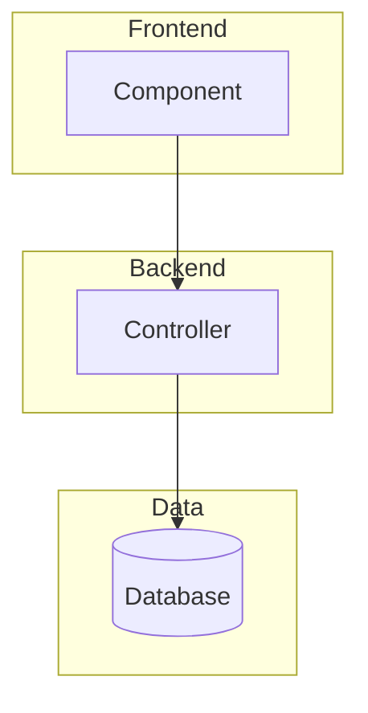
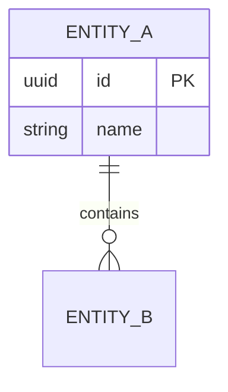
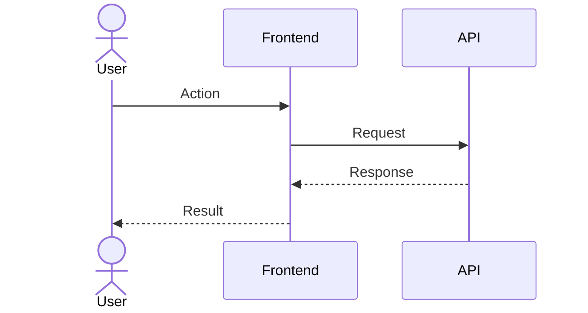
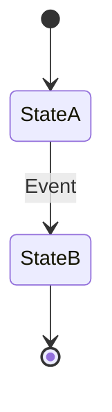

# Connect Existing Feature Documentation Writer

## Instructions

**When to use this skill:**

- You're working in the Connect monorepo
- You need to create comprehensive documentation for a feature
- Documentation should serve both product teams (non-technical) and development teams (technical)
- You're creating feature documentation for an existing feature or updating existing docs

**Triggers:**

- "Document the [feature] feature"
- "Create documentation for [feature]"
- "I need docs for [feature] that work for both product and dev teams"

**Context:** Connect requires comprehensive documentation that serves multiple audiences. Product teams need high-level overviews and user flows, while development teams need architecture details, API references, and technical implementation guidance. This skill produces layered documentation with appropriate depth for each audience.

## Guideline Keywords

- **ALWAYS** — Mandatory requirement, exceptions are very rare and must be explicitly approved
- **NEVER** — Strong prohibition, exceptions are very rare and must be explicitly approved
- **PREFER** — Strong recommendation, exceptions allowed with justification
- **CAN** — Optional, developer's discretion
- **NOTE** — Context, rationale, or clarification
- **EXAMPLE** — Illustrative example

Strictness hierarchy: ALWAYS/NEVER > PREFER > CAN > NOTE/EXAMPLE

---

### Documentation Process

#### Phase 1: Discovery & Planning

##### Search for Context

- **ALWAYS** search for related documentation patterns used in the project before starting
- **ALWAYS** review existing documentation structure for consistency

##### Clarifying Questions

- **ALWAYS** ask clarifying questions using `AskUserQuestion`:
  - Where should the documentation be stored? (in-repo, wiki, multiple locations)
  - What format? (single doc, multiple docs, layered approach)
  - What aspects are most important? (user flows, architecture, API, features)
  - Should visual aids be included? (diagrams, Mermaid, text-only)

##### Explore the Feature

- **ALWAYS** use the Task tool with `subagent_type=Explore` to explore the feature
- **ALWAYS** set thoroughness to "very thorough" for documentation tasks
- **ALWAYS** request comprehensive coverage of:
  - Backend entities and database models
  - API endpoints and controllers
  - Frontend libraries and components
  - State management patterns
  - Key workflows and integrations

---

#### Phase 2: Documentation Structure

- **ALWAYS** create a layered documentation set with multiple documents
- **ALWAYS** organize documentation by audience (product team vs. developers)
- **ALWAYS** include a navigation hub (README.md)

##### 1. Navigation Hub (README.md)

- **ALWAYS** include quick links organized by audience
- **ALWAYS** include document descriptions
- **ALWAYS** provide getting started guidance

##### 2. Feature Overview (High-Level)

**Audience:** Product team, new developers

**ALWAYS** include these sections:

- What is the feature? (2-3 paragraphs)
- Key capabilities (list with examples)
- Feature lifecycle diagram (Mermaid flowchart)
- Common use cases (real-world examples)
- Integration points
- Best practices
- Quick links to technical docs

**ALWAYS** include Mermaid diagrams:

- Lifecycle/workflow flowchart showing the feature journey

**NEVER** include implementation details in the overview

- **NOTE**: Focus on "what" and "why" not "how"

##### 3. Architecture Documentation (Technical Deep-Dive)

**Audience:** Developers

**ALWAYS** include these sections:

- System architecture diagram (Mermaid)
- Database models with ER diagram (Mermaid)
  - Entity descriptions with key properties
  - Relationships and foreign keys
  - Enum definitions
- Frontend architecture
  - Library organization diagram (Mermaid)
  - Component hierarchy
  - State management patterns
  - Key interfaces and types
- Backend architecture
  - Controller layer
  - Service layer
  - Repository layer
  - Background jobs (if applicable)
- File location reference (tables)
- Performance considerations
- Security considerations

**ALWAYS** include Mermaid diagrams:

- High-level architecture showing frontend, backend, database
- Entity-relationship diagram
- Frontend library dependency graph

**ALWAYS** include actual code snippets from the codebase

**ALWAYS** provide file paths for all major files

##### 4. User Flows Documentation

**Audience:** Product team and developers

**ALWAYS** include these sections:

- Flow descriptions for each major workflow
- Sequence diagrams (Mermaid) showing:
  - Creation/setup flow
  - Primary user interaction flow
  - Data submission/processing flow
  - Reporting/analytics flow (if applicable)
- State diagrams for complex state machines
- Step-by-step explanations
- Key decision points and branching logic

**ALWAYS** include Mermaid diagrams:

- Sequence diagrams for each major flow (5-7 diagrams typical)
- State diagrams for complex state transitions

**ALWAYS** number steps clearly

**ALWAYS** include error/edge case flows

##### 5. API Reference (Developer)

**Audience:** Developers integrating with the API

**ALWAYS** include these sections:

- Authentication & authorization
- Endpoint groups (organized by function)
- For each endpoint:
  - Method and path
  - Authorization requirements
  - Parameters (path, query, body)
  - Request body schema
  - Response schemas
  - Example requests/responses
  - Error responses
- Data type definitions (TypeScript interfaces)
- Enum definitions
- Rate limiting (if applicable)

**ALWAYS** document all endpoints (don't skip any)

**ALWAYS** show real request/response examples

**ALWAYS** list all possible error responses

##### 6. Glossary (All Audiences)

**Audience:** Everyone

**ALWAYS** include these sections:

- Core concepts (domain terminology)
- Technical terms
- Configuration options
- Integration terminology
- Data structures
- Acronyms and abbreviations

**ALWAYS** organize alphabetically within categories, not strictly alphabetical overall

**ALWAYS** define terms as they appear in other docs

**ALWAYS** provide context and examples

**ALWAYS** include "also known as" alternatives

---

#### Phase 3: Content Creation

##### Writing Best Practices

- **ALWAYS** start with the high-level overview
- **ALWAYS** write for non-technical readers in the overview
- **ALWAYS** focus on "what" and "why" not "how" in the overview
- **ALWAYS** include practical examples

##### Creating Visual Diagrams

- **ALWAYS** use Mermaid for all diagrams
- **ALWAYS** create visual diagrams early in the process
- **ALWAYS** keep diagrams focused (one concept per diagram)
- **ALWAYS** use consistent styling and naming
- **ALWAYS** add explanatory notes in diagrams

##### Documenting Architecture

- **ALWAYS** start with high-level, drill down to details
- **ALWAYS** include actual code snippets from the codebase
- **ALWAYS** show relationships between components
- **ALWAYS** provide file paths for all major files

##### Writing User Flows

- **ALWAYS** use sequence diagrams to show interactions
- **ALWAYS** number steps clearly
- **ALWAYS** explain decision points
- **ALWAYS** include error/edge case flows

##### Writing API Documentation

- **ALWAYS** include all endpoints (don't skip any)
- **ALWAYS** show real request/response examples
- **ALWAYS** document all parameters
- **ALWAYS** list all possible error responses

##### Writing Glossary

- **ALWAYS** define terms as they appear in other docs
- **ALWAYS** provide context and examples
- **ALWAYS** link related terms
- **ALWAYS** include "also known as" alternatives

---

#### Phase 4: Cross-Referencing

- **ALWAYS** ensure every document links to related documents
- **ALWAYS** add a "Related Documentation" section at the bottom of each document

**Cross-reference matrix:**

- Overview → Architecture, User Flows, Glossary
- Architecture → Overview, User Flows, API Reference
- User Flows → Overview, Architecture, API Reference
- API Reference → Architecture, Glossary
- Glossary → All other docs

---

#### Phase 5: Quality Checks

**ALWAYS** complete these checks before considering documentation complete:

##### Completeness Check

- [ ] All major components documented
- [ ] All API endpoints included
- [ ] All user workflows covered
- [ ] All key terms defined in glossary

##### Audience Appropriateness

- [ ] Overview readable by non-technical users
- [ ] Technical docs provide sufficient detail
- [ ] Diagrams enhance understanding
- [ ] Examples are practical and realistic

##### Navigation

- [ ] README provides clear entry points
- [ ] Cross-references work correctly
- [ ] Table of contents in long documents
- [ ] Consistent heading hierarchy

##### Visual Quality

- [ ] Mermaid diagrams render correctly
- [ ] Diagrams are appropriately sized
- [ ] Code blocks have proper syntax highlighting
- [ ] Tables are well-formatted

##### Final Checklist

- [ ] Check that dates are correct (be mindful of not using knowledge cut-off dates instead of actual dates)

---

### Mermaid Diagram Types

#### System Architecture

- **ALWAYS** use `graph TB` (top-bottom) or `graph LR` (left-right)
- **ALWAYS** use subgraphs to organize components
- **PREFER** using descriptive node labels

**EXAMPLE:**



#### Entity Relationship

- **ALWAYS** use `erDiagram`
- **ALWAYS** show relationships with cardinality
- **ALWAYS** include key fields

**EXAMPLE:**



#### Sequence Diagram

- **ALWAYS** use `sequenceDiagram`
- **ALWAYS** include all key participants
- **ALWAYS** show request-response patterns
- **PREFER** using actors for users

**EXAMPLE:**



#### State Diagram

- **ALWAYS** use `stateDiagram-v2`
- **ALWAYS** show all state transitions
- **ALWAYS** label transitions with events

**EXAMPLE:**



---

### File Naming Convention

- **ALWAYS** use consistent file naming:
  - `README.md` - Navigation hub
  - `{feature}-overview.md` - High-level capabilities
  - `{feature}-architecture.md` - Technical deep-dive
  - `{feature}-user-flows.md` - User journeys
  - `{feature}-api-reference.md` - API documentation
  - `{feature}-glossary.md` - Terminology

---

### Tips for Success

#### Using the Explore Agent

- **ALWAYS** be specific about what you need to find
- **ALWAYS** request "very thorough" exploration for documentation
- **ALWAYS** ask for file locations and key functionality
- **ALWAYS** search both frontend and backend

#### Creating Diagrams

- **ALWAYS** start with a simple diagram
- **ALWAYS** add detail as understanding improves
- **ALWAYS** keep diagrams focused on one aspect
- **ALWAYS** use subgraphs to organize complex systems

#### Balancing Detail and Clarity

- **ALWAYS** keep overview high-level with minimal jargon
- **ALWAYS** make architecture technical but organized
- **ALWAYS** make API documentation complete and precise
- **ALWAYS** make glossary definitions clear with context

#### Writing for the Reader

- **ALWAYS** explain acronyms on first use
- **ALWAYS** provide context before diving into details
- **ALWAYS** use consistent terminology throughout
- **ALWAYS** add examples to illustrate concepts

#### Keeping it Maintainable

- **ALWAYS** store docs in version control
- **ALWAYS** use relative links within docs
- **ALWAYS** make diagrams from text (Mermaid) not images
- **ALWAYS** document the "why" not just the "what"
- **NEVER** reference specific code line numbers as these might change

---

### Expected Output

#### Structure

**EXAMPLE:**

```text
/docs/{feature}/
├── README.md                    # Navigation hub
├── {feature}-overview.md        # High-level
├── {feature}-architecture.md    # Technical
├── {feature}-user-flows.md      # Workflows
├── {feature}-api-reference.md   # API docs
└── {feature}-glossary.md        # Terms

```

- **NEVER** list the line counts of each file, as these will get outdated quickly

#### Scale

- **NOTE**: Comprehensive documentation typically produces 3000+ lines total
- **NOTE**: Expect 6-8 Mermaid diagrams across all documents
- **NOTE**: Plan for 1-2 hours of work for a complex feature
- **NOTE**: Documentation should be living - update as features evolve

---

### Additional Best Practices from AGENTS.md

- **ALWAYS** check AGENTS.md for the latest definite best practices

#### Frontend Documentation

- **ALWAYS** reference library naming conventions from AGENTS.md
- **ALWAYS** document ComponentStore patterns for state management
- **ALWAYS** document Angular component patterns (OnPush, standalone, inject)

#### Backend Documentation

- **ALWAYS** document Entity Framework migrations if applicable
- **ALWAYS** document Hangfire background jobs if applicable
- **ALWAYS** document API endpoint patterns and conventions

#### GitLab Workflow

- **NOTE**: Connect uses GitLab, not GitHub
- **ALWAYS** reference GitLab CI/CD patterns if documenting deployment
- **ALWAYS** use Pull Request (PR) terminology, not Merge Request (MR)

---

### Reference Files

**ALWAYS** check these locations for existing documentation patterns:

- `AGENTS.md` - Development guidelines and best practices
- `CLAUDE.md` - AI-specific instructions
- Existing feature documentation in the repository

## Examples

Please see instructions section.
