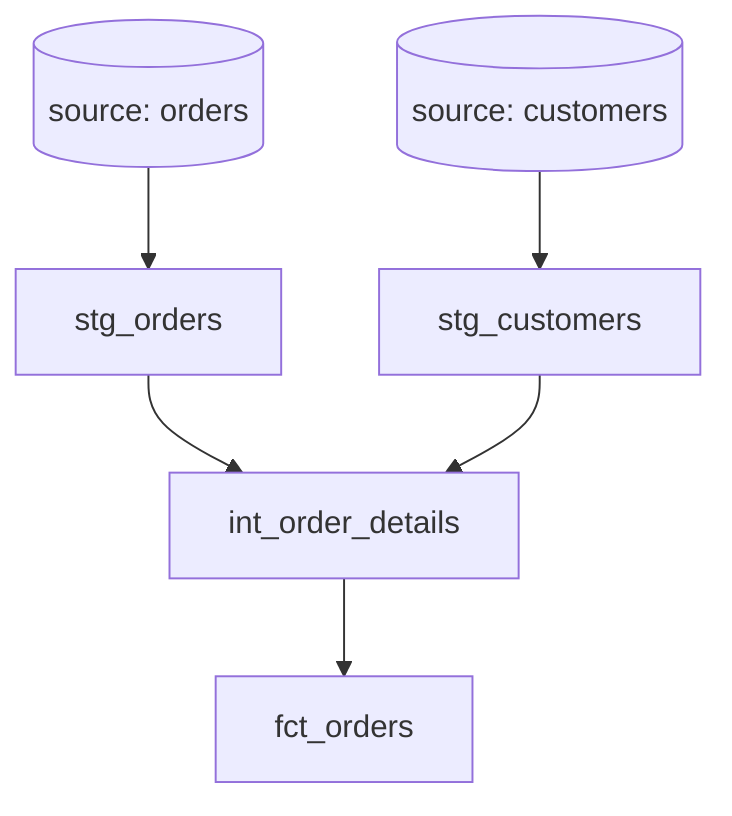

# dbt Lineage Analyzer

Expert skill for analyzing and tracing dbt model dependencies and data lineage.

## When to Use This Skill

Activate when the user mentions:
- "Show me the lineage for this model"
- "What models depend on X"
- "Where does this data come from"
- "Trace dependencies"
- "Impact analysis"
- "Upstream/downstream models"
- "DAG structure"
- "Circular dependencies"

## Core Capabilities

### 1. Dependency Discovery

Extract dependencies from dbt models by finding:
- `{{ ref('model_name') }}` - model references
- `{{ source('source_name', 'table_name') }}` - source references
- Dependencies in Jinja loops and conditionals

### 2. Lineage Tracing Methods

**Method 1: File Scanning (Primary)**
```bash
# Find all model files
find models/ -name "*.sql" -type f

# Extract refs from a model
grep -o "ref('[^']*')" model_file.sql | sed "s/ref('\(.*\)')/\1/"

# Extract sources
grep -o "source('[^']*',\s*'[^']*')" model_file.sql
```

**Method 2: Parse manifest.json (If Available)**
```bash
# Check for dbt manifest
if [ -f "target/manifest.json" ]; then
    # Parse using jq or Python
    cat target/manifest.json | jq '.nodes[] | select(.resource_type == "model")'
fi
```

### 3. Build Dependency Graph

For each model, extract:
1. Model name and path
2. Direct parent refs
3. Direct parent sources
4. Config (materialization, schema)

Create bidirectional mapping:
- parents[model] = list of dependencies
- children[model] = list of consumers

### 4. Recursive Tracing

**Upstream Traversal (Sources)**
```python
def trace_upstream(model_name, graph, visited=None):
    if visited is None:
        visited = set()
    
    if model_name in visited:
        return []  # Circular dependency
    
    visited.add(model_name)
    upstream = []
    
    for parent in graph['parents'].get(model_name, []):
        upstream.append(parent)
        upstream.extend(trace_upstream(parent, graph, visited))
    
    return upstream
```

**Downstream Traversal (Consumers)**
```python
def trace_downstream(model_name, graph, visited=None):
    if visited is None:
        visited = set()
    
    if model_name in visited:
        return []
    
    visited.add(model_name)
    downstream = []
    
    for child in graph['children'].get(model_name, []):
        downstream.append(child)
        downstream.extend(trace_downstream(child, graph, visited))
    
    return downstream
```

### 5. Visualization Formats

**Tree Format (Compact)**
```
fct_orders
├── int_order_details
│   ├── stg_orders
│   │   └── source.raw.orders
│   └── stg_order_items
│       └── source.raw.order_items
└── dim_customers
    └── stg_customers
        └── source.raw.customers
```

**Detailed Format**
```
Model: fct_orders
Type: model
Path: models/marts/core/fct_orders.sql
Materialization: incremental
Schema: analytics

DIRECT DEPENDENCIES:
  → int_order_details (ephemeral)
  → dim_customers (table)

UPSTREAM LINEAGE (3 levels deep):
  Level 1:
    - int_order_details
    - dim_customers
  Level 2:
    - stg_orders
    - stg_order_items
    - stg_customers
  Level 3:
    - source.raw.orders
    - source.raw.order_items
    - source.raw.customers

DOWNSTREAM CONSUMERS:
  ← rpt_daily_revenue (view)
  ← dashboard_sales_metrics (table)

STATISTICS:
  - Dependency Depth: 3
  - Total Upstream Models: 5
  - Total Sources: 3
  - Direct Children: 2
  - Total Downstream: 2
```

**Mermaid Diagram Format**


### 6. Impact Analysis

When tracing lineage, also identify:

**Breaking Change Impact**
- If this model's schema changes, what breaks?
- Models that depend on specific columns
- Tests that would fail

**Performance Impact**
- Models on the critical path
- Long-running models blocking others
- Warehouse resource consumption

**Freshness Impact**
- Source freshness checks
- Incremental load dependencies
- SLA-critical models

### 7. Circular Dependency Detection

```python
def find_cycles(graph):
    """Detect circular dependencies using DFS"""
    def visit(node, path, visited, cycles):
        if node in path:
            cycle_start = path.index(node)
            cycles.append(path[cycle_start:] + [node])
            return
        
        if node in visited:
            return
        
        visited.add(node)
        path.append(node)
        
        for child in graph.get(node, []):
            visit(child, path.copy(), visited, cycles)
    
    cycles = []
    visited = set()
    
    for node in graph:
        if node not in visited:
            visit(node, [], visited, cycles)
    
    return cycles
```

## Practical Workflows

### Workflow 1: Single Model Lineage
```
User: "Show lineage for fct_orders"

Steps:
1. Find the model file: models/marts/core/fct_orders.sql
2. Extract refs and sources from the file
3. Build immediate parent list
4. Recursively trace upstream to sources
5. Trace downstream to find consumers
6. Generate visualization
7. Calculate statistics
```

### Workflow 2: Column-Level Lineage
```
User: "Where does the 'customer_ltv' column come from?"

Steps:
1. Find model containing customer_ltv
2. Parse SELECT statement to see source column
3. If derived, trace back through transformations
4. Identify originating source table and column
5. Map full transformation path
```

### Workflow 3: Impact Analysis
```
User: "What breaks if I change stg_customers?"

Steps:
1. Find all downstream models referencing stg_customers
2. For each downstream model:
   - Check which columns it uses from stg_customers
   - Identify tests on those columns
   - Mark as impacted
3. Trace to final downstream consumers
4. Generate impact report
```

### Workflow 4: Critical Path Analysis
```
User: "What's the critical path in my dbt project?"

Steps:
1. Build full dependency graph
2. Identify leaf nodes (final marts/reports)
3. Trace back to sources
4. Calculate depth for each path
5. Identify longest paths
6. Highlight bottleneck models
```

## Implementation Approach

### Step 1: Scan Project Structure
```bash
# Find all dbt models
find models/ -type f -name "*.sql" > model_list.txt

# Find sources
find models/ -type f -name "*.yml" | xargs grep -l "sources:"
```

### Step 2: Extract Dependencies
For each model file:
```python
import re

def extract_refs(sql_content):
    # Pattern: {{ ref('model_name') }}
    pattern = r"{{\s*ref\(['\"]([^'\"]+)['\"]\)\s*}}"
    return re.findall(pattern, sql_content)

def extract_sources(sql_content):
    # Pattern: {{ source('source', 'table') }}
    pattern = r"{{\s*source\(['\"]([^'\"]+)['\"]\s*,\s*['\"]([^'\"]+)['\"]\)\s*}}"
    return re.findall(pattern, sql_content)
```

### Step 3: Build Graph Structure
```python
graph = {
    'nodes': {},  # model_name: {path, type, config}
    'edges': [],  # (parent, child) tuples
    'sources': {} # source_name.table_name: metadata
}

for model_file in model_files:
    model_name = extract_model_name(model_file)
    refs = extract_refs(read_file(model_file))
    sources = extract_sources(read_file(model_file))
    
    graph['nodes'][model_name] = {
        'path': model_file,
        'type': 'model',
        'parents': refs + sources
    }
    
    for ref in refs:
        graph['edges'].append((ref, model_name))
```

### Step 4: Query and Visualize
```python
def get_lineage(model_name, graph):
    upstream = trace_upstream(model_name, graph)
    downstream = trace_downstream(model_name, graph)
    
    return {
        'model': model_name,
        'upstream': upstream,
        'downstream': downstream,
        'depth': calculate_depth(model_name, graph),
        'stats': calculate_stats(model_name, graph)
    }
```

## Output Examples

### Example 1: Simple Lineage
```
Model: stg_orders
Path: models/staging/ecommerce/stg_orders.sql
Type: View

UPSTREAM:
└── source.raw.orders

DOWNSTREAM:
├── int_order_details (ephemeral)
└── fct_daily_orders (table)

Stats: 1 level deep, 1 source, 2 consumers
```

### Example 2: Complex Lineage with Circular Dependency
```
⚠️  CIRCULAR DEPENDENCY DETECTED:

model_a → model_b → model_c → model_a

Path: models/intermediate/model_a.sql
      models/intermediate/model_b.sql  
      models/intermediate/model_c.sql

This creates an infinite loop. Please refactor to break the cycle.
```

### Example 3: Critical Path
```
CRITICAL PATH ANALYSIS

Longest dependency chain (6 levels):
source.raw.events 
  → stg_events (view)
    → int_event_sessions (ephemeral)
      → int_user_sessions (ephemeral)
        → fct_user_activity (table, 45min build)
          → rpt_user_dashboard (view)

Bottleneck: fct_user_activity (45min)
Recommendation: Consider incremental materialization
```

## Troubleshooting

**Issue: Can't find model file**
- Check project structure and model naming
- Look in subdirectories under models/
- Verify model isn't disabled in dbt_project.yml

**Issue: Missing dependencies in output**
- Check for dynamic refs: `{{ ref(var('model_name')) }}`
- Look for refs in Jinja loops
- Check macros that might generate refs

**Issue: Manifest not available**
- Fall back to file scanning method
- Run `dbt compile` first to generate manifest
- Parse .sql files directly

## Quality Checklist

- [ ] All refs and sources extracted correctly
- [ ] Circular dependencies identified
- [ ] Depth calculations accurate
- [ ] Downstream consumers found
- [ ] Visualization clear and readable
- [ ] Statistics include all relevant metrics
- [ ] Special cases handled (dynamic refs, macros)
