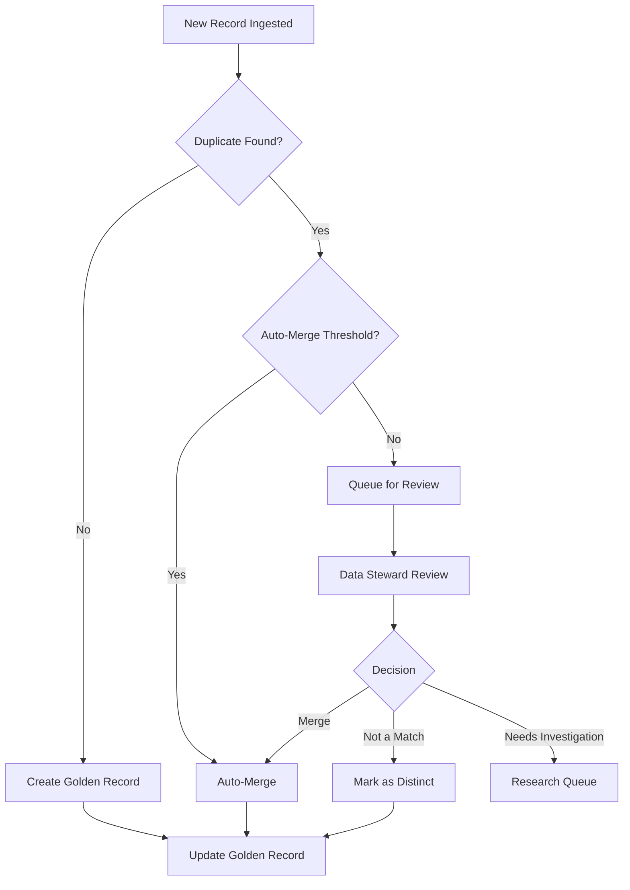

# Master Data Management Planning

## When to Use This Skill

Use this skill when:

- **Mdm Planning tasks** - Working on plan master data management strategies including golden record identification, matching, and merging approaches
- **Planning or design** - Need guidance on Mdm Planning approaches
- **Best practices** - Want to follow established patterns and standards

## Overview

Master Data Management (MDM) ensures critical business entities (customers, products, locations) are consistent, accurate, and governed across the enterprise. MDM creates "golden records" - the single source of truth.

## MDM Architecture Styles

### Style Comparison

| Style | Description | Best For |
|-------|-------------|----------|
| Registry | Index to source systems | Quick wins, low investment |
| Consolidation | Read-only golden copy | Reporting, analytics |
| Coexistence | Bidirectional sync | Complex enterprises |
| Centralized | Single authoring source | Greenfield, tight control |
| Transaction Hub | Real-time master | High-volume transactions |

### Architecture Diagram

```text
CONSOLIDATION STYLE
┌─────────────────────────────────────────────────────────────────┐
│                         MDM Hub                                  │
│  ┌─────────────────────────────────────────────────────────┐    │
│  │              Golden Records (Read-Only)                  │    │
│  │   Customer Master │ Product Master │ Location Master     │    │
│  └─────────────────────────────────────────────────────────┘    │
│                              ▲                                   │
│         ┌────────────────────┼────────────────────┐             │
│         │                    │                    │             │
│    ┌────┴────┐          ┌────┴────┐          ┌────┴────┐       │
│    │  Match  │          │  Match  │          │  Match  │       │
│    │ & Merge │          │ & Merge │          │ & Merge │       │
│    └────┬────┘          └────┬────┘          └────┬────┘       │
└─────────┼───────────────────┼───────────────────┼───────────────┘
          │                    │                    │
     ┌────┴────┐          ┌────┴────┐          ┌────┴────┐
     │   CRM   │          │   ERP   │          │E-Commerce│
     └─────────┘          └─────────┘          └──────────┘
```

## Data Domains

### Common Master Data Domains

| Domain | Examples | Typical Attributes |
|--------|----------|-------------------|
| Party | Customer, Vendor, Employee | Name, Address, Contact |
| Product | SKU, Service, Asset | Description, Category, Price |
| Location | Site, Store, Warehouse | Address, Coordinates, Type |
| Financial | Account, Cost Center | Code, Name, Hierarchy |
| Reference | Country, Currency, Status | Code, Description |

### Domain Assessment Template

```markdown
# Master Data Domain: Customer

## Domain Scope
- B2B customers
- B2C customers
- Prospects
- Leads

## Source Systems
| System | Records | Quality Score | Authority |
|--------|---------|---------------|-----------|
| CRM | 150,000 | 85% | High |
| ERP | 120,000 | 75% | Medium |
| E-Commerce | 200,000 | 60% | Low |

## Key Challenges
- Duplicate customers across systems
- Inconsistent address formats
- Missing email validation
- No unique identifier across systems

## Business Impact
- $X million in duplicate mailings
- Y% order errors from wrong customer
- Z hours/week manual reconciliation
```

## Matching Strategies

### Matching Approaches

| Approach | Description | Accuracy | Speed |
|----------|-------------|----------|-------|
| Exact | Identical values | High | Fast |
| Fuzzy | Similar values (Levenshtein, Soundex) | Medium | Medium |
| Probabilistic | Statistical likelihood | Highest | Slow |
| Rule-Based | Business logic | Configurable | Fast |

### Match Rules Template

```markdown
# Match Rules: Customer Domain

## Rule 1: Exact Email Match
- Field: email
- Type: Exact (case-insensitive)
- Confidence: 95%
- Auto-merge: Yes

## Rule 2: Name + Address
- Fields: last_name, address_line1, postal_code
- Type: Fuzzy (threshold 85%)
- Confidence: 80%
- Auto-merge: No (manual review)

## Rule 3: Phone + Last Name
- Fields: phone, last_name
- Type: Exact phone, Fuzzy name
- Confidence: 75%
- Auto-merge: No

## Rule 4: Company Match
- Fields: company_name, city
- Type: Fuzzy (threshold 80%)
- Confidence: 70%
- Auto-merge: No
```

### C# Matching Example

```csharp
public class CustomerMatcher
{
    public MatchResult Match(Customer source, Customer target)
    {
        var scores = new List<MatchScore>();

        // Exact email match (high confidence)
        if (!string.IsNullOrEmpty(source.Email) &&
            source.Email.Equals(target.Email, StringComparison.OrdinalIgnoreCase))
        {
            scores.Add(new MatchScore("Email", 0.95m));
        }

        // Fuzzy name match
        var nameScore = CalculateLevenshteinSimilarity(
            source.FullName, target.FullName);
        if (nameScore > 0.85m)
        {
            scores.Add(new MatchScore("Name", nameScore * 0.7m));
        }

        // Address match
        var addressScore = CalculateAddressSimilarity(
            source.Address, target.Address);
        if (addressScore > 0.80m)
        {
            scores.Add(new MatchScore("Address", addressScore * 0.6m));
        }

        var overallScore = scores.Sum(s => s.Weight) / scores.Count;

        return new MatchResult
        {
            IsMatch = overallScore > 0.75m,
            Confidence = overallScore,
            Scores = scores,
            RequiresReview = overallScore is > 0.6m and < 0.85m
        };
    }
}
```

## Survivorship Rules

### Survivorship Strategies

| Strategy | Description | Use Case |
|----------|-------------|----------|
| Most Recent | Latest timestamp wins | Frequently updated data |
| Most Trusted | Source priority | Known data quality |
| Most Complete | Non-null preferred | Sparse data |
| Longest | Longest string wins | Descriptions, names |
| Aggregate | Combine values | Lists, tags |
| Custom | Business logic | Complex rules |

### Survivorship Configuration

```csharp
public class CustomerSurvivorship
{
    public Customer Merge(IEnumerable<Customer> duplicates)
    {
        var ordered = duplicates
            .OrderByDescending(d => GetSourcePriority(d.SourceSystem))
            .ThenByDescending(d => d.ModifiedDate)
            .ToList();

        return new Customer
        {
            // Most trusted source
            CustomerId = ordered.First().CustomerId,

            // Most complete (first non-null)
            FirstName = ordered.Select(d => d.FirstName)
                .FirstOrDefault(v => !string.IsNullOrEmpty(v)),

            LastName = ordered.Select(d => d.LastName)
                .FirstOrDefault(v => !string.IsNullOrEmpty(v)),

            // Most recent
            Email = ordered
                .OrderByDescending(d => d.EmailVerifiedDate)
                .Select(d => d.Email)
                .FirstOrDefault(v => !string.IsNullOrEmpty(v)),

            // Aggregated
            Tags = ordered.SelectMany(d => d.Tags ?? [])
                .Distinct()
                .ToList(),

            // Highest value
            LifetimeValue = ordered.Max(d => d.LifetimeValue),

            // Custom logic
            Segment = DetermineSegment(ordered)
        };
    }

    private int GetSourcePriority(string source) => source switch
    {
        "CRM" => 100,
        "ERP" => 80,
        "E-Commerce" => 60,
        _ => 40
    };
}
```

## Reference Data Management

### Reference Data Types

| Type | Description | Examples |
|------|-------------|----------|
| Code Lists | Simple lookups | Countries, Status codes |
| Hierarchies | Parent-child | Categories, Org structure |
| Cross-References | System mappings | Product codes across systems |
| Rules | Business logic | Tax rates, Pricing tiers |

### Reference Data Table

```sql
-- Reference data tables (PascalCase - SQL Server Convention)
CREATE TABLE RefCountry (
    CountryCode CHAR(2) PRIMARY KEY,
    CountryCode3 CHAR(3) NOT NULL,
    CountryName VARCHAR(100) NOT NULL,
    Region VARCHAR(50),
    IsActive BIT DEFAULT 1,
    EffectiveDate DATE NOT NULL,
    ExpirationDate DATE,
    CreatedAt DATETIME2 DEFAULT GETUTCDATE(),
    UpdatedAt DATETIME2
);

CREATE TABLE RefCrossReference (
    CrossRefId INT IDENTITY PRIMARY KEY,
    Domain VARCHAR(50) NOT NULL,
    SourceSystem VARCHAR(50) NOT NULL,
    SourceCode VARCHAR(100) NOT NULL,
    TargetSystem VARCHAR(50) NOT NULL,
    TargetCode VARCHAR(100) NOT NULL,
    IsActive BIT DEFAULT 1,

    CONSTRAINT UQ_CrossRef
        UNIQUE (Domain, SourceSystem, SourceCode, TargetSystem)
);
```

## MDM Governance Model

### RACI Matrix

```markdown
# MDM Governance RACI

| Activity | Data Owner | Data Steward | IT | Business |
|----------|------------|--------------|-----|----------|
| Define data standards | A | R | C | C |
| Approve match rules | A | R | C | I |
| Review merge candidates | I | R | C | A |
| Monitor data quality | I | R | A | C |
| Resolve data issues | A | R | C | I |
| Maintain MDM system | I | C | R | I |

R = Responsible, A = Accountable, C = Consulted, I = Informed
```

### Data Stewardship Workflow



## MDM Platform Components

```text
┌─────────────────────────────────────────────────────────────────┐
│                      MDM Platform                                │
├─────────────────────────────────────────────────────────────────┤
│  ┌────────────┐  ┌────────────┐  ┌────────────┐  ┌───────────┐ │
│  │ Data       │  │ Match &    │  │ Workflow   │  │ Data      │ │
│  │ Integration│  │ Merge      │  │ Engine     │  │ Quality   │ │
│  └────────────┘  └────────────┘  └────────────┘  └───────────┘ │
│  ┌────────────┐  ┌────────────┐  ┌────────────┐  ┌───────────┐ │
│  │ Hierarchy  │  │ Reference  │  │ Governance │  │ API       │ │
│  │ Manager    │  │ Data Mgmt  │  │ Dashboard  │  │ Gateway   │ │
│  └────────────┘  └────────────┘  └────────────┘  └───────────┘ │
└─────────────────────────────────────────────────────────────────┘
```

## Validation Checklist

- [ ] Master data domains identified and prioritized
- [ ] Source systems inventoried with quality assessment
- [ ] MDM style selected (registry, consolidation, etc.)
- [ ] Match rules defined with confidence thresholds
- [ ] Survivorship rules documented per attribute
- [ ] Governance roles assigned (owners, stewards)
- [ ] Reference data management approach defined
- [ ] Data quality metrics established

## Integration Points

**Inputs from**:

- `conceptual-modeling` skill → Entity candidates
- `data-governance` skill → Stewardship model
- `data-quality-planning` skill → Quality rules

**Outputs to**:

- `schema-design` skill → MDM hub schema
- `migration-planning` skill → Initial load strategy
- `data-lineage` skill → Cross-reference tracking
