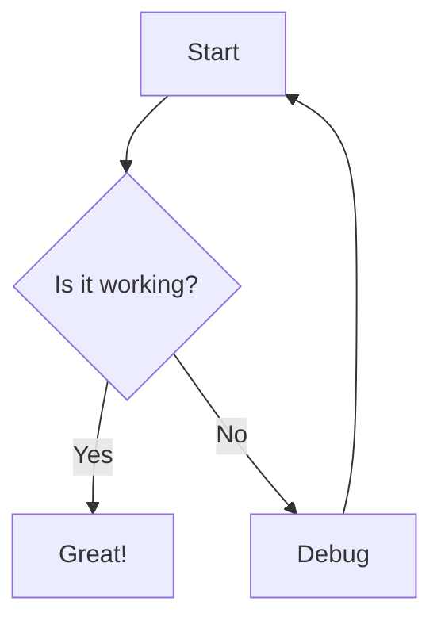

# Mermaid Collaboration Tool

This skill helps you create, edit, and collaborate on Mermaid diagrams and UI wireframes using the claude-mermaid-collab server.

## What This Tool Provides

- **Real-time Diagram Editor**: Live preview with pan, zoom, and auto-save for Mermaid diagrams
- **Real-time Document Editor**: Markdown document collaboration with live preview
- **UI Wireframe Plugin**: Text-based wireframe creation for mobile, tablet, and desktop
- **Team Collaboration**: Real-time updates across all connected clients via WebSocket
- **File-Based Storage**: Simple `.mmd` and `.md` files for version control
- **Unified Dashboard**: Browse and manage both diagrams and documents in one place
- **MCP Integration**: Create and manage diagrams and documents directly from Claude Code

## Running the Server

The server can be run from any directory. Use `STORAGE_DIR` to specify where diagrams and documents are stored.

**Run from the claude-mermaid-collab repository:**
```bash
# Store diagrams/docs in a specific project directory
STORAGE_DIR=/path/to/your/project bun run src/server.ts

# Or store in current directory (default)
bun run dev
```

The server starts on `http://localhost:3737`. The `PUBLIC_DIR` (HTML/CSS/JS) is always resolved relative to the server installation, so static files work regardless of where you run it from.

## When to Use This Skill

Use this skill when you need to:
- Create flowcharts, state diagrams, sequence diagrams, or any Mermaid diagram
- Design UI wireframes and mockups with text-based syntax
- Write and collaborate on markdown documentation, specs, or notes
- Collaborate with team members in real-time on diagrams or documents
- Quickly prototype and iterate on visual designs
- Document workflows, architectures, or processes
- Create technical documentation with live preview

## MCP Tools Available

The server provides these MCP tools through Claude Code:

### Diagrams
- `list_diagrams()` - List all diagrams with metadata
- `get_diagram(id)` - Read diagram content
- `create_diagram(name, content)` - Create new diagram (auto-validates)
- `update_diagram(id, content)` - Replace full diagram content (auto-validates)
- `patch_diagram(id, old_string, new_string)` - **Preferred for small edits** - efficient search-replace
- `validate_diagram(content)` - Check syntax without saving
- `preview_diagram(id)` - Get browser URL for diagram

### Documents
Documents are markdown files (`.md`) for collaborative writing - specs, documentation, meeting notes, etc.

- `list_documents()` - List all markdown documents with metadata
- `get_document(id)` - Read full document content and metadata
- `create_document(name, content)` - Create new markdown document (returns ID and preview URL)
- `update_document(id, content)` - Replace full document content with real-time sync
- `patch_document(id, old_string, new_string)` - **Preferred for small edits** - efficient search-replace
- `preview_document(id)` - Get browser URL for document viewer

### Patch vs Update

**Prefer `patch_document`/`patch_diagram`** for targeted changes:
- Changing a status field
- Updating a single value
- Adding text at a specific location

**Use `update_document`/`update_diagram`** for:
- Adding entirely new sections
- Restructuring large portions
- When patch fails (old_string not found or matches multiple locations)

**Note**: There is no delete_document MCP tool yet. Use the dashboard delete button or REST API for deletion.

## Creating Standard Mermaid Diagrams

### Flowchart Example


### Direction Toggle
Use the direction toggle button (⤡) in the editor to switch between:
- **LR** (Left to Right) - Horizontal layout
- **TD** (Top Down) - Vertical layout

Supported directions: TD, TB, BT, RL, LR

## Creating UI Wireframes

The built-in wireframe plugin lets you create UI mockups with text syntax.

### Basic Wireframe Syntax

```
wireframe mobile TD
  screen "Login Screen"
    col padding=16
      Title "Welcome Back"
      Input "Email"
      Input "Password"
      Button "Sign In" primary
```

### Viewports
- `wireframe mobile` - 375px width
- `wireframe tablet` - 768px width
- `wireframe desktop` - 1200px width

### Layout Directions
- `TD` - Top Down (vertical, default)
- `LR` - Left Right (horizontal)

### Container Types
- `screen "Title"` - Top-level screen container
- `col` - Vertical column layout
- `row` - Horizontal row layout
- `Card` - Card container with rounded corners

### UI Widgets

**Input Controls:**
- `Button "Label"` - Button (can add `primary`, `secondary`, `danger`, `success`)
- `Input "Placeholder"` - Text input field
- `Checkbox "Label"` - Checkbox with label
- `Radio "Label"` - Radio button with label
- `Switch "Label"` - Toggle switch
- `Dropdown "Label"` - Dropdown selector

**Display Elements:**
- `Text "Content"` - Normal text
- `Title "Heading"` - Bold heading text
- `Icon "name"` - Icon placeholder
- `Image` - Image placeholder
- `Avatar` - User avatar circle

**Navigation:**
- `AppBar "Title"` - Top app bar
- `NavMenu "Home|About|Contact"` - Horizontal navigation (use `|` to separate items)
- `BottomNav "Home|Search|Profile"` - Bottom navigation
- `FAB "+"` - Floating action button

**Structure:**
- `Grid` - Table/grid layout (use with `header` and `row` children)
- `List "Item 1|Item 2|Item 3"` - List of items
- `divider` - Horizontal divider line
- `spacer` - Flexible space

### Layout Modifiers

Add modifiers after widget names:
- `width=200` - Fixed width in pixels
- `height=100` - Fixed height in pixels
- `padding=16` - Padding around content
- `flex` or `flex=2` - Take remaining space (optionally with weight)
- `align=start|center|end|space-between` - Horizontal alignment
- `cross=start|center|end` - Vertical alignment

### Complex Wireframe Example

```
wireframe mobile TD
  screen "Dashboard"
    AppBar "My App"
    col padding=16
      Title "Welcome"
      Text "Here's your overview"
      spacer
      row
        Card padding=8 flex
          Text "Sales"
          Title "$1,234"
        Card padding=8 flex
          Text "Orders"
          Title "56"
      spacer
      List "Recent|Pending|Complete"
    BottomNav "Home|Stats|Profile"
```

## Collaborating on Markdown Documents

The document collaboration feature allows teams to write and edit markdown documents with real-time updates, just like diagrams.

### What Documents Are For

Documents are markdown (`.md`) files for:
- **Technical Specifications**: API docs, requirements, design specs
- **Meeting Notes**: Collaborative note-taking during meetings
- **Project Documentation**: README files, wikis, guides
- **Architecture Decisions**: ADRs, technical decision records
- **User Stories**: Feature descriptions, acceptance criteria
- **Team Knowledge**: How-tos, troubleshooting guides, onboarding docs

### Creating Documents

```
create_document("api-spec", """
# Payment API Specification

## Overview
This document describes the payment API endpoints.

## Authentication
All requests require Bearer token authentication.

## Endpoints

### POST /api/payments
Create a new payment transaction.

**Request Body:**
```json
{
  "amount": 100.00,
  "currency": "USD",
  "customer_id": "cust_123"
}
\```

**Response:**
```json
{
  "id": "pay_456",
  "status": "pending",
  "created_at": "2024-01-13T10:00:00Z"
}
\```

## Error Codes
- `400` - Invalid request
- `401` - Unauthorized
- `500` - Server error
""")
```

### Document Editor Features

The document editor (`/document.html?id=<id>`) provides:
- **Split-pane view**: Markdown source on left, rendered preview on right
- **Live preview**: See formatted output as you type
- **Auto-save**: Saves automatically 500ms after you stop typing
- **Undo/Redo**: Full history with Ctrl+Z / Ctrl+Shift+Z
- **Syntax highlighting**: Code blocks with language support
- **Real-time collaboration**: See updates from other users instantly
- **Resizable panes**: Drag the separator to adjust layout
- **Clean content API**: Get sanitized HTML for safe rendering
- **Review workflow**: Comment, propose, approve, and reject content

### Review Workflow

The document editor includes a review workflow for collaborative editing with visual status indicators:

**Toolbar Buttons:**
- **💬 Comment** - Add comments to selections or at cursor
- **◇ Propose** (cyan) - Mark content as proposed/suggested
- **✓ Approve** (green) - Mark content as approved
- **✗ Reject** (red) - Mark content as rejected with reason
- **⊘ Clear** - Remove any status markers

**Status Types:**

| Status | Color | Section Marker | Inline Marker |
|--------|-------|----------------|---------------|
| Proposed | Cyan | `<!-- status: proposed: label -->` | `<!-- propose-start: label -->...<!-- propose-end -->` |
| Approved | Green | `<!-- status: approved -->` | `<!-- approve-start -->...<!-- approve-end -->` |
| Rejected | Red | `<!-- status: rejected: reason -->` | `<!-- reject-start: reason -->...<!-- reject-end -->` |
| Comment | Yellow | `<!-- comment: text -->` | `<!-- comment-start: text -->...<!-- comment-end -->` |

**How It Works:**
- **Select text** then click a button → wraps selection with inline markers
- **Cursor on list item** then click → wraps the list item content
- **Cursor under heading** then click → adds section-level status after heading
- **Toggle between states** → clicking Approve on proposed content switches it to approved
- Markers are HTML comments, so they're invisible in standard markdown renderers

**Example Usage:**
```markdown
## Feature Proposal
<!-- status: proposed: new authentication flow -->

This section describes the new login system.

We should use <!-- propose-start: needs discussion -->OAuth 2.0<!-- propose-end --> for authentication.

- <!-- approve-start -->Email/password login<!-- approve-end -->
- <!-- reject-start: too complex for MVP -->Biometric auth<!-- reject-end -->
```

### Markdown Features Supported

The editor supports full GitHub-Flavored Markdown:
- **Headings**: `# H1` through `###### H6`
- **Bold**: `**bold**` or `__bold__`
- **Italic**: `*italic*` or `_italic_`
- **Links**: `[text](url)`
- **Images**: ``
- **Code blocks**: \```language ... \```
- **Inline code**: \`code\`
- **Lists**: Unordered (`-`, `*`, `+`) and ordered (`1.`, `2.`)
- **Blockquotes**: `> quote`
- **Tables**: Pipe-separated tables
- **Task lists**: `- [ ]` unchecked, `- [x]` checked
- **Horizontal rules**: `---`, `***`, or `___`

### Document Workflow Example

```
# 1. Create a spec document
result = create_document("feature-spec", """
# User Authentication Feature

## Problem Statement
Users need a secure way to log into the application.

## Proposed Solution
Implement JWT-based authentication with refresh tokens.

## Requirements
1. Email/password login
2. JWT tokens with 15-minute expiry
3. Refresh token rotation
4. Password reset flow

## API Endpoints
- POST /auth/login
- POST /auth/refresh
- POST /auth/logout
- POST /auth/reset-password

## Security Considerations
- Passwords hashed with bcrypt
- Tokens stored in httpOnly cookies
- Rate limiting on login attempts
""")

# 2. Share preview URL with team
preview_document("feature-spec")

# 3. Team reviews and adds comments/updates in real-time

# 4. Update based on feedback
update_document("feature-spec", """
# User Authentication Feature

## Problem Statement
Users need a secure way to log into the application.

## Proposed Solution
Implement JWT-based authentication with refresh tokens and optional 2FA.

## Requirements
1. Email/password login
2. JWT tokens with 15-minute expiry
3. Refresh token rotation
4. Password reset flow
5. **NEW**: Optional TOTP 2FA

## API Endpoints
- POST /auth/login
- POST /auth/refresh
- POST /auth/logout
- POST /auth/reset-password
- **NEW**: POST /auth/2fa/enable
- **NEW**: POST /auth/2fa/verify

## Security Considerations
- Passwords hashed with bcrypt (cost factor 12)
- Tokens stored in httpOnly, secure cookies
- Rate limiting: 5 attempts per 15 minutes
- 2FA backup codes generated on enable
""")
```

### Document Best Practices

1. **Use descriptive names**: `api-architecture` not `doc1`
2. **Structure with headings**: Use H1 for title, H2 for sections
3. **Keep it focused**: One document per topic/feature
4. **Link related docs**: Use markdown links to connect documents
5. **Version in git**: Documents are `.md` files - commit them
6. **Add timestamps**: Include "Last updated" dates for living docs
7. **Use code blocks**: Properly format code examples with language tags
8. **Create templates**: Standardize document structure for consistency

### Dashboard Features

The unified dashboard shows both diagrams and documents:
- **Type badges**: Blue "Diagram" and purple "Document" badges
- **Type filter**: Filter by "All Items", "Diagrams Only", or "Documents Only"
- **Search**: Search across both diagrams and documents
- **Preview**: Documents show first heading or first 100 characters
- **Thumbnails**: Diagrams show rendered preview, documents show text excerpt
- **Sort by date**: Newest items first
- **Delete all**: Remove all diagrams and documents at once

## Best Practices

### Diagram Naming
- Use descriptive names: `user-login-flow` not `diagram1`
- Use hyphens, not spaces: `api-architecture` not `api architecture`
- Keep names lowercase for consistency

### Collaboration Workflow
1. Create diagram: `create_diagram("feature-flow", content)`
2. Share the preview URL with team members
3. Team members can view real-time updates in their browsers
4. Everyone sees changes instantly via WebSocket

### Wireframe Design Tips
1. **Start with screens**: Define your main screens first
2. **Use containers**: Group related elements in `col` and `row`
3. **Add padding**: Use `padding=16` on containers for spacing
4. **Flexible layouts**: Use `flex` for responsive elements
5. **Toggle direction**: Try both LR and TD to see what works best

### Version Control
All diagrams are stored as `.mmd` files in the `diagrams/` folder:
- Easy to commit to git
- Plain text, easy to diff
- Can edit externally with any text editor
- Auto-reloads in the web interface

## Editor Features

### Keyboard Shortcuts
- **Undo**: Ctrl+Z (managed by editor)
- **Redo**: Ctrl+Shift+Z (managed by editor)
- **Auto-save**: 500ms after typing stops

### Pan & Zoom Controls
- **Mouse wheel**: Zoom in/out
- **Drag**: Pan around diagram
- **⊡ Fit**: Fit entire diagram to viewport
- **↔ Fit Width**: Fit diagram width
- **↕ Fit Height**: Fit diagram height
- **↻ Reset**: Reset zoom to 100%
- **+ / −**: Zoom in/out buttons

### Resizable Panes
- **Drag the separator** between code and preview
- Customize your preferred layout
- Setting persists across sessions

## Common Patterns

### Mobile App Wireframe
```
wireframe mobile TD
  screen "Profile"
    AppBar "Profile"
    col padding=16
      Avatar
      Title "John Doe"
      Text "john@example.com"
      divider
      List "Settings|Privacy|Help|Logout"
```

### Desktop Dashboard
```
wireframe desktop LR
  screen "Analytics Dashboard"
    col width=200
      NavMenu "Dashboard|Reports|Users"
    col flex padding=20
      Title "Analytics Overview"
      row
        Card flex padding=16
          Text "Total Users"
          Title "1,234"
        Card flex padding=16
          Text "Revenue"
          Title "$56,789"
```

### Form Layout
```
wireframe tablet TD
  screen "Registration"
    col padding=24
      Title "Create Account"
      Input "Full Name"
      Input "Email Address"
      Input "Password"
      Checkbox "I agree to terms"
      spacer
      Button "Sign Up" primary
      Text "Already have an account?"
```

## Troubleshooting

### Diagram Not Rendering
- Check syntax with `validate_diagram(content)` first
- Look at error banner in editor for line-specific errors
- Make sure Mermaid syntax is valid

### Wireframe Not Showing
- Verify first line starts with `wireframe`
- Check indentation (use spaces, not tabs)
- Make sure viewport is specified: `wireframe mobile`

### Real-time Updates Not Working
- Check WebSocket connection status (top-right indicator)
- Click the status indicator to reconnect if disconnected
- Make sure you're subscribed to the correct diagram

## Pro Tips

1. **Use validate before save**: Call `validate_diagram()` to catch errors early
2. **Preview URL sharing**: Use `preview_diagram(id)` to get sharable links
3. **Direction matters**: Horizontal (LR) works better for wide diagrams, vertical (TD) for tall ones
4. **Prototype fast**: Wireframes are text-based, so iterate quickly
5. **Version everything**: Commit `.mmd` files to git for history
6. **Test viewports**: Try mobile, tablet, desktop to see what works best
7. **Use badges**: Dashboard shows diagram vs document badges for easy identification

## Example Workflow

```
# 1. Create a new wireframe
create_diagram("checkout-flow", """
wireframe mobile TD
  screen "Cart"
    AppBar "Shopping Cart"
    col padding=16
      List "Item 1|Item 2|Item 3"
      divider
      row
        Text "Total"
        spacer
        Title "$99.99"
      Button "Checkout" primary
""")

# 2. Get preview URL
preview_diagram("checkout-flow")

# 3. Share with team, iterate based on feedback

# 4. Update diagram
update_diagram("checkout-flow", """
wireframe mobile TD
  screen "Cart"
    AppBar "Shopping Cart"
    col padding=16
      List "Item 1 - $29.99|Item 2 - $39.99|Item 3 - $30.01"
      divider
      row
        Text "Subtotal"
        spacer
        Text "$99.99"
      row
        Text "Tax"
        spacer
        Text "$8.00"
      row
        Title "Total"
        spacer
        Title "$107.99"
      spacer
      Button "Proceed to Checkout" primary
""")
```

## Resources

- **Web Dashboard**: http://localhost:3737/
- **Editor**: http://localhost:3737/diagram.html?id=<diagram-id>
- **Mermaid Docs**: https://mermaid.js.org/
- **Project README**: See `/README.md` for full documentation
- **Wireframe Plugin**: See `/plugins/wireframe/README.md` for detailed syntax

---

**Remember**: This is a collaboration tool - diagrams update in real-time for all connected users. Perfect for pair programming, design reviews, and team brainstorming sessions!
