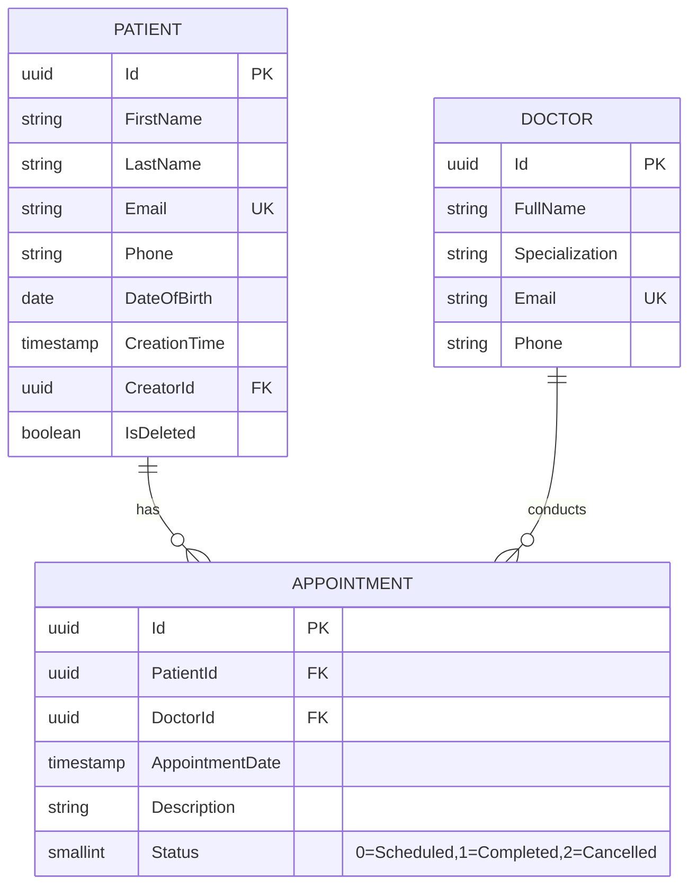
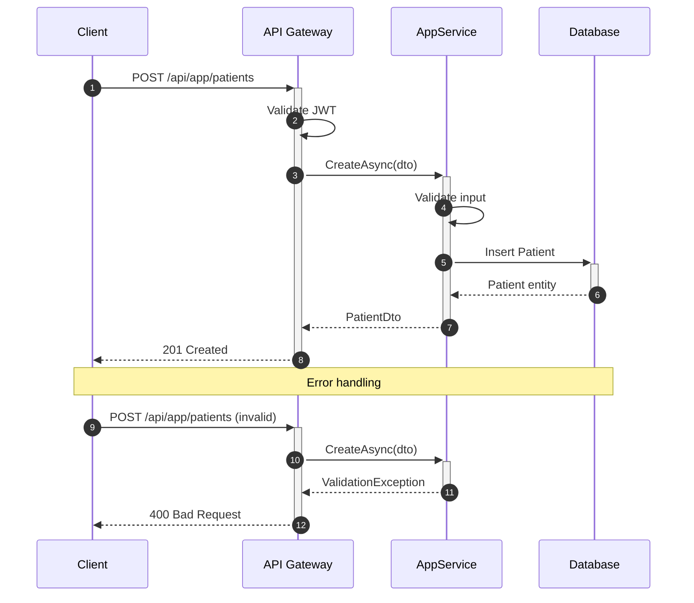
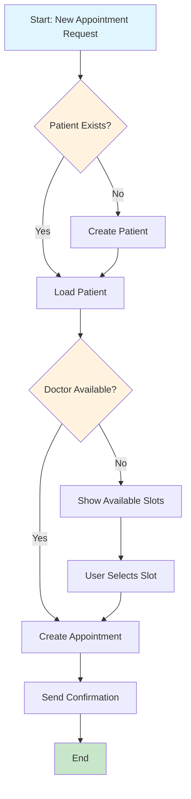
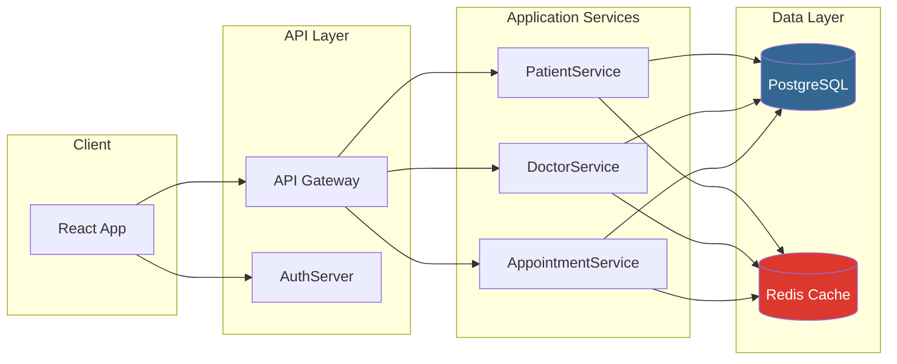
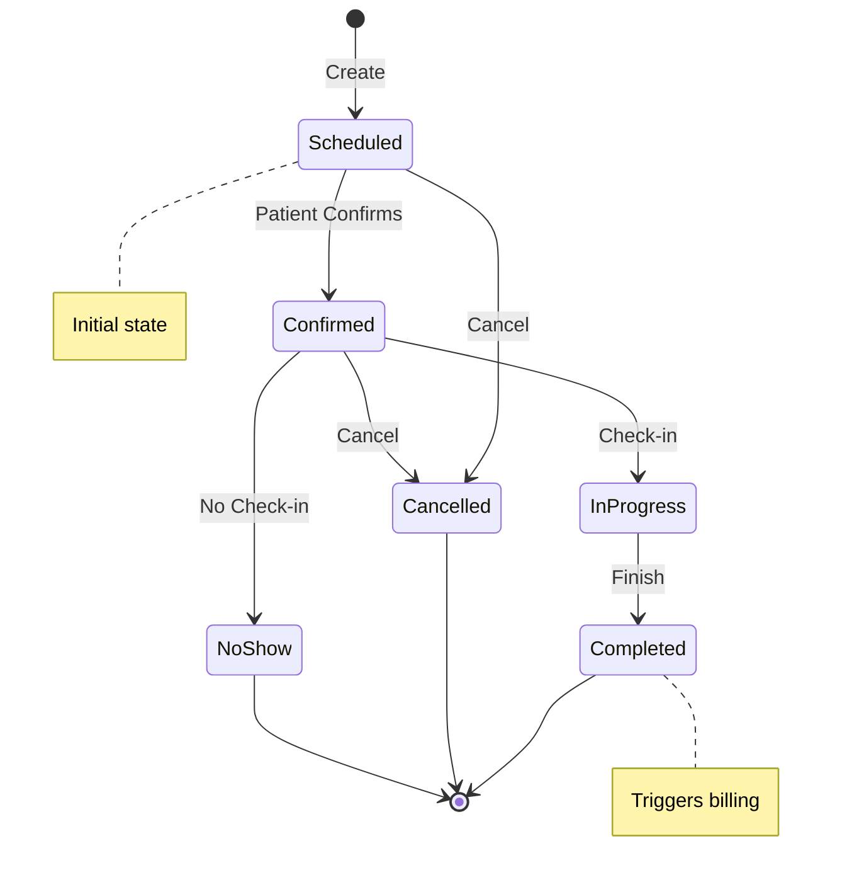

# Mermaid Diagram Patterns

Create clear, professional Mermaid diagrams for technical documentation.

## When to Use

- Database schema visualization (ERD)
- API interaction sequences
- Process and workflow flowcharts
- System architecture diagrams
- State machines and user journeys
- Decision trees

## Diagram Type Selection

| Scenario | Diagram Type | Mermaid Syntax |
|----------|--------------|----------------|
| Database schema | ERD | `erDiagram` |
| API calls | Sequence | `sequenceDiagram` |
| Process flow | Flowchart | `graph TD` or `flowchart TD` |
| Component architecture | Flowchart | `graph LR` |
| State transitions | State | `stateDiagram-v2` |
| User workflow | Journey | `journey` |
| Project timeline | Gantt | `gantt` |
| Class relationships | Class | `classDiagram` |

## ERD Pattern (Database Schema)

Use for entity definitions in technical design documents.



### ERD Conventions

| Symbol | Meaning |
|--------|---------|
| `PK` | Primary Key |
| `FK` | Foreign Key |
| `UK` | Unique Key |
| `||--o{` | One-to-Many |
| `||--||` | One-to-One |
| `}o--o{` | Many-to-Many |

## Sequence Diagram Pattern (API Interactions)

Use for documenting API flows in technical design.



### Sequence Conventions

| Arrow | Meaning |
|-------|---------|
| `->>` | Sync request |
| `-->>` | Sync response |
| `--)` | Async message |
| `+` / `-` | Activation/deactivation |

## Flowchart Pattern (Process Flow)

Use for business processes and decision flows.



### Flowchart Conventions

| Shape | Syntax | Use For |
|-------|--------|---------|
| Rectangle | `[text]` | Process/Action |
| Diamond | `{text}` | Decision |
| Stadium | `([text])` | Start/End |
| Parallelogram | `[/text/]` | Input/Output |
| Circle | `((text))` | Connector |

## Architecture Diagram Pattern

Use for system component visualization.



## State Diagram Pattern

Use for entity lifecycle documentation.



## Styling Guidelines

### Color Palette (ABP/Healthcare Theme)

```mermaid
%%{init: {'theme': 'base', 'themeVariables': {
    'primaryColor': '#1976d2',
    'primaryTextColor': '#fff',
    'primaryBorderColor': '#1565c0',
    'lineColor': '#424242',
    'secondaryColor': '#f5f5f5',
    'tertiaryColor': '#e3f2fd'
}}}%%
```

### Styling Classes

```
style NodeId fill:#color,stroke:#color,color:#textcolor
classDef className fill:#color,stroke:#color
class NodeId className
```

## Quality Checklist

- [ ] Correct diagram type for the scenario
- [ ] Clear, descriptive labels
- [ ] Consistent arrow directions (TD=top-down, LR=left-right)
- [ ] Proper relationship cardinality (ERD)
- [ ] Activation bars for long operations (sequence)
- [ ] Decision points clearly marked (flowchart)
- [ ] Subgraphs for logical grouping
- [ ] Comments for complex sections (`%%`)

## Integration Points

This skill is used by:
- **backend-architect**: ERD in technical-design.md, API sequences
- **business-analyst**: Process flows in requirements.md, user journeys

## References

- [Mermaid Official Docs](https://mermaid.js.org/intro/)
- [references/diagram-examples.md](references/diagram-examples.md) - Additional examples
