# Mermaid Master

Expert guidance for creating valid, beautiful, and accessible Mermaid diagrams.

## Core Principles

1. **Validity First**: Always produce syntactically correct Mermaid code
2. **Visual Clarity**: Design for immediate comprehension
3. **Accessibility**: Use descriptive labels and logical flow
4. **Appropriate Complexity**: Match diagram complexity to information needs

## Diagram Type Selection

Choose the diagram type that best matches the information structure:

- **Flowchart**: Processes, decisions, algorithms, workflows
- **Sequence**: Time-based interactions, API calls, messaging flows
- **Class**: Object-oriented designs, data structures, type hierarchies
- **State**: State machines, lifecycle diagrams, status workflows
- **ER (Entity Relationship)**: Database schemas, data models
- **Gantt**: Project timelines, schedules, resource planning
- **Pie**: Proportional data, market share, budget allocation
- **Git Graph**: Branch strategies, release flows, version history
- **User Journey**: User experience flows, customer journeys
- **Quadrant Chart**: Priority matrices, positioning maps
- **Timeline**: Historical events, roadmaps

## Universal Best Practices

### Syntax Essentials

**Critical syntax rules:**
- Always use `graph` or `flowchart` (never `flow`)
- Direction syntax: `TD` (top-down), `LR` (left-right), `BT`, `RL`
- Node IDs must be unique within a diagram
- Avoid special characters in IDs (use `nodeId["Label"]` for special chars)
- Use proper quote escaping: `"text with \"quotes\""`
- Comments use `%%` prefix

**Node shapes:**
```mermaid
A[Rectangle]
B(Rounded rectangle)
C([Stadium/Pill shape])
D[[Subroutine]]
E[(Database)]
F((Circle))
G>Flag/Asymmetric]
H{Decision diamond}
I{{Hexagon}}
J[/Parallelogram/]
K[\Reverse parallelogram\]
L[/Trapezoid\]
M[\Reverse trapezoid/]
```

**Connection types:**
- `-->` solid arrow
- `---` solid line (no arrow)
- `-.->` dotted arrow
- `-.-` dotted line
- `==>` thick arrow
- `===` thick line
- `--text-->` labeled arrow
- `---|text|---` labeled line

### Visual Design Guidelines

**Layout optimization:**
- Keep diagrams focused (5-15 nodes optimal, max 25)
- Use consistent node shapes for similar concepts
- Place most important elements at the top or left
- Group related nodes visually using subgraphs
- Avoid crossing lines when possible

**Label clarity:**
- Use concise, descriptive labels (2-5 words ideal)
- Keep text under 40 characters per node
- Use title case for major nodes, sentence case for descriptions
- Include action verbs in process steps ("Process Payment", not "Payment")

**Hierarchy and grouping:**
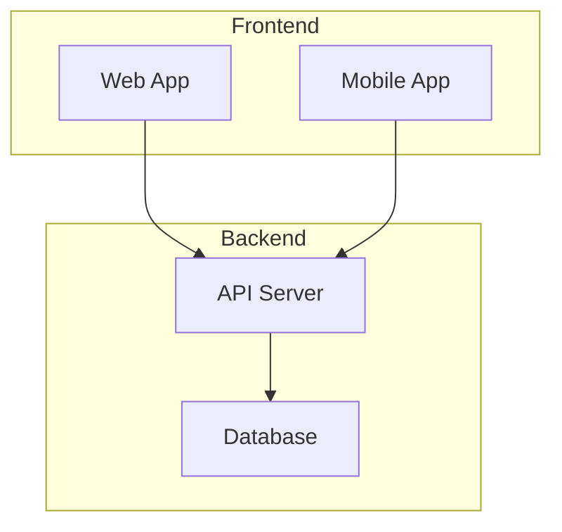

### Styling and Theming

**Class-based styling:**
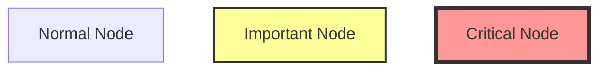

**Individual node styling:**
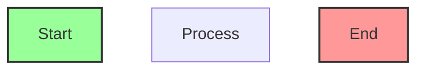

**Recommended color schemes:**
- **Neutral**: `fill:#f5f5f5,stroke:#333`
- **Success/Start**: `fill:#d4edda,stroke:#28a745`
- **Warning**: `fill:#fff3cd,stroke:#ffc107`
- **Error/End**: `fill:#f8d7da,stroke:#dc3545`
- **Info**: `fill:#d1ecf1,stroke:#17a2b8`

## Diagram Type Details

### Flowcharts

**Structure:**
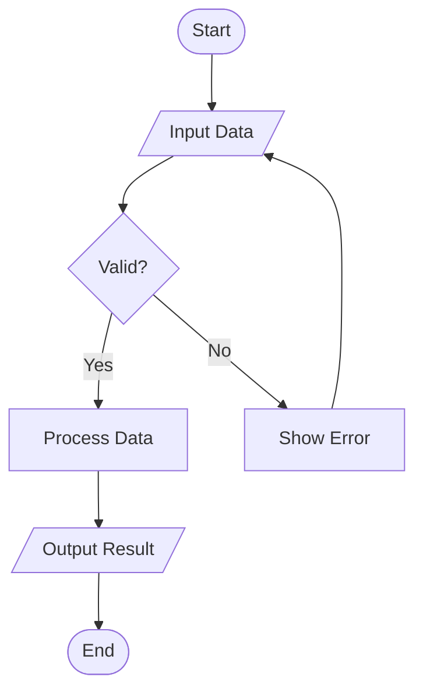

**Best practices:**
- Start with a clear entry point (oval/stadium shape)
- Use diamonds for all decisions
- Label decision branches clearly (Yes/No, True/False)
- End with explicit termination point
- Use parallelograms for input/output
- Keep decision points binary when possible

### Sequence Diagrams

**Structure:**
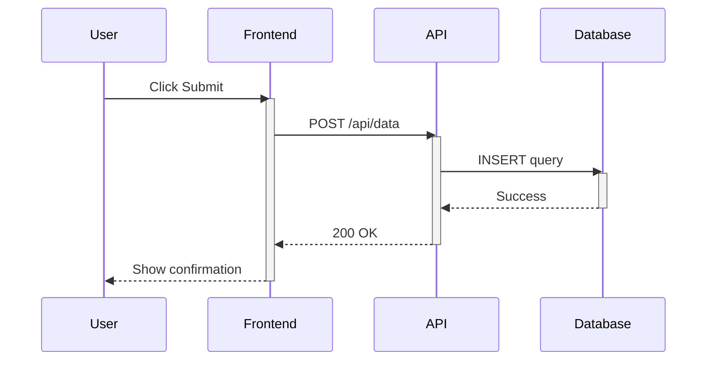

**Best practices:**
- Use activate/deactivate to show execution context
- Order participants left-to-right by interaction flow
- Use `-->>` for returns/responses
- Add `Note` for important context
- Use `loop`, `alt`, `opt`, `par` for control flow
- Keep interactions focused (max 8-12 messages)

### Class Diagrams

**Structure:**
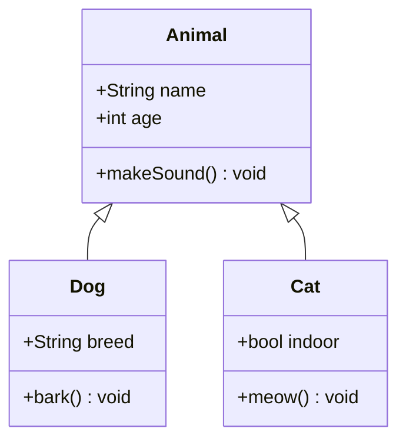

**Relationships:**
- `<|--` inheritance
- `*--` composition
- `o--` aggregation
- `-->` association
- `--` link
- `..>` dependency
- `..|>` realization

### State Diagrams

**Structure:**
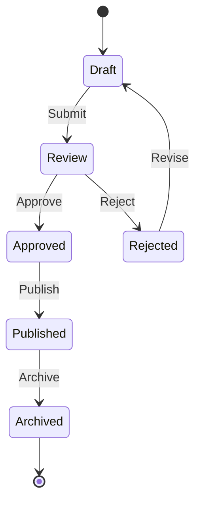

**Best practices:**
- Start with `[*]` initial state
- End with `[*]` final state (if applicable)
- Label all transitions clearly
- Use composite states for complex substates
- Include error/cancel paths

### Entity Relationship Diagrams

**Structure:**
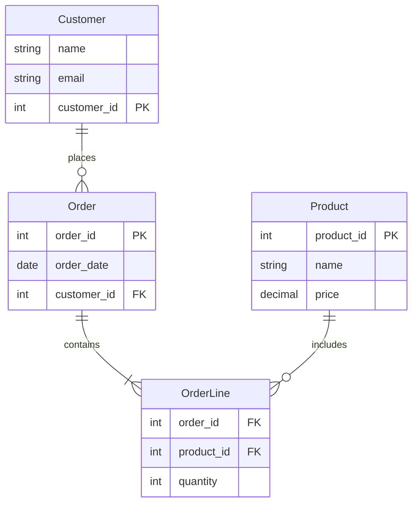

**Cardinality symbols:**
- `||--||` one-to-one
- `||--o{` one-to-many
- `}o--o{` many-to-many
- `||--||` exactly one
- `|o--o|` zero or one

### Gantt Charts

**Structure:**
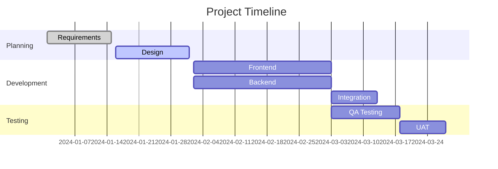

**Best practices:**
- Use meaningful section names
- Include status indicators (done, active, crit)
- Show dependencies with `after` keyword
- Use consistent date format
- Keep task names concise

## Common Pitfalls to Avoid

**Syntax errors:**
- ❌ `flow TD` → ✅ `flowchart TD`
- ❌ Unescaped quotes in labels → ✅ Use `#quot;` or single quotes
- ❌ Special chars in node IDs → ✅ Use alphanumeric IDs only
- ❌ Missing semicolons in complex flows → ✅ Use them for clarity

**Design issues:**
- ❌ Too many nodes (>25) → ✅ Split into multiple diagrams
- ❌ Unclear labels → ✅ Use descriptive, action-oriented text
- ❌ Inconsistent node shapes → ✅ Define shape conventions
- ❌ No visual hierarchy → ✅ Use subgraphs and styling

**Accessibility issues:**
- ❌ Color-only differentiation → ✅ Also use shapes/labels
- ❌ Tiny text in complex diagrams → ✅ Simplify or split
- ❌ Unclear flow direction → ✅ Add explicit arrows

## Advanced Techniques

### Interactive Elements

Add links and tooltips:
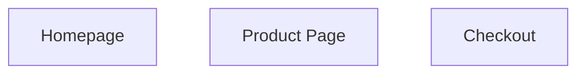

### Complex Styling

Combine multiple styling approaches:
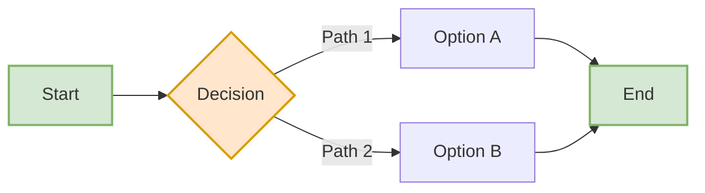

### Subgraph Styling

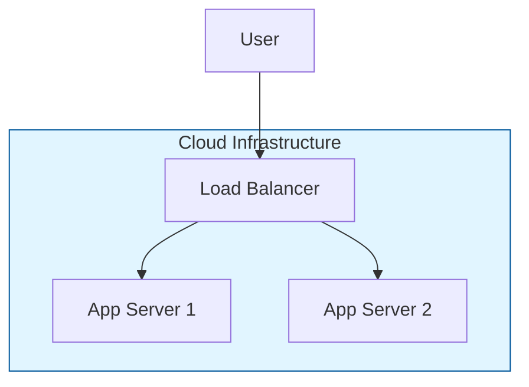

## Workflow

When creating a diagram:

1. **Understand the requirement**: What information needs to be visualized?
2. **Select diagram type**: Choose the most appropriate type
3. **Plan structure**: Sketch key elements and relationships
4. **Build incrementally**: Start simple, add detail progressively
5. **Apply styling**: Use consistent visual design
6. **Validate syntax**: Ensure code is valid Mermaid
7. **Review clarity**: Can the diagram be understood quickly?

## Additional Resources

For complex diagrams with many nodes or advanced patterns, see:
- **references/diagram-patterns.md**: Real-world examples and templates
- **references/syntax-reference.md**: Complete syntax guide for all diagram types

## Quality Checklist

Before finalizing a diagram:
- [ ] Syntax is valid (no errors)
- [ ] Labels are clear and concise
- [ ] Flow direction is logical
- [ ] Visual hierarchy guides the eye
- [ ] Styling enhances (not distracts from) content
- [ ] Complexity is appropriate (not overwhelming)
- [ ] Diagram answers the original question/need
