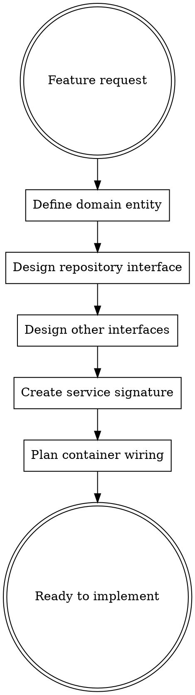

# New Feature Architecture

## Overview

Design features with clean architecture BEFORE writing implementation code. This skill ensures proper separation of concerns, dependency injection, and testability.

**Following the letter IS following the spirit.** The workflow below is not negotiable—skipping steps to "save time" creates technical debt.

## When to Use

Use this skill when:
- Adding a new domain concept (e.g., comments, subscriptions, analytics)
- Creating functionality that needs database, storage, or external APIs
- User asks to "add a feature" or "implement X"
- Building anything more complex than a simple UI change

## Architecture Overview

```
┌─────────────────────────────────────────────────────────────┐
│                     UI Layer (app/)                         │
│         Routes, Components, Server Actions (THIN)           │
│                           │                                 │
│                    imports from                             │
│                           ▼                                 │
│              ┌─────────────────────┐                        │
│              │   lib/container.ts  │                        │
│              │   (DI Wiring)       │                        │
│              └─────────────────────┘                        │
│                           │                                 │
│              instantiates & injects                         │
│                           ▼                                 │
├─────────────────────────────────────────────────────────────┤
│                  Domain Layer (lib/domain/)                 │
│        Business Logic, Validation, Services                 │
│                           │                                 │
│              depends on (interfaces only)                   │
│                           ▼                                 │
│              ┌─────────────────────┐                        │
│              │ lib/infra/interfaces│                        │
│              │ (Contracts)         │                        │
│              └─────────────────────┘                        │
│                           ▲                                 │
│                    implements                               │
│                           │                                 │
├─────────────────────────────────────────────────────────────┤
│                  Infra Layer (lib/infra/)                   │
│        Database, Storage, Email, External APIs              │
└─────────────────────────────────────────────────────────────┘
```

## The Three Laws

1. **Domain layer (`lib/domain/`) MUST NOT import from `lib/infra/` or `lib/db/`**
2. **Services MUST receive dependencies via constructor injection**
3. **UI layer MUST only import from `lib/container.ts`, never directly from infra**

## Required Workflow



### Step 1: Define the Domain Entity

Before ANY code, answer these questions:

**Entity Definition:**
- What is the entity name? (e.g., Comment, Subscription, Analytics)
- What properties does it have?
- What are the validation rules?
- What errors can occur?

**Create `lib/domain/{entity}/{entity}.entity.ts`:**
```typescript
// Types - no external dependencies
export interface MyEntity {
  id: string;
  // ... properties
}

// Pure validation functions - NO I/O, NO database calls
export function validateX(value: string): ValidationResult {
  // validation logic
  return { valid: true } | { valid: false, error: 'message' };
}

// Constants
export const MAX_LENGTH = 1000;
```

### Step 2: Design Repository Interface

**Create `lib/infra/interfaces/{entity}.repository.ts`:**
```typescript
import type { MyEntity } from '@/lib/domain/{entity}/{entity}.entity';

export interface IMyEntityRepository {
  findById(id: string): Promise<MyEntity | null>;
  findByUserId(userId: string): Promise<MyEntity[]>;
  create(input: CreateInput): Promise<MyEntity>;
  update(id: string, input: UpdateInput): Promise<MyEntity>;
  delete(id: string): Promise<void>;
}
```

**Key principle:** Define what operations you NEED, not what the database CAN do.

### Step 3: Design Other Interfaces (if needed)

Does your feature need:
- File storage? → `IStorageAdapter`
- Email sending? → `IEmailAdapter`
- External API? → `IExternalServiceAdapter`

Create interfaces in `lib/infra/interfaces/` for each.

### Step 4: Create Service Signature

**Create `lib/domain/{entity}/{entity}.service.ts`:**
```typescript
import type { IMyEntityRepository } from '@/lib/infra/interfaces/{entity}.repository';
import type { IStorageAdapter } from '@/lib/infra/interfaces/storage.adapter';
import { validateX } from './{entity}.entity';
import { MyEntityError } from './{entity}.errors';

export class MyEntityService {
  constructor(
    private repo: IMyEntityRepository,
    private storage: IStorageAdapter, // if needed
  ) {}

  async createEntity(userId: string, input: CreateInput): Promise<MyEntity> {
    // 1. Validate (pure functions)
    const result = validateX(input.value);
    if (!result.valid) throw new MyEntityError('INVALID', result.error);

    // 2. Business rules
    // ...

    // 3. Orchestrate (via injected deps)
    return this.repo.create({ userId, ...input });
  }
}
```

### Step 5: Plan Container Wiring

**Update `lib/container.ts`:**
```typescript
import { MyEntityService } from './domain/{entity}/{entity}.service';
import { DrizzleMyEntityRepository } from './infra/db/{entity}.repository';

let myEntityService: MyEntityService | null = null;

export function getMyEntityService(): MyEntityService {
  if (!myEntityService) {
    myEntityService = new MyEntityService(
      new DrizzleMyEntityRepository(),
      new VercelBlobAdapter(), // if needed
    );
  }
  return myEntityService;
}
```

## Checklist Before Implementation

- [ ] Entity types defined in `lib/domain/{entity}/{entity}.entity.ts`
- [ ] Validation functions are pure (no I/O, no async)
- [ ] Domain errors defined in `lib/domain/{entity}/{entity}.errors.ts`
- [ ] Repository interface defined in `lib/infra/interfaces/`
- [ ] Service class signature created with constructor injection
- [ ] Container wiring planned
- [ ] NO direct imports from infra in domain layer

## Anti-Patterns to Avoid

| Anti-Pattern | Why Bad | Correct Approach |
|--------------|---------|------------------|
| `import { db } from '../db'` in service | Couples to Drizzle | Inject `IRepository` |
| `import { uploadFile } from '../storage'` | Couples to Vercel Blob | Inject `IStorageAdapter` |
| Validation with database calls | Side effects in validation | Pure validation, async checks in service |
| Service methods directly in actions | No reusability, hard to test | Create service class |
| `new Repository()` in service | Hard to test, tight coupling | Constructor injection |

## Red Flags - STOP and Fix

These thoughts mean you're about to violate architecture:
- "I'll just import the db directly, it's faster"
- "This is simple, I don't need a repository"
- "I'll add the interface later"
- "Constructor injection is overkill for this"
- "Let me just get it working first, then refactor"
- "The validation needs to check the database"
- "I'll call the storage directly, it's just one place"

**All of these mean: STOP. Design the architecture first. No shortcuts.**

## Example: Adding Analytics Feature

### 1. Entity (`lib/domain/analytics/analytics.entity.ts`)
```typescript
export interface PageView {
  id: string;
  siteId: string;
  path: string;
  referrer: string | null;
  userAgent: string;
  timestamp: Date;
}

export interface AnalyticsSummary {
  totalViews: number;
  uniqueVisitors: number;
  topPages: { path: string; views: number }[];
}

export function validatePath(path: string): ValidationResult {
  if (!path.startsWith('/')) return { valid: false, error: 'Path must start with /' };
  if (path.length > 2000) return { valid: false, error: 'Path too long' };
  return { valid: true };
}
```

### 2. Interface (`lib/infra/interfaces/analytics.repository.ts`)
```typescript
export interface IAnalyticsRepository {
  recordPageView(siteId: string, data: PageViewInput): Promise<void>;
  getSummary(siteId: string, dateRange: DateRange): Promise<AnalyticsSummary>;
  getPageViews(siteId: string, options: QueryOptions): Promise<PageView[]>;
}
```

### 3. Service (`lib/domain/analytics/analytics.service.ts`)
```typescript
export class AnalyticsService {
  constructor(private analytics: IAnalyticsRepository) {}

  async recordView(siteId: string, input: PageViewInput): Promise<void> {
    const pathResult = validatePath(input.path);
    if (!pathResult.valid) return; // Silently ignore invalid paths

    await this.analytics.recordPageView(siteId, input);
  }

  async getDashboardData(siteId: string, userId: string): Promise<AnalyticsSummary> {
    // Business logic: verify user owns site (would need site repo too)
    return this.analytics.getSummary(siteId, { days: 30 });
  }
}
```

## Quick Reference

```
New feature requested
    │
    ▼
1. lib/domain/{entity}/{entity}.entity.ts    ← Types + pure validation
2. lib/domain/{entity}/{entity}.errors.ts    ← Domain errors
3. lib/infra/interfaces/{entity}.repository.ts ← Contract
4. lib/domain/{entity}/{entity}.service.ts   ← Business logic (injected deps)
5. lib/infra/db/{entity}.repository.ts       ← Implementation
6. lib/container.ts                          ← Wire it up
7. app/...                                   ← UI calls container
```

## Why This Matters

**Without this workflow:**
- Business logic couples to specific database (can't swap Drizzle for Prisma)
- Storage couples to Vercel Blob (can't use S3 or local files in tests)
- Testing requires mocking database internals
- Changing infrastructure requires changing business logic

**With this workflow:**
- Swap database by implementing new repository
- Test services with mock repositories (no database needed)
- Business logic is pure and understandable
- Infrastructure changes don't touch domain code
