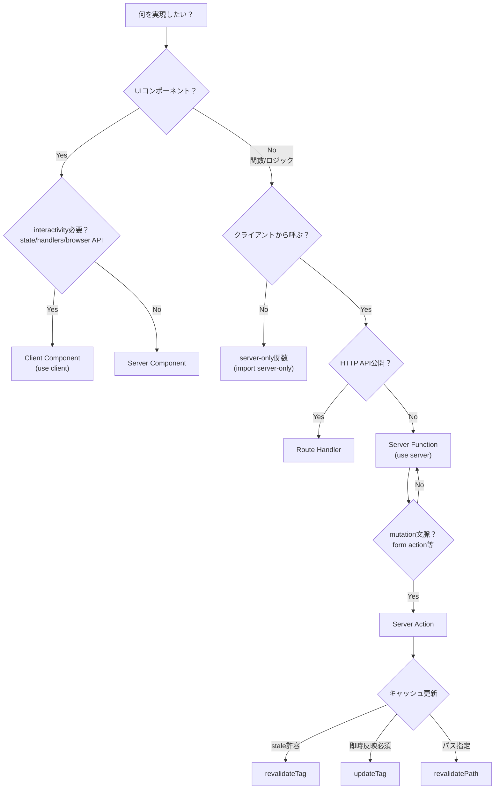

# Next.js App Router 使い分けガイド

## 最小の判断フロー



**Server Action選択後のキャッシュ更新：**
- stale許容 → `revalidateTag`（`profile="max"`でstale-while-revalidate）
- 即時反映必須 → `updateTag`
- パス指定 → `revalidatePath`

## 関連Hooksの使い分け

| Hook | 用途 | 典型例 |
|------|------|--------|
| `useTransition` | UIをブロックせず低優先度更新 | 保存中も入力可能にしたい |
| `useFormStatus` | フォーム送信のpending状態取得 | 二重送信防止、スピナー表示 |
| `useActionState` | action結果に基づくstate管理 | バリデーションエラー表示 |
| `useOptimistic` | 楽観的UI更新 | いいねボタンの即時反映 |

---

## Q1. Server ComponentsとClient Componentsの違いは？

**環境（server / browser）ごとの「できること」で分ける。**

| 用途 | 選択 |
|------|------|
| state / event handlers / `useEffect` / browser API | Client Component |
| DB/API近接でのデータ取得、秘密情報利用、JS削減、ストリーミング | Server Component |

App Routerではlayouts/pagesはデフォルトでServer Component。Client Componentが必要な場合のみファイル先頭に`'use client'`を付ける。

### 補足：重いClient Componentは遅延ロードを検討

重いUI（チャート、エディタ等）は遅延ロードして初期JSを抑える。

```tsx
import dynamic from 'next/dynamic'

const HeavyChart = dynamic(() => import('./Chart'), { ssr: false })

export function Dashboard() {
  return <HeavyChart />
}
```

## Q2. Server FunctionsとServer Actionsの違いは？

**「クライアントからネットワーク経由で呼べるか」で分ける。**

### Server Function（`'use server'`）
サーバーで動く非同期関数で、クライアントからネットワークリクエスト経由で呼べるためasyncである必要がある。`use server`をファイル先頭に置けば、そのファイルの全exportがserver側になる。

### Server Action（= mutation文脈）
「action / mutation文脈」ではServer FunctionsはServer Actionsとも呼ばれる。`<form action={...}>`や`<button formAction={...}>`に渡すと自動的にその扱いになり、Next.jsのキャッシュ機構と統合され、更新後UIと新データを1回のサーバー往復で返せる。

### 補足：Server→Clientのデータ受け渡し（シリアライズ / 最小化）

引数・戻り値はシリアライズ可能である必要がある。クライアントに返すデータは「必要最小限」にするとよい（例：画面に使わない列を返さない、機密をそのまま返さない、巨大な構造体を返さない等）。

### 普通のserver-only関数
クライアントから呼ぶ必要がないユーティリティは「普通のserver-only関数」で十分。`import 'server-only'`でマークすると、Client Componentがimportした場合にビルドエラーにできる。

## Q3. Server Actionsはどこに置く？

**「どこから呼ぶか」で制約が変わる。**

- Server Component内でインライン定義：関数先頭に`'use server'`を置く
- 別ファイルで定義：ファイル先頭に`'use server'`を置く

Client Componentsは「モジュール先頭の`"use server"`」で定義されたactionしかimportできない。つまりClient Componentから使いたい場合は、専用ファイルを作る必要がある。

```typescript
// actions.ts
'use server'

export async function createPost(formData: FormData) {
  // Server Actionの実装
}
```

## Q4. Route HandlersとServer Actionsの使い分けは？

**「HTTP APIとしての入出力が必要か」で分ける。**

| ユースケース | 選択 |
|-------------|------|
| ブラウザから直接`fetch('/api/...')`したい | Route Handler |
| Webhookを受けたい | Route Handler |
| 外部クライアントに公開したい | Route Handler |
| フォーム送信・ボタン操作などUIからの更新 | Server Action |

Route Handlersは`app/**/route.ts`に配置し、Web標準の`Request`/`Response` APIを使う。Server Actionsは裏側で`POST`を使い、Next.jsのキャッシュ/UI更新と統合される。

## Q5. useTransitionはいつ使う？

**「UIをブロックせずに低優先度の更新を裏で進めたい」とき。**

`useTransition`は「UIをブロックせずにstateを更新する」ためのReact Hookで、`isPending`と`startTransition`を返す。

```tsx
const [isPending, startTransition] = useTransition()

function handleSave() {
  startTransition(async () => {
    await saveData()  // この間もUIは操作可能
  })
}
```

Server Actionsは慣習的に`startTransition`と一緒に使われ、`<form action>`経由ならそれが自然に成立する。

## Q6. useFormStatusはいつ使う？

**「フォーム送信のpending状態」をUIに反映したいとき。**

`useFormStatus`は直近のform submissionのステータス情報を返すHook。

```tsx
function SubmitButton() {
  const { pending } = useFormStatus()
  return <button disabled={pending}>送信</button>
}
```

注意：`pending`を正しく取るには`<form>`の中でレンダリングされるコンポーネント内で使う必要がある。

## Q7. useActionState / useOptimistic はいつ使う？

### useActionState
**「form actionが呼ばれたときに更新されるstate」を作りたいとき。**

```tsx
const [state, formAction, isPending] = useActionState(
  async (prevState, formData) => {
    const result = await submitForm(formData)
    return result  // これが次のstateになる
  },
  initialState
)

return <form action={formAction}>...</form>
```

バリデーションエラーの表示や、サーバーからの応答に基づくUI更新に便利。

### useOptimistic
**「非同期アクション実行中だけ楽観的に違うstateを見せたい」とき。**

```tsx
const [optimisticLikes, addOptimisticLike] = useOptimistic(
  likes,
  (state, newLike) => [...state, newLike]
)

async function handleLike() {
  addOptimisticLike({ id: 'temp', pending: true })  // 即座にUI反映
  await likePost()  // サーバー処理完了後、実際の値に置き換わる
}
```

「いいね」ボタンなど、即座にフィードバックを見せたいUIに有効。

## Q8. revalidatePath()はいつ使う？

**「特定パスのキャッシュをオンデマンドで無効化したい」とき。**

`revalidatePath`は特定pathのcached dataをオンデマンドでinvalidateできる。Server FunctionsとRoute Handlersで呼べるが、Client Componentsでは呼べない。

挙動の違いに注意：
- **Server Functionで呼ぶ**：影響パスを見ているときUIが即時更新されうる。「訪問済みページが次回ナビゲーションでrefreshされる」挙動は一時的
- **Route Handlerで呼ぶ**：次にそのpathが訪問されたときにrevalidateされる

動的セグメントのパターン指定：
```ts
revalidatePath('/posts/[id]', 'page')
```

## Q9. revalidateTagとupdateTagの違いは？

**「キャッシュをタグでまとめて制御」し、読み取り一貫性の要件で使い分ける。**

| 関数 | 特徴 | ユースケース |
|------|------|-------------|
| `revalidateTag` | `profile="max"`指定でstale-while-revalidate（裏でfreshを取る間staleを返す） | 更新が多少遅れてもよいコンテンツ |
| `updateTag` | staleを返さずfreshを待つ | read-your-own-writes（更新直後に必ず最新を見せたい） |

`updateTag`はServer Actions内でのみ使える。

tag系APIが効くためには、読み取り側でタグ付けが必要：
- `fetch(... { next: { tags: [...] }})`
- `use cache` + `cacheTag(...)`

## Q10. serverActions設定はいつ使う？

**「CSRF対策（プロキシ経由）」や「送信ボディが大きい」とき。**

```js
// next.config.js
module.exports = {
  experimental: {
    serverActions: {
      allowedOrigins: ['my-proxy.com'],  // CSRF対策
      bodySizeLimit: '2mb',              // デフォルト1MB
    },
  },
}
```

### セキュリティの仕組み（Origin/Hostチェック）
Next.jsのServer Actionsは`Origin`ヘッダと`Host`を比較し、一致しない場合はActionを拒否する。裏側では`POST`のみがactionsをinvokeできる。

## Q11. 「action / mutation文脈」って結局なに？

**「読み取り（read）ではなく、書き込み（mutation）を起こす操作」の文脈。**

- **Server Function**：サーバーで動く非同期関数の総称
- **Server Action**：その中でも「mutationを起こす文脈」で使われるもの

`<form action=...>`や`<button formAction=...>`で自然に発火し、キャッシュ/UI更新と統合される。

## Q12. Cache Components / use cache はいつ使う？

**「コンポーネントや関数をキャッシュ可能としてマークしたい」とき（Next.js 16+のopt-in機能）。**

```tsx
// ファイル全体をキャッシュ可能に
'use cache'

export async function getCachedData() {
  // この関数の結果がキャッシュされる
}
```

Cache ComponentsはNext configで`cacheComponents`フラグを有効化して使うopt-in機能。

## Q13. Suspense境界はいつ使う？

**「部分的に先に表示して、残りを後から差し込みたい」とき（ストリーミング最適化）。**

App RouterではSuspenseを前提に「ルートセグメント単位でLoading UIを差し込む」設計が取りやすい。`loading.js`はReact Suspenseで意味のあるLoading UIを作り、サーバーからコンテンツがストリーミングされる間に即時のフォールバックを表示できる。

典型例：
- 上部レイアウト（ヘッダ/ナビ）は即表示
- 記事本文や一覧など、データ依存部は後からストリームで差し込む
- 「体感速度」を上げたいページ（ダッシュボード、検索結果、フィードなど）

## Q14. React.cache() はいつ使う？

**「同一リクエスト内での重複データ取得を避けたい」とき（リクエスト単位の重複排除）。**

RSCの文脈で、Reactの`cache`は「関数呼び出し結果をメモ化する」。同一リクエスト内で同じ引数の呼び出しが繰り返される場合に、重複計算・重複I/Oを抑える。

```ts
import { cache } from 'react'

const getUser = cache(async (id: string) => {
  return db.user.findUnique({ where: { id } })
})
```

「layoutとpageの両方で同じデータを触る」「複数コンポーネントが同じ参照データを読む」などで有効。

## Server Actionsの制約

- **mutation向け**：データ取得（fetch用途）には推奨されない
- **直列実行**：クライアントは「1つずつ順番にdispatchしてawait」するため並列フェッチには向かない
- **シリアライズ制約**：引数・戻り値はシリアライズ可能である必要がある

並列でデータを取りたい場合：
- Server Componentsでのデータフェッチ
- 1つのServer Function内で`Promise.all`

## まとめ

- **デフォルトはServer Component**、state/handlers/browser APIが必要なときだけClient Component
- **UIからの更新はServer Action**、HTTP API公開はRoute Handler
- **Server Actionsはmutation向け**、並列データ取得にはServer Componentsを使う
- **キャッシュ制御**は`revalidatePath`/`revalidateTag`、即時反映（read-your-own-writes）なら`updateTag`
- **server-only**にしたいモジュールは`import 'server-only'`で漏洩防止
- **フォームUI**には`useFormStatus`/`useActionState`/`useOptimistic`を活用
- **重いClient Componentは遅延ロード**、**体感速度はSuspense境界で最適化**、**重複取得はReact.cacheで抑制**
