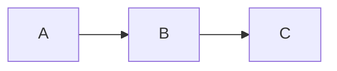

# Obsidian Spec Wiki

Create and manage specification wikis as Obsidian-compatible markdown. Feature areas capture both **what** the system does (specs) and **how** to build it (plans).

## Change Tracking (No LWW)

There is no LWW model. Specs, plans, and code are updated intentionally and together.

**Required change workflow:**
1. Open or reference a `tk` ticket (https://github.com/wedow/ticket).
2. Update the relevant feature spec/plan.
3. Update the code.
4. Add a changelog entry via `tinychange`.
5. Link the `tk` ticket and feature ID in the changelog entry or spec note.

**ADRs:** Store decisions in `docs/reference/decisions/` with Johnny Decimal IDs. Track updates like any other change.

## When to Use

- Creating new project specs or documentation
- Working with existing wikis using the open-questions format: `%% 🙋‍♂️ ... %%` / `%% 🤖 ... %%`
- User mentions "wiki", "spec", "feature", or "Obsidian"
- Need to document behavior for agent-driven code updates

## One-Shot Usage (LLM Quickstart)

When asked to use this skill, follow this sequence in a single pass:
1. Read `docs/AGENTS.md` (and `docs/handbook/README.md` if present).
2. Identify the structure: `features/` or `workstreams/` (treat workstreams as feature areas).
3. Use Johnny Decimal with two-digit decimals (`NN.NN`).
4. Apply the open-questions format with `🙋‍♂️/🤖/✅` and block IDs.
5. Record changes via `tk` and `tinychange` (merge to `docs/changelog.md`).

## Wiki Discovery

Check for existing wiki in order:
1. `docs/` - Primary location
2. `docs/wiki/` - Nested variant
3. `wiki/` - Root alternative
4. `.plans/*/` - Legacy support

First match wins. **Always use `docs/` for new wikis.**

## Directory Structure

```
docs/
├── README.md              # Index with feature table (Johnny Decimal)
├── CLAUDE.md              # Symlink → AGENTS.md
├── AGENTS.md              # Actual agent instructions
├── changelog.md           # Keep a Changelog format (generated via tinychange)
├── handbook/              # Process/tooling docs (Johnny Decimal)
├── reference/             # Architecture + research (Johnny Decimal)
│   └── decisions/         # ADRs (Johnny Decimal IDs)
├── features/              # OR workstreams/ (treat as feature areas)
│   └── NN-name/           # Johnny Decimal area (10-19, 20-29, ...)
│       ├── README.md      # Area summary + feature tables
│       ├── AGENTS.md      # Optional: area-specific agent rules
│       ├── NN.NN-spec.md  # Feature specs (what)
│       └── NN.NN-plan.md  # Implementation plans (how)
└── research/              # Oracle outputs (frozen)
```

**CLAUDE.md vs AGENTS.md convention:**
- `CLAUDE.md` = **symlink** to `AGENTS.md` (NOT a file containing `@AGENTS.md`)
- `AGENTS.md` = actual agent instructions and wiki operations

**Why symlink?** The `@filename` convention in file contents causes some tools to ignore the file entirely. A symlink ensures CLAUDE.md is always read as the actual AGENTS.md content.

**Key concepts:**
- **Feature areas** = Johnny Decimal functional areas (not temporal phases). Treat everything as a feature (product, infra, tooling, docs)
- **Specs** = behavior documents (what the system does)
- **Plans** = implementation documents (how to build it)
- **Research** = Oracle/Delphi outputs (frozen snapshots)

## Codebase AGENTS.md (Required)

Every top-level code or source folder must include an `AGENTS.md` that explains:
- The folder's purpose
- Feature area IDs it implements (link to `docs/features/`)
- Boundaries (what does NOT belong here)
- Primary entry points and tests

## Core Principles

### 1. Progressive Disclosure

Load only what's needed:

```
User asks about auth → Read features/10-core/README.md
User asks about login → Read features/10-core/10.01-auth-spec.md
User asks for overview → Read README.md only
```

Load only what each task requires.

### 2. Johnny Decimal Structure

Organize all feature areas using Johnny Decimal (johnnydecimal.com). Use ranges like 10-19, 20-29, ... Each feature has an ID `NN.NN` and uses that prefix in filenames.

Example:
```
docs/features/10-core/
├── README.md
├── 10.01-auth-spec.md
└── 10.01-auth-plan.md
```

### 3. Wiki Links Everywhere

All references use `[[wiki-links]]`. Broken links = sync signal.

```markdown
[[features/10-core/10.01-auth-spec|Login Flow]]
[[reference/architecture#auth-middleware|Auth Middleware]]
```

### 4. Task Tracking with Obsidian Comments

Track open questions using hidden comments with emoji prefixes and block references. Multi-line is allowed if it improves readability.

```markdown
%% 🙋‍♂️ Human question/task %% ^q-scope-descriptor

%% 🤖 Agent question waiting on human %% ^q-scope-question

%% ✅ Question here → Answer here %% ^q-scope-resolved
```

**CRITICAL: Separate each question with a blank line.** Obsidian treats consecutive lines as a single block; only the last block ID works.

**Format components:**
- `🙋‍♂️` = **human wrote this** → AGENTS SHOULD ACTION/ANSWER
- `🤖` = **agent wrote this** → AGENTS MUST SKIP (waiting for human)
- `✅` = **resolved** → no action needed
- `^q-{scope}-{descriptor}` = block ID for Obsidian navigation

**WHO ANSWERS WHAT:**
| Emoji | Who wrote it | Who should answer/action |
|-------|--------------|--------------------------|
| 🙋‍♂️ | Human | **Agent** (this is work for you!) |
| 🤖 | Agent | **Human** (skip this, you asked it) |
| ✅ | Resolved | **No one** |

**Conversation threading:** Questions can have inline replies. The **LAST emoji** determines whose turn:
```
%% 🤖 Should we cache? 🙋‍♂️ yes 🤖 what limit? %% ^q-cache
```
Last emoji is 🤖 → Human's turn. When `✅` → Done.

**Block ID convention:** `^q-{scope}-{descriptor}`
- `^q-auth-oauth` (auth feature, OAuth question)
- `^q-tabs-persist` (tabs feature, persistence question)

**Workflow:**
- Agent adds `🤖` question → human answers (agent skips these)
- Human answers → convert to `🙋‍♂️` (now actionable by agent) or `✅` (resolved)
- Human adds `🙋‍♂️` task → agent should action this
- Resolved format: `%% ✅ question → answer %% ^q-id`

**Linking to questions:**
```markdown
[[features/10-core/10.01-auth-spec#^q-auth-oauth|OAuth question]]
```

**Search in Obsidian:** Search for the emoji.

**Find via terminal:**
```bash
rg "🙋‍♂️" docs/                 # human tasks
rg "🤖" docs/                    # agent questions
rg "✅" docs/                    # resolved
rg "%% .*%%$" docs/              # missing block IDs (lines ending with %%)
```

**Agent responsibility:** Add block IDs to any question missing one. Generate the ID from the file's feature/spec and the question topic:
```
%% 🤖 how to handle OAuth? %%           → missing block ID
%% 🤖 how to handle OAuth? %% ^q-auth-oauth   → fixed
```

### 5. Changelog Protocol

Update `changelog.md` via `tinychange`. Do not hand-edit.

Setup (once):
```bash
tinychange init
```

Add entry (interactive):
```bash
tinychange
```

Add entry (scripted):
```bash
tinychange new --kind Added --message "Describe the change" --author "Your Name"
```

Include the `tk` ticket ID in the message when available (e.g., "[tk-123] Add feature X").

Merge entries into `docs/changelog.md`:
```bash
tinychange merge
```

Ensure `tinychange.toml` points to `docs/changelog.md` and uses Keep a Changelog format.

## Templates

### Spec File Template

```markdown
# NN.NN Spec Name

> **Feature Area:** [[../README|NN-Feature-Area-Name]]
> **Feature ID:** NN.NN
> **Ticket:** tk-000 (optional)

## Behavior

### Contract
- **Input:** description
- **Output:** description
- **Preconditions:** what must be true before
- **Postconditions:** what will be true after

### Scenarios
- When X happens → Y should occur
- When edge case → handle gracefully

## Decisions

### Assumptions
1. [Assumption] - [implication if wrong]
2. [Assumption] - [implication if wrong]

### Failure Modes
| Failure | Detection | Recovery |
|---------|-----------|----------|
| [scenario] | [how to detect] | [what to do] |

### ADR-1: Decision Title
- **Status:** Proposed | Accepted | Deprecated | Superseded
- **Context:** Why this decision was needed
- **Decision:** What we decided
- **Consequences:** What happens as a result
- **Alternatives:** What we considered and rejected

### Open Questions

%% 🤖 Question needing resolution? %% ^q-specname-topic

## Integration

### Dependencies
- [[path/to/spec|Display Name]] - what we need from it

### Consumers
- [[path/to/spec|Display Name]] - what uses us

### Diagram

```

### Plan File Template

```markdown
# NN.NN Plan Name

> **Feature Area:** [[../README|NN-Feature-Area-Name]]
> **Related Spec:** [[NN.NN-spec-name]] (optional)
> **Ticket:** tk-000 (optional)

## Goal
What this plan achieves.

## Prerequisites
- [ ] Dependency 1
- [ ] Dependency 2

## Implementation Steps

### Phase 1: [Name]
- [ ] Step 1
- [ ] Step 2

### Phase 2: [Name]
- [ ] Step 3
- [ ] Step 4

## Files to Modify
| File | Changes |
|------|---------|
| `path/to/file` | Description of changes |

## Testing Strategy
How to verify the implementation works.

## Risks & Mitigations
| Risk | Mitigation |
|------|------------|
| [What could go wrong] | [How to prevent/handle] |

## Open Questions

%% 🤖 Implementation question? %% ^q-planname-topic
```

### Feature Area README Template

```markdown
# NN Feature Area Name

> Brief description of what this feature area covers.

## Goal
What this feature area achieves.

## Specs

| Spec | Description | Status |
|------|-------------|--------|
| [[NN.NN-spec-name]] | Brief description | Status |
| [[NN.NN-spec-name]] | Brief description | Status |

## Plans

| Plan | Description | Status |
|------|-------------|--------|
| [[NN.NN-plan-name]] | Implementation approach | Status |

## Shared Decisions

ADRs that apply to all specs in this feature area:
- **Decision:** Brief summary

## Integration Points

This feature area connects to:
- [[../20-other-area/README|Other Feature Area]] - how
```

### CLAUDE.md Setup (Symlink)

CLAUDE.md should be a **symlink** to AGENTS.md, not a file with content:

```bash
# From within docs/ directory
ln -s AGENTS.md CLAUDE.md
```

This ensures CLAUDE.md and AGENTS.md always have identical content. All actual instructions go in AGENTS.md.

### AGENTS.md Template

Agent instructions belong here:

```markdown
# Agent Instructions: [Project Name]

[Project-specific rules here...]

---

## Wiki Operations

**IMPORTANT:** When working with this wiki, use the `obsidian-plan-wiki` skill if available. It provides the full spec format and workflow patterns.

This documentation uses Obsidian vault format. Follow these patterns.

### Change Tracking (No LWW)

Specs, plans, and code are updated intentionally and together. Track changes via `tk` tickets and `tinychange` entries.

### Ticketing (tk)

All work is tracked via `tk` (https://github.com/wedow/ticket). Include ticket IDs in spec/plan headers and in `tinychange` messages.

### Progressive Disclosure

**Don't load everything.** Navigate in layers:

1. **Start at feature area README** - `features/NN-name/README.md`
   - Understand scope and current status
   - See which specs exist

2. **Read specific specs as needed** - `features/NN-name/NN.NN-*-spec.md`
   - Load only the spec you're implementing
   - Check "Integration" section for related specs

3. **Dive into reference docs for deep context** - `reference/` or `features/NN-name/reference/`

4. **Check research for background** - `research/topic/`

### Johnny Decimal Features

Feature areas use Johnny Decimal IDs with two-digit decimals. Specs/plans use `NN.NN-` prefixes.

### Open Questions System

See [[handbook/10-docs/10.01-open-questions-system]] for full spec.

**WHO ANSWERS WHAT:**
| Emoji | Who wrote it | Who should answer/action |
|-------|--------------|--------------------------|
| 🙋‍♂️ | Human | **Agent** (this is work for you!) |
| 🤖 | Agent | **Human** (skip this, you asked it) |
| ✅ | Resolved | **No one** |

### Updating Specs

**Before:** Read Assumptions and Failure Modes
**During:** Mark open questions resolved with `✅`, note discoveries
**After:** Update Success Criteria checkboxes, update README status

### Link Format

| Target | Format |
|--------|--------|
| Same directory | `[text](filename.md)` |
| Parent | `[text](../README.md)` |
| Cross-feature area | `[text](../20-name/README.md)` |
```

### Codebase AGENTS.md

Every top-level code or source folder must include an `AGENTS.md` that explains:
- The folder's purpose
- Feature area IDs it implements (link to `docs/features/`)
- Boundaries (what does NOT belong here)
- Primary entry points and tests

### Root README Template

```markdown
# Project Wiki

> **For Claude:** Start here. Read feature area READMEs for context, then specific specs as needed.

## Feature Areas

| # | Feature Area | Description |
|---|--------------|-------------|
| 10 | [[features/10-name/README\|Name]] | Description |

## Quick Links

- [[AGENTS]] - Rules for agents
- [[changelog]] - What changed and when
- [[reference/architecture]] - System overview
- [[reference/decisions]] - ADRs

## Research

Oracle/Delphi outputs (frozen snapshots):
- [[research/topic]] - Description
```

## Workflow Patterns

### Creating a New Wiki

1. Create `docs/` directory structure
2. Write README.md with feature area table (Johnny Decimal)
3. Create AGENTS.md with actual agent instructions
4. Create CLAUDE.md as a symlink: `ln -s AGENTS.md CLAUDE.md`
5. Initialize changelog via `tinychange init`
6. Create feature area folders with README.md
7. Add specs as needed

### Adding a Spec

1. Create `NN.NN-spec-name.md` in feature area folder
2. Add `tk` ticket in the header if applicable
3. Fill in Behavior (contract + scenarios)
4. Document Decisions (ADRs)
5. Map Integration (dependencies + consumers with wiki links)
6. Update feature area README table
7. Update changelog via CLI

### Adding a Plan

1. Create `NN.NN-plan-name.md` in feature area folder
2. Link to related spec if one exists
3. Add `tk` ticket in the header if applicable
4. Fill in Implementation Steps with checkboxes
5. List Files to Modify
6. Document Risks & Mitigations
7. Update feature area README plans table
8. Update changelog via CLI

### Research Workflow

When a `%% 🙋‍♂️ ... %%` or `%% 🤖 ... %%` comment needs research:

**Simple question:** Launch oracle agent
**Complex/uncertain:** Use Delphi (3 parallel oracles + synthesis)

Store results in `research/`, link from spec:
```markdown
%% ✅ question → see [[research/topic]] %% ^q-scope-topic
```

### Keeping Specs and Code in Sync

Specs and code are updated together. If you discover drift:
1. Open or link a `tk` ticket.
2. Decide the intended behavior (document in spec or ADR).
3. Update spec/plan and code to match that decision.
4. Add a `tinychange` entry.

### Updating Specs During Implementation

**Before:** Read the spec's Assumptions and Failure Modes.

**During implementation:**
- Add implementation notes to the spec
- Mark open questions as resolved: `%% ✅ Decided → [outcome] %%`
- Note any discovered failure modes

**After completing:**
- Update Success Criteria checkboxes
- Add commit hash if significant
- Update feature area README status if needed

## Link Format

Use relative markdown links (Obsidian-compatible):

| Target | Link Format |
|--------|-------------|
| Same directory | `[text](filename.md)` |
| Parent directory | `[text](../README.md)` |
| Subdirectory | `[text](reference/file.md)` |
| Cross-feature area | `[text](../20-context-menu/README.md)` |
| Heading anchor | `[text](file.md#section-name)` |

## When to Create New Documentation

| Situation | Action |
|-----------|--------|
| New feature area | Create new feature area directory |
| New behavior to document | Create numbered spec file (`NN.NN-spec.md`) |
| New implementation approach | Create numbered plan file (`NN.NN-plan.md`) |
| Deep technical topic | Add to `reference/` subdirectory |
| Research question | Use Oracle, save to `research/` |
| Feature-area-specific rules | Create `AGENTS.md` in feature area |
| New code/source folder | Create `AGENTS.md` in that folder |

## Best Practices

1. **Specs describe behavior** - What it does (contract, scenarios)
2. **Plans describe implementation** - How to build it (steps, files, risks)
3. **All references are wiki links** - Broken links signal sync issues
4. **Update changelog via CLI immediately** - Don't hand-edit
5. **One spec per feature/component** - Keep focused
6. **Research before deciding** - Use oracles for uncertain questions
7. **Optional AGENTS.md per feature area** - For scoped agent rules
8. **CLAUDE.md is a symlink** - Points to AGENTS.md via symlink
