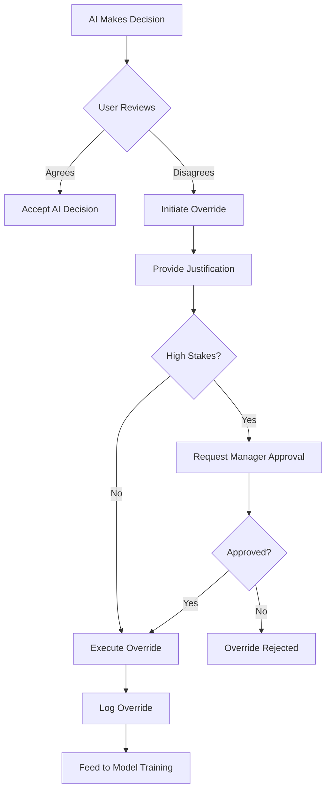

# Override Mechanisms

## Overview

Override Mechanisms allow humans to correct or reverse AI decisions, providing a critical safety net for automated systems. Proper override implementation includes tracking, justification, learning, and prevention of abuse.

**Core Principle**: "AI should be overridable, but overrides should be logged, justified, and learned from."

---

## 1. Why Override Mechanisms Are Essential

- **AI Makes Mistakes**: Even high-accuracy models fail on edge cases
- **Context Matters**: Humans have context AI doesn't (e.g., customer called to complain)
- **Compliance**: Regulations often require human ability to override automated decisions
- **Trust**: Users trust systems more when they can intervene
- **Learning**: Overrides provide valuable training data

---

## 2. Types of Overrides

### Manual Override (Human Changes AI Decision)
```typescript
interface ManualOverride {
  originalDecision: AIDecision;
  newDecision: any;
  overriddenBy: User;
  reason: string;
  timestamp: Date;
  requiresApproval?: boolean;
}

async function manualOverride(
  decisionId: string,
  newDecision: any,
  reason: string,
  user: User
): Promise<OverrideResult> {
  const original = await getDecision(decisionId);
  
  // Check permissions
  if (!canOverride(user, original)) {
    throw new Error('Insufficient permissions to override');
  }
  
  // Require justification
  if (!reason || reason.length < 20) {
    throw new Error('Override reason required (min 20 characters)');
  }
  
  // Create override record
  const override: ManualOverride = {
    originalDecision: original,
    newDecision,
    overriddenBy: user,
    reason,
    timestamp: new Date()
  };
  
  // High-stakes decisions require manager approval
  if (original.impact === 'high') {
    override.requiresApproval = true;
    await requestManagerApproval(override);
  } else {
    await executeOverride(override);
  }
  
  // Log for audit and learning
  await logOverride(override);
  
  return { success: true, overrideId: override.id };
}
```

### Rule-Based Override (Business Rules Trump AI)
```python
def apply_business_rules(ai_decision, context):
    """Business rules can override AI decisions"""
    
    # Rule 1: VIP customers always get approved
    if context['customer_tier'] == 'VIP':
        return {
            'decision': 'approved',
            'override_type': 'business_rule',
            'rule': 'VIP_AUTO_APPROVE',
            'original_ai_decision': ai_decision
        }
    
    # Rule 2: Regulatory compliance
    if context['country'] == 'US' and context['amount'] > 10000:
        # Must comply with Bank Secrecy Act
        return {
            'decision': 'requires_manual_review',
            'override_type': 'compliance',
            'rule': 'BSA_THRESHOLD',
            'original_ai_decision': ai_decision
        }
    
    # Rule 3: Blacklist override
    if context['user_id'] in BLACKLIST:
        return {
            'decision': 'rejected',
            'override_type': 'blacklist',
            'rule': 'BLACKLIST_OVERRIDE',
            'original_ai_decision': ai_decision
        }
    
    # No override needed
    return ai_decision
```

### User Preference Override
```typescript
// User can override AI recommendations
interface UserPreferenceOverride {
  userId: string;
  aiRecommendation: string;
  userChoice: string;
  context: Record<string, any>;
}

function recordUserPreference(override: UserPreferenceOverride) {
  // Learn from user preferences
  userPreferenceModel.learn({
    features: override.context,
    aiPrediction: override.aiRecommendation,
    userChoice: override.userChoice
  });
  
  // Personalize future recommendations
  updateUserProfile(override.userId, {
    preferences: override.userChoice,
    disagreesWith AI: override.aiRecommendation
  });
}
```

### Emergency Override (Kill Switch)
```python
class EmergencyOverride:
    """Emergency kill switch for AI systems"""
    
    @staticmethod
    def disable_ai_system(system_name: str, reason: str, disabled_by: str):
        """Immediately disable AI system"""
        
        # Set feature flag to disable AI
        feature_flags.set(f'ai_{system_name}_enabled', False)
        
        # Switch to fallback (rule-based or manual)
        activate_fallback_system(system_name)
        
        # Alert team
        send_alert(
            severity='critical',
            message=f'AI system {system_name} disabled: {reason}',
            disabled_by=disabled_by
        )
        
        # Log incident
        log_emergency_override({
            'system': system_name,
            'reason': reason,
            'disabled_by': disabled_by,
            'timestamp': datetime.now(),
            'fallback_active': True
        })
```

---

## 3. Override Workflow



---

## 4. Override Tracking

### Override Database Schema
```sql
CREATE TABLE ai_overrides (
    override_id UUID PRIMARY KEY,
    decision_id UUID NOT NULL,
    
    -- Original AI decision
    ai_decision JSONB NOT NULL,
    ai_confidence DECIMAL(5,4),
    
    -- Override details
    new_decision JSONB NOT NULL,
    override_type VARCHAR(50), -- 'manual', 'business_rule', 'emergency'
    
    -- Who and why
    overridden_by VARCHAR(255) NOT NULL,
    reason TEXT NOT NULL,
    
    -- Approval (if required)
    requires_approval BOOLEAN DEFAULT FALSE,
    approved_by VARCHAR(255),
    approved_at TIMESTAMP,
    
    -- Metadata
    created_at TIMESTAMP DEFAULT NOW(),
    impact_level VARCHAR(20), -- 'low', 'medium', 'high', 'critical'
    
    -- Outcome tracking
    was_override_correct BOOLEAN,
    verified_at TIMESTAMP,
    verified_by VARCHAR(255)
);

CREATE INDEX idx_overrides_user ON ai_overrides(overridden_by);
CREATE INDEX idx_overrides_date ON ai_overrides(created_at);
CREATE INDEX idx_overrides_type ON ai_overrides(override_type);
```

### Override Analytics
```python
def analyze_overrides(period_days=30):
    """Analyze override patterns"""
    
    cutoff = datetime.now() - timedelta(days=period_days)
    overrides = Override.filter(created_at__gte=cutoff)
    
    analytics = {
        # Volume
        'total_overrides': len(overrides),
        'override_rate': len(overrides) / total_decisions,
        
        # By type
        'by_type': Counter([o.override_type for o in overrides]),
        
        # By user
        'top_overriders': Counter([o.overridden_by for o in overrides]).most_common(10),
        
        # By reason
        'common_reasons': extract_common_themes([o.reason for o in overrides]),
        
        # Correctness
        'override_accuracy': sum(o.was_override_correct for o in overrides if o.verified) / len([o for o in overrides if o.verified]),
        
        # Impact
        'high_impact_overrides': len([o for o in overrides if o.impact_level == 'high'])
    }
    
    # Alert on anomalies
    if analytics['override_rate'] > 0.20:  # >20% override rate
        alert('High override rate detected - model may need retraining')
    
    return analytics
```

---

## 5. Learning from Overrides

### Feedback to Model Training
```python
def incorporate_overrides_into_training():
    """Use overrides to improve model"""
    
    # Get verified overrides (where we know override was correct)
    verified_overrides = Override.filter(
        was_override_correct=True,
        verified=True
    )
    
    # Create training examples
    training_data = []
    for override in verified_overrides:
        training_data.append({
            'features': override.original_features,
            'label': override.new_decision,  # Human's decision
            'weight': 2.0  # Give overrides higher weight
        })
    
    # Retrain model
    model.fit(training_data, sample_weight=[d['weight'] for d in training_data])
    
    # Evaluate improvement
    test_on_overrides = evaluate_model_on_overrides()
    if test_on_overrides['accuracy'] > 0.90:
        logger.info(f"Model improved on override cases: {test_on_overrides['accuracy']}")
    else:
        logger.warning(f"Model still struggling with override cases")
```

### Identifying Systematic Errors
```python
def identify_systematic_errors():
    """Find patterns in overrides to identify model weaknesses"""
    
    overrides = Override.filter(was_override_correct=True)
    
    # Cluster overrides by feature similarity
    from sklearn.cluster import DBSCAN
    
    features = np.array([o.original_features for o in overrides])
    clustering = DBSCAN(eps=0.3, min_samples=5).fit(features)
    
    # Analyze each cluster
    for cluster_id in set(clustering.labels_):
        if cluster_id == -1:  # Noise
            continue
        
        cluster_overrides = [o for i, o in enumerate(overrides) if clustering.labels_[i] == cluster_id]
        
        if len(cluster_overrides) > 10:
            # Significant pattern found
            pattern_description = describe_pattern(cluster_overrides)
            
            alert(
                f"Systematic error detected: {pattern_description}\n"
                f"Affects {len(cluster_overrides)} cases\n"
                f"Consider adding specific handling or retraining"
            )
```

---

## 6. Override Permissions

### Role-Based Access Control
```typescript
enum OverridePermission {
  NONE = 0,
  LOW_IMPACT = 1,      // Can override low-impact decisions
  MEDIUM_IMPACT = 2,   // Can override medium-impact decisions
  HIGH_IMPACT = 3,     // Can override high-impact decisions
  EMERGENCY = 4        // Can use emergency kill switch
}

interface UserRole {
  role: string;
  overridePermission: OverridePermission;
}

const ROLE_PERMISSIONS: Record<string, OverridePermission> = {
  'customer_service': OverridePermission.LOW_IMPACT,
  'senior_agent': OverridePermission.MEDIUM_IMPACT,
  'manager': OverridePermission.HIGH_IMPACT,
  'director': OverridePermission.EMERGENCY
};

function canOverride(user: User, decision: AIDecision): boolean {
  const userPermission = ROLE_PERMISSIONS[user.role];
  const requiredPermission = getRequiredPermission(decision.impact);
  
  return userPermission >= requiredPermission;
}
```

---

## 7. Override UI Patterns

### Edit in Place
```typescript
const EditableAIDecision: React.FC<{decision: AIDecision}> = ({decision}) => {
  const [isEditing, setIsEditing] = useState(false);
  const [value, setValue] = useState(decision.value);
  const [reason, setReason] = useState('');
  
  const handleOverride = async () => {
    await submitOverride({
      decisionId: decision.id,
      newValue: value,
      reason
    });
    setIsEditing(false);
  };
  
  return (
    <div>
      {!isEditing ? (
        <>
          <span>{decision.value}</span>
          <ConfidenceBadge confidence={decision.confidence} />
          <button onClick={() => setIsEditing(true)}>Override</button>
        </>
      ) : (
        <>
          <input value={value} onChange={(e) => setValue(e.target.value)} />
          <textarea
            placeholder="Why are you overriding? (required)"
            value={reason}
            onChange={(e) => setReason(e.target.value)}
          />
          <button onClick={handleOverride} disabled={!reason}>
            Confirm Override
          </button>
          <button onClick={() => setIsEditing(false)}>Cancel</button>
        </>
      )}
    </div>
  );
};
```

---

## 8. Preventing Override Abuse

### Anomaly Detection
```python
def detect_override_abuse(user_id: str):
    """Detect unusual override patterns"""
    
    user_overrides = Override.filter(overridden_by=user_id, created_at__gte=datetime.now() - timedelta(days=30))
    
    # Calculate user's override rate
    user_decisions = Decision.filter(reviewed_by=user_id, created_at__gte=datetime.now() - timedelta(days=30))
    override_rate = len(user_overrides) / len(user_decisions)
    
    # Compare to team average
    team_avg_override_rate = calculate_team_average_override_rate(user.team)
    
    # Alert if significantly higher
    if override_rate > team_avg_override_rate * 2:
        alert(
            severity='warning',
            message=f"User {user_id} has unusually high override rate: {override_rate:.1%} vs team avg {team_avg_override_rate:.1%}",
            notify=user.manager
        )
    
    # Check for suspicious patterns
    if len(user_overrides) > 50:
        # Check if overrides are clustered in time (bulk override)
        time_diffs = [user_overrides[i+1].created_at - user_overrides[i].created_at 
                      for i in range(len(user_overrides)-1)]
        avg_time_diff = sum(time_diffs, timedelta()) / len(time_diffs)
        
        if avg_time_diff < timedelta(seconds=10):
            alert(f"Possible bulk override detected for user {user_id}")
```

---

## 9. Real Override Scenarios

### Fraud Detection Override
```python
# Scenario: AI flags transaction as fraud, but customer calls to confirm it's legitimate

def override_fraud_decision(transaction_id, agent_id, customer_verification):
    """Override fraud decision after customer verification"""
    
    original_decision = get_fraud_decision(transaction_id)
    
    override = {
        'decision_id': original_decision.id,
        'new_decision': 'approved',
        'override_type': 'customer_verified',
        'overridden_by': agent_id,
        'reason': f"Customer verified transaction via phone. Verification code: {customer_verification['code']}",
        'customer_contact': customer_verification['phone_number']
    }
    
    execute_override(override)
    
    # Release transaction
    process_transaction(transaction_id)
```

---

## 10. Override Mechanisms Checklist

- [ ] **Permissions**: Are override permissions role-based?
- [ ] **Justification**: Do we require reasons for all overrides?
- [ ] **Approval**: Do high-stakes overrides require manager approval?
- [ ] **Logging**: Are all overrides logged with full context?
- [ ] **Learning**: Are overrides fed back to improve the model?
- [ ] **Monitoring**: Do we track override rates and patterns?
- [ ] **Abuse Prevention**: Do we detect unusual override behavior?
- [ ] **Emergency**: Is there a kill switch for emergencies?

---

## Related Skills
- `44-ai-governance/human-approval-flows`
- `44-ai-governance/auditability`
- `44-ai-governance/model-explainability`
