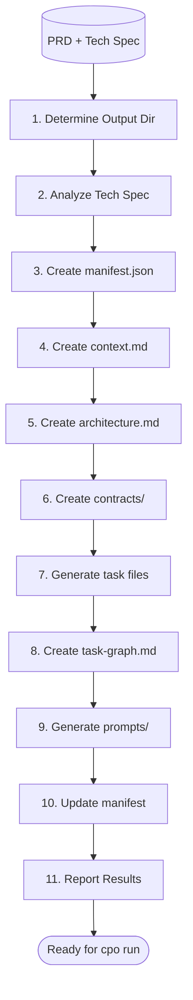
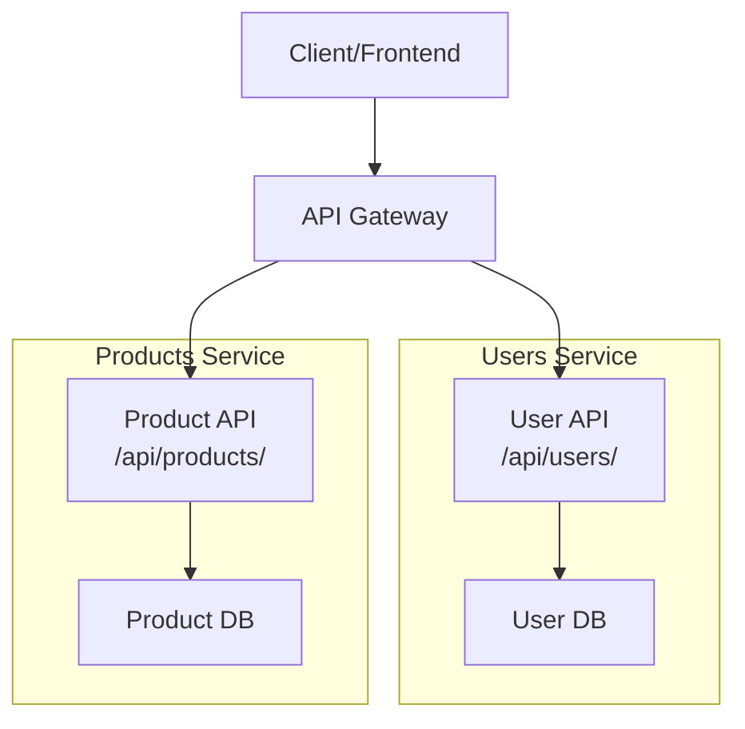
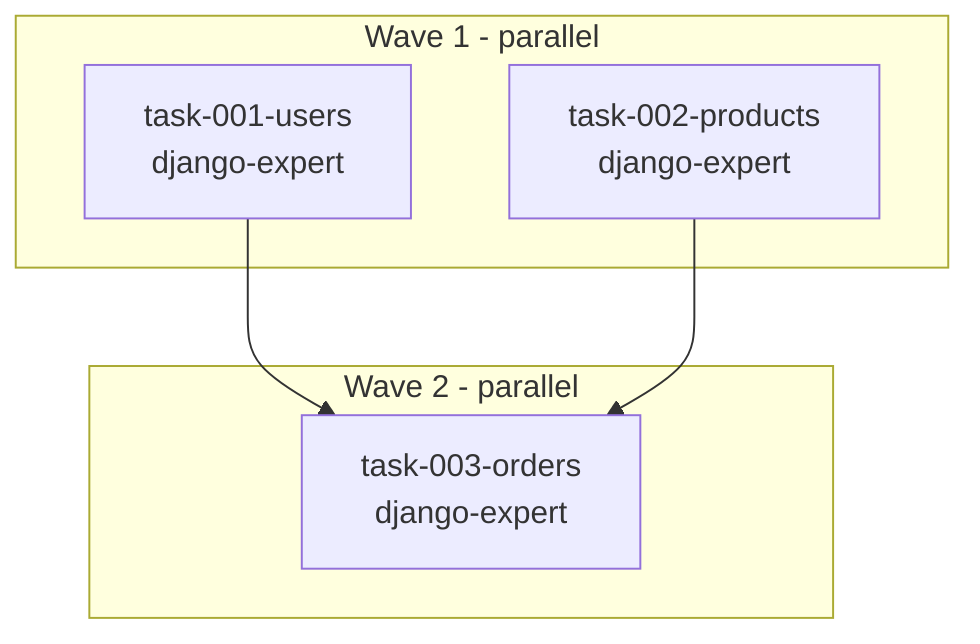
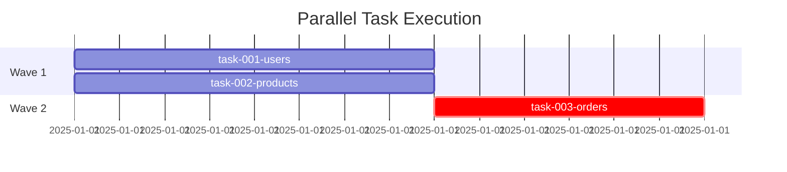

# PRD Decomposition Workflow

Decompose a PRD and Tech Spec into parallel-executable tasks with contracts, dependency graphs, and agent prompts.

## Workflow Overview



## Step 1: Determine Output Directory

```bash
PARALLEL_DIR="parallel/TS-0042-inventory-system"
```

- **If Tech Spec provided**: Extract ID and slug from Tech Spec file
- **If --name provided**: Use `parallel/{slug}/`

## Step 2: Tech Spec Analysis

If a Tech Spec (TS-XXXX) is provided:

1. **Read and validate Tech Spec**:
   - Verify status is APPROVED or REFERENCE
   - Warn if DRAFT (not ready for decomposition)

2. **Extract from Tech Spec**:
   - **Design Overview** -> Use for `architecture.md`
   - **Data Model** -> Use for `contracts/types.py`
   - **API Specification** -> Use for `contracts/api-schema.yaml`
   - **Component boundaries** -> Use for task ownership

3. **Skip redundant steps**:
   - If Tech Spec has complete Data Model, skip generating types
   - If Tech Spec has complete API Spec, skip generating api-schema.yaml

**If no Tech Spec provided**: Generate contracts from PRD and display warning:
> "Consider creating a Tech Spec first for better contract definitions"

## Step 3: Create manifest.json

Use the `cpo` format:

```json
{
  "tech_spec_id": "TS-0042",
  "name": "inventory-system",
  "technology": "python",
  "python_version": "3.11",
  "waves": [
    {
      "number": 1,
      "tasks": [
        { "id": "task-001", "agent": "python-experts:django-expert" },
        { "id": "task-002", "agent": "python-experts:django-expert" }
      ],
      "validation": "from apps.users.models import User; print('Wave 1 OK')"
    }
  ],
  "metadata": {
    "tech_spec": "tech-specs/approved/TS-0042-inventory.md",
    "generated_at": "2025-01-15T10:00:00Z",
    "total_tasks": 3,
    "max_parallel": 2,
    "critical_path": ["task-001", "task-003"]
  }
}
```

## Step 4: Create context.md

Shared project context read once by all agents (token-efficient):
- Brief project overview from PRD
- Technology stack
- Project conventions (from CLAUDE.md)
- Key directories
- Contracts location

## Step 5: Create Architecture Documentation

Create `architecture.md` with Mermaid component diagram:



**Conventions**:
- Use `subgraph` to group by service/task
- Include task number for ownership clarity
- Solid arrows (`-->`) for direct dependencies
- Dotted arrows (`-.->`) for weak dependencies

## Step 6: Create Contracts

### contracts/types.py

```python
from dataclasses import dataclass
from typing import Optional
from datetime import datetime
from enum import Enum

class UserRole(str, Enum):
    ADMIN = "admin"
    USER = "user"

@dataclass
class User:
    id: int
    email: str
    username: str
    role: UserRole
    created_at: datetime

@dataclass
class UserCreateRequest:
    email: str
    username: str
    password: str
```

### contracts/api-schema.yaml

```yaml
openapi: 3.0.0
info:
  title: API
  version: 1.0.0

components:
  schemas:
    User:
      type: object
      required: [id, email, username]
      properties:
        id: {type: integer}
        email: {type: string, format: email}
        username: {type: string}

paths:
  /users:
    get:
      summary: List users
      responses:
        '200':
          description: User list
```

## Step 7: Task Decomposition

Create task specs in `tasks/` using compact YAML format.

See the `parallel-task-format` skill for the complete task specification format.

### Decomposition Principles

- **Contract-first**: Define interfaces before implementation
- **Maximize independence**: Tasks should touch separate files/modules
- **Explicit boundaries**: Specify what each task CAN and CANNOT touch
- **2-4 hour granularity**: Not too big, not too small
- **Token efficiency**: Compact YAML format, shared context.md

## Step 8: Create task-graph.md

Dependency visualization with Mermaid:



Include Gantt chart for timeline:



## Step 9: Generate Prompts

Use the `parallel-prompt-generator` skill to generate agent-ready prompts from the task files.

This creates:
- `prompts/agent-prompts.md` - Wave summary and launch commands
- `prompts/task-NNN.txt` - Individual agent prompts

See the `parallel-prompt-generator` skill for the complete prompt template and generation workflow.

**Key points:**
- Each prompt includes the full `context.md` content
- Contract files are referenced (agent reads them)
- Scope uses CREATE/MODIFY/BOUNDARY from task spec
- Output Format JSON block is included for structured completion reporting

## Step 10-11: Update Manifest & Report

Update `manifest.json` with final task counts.

Report summary:
```
Decomposition Complete

Output: parallel/TS-0042-inventory-system/
Source: docs/prd.md
Tech Spec: TS-0042

Tasks: 6
Waves: 3
Max parallel: 3

Next: Run cpo run parallel/TS-0042-inventory-system/
```

## File Ownership Rules (CRITICAL)

**Merge conflicts happen when parallel tasks touch the same lines. Follow these rules:**

### Rule 1: CREATE is Exclusive

A file can appear in CREATE for **exactly one task** across all waves.

```yaml
# task-001 (Wave 1)
CREATE: rag/core/acl.py      # Only task-001 can create this

# task-002 (Wave 1) - WRONG
CREATE: rag/core/acl.py      # CONFLICT - already created by task-001
```

### Rule 2: MODIFY Requires Scoped Ownership

Multiple tasks CAN modify the same file in the same wave **only if** each task owns distinct sections (functions, classes, methods).

**Scoped MODIFY syntax:**
```yaml
MODIFY: path/file.py::ClassName           # Owns entire class
MODIFY: path/file.py::function_name       # Owns entire function
MODIFY: path/file.py::ClassName.method    # Owns specific method
```

**Parallel MODIFY - ALLOWED (different scopes):**
```yaml
# Wave 2 - OK, different functions
task-003: MODIFY: rag/core/acl.py::to_sql_conditions
task-004: MODIFY: rag/core/acl.py::to_mongo_conditions
```

**Parallel MODIFY - NOT ALLOWED (overlapping scopes):**
```yaml
# Wave 2 - CONFLICT, same scope or unscoped
task-003: MODIFY: rag/core/acl.py
task-004: MODIFY: rag/core/acl.py

# Wave 2 - CONFLICT, nested scopes
task-003: MODIFY: rag/core/acl.py::ACLFilterSpec
task-004: MODIFY: rag/core/acl.py::ACLFilterSpec.validate
```

### Rule 3: File Ownership Matrix

Build this matrix before generating tasks:

| File | CREATE | MODIFY (scoped) | Wave |
|------|--------|-----------------|------|
| `rag/core/acl.py` | task-001 | - | W1 |
| `rag/core/acl.py::to_sql_conditions` | - | task-003 | W2 |
| `rag/core/acl.py::to_mongo_conditions` | - | task-004 | W2 |
| `rag/core/interfaces.py` | task-003 | - | W2 |

### Validation Rules

```
1. COUNT(tasks where file F in CREATE) <= 1

2. For parallel tasks (same wave):
   - If MODIFY is unscoped (no ::), only ONE task can touch file F
   - If MODIFY is scoped (has ::), scopes must NOT overlap

3. Scopes overlap if:
   - Same scope (both ::ClassName)
   - One contains other (::ClassName vs ::ClassName.method)
```

## Validation Checklist

Before finalizing:

- [ ] No circular dependencies
- [ ] Wave ordering valid
- [ ] 2-4 hour task granularity
- [ ] **Each file has at most ONE task with CREATE**
- [ ] **Parallel MODIFY uses scoped syntax (file::function)**
- [ ] **No overlapping scopes in same wave**
- [ ] **File ownership matrix documented**
- [ ] BOUNDARY section in every task
- [ ] Output Format section in every task (see `parallel-task-format` skill)
- [ ] Agent assigned to every task
- [ ] Complete types.py and api-schema.yaml
- [ ] Architecture diagram with task ownership
- [ ] Task graph with Mermaid flowchart

## Common Decomposition Patterns

### Microservices
```
Wave 1: shared-models (contracts)
Wave 2: users-service, products-service, orders-service (parallel)
Wave 3: api-gateway
Wave 4: integration-tests
```

### Django Feature
```
Wave 1: models-and-migrations
Wave 2: views-and-serializers, api-endpoints (parallel)
Wave 3: comprehensive-tests
```

### React Feature
```
Wave 1: types-and-hooks
Wave 2: form-components, list-components (parallel)
Wave 3: pages (parallel)
Wave 4: routing-and-integration
```

## Troubleshooting

### Circular Dependencies
Split coupled tasks or create intermediate shared task.

### Task Too Large (>4 hours)
Split by component (models, views, tests) or defer optional features.

### Tech Spec Incomplete
Warn user, generate best-effort contracts with TODOs.

### Contract-Task Mismatch
Update contracts first, then regenerate prompts.
