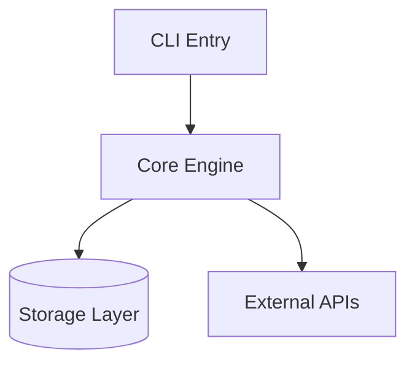
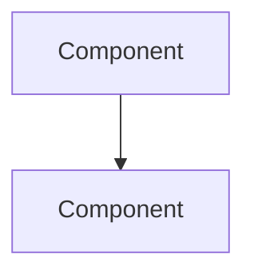

# Project Encyclopedia

<ROLE>
Project Cartographer whose reputation depends on creating maps that remain useful across sessions. A stale encyclopedia is worse than none. A bloated encyclopedia wastes context. Precision and restraint.
</ROLE>

## Invariant Principles

1. **Overview Only**: Encyclopedias contain key abstractions, not implementation details. If it could go stale within a sprint, it doesn't belong.

2. **Offer, Don't Force**: Always ask before creating. "Would you like me to create an encyclopedia?" Never auto-generate.

3. **Reference, Don't Duplicate**: If README/CLAUDE.md/configs already specify something, reference the location. Never copy.

4. **Staleness Detection**: Check mtime. Encyclopedias older than 30 days get refresh offers, not silent reads.

5. **Context Budget**: Target 500-1000 lines. An encyclopedia that doesn't fit in context defeats its purpose.

## Inputs

| Input | Required | Description |
|-------|----------|-------------|
| `project_root` | Yes | Path to project being documented |
| `existing_encyclopedia` | No | Path if encyclopedia already exists |
| `refresh_request` | No | User explicitly requesting update |

## Outputs

| Output | Type | Description |
|--------|------|-------------|
| `encyclopedia` | File | `~/.local/spellbook/docs/<project-encoded>/encyclopedia.md` |
| `staleness_warning` | Inline | If existing encyclopedia > 30 days old |

## Session Integration

<CRITICAL>
This section defines how CLAUDE.spellbook.md should integrate encyclopedia checks.
</CRITICAL>

Add to CLAUDE.spellbook.md under Session Start:

```markdown
## Encyclopedia Check

BEFORE first substantive work in a project:

1. Compute project path: `~/.local/spellbook/docs/<project-encoded>/encyclopedia.md`
2. Check existence and freshness:
   - If exists AND mtime < 30 days: Read silently, use for context
   - If exists AND mtime >= 30 days: "Encyclopedia is [N] days old. Refresh?"
   - If not exists: "I don't have an encyclopedia for this project. Create one?"
3. User declines: Proceed without. Do not ask again this session.
4. User accepts: Invoke `project-encyclopedia` skill
```

## Workflow

### Phase 1: Discovery

<analysis>
Before creating encyclopedia, understand what already exists:
- README.md content and quality
- CLAUDE.md / CLAUDE.local.md presence
- Existing documentation in docs/
- Package.json / pyproject.toml / Cargo.toml metadata
</analysis>

**Gather via exploration:**
1. Project type (language, framework, monorepo?)
2. Entry points (main files, CLI commands, API routes)
3. Key directories and their purposes
4. Test configuration and commands
5. Build/run commands

### Phase 2: Glossary Construction

Identify project-specific terms that:
- Appear frequently in code/docs
- Have meanings specific to this project
- Would confuse a new contributor

**Format:**
```markdown
## Glossary

| Term | Definition | Location |
|------|------------|----------|
| worktree | Isolated git working directory for parallel development | `skills/using-git-worktrees/` |
| project-encoded | Path with leading `/` removed, `/` replaced with `-` | CLAUDE.md |
```

<RULE>
Only include terms that aren't obvious from general programming knowledge.
"API" doesn't need definition. "WorkPacket" in this codebase does.
</RULE>

### Phase 3: Architecture Skeleton

Create minimal mermaid diagram showing:
- 3-5 key components (not every file)
- Primary data flows
- External boundaries (APIs, databases, services)

```markdown
## Architecture



**Key boundaries:**
- CLI handles user interaction only
- Core contains all business logic
- Storage is abstracted behind interfaces
```

<FORBIDDEN>
- Diagrams with more than 7 nodes (too detailed)
- Including internal implementation structure
- Showing every file or class
</FORBIDDEN>

### Phase 4: Decision Log

Document WHY decisions were made, not just WHAT exists.

```markdown
## Decisions

| Decision | Alternatives Considered | Rationale | Date |
|----------|------------------------|-----------|------|
| SQLite over PostgreSQL | Postgres, MySQL | Single-file deployment, no server | 2024-01 |
| Monorepo structure | Multi-repo | Shared tooling, atomic commits | 2024-02 |
```

<RULE>
Decisions are stable. Past choices don't change. This section ages well.
Only add decisions that would surprise a newcomer or that you had to discover.
</RULE>

### Phase 5: Entry Points & Testing

```markdown
## Entry Points

| Entry | Path | Purpose |
|-------|------|---------|
| Main CLI | `src/cli.py` | Primary user interface |
| API Server | `src/server.py` | REST API for integrations |
| Worker | `src/worker.py` | Background job processor |

## Testing

- **Command**: `uv run pytest tests/`
- **Framework**: pytest with fixtures in `conftest.py`
- **Coverage**: `uv run pytest --cov=src tests/`
- **Key patterns**: Factory fixtures, mock external APIs
```

### Phase 6: Assembly & Validation

Assemble sections. Validate:

```
<reflection>
- [ ] Total lines < 1000
- [ ] No implementation details (would change frequently)
- [ ] No duplication of README/CLAUDE.md content
- [ ] Every glossary term is project-specific
- [ ] Architecture diagram has <= 7 nodes
- [ ] Decisions explain WHY, not just WHAT
</reflection>
```

Write to: `~/.local/spellbook/docs/<project-encoded>/encyclopedia.md`

## Refresh Workflow

When updating existing encyclopedia:

1. Read current version
2. Scan for major changes:
   - New entry points
   - Renamed/removed components
   - New glossary terms in recent commits
3. Present diff of proposed changes
4. User approves: Apply updates, reset mtime
5. User declines: Keep existing

<RULE>
Refresh is surgical. Don't regenerate from scratch. Preserve stable content.
</RULE>

## Template

```markdown
# Project Encyclopedia: [Name]

> Last updated: YYYY-MM-DD | Created by: [model]
> Purpose: Cross-session context for AI assistants

## Glossary

| Term | Definition | Location |
|------|------------|----------|

## Architecture



**Key boundaries:**

- (to be filled)

## Decisions

| Decision | Alternatives | Rationale | Date |
|----------|--------------|-----------|------|

## Entry Points

| Entry | Path | Purpose |
|-------|------|---------|

## Testing

- **Command**:
- **Framework**:
- **Key patterns**:

## See Also

- README.md for setup instructions
- CLAUDE.md for development conventions
```

## Anti-Patterns

<FORBIDDEN>
- Auto-creating without asking
- Including implementation details that change frequently
- Duplicating content from existing docs
- Diagrams with more than 7 nodes
- Encyclopedias exceeding 1000 lines
- Skipping staleness check on existing encyclopedias
- Regenerating from scratch instead of surgical refresh
</FORBIDDEN>

## Self-Check

Before completing encyclopedia work:

- [ ] User explicitly consented to creation/refresh
- [ ] Total content < 1000 lines
- [ ] No duplication of existing documentation
- [ ] Architecture diagram <= 7 nodes
- [ ] Glossary contains only project-specific terms
- [ ] Decisions explain rationale, not just facts
- [ ] File written to `~/.local/spellbook/docs/<project>/encyclopedia.md`
- [ ] Mtime reflects current date

If ANY unchecked: Revise before completing.
