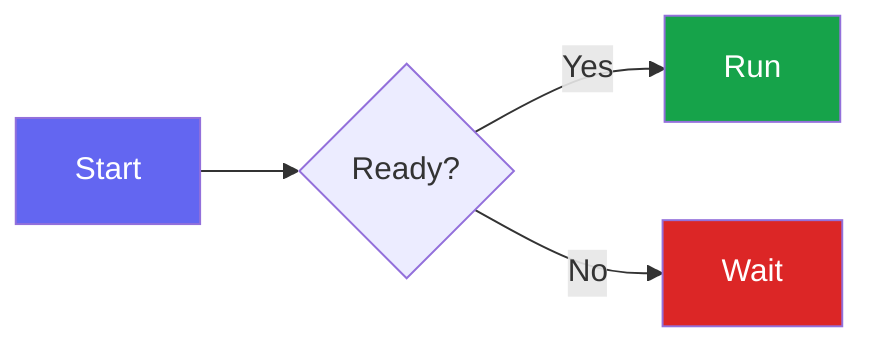
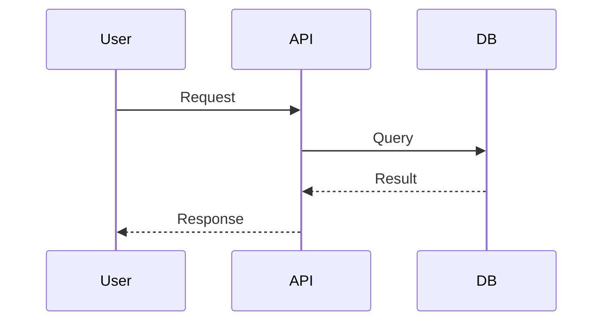

# README Maintainer

Guide for maintaining and improving README.md files using GitHub's advanced formatting capabilities.

## Core Principle

README.md is **user documentation** (unlike CLAUDE.md which is Claude's memory). Optimize for scannability, visual appeal, and information hierarchy.

## GitHub Advanced Formatting

### Tables

Use tables for structured comparisons, feature matrices, and option lists.

**Syntax:**

```markdown
| Header 1 | Header 2 | Header 3 |
|----------|:--------:|---------:|
| Left     | Center   | Right    |
```

**Alignment:** `:---` (left), `:---:` (center), `---:` (right)

**Formatting in cells:** Supports `**bold**`, `*italic*`, `` `code` ``, and [links](url).

**Escape pipes:** Use `\|` for literal pipe characters.

**When to use tables:**

- Feature comparisons (columns: feature, description, status)
- Command reference (columns: command, description, example)
- Configuration options (columns: option, type, default, description)
- Side-by-side comparisons (with/without, before/after)

**When NOT to use tables:**

- Simple lists with no comparison dimension
- Content requiring long prose descriptions

### Collapsible Sections

Use `<details>` for optional or lengthy content that shouldn't dominate the page.

**Syntax:**

```html
<details>
<summary>Click to expand</summary>

Content here (leave blank line after summary tag)

</details>
```

**Open by default:** Add `open` attribute: `<details open>`

**When to collapse:**

- Installation instructions for multiple platforms/methods
- Troubleshooting sections
- Advanced configuration
- Long code examples
- Changelog/version history
- FAQ sections

**When NOT to collapse:**

- Critical getting-started content
- Primary installation method
- Core features (these should be visible)

### Badges

Badges communicate project status at a glance. Use shields.io for consistent styling.

**Common badges:**

| Purpose | Pattern |
|---------|---------|
| CI Status | `` |
| npm Version | `` |
| npm Downloads | `` |
| License | `` |
| Node Version | `` |
| TypeScript | `` |
| Coverage | `` |

**Badge placement:** Immediately after title, before description.

**Don't overdo it:** 3-6 relevant badges. Skip badges for metrics that don't matter.

### Mermaid Diagrams

GitHub renders Mermaid diagrams in fenced code blocks.

**CRITICAL RULES:**

1. **Keep node labels SHORT (1-2 words max)** - Long labels get truncated
2. **Do NOT use `%%{init:...}%%` theme blocks** - These cause node sizing issues that truncate text
3. **DO use `style` directives** - Individual node styling works fine
4. **Use `flowchart LR`** - Left-to-right works best on GitHub

| Bad (causes truncation) | Good (works) |
|-------------------------|--------------|
| `A["Pre-flight Checks"]` | `A[Check]` |
| `%%{init: {'theme': 'dark'...}}%%` | (omit entirely) |
| No colors | `style A fill:#6366f1,color:#fff` |

**Flowchart with colors:**

````markdown

````

**Sequence diagram:**

````markdown

````

**When to use diagrams:**

- Architecture overviews
- Data flow / message flow
- State machines
- Decision trees
- Component relationships

**When NOT to use diagrams:**

- Simple linear processes (use numbered list)
- When prose is clearer
- Decorative purposes (diagram must clarify)

**Best practices:**

- Max 1-2 words per node label
- Never use `%%{init:...}%%` theme configuration (causes truncation)
- Use `style NodeId fill:#color,color:#fff` for colored nodes
- Use edge labels for relationships (`-->|label|`)
- Common colors: `#6366f1` (indigo), `#16a34a` (green), `#dc2626` (red)
- Put detailed explanations in surrounding text or tables
- Test diagram renders on GitHub before committing

### GitHub Alerts

Special blockquotes for callouts.

```markdown
> [!NOTE]
> Useful information that users should know.

> [!TIP]
> Helpful advice for doing things better.

> [!IMPORTANT]
> Key information users need to know.

> [!WARNING]
> Urgent info that needs immediate attention.

> [!CAUTION]
> Advises about risks or negative outcomes.
```

**Renders as colored callout boxes on GitHub.**

### Code Blocks

Always specify language for syntax highlighting.

````markdown
```typescript
const example: string = "highlighted";
```
````

**Common language identifiers:** `typescript`, `javascript`, `python`, `bash`, `json`, `yaml`, `markdown`, `rust`, `go`

## README Structure

### Recommended Section Order

1. **Title** + badges
2. **Tagline** (1-2 sentences)
3. **Table of Contents** (collapsible for long READMEs)
4. **Why / Motivation** (optional)
5. **Features** (table or list)
6. **Quick Start / Installation**
7. **Usage** (with examples)
8. **Configuration / API**
9. **Architecture** (if complex, use diagram)
10. **Contributing**
11. **License**

See `templates/structure.md` for detailed template.

### Title Format

```markdown
# Project Name

[](link) [](link) [](link)

> One-line description of what this project does.
```

### Table of Contents

For READMEs with 5+ sections, add a collapsible ToC:

```html
<details>
<summary>Table of Contents</summary>

- [Installation](#installation)
- [Usage](#usage)
- [API](#api)
- [Contributing](#contributing)

</details>
```

## Anti-Patterns

### Don't Over-Format

- Not every list needs to be a table
- Not every section needs to be collapsed
- Not every process needs a diagram
- Not every statement needs a badge

### Don't Add Noise

- Skip badges for metrics that don't matter
- Skip diagrams that don't clarify
- Skip collapsibles for short content
- Don't add emojis to plain READMEs unless requested

### Never Remove, Only Reorganize

**CRITICAL: Breakout and beautify operations must preserve ALL existing content and formatting.**

- Moving content to a new file ≠ deleting it
- Restructuring ≠ stripping
- Condensing or summarizing ≠ preserving
- If something exists, assume the author put it there intentionally

The goal is to reorganize and enhance, never to reduce. If you're about to delete or condense anything, stop and reconsider.

### Preserve Author Intent

When beautifying an existing README:

- Respect the existing structure if it's reasonable
- Don't force a completely different format
- Enhance, don't replace
- Keep the author's voice

## Beautify Algorithm

1. **Read** current README.md
2. **Identify** improvement opportunities:
   - Lists that could be tables (comparisons, options)
   - Long sections that could be collapsed
   - Missing badges (if package.json/CI exists)
   - Architecture that could use a diagram
   - Missing Table of Contents
3. **Prioritize** user instructions if provided
4. **Apply** changes incrementally with Edit tool
5. **Report** what was changed

## Breakout Heuristics

For large READMEs (> 400 lines) that should be split into modular documentation.

**Thresholds:**

- Total lines > 400 → Consider breakout
- Single section > 75 lines → Break out to dedicated file
- Target after breakout: 200-350 lines

**Algorithm:**

1. Read README.md and count lines
2. Parse sections by heading level
3. Classify sections by keywords (Contributing → CONTRIBUTING.md, etc.)
4. Present breakout plan as table
5. Confirm with user before changes
6. Execute and add Documentation links table

**Details:** Read `${CLAUDE_PLUGIN_ROOT}/skills/readme-maintainer/templates/breakout.md` for:

- GitHub special files (CONTRIBUTING.md, SECURITY.md, etc.)
- Content type detection keywords
- docs/ folder structure
- Post-breakout README template

## Audit Algorithm

Verify README.md and docs/ accuracy against actual codebase.

### Process

1. **Gather context**: Use Haiku agent to find CLAUDE.md files and identify source files

2. **Parallel verification** (2 Sonnet agents):
   - **Agent #1 - README audit**: Check README.md against codebase
     - Commands listed exist in commands/
     - Skills listed exist in skills/
     - Hooks documented match hooks/hooks.json
     - Version numbers match package.json
     - Feature descriptions match implementations

   - **Agent #2 - docs/ audit**: Check docs/*.md against codebase
     - Configuration options match actual schema
     - Hook behaviors match implementations
     - Examples are accurate and runnable
     - API references are current

3. **Confidence scoring**: For each issue, score 0-100:
   - 0: False positive
   - 25: Unverified/stylistic
   - 50: Real but minor
   - 75: Verified, impacts functionality
   - 100: Critical inaccuracy

4. **Filter and report**: Only show issues with score ≥ 80

### Output Format

#### Issues Found

```markdown
## Documentation Audit

Found N issues:

1. **description** (reason)
   `file/path.md:line` → should be "correct value"

2. **description** (reason)
   `file/path.md:line`
```

#### No Issues

```markdown
## Documentation Audit (no issues)

Documentation is consistent with codebase.
```

### False Positives to Avoid

- Intentional documentation of future features
- Version numbers in examples (not actual version)
- Stylistic differences that don't affect accuracy
- Links to external documentation

---

## References

Read these templates for detailed syntax and examples:

| Template | Content |
|----------|---------|
| `templates/badges.md` | shields.io patterns for CI, npm, license badges |
| `templates/structure.md` | README section templates (minimal, standard, comprehensive) |
| `templates/breakout.md` | Breakout destinations and post-breakout structure |
