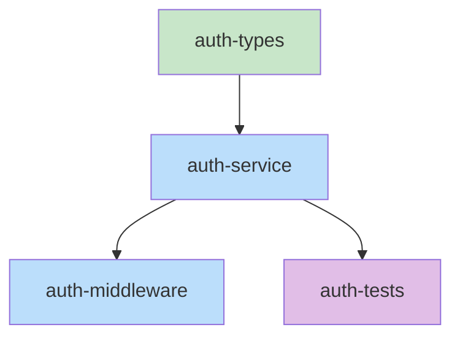

## Step 0: Query Kodex

Query project knowledge for file structure conventions.

### Topic Inference (Skeleton Focus)

From work item context, build candidates:
- `{item-keyword}-file-structure`
- `file-naming`
- `directory-conventions`
- `project-structure`

### Example

```
Tool: mcp__plugin_mermaid-collab_mermaid__kodex_query_topic
Args: { "project": "<cwd>", "name": "file-naming" }
```

Display found topics as context before planning file structure.

# Phase 3: Skeleton

Generate actual stub files and the task dependency graph.

## What to Produce

1. **Stub files** - Real files with types and TODO comments
2. **Task dependency graph** - YAML format with explicit dependencies
3. **Mermaid visualization** - Visual diagram of task dependencies

## Process

**Step 1: Document stub files (DO NOT CREATE)**

For each file in the Interface:
1. Document the file path
2. Document the full stub content in a code block
3. Mark as "will create" (not "created")

**IMPORTANT:** Do NOT use the Write tool. Do NOT create files in the source tree.
Files are documented here and created during implementation phase by executing-plans.

Example documentation format:

### Planned File: src/auth/service.ts

```typescript
import { User, AuthResult } from './types';

export class AuthService {
  async authenticate(email: string, password: string): Promise<AuthResult> {
    // TODO: Implement authentication logic
    // - Validate email format
    // - Look up user by email
    // - Verify password hash
    // - Generate JWT token
    throw new Error('Not implemented');
  }
}
```

**Status:** [ ] Will be created during implementation

**Step 2: Build task dependency graph**

Analyze dependencies between files to determine execution order:

```yaml
tasks:
  - id: auth-types
    files: [src/auth/types.ts]
    description: Core auth type definitions
    parallel: true

  - id: auth-service
    files: [src/auth/service.ts]
    description: Authentication service implementation
    depends-on: [auth-types]

  - id: auth-middleware
    files: [src/auth/middleware.ts]
    description: Express authentication middleware
    depends-on: [auth-service]

  - id: auth-tests
    files: [src/auth/__tests__/service.test.ts]
    description: Unit tests for auth service
    depends-on: [auth-service]
```

**Step 2.5: Generate Test Patterns**

For each task in the dependency graph, generate the `tests` field:

For each file in task.files:
1. Extract directory: `dir = dirname(file)`
2. Extract basename: `name = filename without extension`
3. Extract extension: `ext = file extension`
4. Generate patterns:
   - `{dir}/{name}.test{ext}`
   - `{dir}/__tests__/{name}.test{ext}`

Add to task YAML:

```yaml
tasks:
  - id: example-task
    files: [src/auth/service.ts]
    tests: [src/auth/service.test.ts, src/auth/__tests__/service.test.ts]  # AUTO-GENERATED
    description: ...
```

**Step 3: Create Mermaid visualization**



Legend: Green = parallel-safe (no dependencies), Blue = sequential, Purple = tests

## Output Format

**Create per-item skeleton documents** instead of adding to design.md:

For each work item N, create `skeleton-item-N.md`:

```
Tool: mcp__plugin_mermaid-collab_mermaid__create_document
Args: {
  "project": "<cwd>",
  "session": "<session>",
  "name": "skeleton-item-N",
  "content": "<skeleton content for item N>"
}
```

**Document structure:**

```markdown
# Skeleton: Item N - [Title]

## Planned Files
- [ ] `src/auth/types.ts` - Will contain type definitions
- [ ] `src/auth/service.ts` - Will contain stub methods
- [ ] `src/auth/middleware.ts` - Will contain stub functions

**Note:** These files are documented but NOT created yet. They will be created during the implementation phase by executing-plans.

## File Contents

[Include full stub content for each file in code blocks]

## Task Dependency Graph

[Include YAML task graph]

## Execution Order

[List waves and parallel batches]

## Verification

[Checklist for this item]
```

## Verification Gate

Before moving to Phase 4, run verification:

```bash
./hooks/verify-phase.sh skeleton <collab-name>
```

**Checklist:**
- [ ] All files from Interface are documented (NOT created - files are only created by executing-plans)
- [ ] File paths match exactly
- [ ] All types are defined
- [ ] All function signatures present
- [ ] TODO comments match pseudocode
- [ ] Dependency graph covers all files
- [ ] No circular dependencies

**GATE: Do NOT proceed until this checklist passes.**

**If Skeleton phase doesn't apply** (e.g., no code to write, config-only changes):
1. Document explicitly: "N/A - [reason why skeleton phase doesn't apply]"
2. Add this to the design doc Skeleton section
3. You still MUST invoke executing-plans (it will handle the actual changes)
4. Implementing directly is NEVER allowed

**MANDATORY:** After skeleton phase, you MUST invoke executing-plans. Never implement changes inline.

**Update state on success:**

```
Tool: mcp__plugin_mermaid-collab_mermaid__update_session_state
Args: { "project": "<cwd>", "session": "<name>", "phase": "implementation" }
```
Note: `lastActivity` is automatically updated by the MCP tool.

## Completion

At the end of this skill's work, call complete_skill:

```
Tool: mcp__plugin_mermaid-collab_mermaid__complete_skill
Args: { "project": "<cwd>", "session": "<session>", "skill": "rough-draft-skeleton" }
```

**Handle response:**
- If `action == "clear"`: Invoke skill: collab-clear
- If `next_skill` is not null: Invoke that skill
- If `next_skill` is null: Workflow complete
