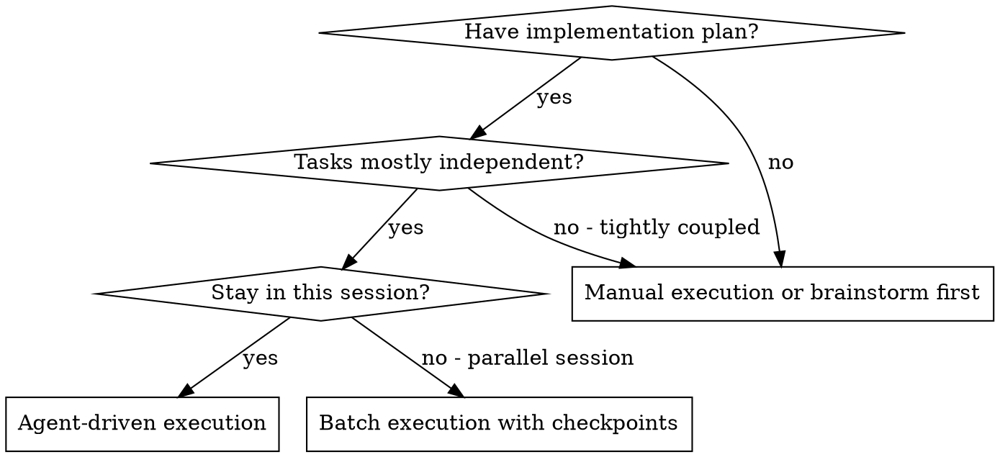
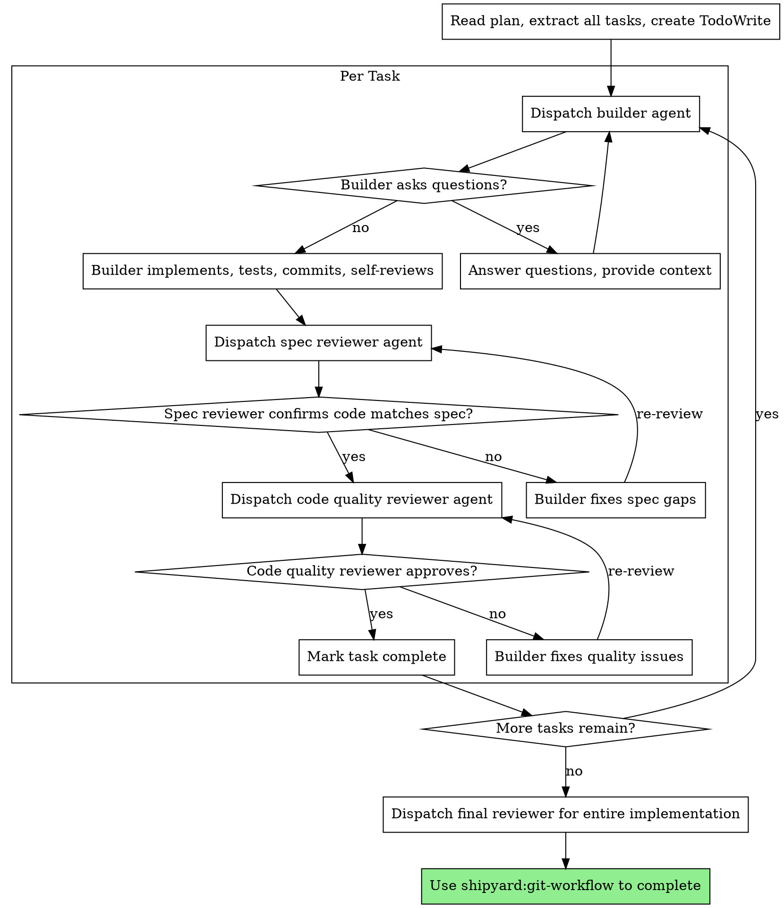

<!-- TOKEN BUDGET: 240 lines / ~720 tokens -->

# Executing Plans

## Overview

Execute implementation plans by dispatching fresh builder agents per task, with two-stage review after each: spec compliance review first, then code quality review. Can also run as batch execution with human checkpoints.

**Core principle:** Fresh agent per task + two-stage review (spec then quality) = high quality, fast iteration.

**Announce at start:** "I'm using the executing-plans skill to implement this plan."

## When to Use

## The Process

### Step 1: Load and Review Plan

1. Read plan file
2. Review critically - identify any questions or concerns about the plan
3. If concerns: Raise them with your human partner before starting
4. If no concerns: Create TodoWrite and proceed

### Step 2: Execute Tasks

**Agent-Driven Mode (preferred):**

For each task, dispatch a fresh builder agent:

**Batch Mode (separate session):**

Default: First 3 tasks per batch.

For each task:
1. Mark as in_progress
2. Follow each step exactly (plan has bite-sized steps)
3. Run verifications as specified
4. Mark as completed

When batch complete:
- Show what was implemented
- Show verification output
- Say: "Ready for feedback."

Based on feedback:
- Apply changes if needed
- Execute next batch
- Repeat until complete

## Two-Stage Review Pattern

**Stage 1: Spec Compliance Review**
- Does the code match the plan's specification?
- Are all requirements met?
- Is there anything extra that wasn't requested?
- Are verification criteria satisfied?

**Stage 2: Code Quality Review**
- Is the code well-structured?
- Are there any bugs or edge cases missed?
- Is naming clear and consistent?
- Are tests comprehensive?

**IMPORTANT:** Always complete spec compliance before code quality. Wrong order wastes time reviewing quality of code that doesn't meet spec.

## Step 3: Complete Development

After all tasks complete and verified:
- Announce: "I'm using the git-workflow skill to complete this work."
- **REQUIRED SUB-SKILL:** Use shipyard:git-workflow
- Follow that skill to verify tests, present options, execute choice

## When to Stop and Ask for Help

**STOP executing immediately when:**
- Hit a blocker mid-batch (missing dependency, test fails, instruction unclear)
- Plan has critical gaps preventing starting
- You don't understand an instruction
- Verification fails repeatedly

**Ask for clarification rather than guessing.**

## Builder Agent Guidelines

Builder agents should:
- Follow TDD naturally (shipyard:shipyard-tdd)
- Ask questions before AND during work if unclear
- Self-review before handing off to reviewers
- Commit after each task

## Red Flags

**Never:**
- Skip reviews (spec compliance OR code quality)
- Proceed with unfixed issues
- Dispatch multiple builder agents in parallel (conflicts)
- Make agent read plan file (provide full text instead)
- Skip scene-setting context (agent needs to understand where task fits)
- Ignore agent questions (answer before letting them proceed)
- Accept "close enough" on spec compliance
- Skip review loops (reviewer found issues = builder fixes = review again)
- Let builder self-review replace actual review (both are needed)
- **Start code quality review before spec compliance is approved** (wrong order)
- Move to next task while either review has open issues

**If builder asks questions:**
- Answer clearly and completely
- Provide additional context if needed
- Don't rush them into implementation

**If reviewer finds issues:**
- Builder (same agent) fixes them
- Reviewer reviews again
- Repeat until approved
- Don't skip the re-review

**If agent fails task:**
- Dispatch fix agent with specific instructions
- Don't try to fix manually (context pollution)

## Integration

**Required workflow skills:**
- **shipyard:shipyard-writing-plans** - Creates the plan this skill executes
- **shipyard:git-workflow** - Complete development after all tasks

**Agents should use:**
- **shipyard:shipyard-tdd** - Agents follow TDD for each task

## Remember
- Review plan critically first
- Follow plan steps exactly
- Don't skip verifications
- Reference skills when plan says to
- Between batches: just report and wait
- Stop when blocked, don't guess
