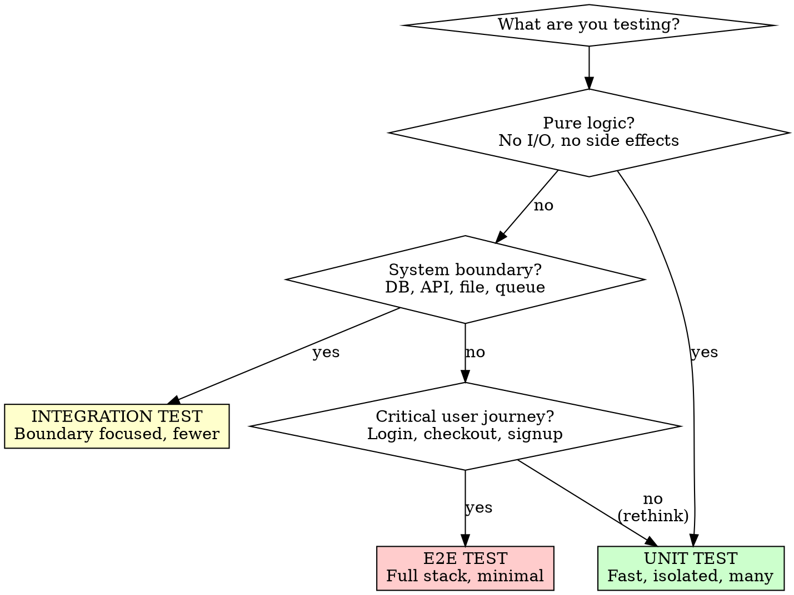

<!-- TOKEN BUDGET: 400 lines / ~1200 tokens -->

# Writing Effective Tests

## Activation Triggers

- Writing or modifying test files (`*.test.*`, `*.spec.*`, `*_test.go`, `test_*.py`)
- Setting up test infrastructure or test utilities
- Debugging flaky, brittle, or slow tests
- Deciding between unit, integration, and E2E tests
- Choosing when and how to use mocks, stubs, or fakes

## Overview

Test behaviors through public APIs. Verify state, not interactions.

**Core principle:** If refactoring breaks your tests but not your users, your tests are wrong.

**Relationship to TDD:** The `shipyard:shipyard-tdd` skill covers WHEN to write tests (test-first, red-green-refactor). This skill covers HOW to write tests that are effective, maintainable, and trustworthy.

## The Iron Law

```
TEST BEHAVIORS, NOT IMPLEMENTATIONS
```

A test should break only when the system's observable behavior changes — never because of refactoring, renaming internals, or restructuring code.

**No exceptions:**
- Don't test private methods
- Don't assert on internal state
- Don't verify method call sequences
- Don't couple tests to data structures users never see

## Test Structure (AAA)

Every test follows Arrange-Act-Assert:

```
Arrange — Set up preconditions and inputs
Act     — Execute the behavior under test
Assert  — Verify the expected outcome
```

Separate the three sections with blank lines. One Act per test. One logical assertion per test.

<Good>
```python
def test_expired_subscription_denies_access():
    # Arrange
    user = create_user(subscription_end=yesterday())

    # Act
    result = check_access(user, resource="premium-content")

    # Assert
    assert result.denied is True
    assert result.reason == "subscription expired"
```
Clear name, tests one behavior, obvious structure
</Good>

<Bad>
```python
def test_subscription():
    user = create_user(subscription_end=yesterday())
    assert check_access(user, "premium-content").denied
    user.subscription_end = tomorrow()
    assert check_access(user, "premium-content").allowed
    assert user.access_log == [("denied", "premium-content"), ("allowed", "premium-content")]
```
Two behaviors in one test, tests internal log, vague name
</Bad>

### Keep Tests DAMP, Not DRY

Prefer **Descriptive And Meaningful Phrases** over eliminating duplication. Duplicating setup across tests is fine if it makes each test self-contained and readable. Extract shared setup into helpers only when it improves clarity, not to reduce line count.

### No Logic in Tests

Tests are straight-line code. No loops, conditionals, ternaries, or string concatenation. If you need logic, the test is too complex — split it or simplify the design.

## What to Test

### Test These

- **Behaviors:** What the system does from a user's perspective
- **Edge cases:** Empty inputs, boundaries, overflow, zero, null
- **Error paths:** Invalid input, missing dependencies, timeouts
- **State transitions:** Before and after an operation

### Skip These

- Trivial getters/setters with no logic
- Generated code (protobuf, ORM migrations)
- Configuration files
- Third-party library internals

### Test Via Public APIs

Invoke the system the same way its callers do. If the only way to test something is through a private method, the design needs to change — extract it into a collaborator with its own public interface.

## Naming Tests

Name tests after the behavior, not the method.

| Good | Bad |
|------|-----|
| `rejects_empty_email_with_validation_error` | `test_validate` |
| `returns_cached_result_when_within_ttl` | `test_cache` |
| `retries_three_times_before_failing` | `test_retry_logic` |
| `grants_access_when_subscription_active` | `test_check_access_method` |

Patterns that work:
- `[action]_[condition]_[expected_result]`
- `should [expected behavior] when [condition]`
- Plain descriptive sentence

A test name containing "and" usually means two tests.

## Choosing Test Level



**The pyramid:** Many unit tests. Fewer integration tests. Minimal E2E tests.

**Push tests down.** If a behavior can be tested at a lower level, test it there. Lower = faster, more stable, cheaper to maintain. Only go higher when the lower level can't verify the behavior (serialization, wiring, full user flow).

**Duplicate coverage?** If a unit test and integration test verify the same behavior, keep the unit test. Remove the integration test unless it adds confidence about wiring.

## Test Isolation and Doubles

### When to Use Test Doubles

| Use doubles for | Use real objects for |
|----------------|---------------------|
| Network calls (HTTP, gRPC) | In-process collaborators |
| Database queries (in unit tests) | Value objects and data structures |
| Filesystem I/O | Pure functions |
| Non-deterministic sources (time, random) | Deterministic transformations |
| Expensive operations (ML inference, rendering) | Lightweight dependencies |

### Types of Doubles

- **Stub:** Returns canned responses. Use when you need a dependency to return specific data.
- **Fake:** Working implementation with shortcuts (in-memory DB, local file store). Preferred over mocks for complex interactions.
- **Mock:** Records calls and asserts on them. Use sparingly — only when the interaction IS the behavior (e.g., "sends an email").

### The Mocking Rule

```
Verify STATE over INTERACTIONS.
Mock only when the side effect IS the behavior under test.
```

<Good>
```typescript
// Testing that withdrawal updates balance (state)
test('withdrawal reduces account balance', () => {
  const account = new Account(100);

  account.withdraw(30);

  expect(account.balance).toBe(70);
});
```
Tests resulting state
</Good>

<Bad>
```typescript
// Testing that withdrawal calls the right methods (interaction)
test('withdrawal calls debit', () => {
  const ledger = mock(Ledger);
  const account = new Account(100, ledger);

  account.withdraw(30);

  expect(ledger.debit).toHaveBeenCalledWith(30);
});
```
Tests internal interaction — breaks if refactored
</Bad>

## Unchanging Tests

A well-written test changes only when requirements change. It survives:
- **Refactoring** — internal restructuring, no behavior change
- **Bug fixes** — new tests added, existing tests unchanged
- **New features** — unrelated tests unaffected

If your tests break during refactoring, they're testing implementation details. Fix the tests to test behavior instead.

## Clear Failure Messages

A failure message should let you diagnose the problem without reading the test code.

<Good>
```
FAIL: rejects_empty_email_with_validation_error
  Expected: ValidationError("email is required")
  Actual:   None (no error raised)
```
Shows expected vs actual with context
</Good>

<Bad>
```
FAIL: test_validate
  AssertionError: False is not True
```
No context, unclear what was tested
</Bad>

Use assertion libraries that produce descriptive messages. Prefer `assertEqual(expected, actual)` over bare `assert`.

## Anti-Patterns

| Anti-Pattern | Problem | Fix |
|-------------|---------|-----|
| Testing implementation | Breaks on refactor | Test observable behavior via public API |
| Over-mocking | Tests verify mocks, not code | Use real objects; mock only at boundaries |
| Flaky tests | Non-deterministic (time, order, network) | Control inputs; isolate state; use fakes |
| Ice cream cone | Too many E2E, few unit tests | Push tests down the pyramid |
| Logic in tests | Bugs in test code hide bugs in prod | Straight-line code only |
| Shared mutable state | Tests depend on run order | Fresh state per test (setup/teardown) |
| Test-only production code | Methods exist only for testing | Test via public API; redesign if needed |
| Assertion-free tests | Test runs but verifies nothing | Every test must assert expected outcome |
| Giant setup | 50 lines before the act | Simplify design; extract builder/factory |

## Red Flags — STOP and Rethink

- Mocking more than 2 dependencies → class has too many responsibilities
- Test setup exceeds 20 lines → design is too complex or test scope too broad
- Test name contains "and" → split into two tests
- Tests break when you refactor → testing implementation, not behavior
- Tests pass but bugs ship → testing the wrong things
- Can't explain what behavior a test verifies → rewrite or delete it
- All tests use mocks → not testing real behavior
- Test file is longer than production file → over-testing or testing internals

## Common Rationalizations

| Excuse | Reality |
|--------|---------|
| "Need mocks for everything" | Design is too coupled. Inject dependencies, use fakes. |
| "100% coverage = quality" | Coverage measures execution, not correctness. 80% covering behaviors > 100% covering lines. |
| "E2E tests cover everything" | Slow, flaky, expensive. Unit tests catch most bugs faster. |
| "Test is too hard to write" | Hard to test = hard to use. Fix the design. |
| "It's just test code" | Test code deserves production standards. Sloppy tests rot fast. |
| "One big test is easier" | One big test = one useless failure message. Split by behavior. |
| "Helper makes it DRY" | If the helper obscures what's tested, inline it. DAMP > DRY. |

## Quick Reference: FIRST Principles

- **Fast** — Tests run in seconds, not minutes. Slow tests get skipped.
- **Independent** — No test depends on another. Any order, any subset.
- **Repeatable** — Same result every run, any machine, any time.
- **Self-checking** — Pass/fail without human inspection.
- **Timely** — Written close to the code. Not "later." Not "before release."

## Final Rule

```
Test what your users care about, through the interfaces they use.
Everything else is an implementation detail.
```
