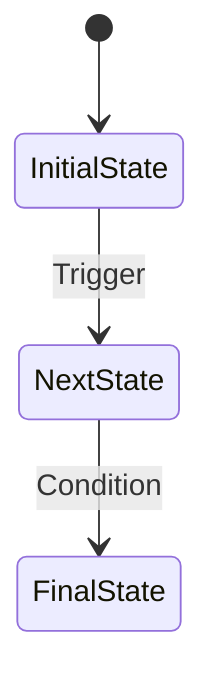
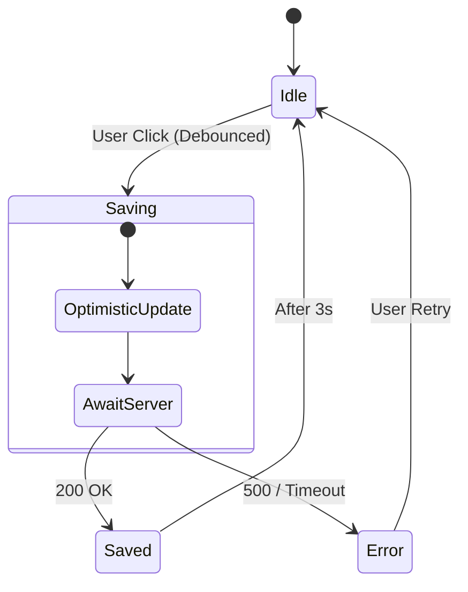

## When to use this skill

- User asks to **design a new UI component** or create a component spec.
- User asks to **document a component's API, state machine, or behavior**.
- User needs a **bridge between product requirements and frontend implementation**.
- User wants to define **strict contracts** before implementing a component.

This skill is ideal for:
- Designing complex interactive components (forms, modals, data tables).
- Establishing clear API contracts between parent and child components.
- Documenting edge cases and error states before implementation.
- Creating testable behavioral specifications.

## Input Schema

When invoking this skill, provide:

```yaml
component:
  name: string           # PascalCase component name
  type: "atom" | "molecule" | "organism" | "page"
  responsibility: string # One-sentence description of what it does
context:
  product_area: string   # Where this component lives (e.g., "Settings Page")
  user_role: string      # Target user (e.g., "Admin", "End User")
constraints:
  tech_stack: string     # (optional) e.g., "React + Zustand"
  performance: string    # (optional) e.g., "High latency network"
  permissions: string    # (optional) e.g., "Role-based access"
```

## Execution Rules

### 1. Define Contract (The Interface)

- Use **TypeScript** syntax strictly.
- Define `Props` (Inputs) and `Events` (Outputs).
- Explicitly annotate **State Ownership** in comments:
  - `[Controlled]`: Owned by parent/server.
  - `[Local]`: Internal UI state.
  - `[Computed]`: Derived from props/state.
- Do NOT implement the logic, only the type signature.

### 2. Define Logic (The Machine)

- Use **Mermaid.js** (`stateDiagram-v2`).
- Focus on the **Finite State Machine (FSM)**:
  - Valid States (e.g., Idle, Loading, Error, Success).
  - Transitions (Triggered by User or System).
  - Guard conditions (e.g., `if data > 0`).
- Do NOT use Flowcharts; use State Diagrams.

### 3. Define Scenarios (The Tests)

- Use **Gherkin-lite** syntax (Given / When / Then).
- Focus strictly on **Edge Cases** identified in constraints:
  - Network failures / Latency.
  - Permission denials.
  - Empty states / Partial data.
  - Concurrent user actions.

## Output Format (Strict)

Output must be a single Markdown document containing exactly these three sections:

### Section 1: Component Contract

```typescript
interface {ComponentName}Props {
  // [Controlled] Description
  propName: Type;
}

interface {ComponentName}State {
  // [Local] Description
  stateName: Type;
}

interface {ComponentName}Events {
  // Event callbacks
  onEvent: (payload: Type) => void;
}
```

### Section 2: State Logic



### Section 3: Behavioral Scenarios

- **Scenario: [Name]**
  - **Given** initial condition
  - **When** user action or system event
  - **Then** expected outcome

## Example

**Input:**
```yaml
component:
  name: "SmartSaveButton"
  type: "molecule"
  responsibility: "Debounce user input and save to server with optimistic updates."
context:
  product_area: "Settings Page"
  user_role: "End User"
constraints:
  performance: "High latency network"
```

**Output:**

## 1. Component Contract

```typescript
interface SmartSaveButtonProps {
  // [Controlled] The actual value to save
  value: any;
  // [Computed] Dirty state (value !== initialValue)
  isDirty: boolean;
  // [Controlled] External save handler
  onSave: (val: any) => Promise<void>;
}

interface SmartSaveButtonState {
  // [Local] Optimistic UI state
  optimisticStatus: 'idle' | 'saving' | 'saved' | 'error';
}
```

## 2. State Logic



## 3. Behavioral Scenarios

- **Scenario: Rapid Clicking**
  - **Given** the button is in 'Saving' state
  - **When** user clicks again immediately
  - **Then** the click should be ignored (disabled) to prevent race conditions.

- **Scenario: Network Timeout**
  - **Given** server takes > 10s to respond
  - **When** timeout threshold is reached
  - **Then** revert optimistic UI AND show toast error.

## Output Location

Save generated specs to: `doc/specs/{component-name}-spec.md`

## Requirements

- TypeScript knowledge for contract definitions.
- Mermaid.js for state diagram rendering.
- Understanding of component state ownership patterns.
