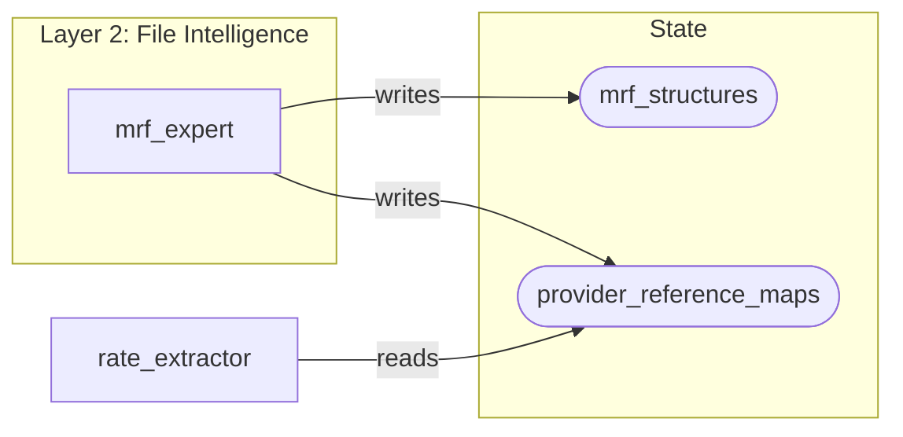

# State Flow Visualizer

Analyze LangGraph state mutations and generate visual representations of data flow between nodes.

## Capabilities

1. **State Flow Diagrams** - Generate Mermaid flowcharts showing node-to-state-key relationships
2. **Key Tracing** - Track a specific state key through all read/write operations
3. **Dependency Analysis** - Show which nodes depend on outputs from other nodes
4. **Orphan Detection** - Find state keys that are written but never read (or vice versa)
5. **Layer Analysis** - Visualize state flow within and between layers

## Quick Start

Run the analyzer on a LangGraph nodes directory:

```bash
python scripts/analyze_state_flow.py /path/to/src/langgraph/nodes
```

Generate a Mermaid diagram:

```bash
python scripts/analyze_state_flow.py /path/to/src/langgraph/nodes --output mermaid
```

Trace a specific key:

```bash
python scripts/analyze_state_flow.py /path/to/src/langgraph/nodes --trace extracted_rates
```

## Output Formats

### Mermaid Diagram


### JSON Report
```json
{
  "nodes": [...],
  "state_keys": [...],
  "reads": [...],
  "writes": [...],
  "orphans": {"written_never_read": [], "read_never_written": []},
  "dependencies": [...]
}
```

## Integration with TiC Pipeline

For TiC-specific analysis, the tool understands:
- Layer organization (layer0-layer8)
- `TiCPipelineState` TypedDict structure
- `BaseLLMNode` and `BaseDeterministicNode` patterns
- State update patterns via `update_layer_status()`

## Commands

| Command | Description |
|---------|-------------|
| `--output mermaid` | Generate Mermaid flowchart |
| `--output json` | Generate JSON analysis report |
| `--output summary` | Human-readable summary (default) |
| `--trace KEY` | Trace specific state key through pipeline |
| `--layer N` | Filter to specific layer |
| `--detect-orphans` | Find unused state keys |
| `--detect-cycles` | Find circular dependencies |

## Interpreting Results

### Healthy Patterns
- Each state key has at least one writer and one reader
- Writers execute before readers (layer ordering)
- No circular dependencies within a layer

### Warning Signs
- **Orphan writes**: State key populated but never used downstream
- **Orphan reads**: Node expects state key that no node populates
- **Cross-layer cycles**: Later layer writes key read by earlier layer
- **Shadow writes**: Multiple nodes write same key (potential race condition)

## Troubleshooting Common Issues

### "extracted_rates is empty at layer 6"
Run: `python scripts/analyze_state_flow.py . --trace extracted_rates`

Look for:
1. Which node should write `extracted_rates`
2. Whether that node's layer executes before layer 6
3. Whether the writing node has error handling that silently returns `[]`

### "State key not found in analysis"
The key may be:
- Dynamically constructed (e.g., `state.get(f"{prefix}_rates")`)
- Set in initial state factory, not by a node
- Populated by external process

Check `state.py` for initial state values.
