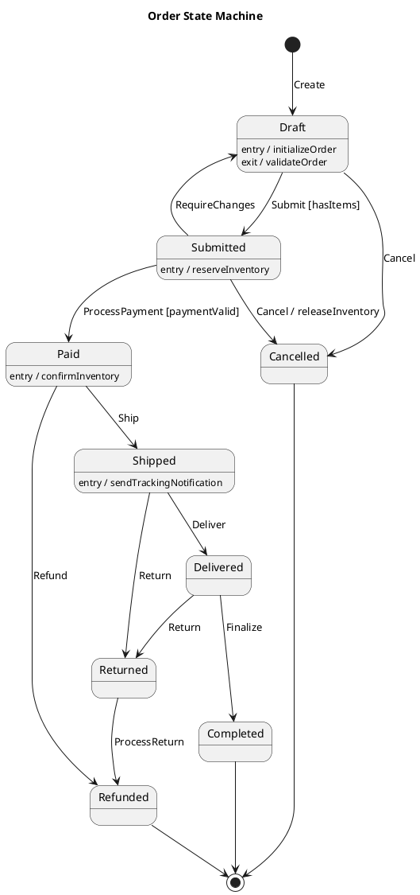
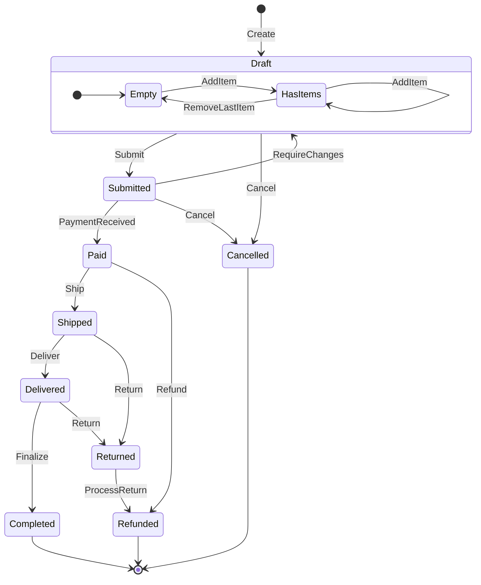

# State Machine Design Skill

## When to Use This Skill

Use this skill when:

- **State Machine Design tasks** - Working on statechart and state machine modeling for lifecycle and behavior specification
- **Planning or design** - Need guidance on State Machine Design approaches
- **Best practices** - Want to follow established patterns and standards

## Overview

Design finite state machines and statecharts for modeling entity lifecycles, workflows, and system behavior.

## MANDATORY: Documentation-First Approach

Before designing state machines:

1. **Invoke `docs-management` skill** for state machine patterns
2. **Verify implementation patterns** via MCP servers (context7 for XState, etc.)
3. **Base all guidance on Harel statechart semantics**

## State Machine Concepts

### Core Elements

| Element | Description | Example |
|---------|-------------|---------|
| State | Condition the system can be in | `Draft`, `Submitted`, `Paid` |
| Transition | Change from one state to another | `Draft → Submitted` |
| Event | Trigger for a transition | `Submit`, `Pay`, `Cancel` |
| Guard | Condition that must be true | `[hasItems]`, `[isValid]` |
| Action | Side effect on transition | `sendNotification`, `updateDatabase` |
| Entry Action | Action when entering state | `onEnter: startTimer` |
| Exit Action | Action when leaving state | `onExit: stopTimer` |

### State Types

```csharp
public enum StateType
{
    Initial,       // Starting state (filled circle)
    Normal,        // Regular state
    Final,         // End state (circle with border)
    Composite,     // Contains sub-states
    Parallel,      // Concurrent regions
    History,       // Remember last sub-state
    Choice         // Decision point
}
```

## State Machine Notation

### PlantUML Syntax



### Mermaid Syntax



## C# Implementation Patterns

### Simple State Machine

```csharp
public sealed class Order : Entity
{
    public OrderStatus Status { get; private set; }

    private static readonly Dictionary<(OrderStatus From, OrderEvent Event), OrderStatus> _transitions =
        new()
        {
            { (OrderStatus.Draft, OrderEvent.Submit), OrderStatus.Submitted },
            { (OrderStatus.Draft, OrderEvent.Cancel), OrderStatus.Cancelled },
            { (OrderStatus.Submitted, OrderEvent.Pay), OrderStatus.Paid },
            { (OrderStatus.Submitted, OrderEvent.Cancel), OrderStatus.Cancelled },
            { (OrderStatus.Submitted, OrderEvent.RequireChanges), OrderStatus.Draft },
            { (OrderStatus.Paid, OrderEvent.Ship), OrderStatus.Shipped },
            { (OrderStatus.Paid, OrderEvent.Refund), OrderStatus.Refunded },
            { (OrderStatus.Shipped, OrderEvent.Deliver), OrderStatus.Delivered },
            { (OrderStatus.Shipped, OrderEvent.Return), OrderStatus.Returned },
            { (OrderStatus.Delivered, OrderEvent.Finalize), OrderStatus.Completed },
            { (OrderStatus.Delivered, OrderEvent.Return), OrderStatus.Returned },
            { (OrderStatus.Returned, OrderEvent.ProcessReturn), OrderStatus.Refunded },
        };

    public Result Transition(OrderEvent @event)
    {
        if (!_transitions.TryGetValue((Status, @event), out var newStatus))
        {
            return Result.Failure($"Cannot {@event} order in {Status} status");
        }

        var oldStatus = Status;
        Status = newStatus;

        AddDomainEvent(new OrderStatusChangedEvent(Id, oldStatus, newStatus, @event));

        return Result.Success();
    }
}

public enum OrderStatus
{
    Draft, Submitted, Paid, Shipped, Delivered, Completed, Cancelled, Returned, Refunded
}

public enum OrderEvent
{
    Submit, Cancel, Pay, RequireChanges, Ship, Refund, Deliver, Return, Finalize, ProcessReturn
}
```

### State Pattern Implementation

```csharp
public abstract class OrderState
{
    public abstract OrderStatus Status { get; }

    public virtual Result Submit(Order order) =>
        Result.Failure($"Cannot submit order in {Status} state");

    public virtual Result Cancel(Order order) =>
        Result.Failure($"Cannot cancel order in {Status} state");

    public virtual Result Pay(Order order) =>
        Result.Failure($"Cannot pay order in {Status} state");

    public virtual Result Ship(Order order) =>
        Result.Failure($"Cannot ship order in {Status} state");

    protected void TransitionTo(Order order, OrderState newState)
    {
        order.SetState(newState);
    }
}

public sealed class DraftState : OrderState
{
    public override OrderStatus Status => OrderStatus.Draft;

    public override Result Submit(Order order)
    {
        if (!order.HasItems)
            return Result.Failure("Order must have items to submit");

        TransitionTo(order, new SubmittedState());
        order.ReserveInventory();
        return Result.Success();
    }

    public override Result Cancel(Order order)
    {
        TransitionTo(order, new CancelledState());
        return Result.Success();
    }
}

public sealed class SubmittedState : OrderState
{
    public override OrderStatus Status => OrderStatus.Submitted;

    public override Result Pay(Order order)
    {
        TransitionTo(order, new PaidState());
        order.ConfirmInventory();
        return Result.Success();
    }

    public override Result Cancel(Order order)
    {
        order.ReleaseInventory();
        TransitionTo(order, new CancelledState());
        return Result.Success();
    }
}
```

### Stateless Library Pattern

```csharp
using Stateless;

public sealed class OrderStateMachine
{
    private readonly StateMachine<OrderStatus, OrderEvent> _machine;
    private readonly Order _order;

    public OrderStateMachine(Order order)
    {
        _order = order;
        _machine = new StateMachine<OrderStatus, OrderEvent>(
            () => order.Status,
            status => order.SetStatus(status));

        ConfigureTransitions();
    }

    private void ConfigureTransitions()
    {
        _machine.Configure(OrderStatus.Draft)
            .Permit(OrderEvent.Submit, OrderStatus.Submitted)
            .Permit(OrderEvent.Cancel, OrderStatus.Cancelled)
            .OnEntry(() => _order.InitializeOrder());

        _machine.Configure(OrderStatus.Submitted)
            .PermitIf(OrderEvent.Pay, OrderStatus.Paid,
                () => _order.PaymentIsValid)
            .Permit(OrderEvent.Cancel, OrderStatus.Cancelled)
            .Permit(OrderEvent.RequireChanges, OrderStatus.Draft)
            .OnEntry(() => _order.ReserveInventory())
            .OnExit(() => { /* cleanup if needed */ });

        _machine.Configure(OrderStatus.Paid)
            .Permit(OrderEvent.Ship, OrderStatus.Shipped)
            .Permit(OrderEvent.Refund, OrderStatus.Refunded)
            .OnEntry(() => _order.ConfirmInventory());

        _machine.Configure(OrderStatus.Shipped)
            .Permit(OrderEvent.Deliver, OrderStatus.Delivered)
            .Permit(OrderEvent.Return, OrderStatus.Returned)
            .OnEntry(() => _order.SendTrackingNotification());

        _machine.Configure(OrderStatus.Delivered)
            .Permit(OrderEvent.Finalize, OrderStatus.Completed)
            .Permit(OrderEvent.Return, OrderStatus.Returned);

        _machine.Configure(OrderStatus.Returned)
            .Permit(OrderEvent.ProcessReturn, OrderStatus.Refunded);

        // Terminal states
        _machine.Configure(OrderStatus.Completed);
        _machine.Configure(OrderStatus.Cancelled);
        _machine.Configure(OrderStatus.Refunded);
    }

    public bool CanFire(OrderEvent trigger) => _machine.CanFire(trigger);

    public void Fire(OrderEvent trigger) => _machine.Fire(trigger);

    public IEnumerable<OrderEvent> GetPermittedTriggers() =>
        _machine.GetPermittedTriggers();
}
```

## XState Pattern (TypeScript)

```typescript
import { createMachine, assign } from 'xstate';

interface OrderContext {
  items: LineItem[];
  customerId: string;
  paymentId?: string;
  trackingNumber?: string;
}

type OrderEvent =
  | { type: 'ADD_ITEM'; item: LineItem }
  | { type: 'REMOVE_ITEM'; itemId: string }
  | { type: 'SUBMIT' }
  | { type: 'PAY'; paymentId: string }
  | { type: 'CANCEL' }
  | { type: 'SHIP'; trackingNumber: string }
  | { type: 'DELIVER' }
  | { type: 'RETURN' }
  | { type: 'REFUND' };

const orderMachine = createMachine({
  id: 'order',
  initial: 'draft',
  context: {
    items: [],
    customerId: '',
  } as OrderContext,

  states: {
    draft: {
      entry: 'initializeOrder',
      on: {
        ADD_ITEM: {
          actions: assign({
            items: ({ context, event }) => [...context.items, event.item],
          }),
        },
        REMOVE_ITEM: {
          actions: assign({
            items: ({ context, event }) =>
              context.items.filter(i => i.id !== event.itemId),
          }),
        },
        SUBMIT: {
          target: 'submitted',
          guard: 'hasItems',
        },
        CANCEL: 'cancelled',
      },
    },

    submitted: {
      entry: 'reserveInventory',
      exit: 'onSubmittedExit',
      on: {
        PAY: {
          target: 'paid',
          guard: 'paymentValid',
          actions: assign({
            paymentId: ({ event }) => event.paymentId,
          }),
        },
        CANCEL: {
          target: 'cancelled',
          actions: 'releaseInventory',
        },
      },
    },

    paid: {
      entry: 'confirmInventory',
      on: {
        SHIP: {
          target: 'shipped',
          actions: assign({
            trackingNumber: ({ event }) => event.trackingNumber,
          }),
        },
        REFUND: 'refunded',
      },
    },

    shipped: {
      entry: 'sendTrackingNotification',
      on: {
        DELIVER: 'delivered',
        RETURN: 'returned',
      },
    },

    delivered: {
      on: {
        RETURN: 'returned',
      },
      after: {
        // Auto-complete after 14 days
        '14d': 'completed',
      },
    },

    returned: {
      on: {
        REFUND: 'refunded',
      },
    },

    completed: { type: 'final' },
    cancelled: { type: 'final' },
    refunded: { type: 'final' },
  },
}, {
  guards: {
    hasItems: ({ context }) => context.items.length > 0,
    paymentValid: ({ event }) => event.type === 'PAY' && !!event.paymentId,
  },
  actions: {
    initializeOrder: () => console.log('Order initialized'),
    reserveInventory: ({ context }) =>
      console.log(`Reserving ${context.items.length} items`),
    confirmInventory: () => console.log('Inventory confirmed'),
    releaseInventory: () => console.log('Inventory released'),
    sendTrackingNotification: ({ context }) =>
      console.log(`Tracking: ${context.trackingNumber}`),
  },
});
```

## Design Best Practices

### State Design Guidelines

1. **Name states as conditions**: `Submitted` not `Submit`
2. **Name events as commands**: `Submit` not `Submitted`
3. **Use guards for conditional transitions**
4. **Keep states atomic**: One responsibility per state
5. **Document entry/exit actions**
6. **Consider terminal states** (final states)

### Common Patterns

| Pattern | Use Case |
|---------|----------|
| Linear | Simple sequential flow |
| Choice | Conditional branching |
| Parallel | Concurrent activities |
| Hierarchical | Complex nested states |
| History | Resume from last state |

## Workflow

When designing state machines:

1. **Identify entity**: What has the lifecycle?
2. **List states**: What conditions can it be in?
3. **Define events**: What triggers state changes?
4. **Map transitions**: State + Event → New State
5. **Add guards**: What conditions must be true?
6. **Define actions**: What happens on transitions?
7. **Draw diagram**: Visualize for review
8. **Implement**: Choose appropriate pattern

## References

For detailed guidance:

---

**Last Updated:** 2025-12-26
