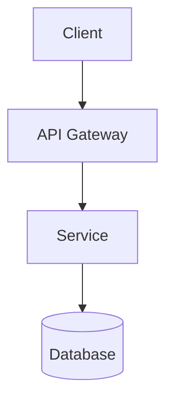
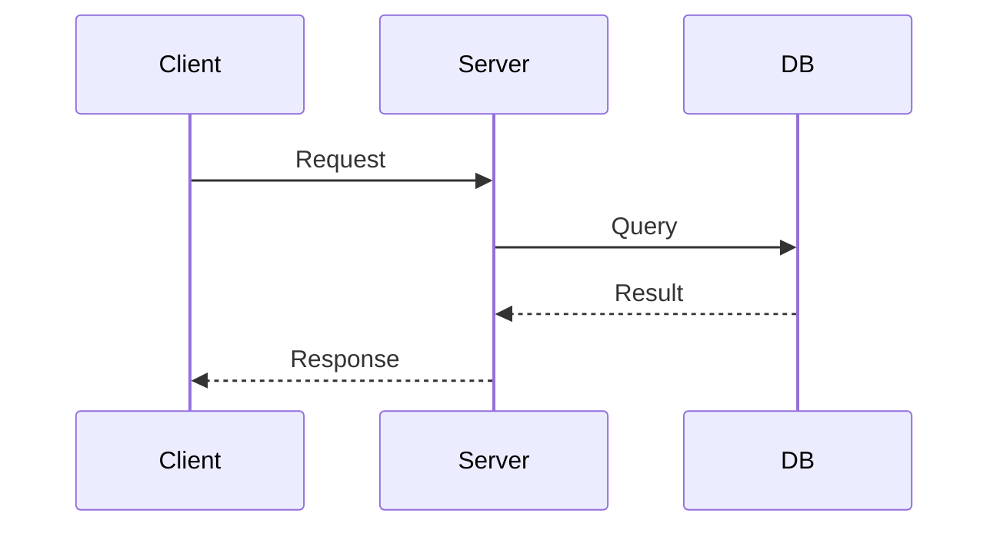
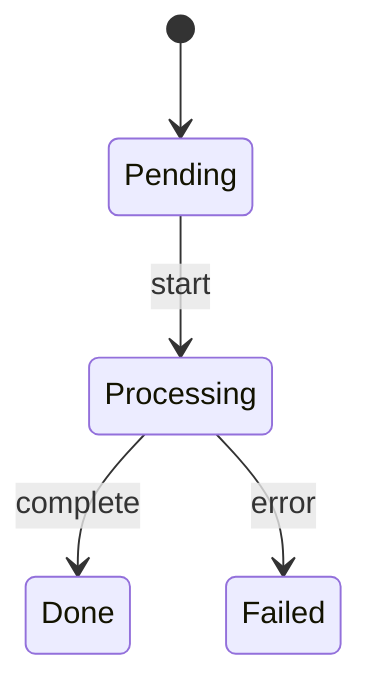

# Technical Design Document Skill

## When to Use

- Designing a new feature or system
- Documenting architecture decisions (ADR/RFC)
- Planning refactoring or optimization work

## Execution Flow

### 1. Assess Complexity

| Level | Scope | Sections Required |
|-------|-------|-------------------|
| Small | Single component, <100 LOC | TL;DR, Design, Implementation |
| Medium | Cross-component, API changes | + Background, Solution Analysis |
| Large | System-level, new service | Full template |

### 2. Gather Context

Before writing, explore the codebase:
- Identify affected components (grep/glob for related code)
- Read existing implementations and patterns
- Note dependencies and potential side effects
- Check for similar solutions already in codebase

### 3. Write Document

Follow the template structure below, scaled to complexity level.

### 4. Verify Before Handoff

- [ ] Problem clearly defined (what breaks if we do nothing?)
- [ ] Options compared with trade-offs (not just one solution)
- [ ] Decision rationale documented
- [ ] Diagrams illustrate key flows
- [ ] Implementation steps are concrete and actionable
- [ ] Risks identified with mitigations

## Document Template

```markdown
# [Feature/System Name] Technical Design

## TL;DR
- 3-5 bullets: problem, solution, key decisions, expected outcome

## Background (Medium/Large)

### Current State
- Existing behavior and limitations

### Problem Statement
- What breaks if we do nothing?
- Who is affected and how?

### Goals / Non-Goals
- Goals: what this design achieves
- Non-Goals: explicitly out of scope

## Solution Analysis (Medium/Large)

### Option 1: [Name]
Pros: ...
Cons: ...

### Option 2: [Name]
Pros: ...
Cons: ...

### Comparison
| Criteria | Option 1 | Option 2 |
|----------|----------|----------|
| Performance | ... | ... |
| Complexity | ... | ... |

### Recommendation
Selected: Option X
Rationale: [why]

## Detailed Design

### Architecture
[Mermaid diagram - see examples below]

### Component Design
- Responsibilities
- Interfaces
- Dependencies

### Data Model (if applicable)
[Schema or structure]

### API Design (if applicable)
[Endpoints, request/response]

## Implementation Plan

### Phase 1: [Name]
- [ ] Task 1
- [ ] Task 2

### Migration Strategy (if applicable)

## Risk Assessment

| Risk | Probability | Impact | Mitigation |
|------|-------------|--------|------------|
| ... | High/Med/Low | High/Med/Low | ... |

## References
- Related docs, external resources
```

## Mermaid Diagram Examples

**Architecture (flowchart):**


**Sequence:**


**State:**


## Handling Feedback

When user requests changes:
1. Understand which section needs revision
2. Update only affected sections
3. Ensure changes don't contradict other sections
4. Re-verify the checklist items related to changes

## Output Location

- Check if project has `docs/`, `ai_docs/`, or `design/` directory
- Ask user if location is unclear
- Use descriptive filename: `design-[feature-name].md`
