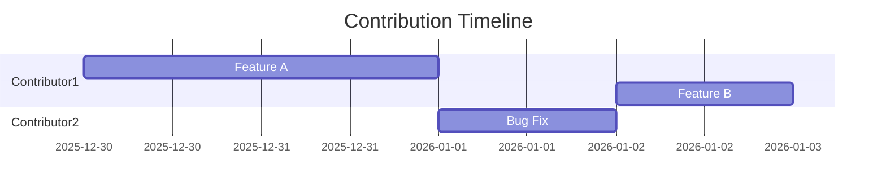
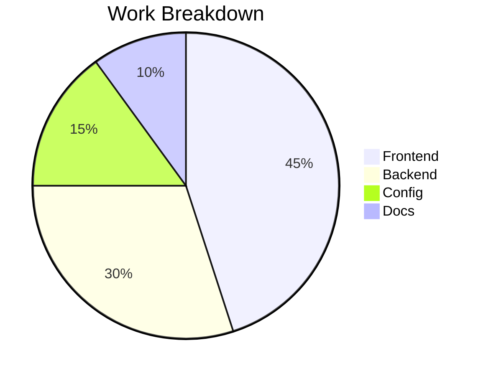

# Repo Review Skill (Engineering Manager Edition)

This skill enables AI-powered repository analysis with three modes: contribution statistics, code quality assessment, and team/manager insights. Supports org-wide reviews, single repos, and saved repo groups.

## Prerequisites

- Git CLI installed
- GitHub CLI (`gh`) for org-wide reviews
- Optional: Python 3.10+ with matplotlib for PNG chart generation

## Quick Start

```
Review https://github.com/org/repo
Review the UP organization
Review my side-projects group
```

## Progressive Onboarding

On first use, gather context through conversation:

### Initial Questions
1. **Role**: Engineering Manager | Tech Lead | IC
2. **Focus**: Full review | Quick stats | Code quality only
3. **Time period**: 30 days | 90 days | YTD | Custom

Save preferences to `config.yaml` for future sessions.

### Follow-up Questions (as needed)
- "I found 5 contributors. Focus on anyone specific?"
- "Compare against previous review?"
- "Flag contributors with < X commits?"

---

## Analysis Modes

### Mode 1: Contribution Statistics

Gather quantitative metrics using git commands:

```bash
# Clone repo to temp directory
git clone --quiet <repo_url> /tmp/repo_review_temp

# Contribution stats by author
git log --numstat --format="COMMIT|%H|%an|%ad" --date=short --since="2025-01-01" --all

# Weekly breakdown
git log --format="%ad" --date=short --since="2025-01-01" | sort | uniq -c

# Files touched by author
git log --author="Name" --name-only --pretty=format: | sort | uniq -c | sort -rn

# File type breakdown
git log --numstat --format="" | awk '{print $3}' | grep -oE '\.[^.]+$' | sort | uniq -c | sort -rn
```

**Output metrics:**
- Commits per author
- Lines added/deleted/net per author
- File type breakdown (frontend/backend/config/infra/docs)
- Weekly/monthly activity patterns

### Mode 2: Code Quality Review

Examine the codebase for:

**Architecture & Patterns**
- Project structure organization
- Component/module boundaries
- DRY compliance
- Separation of concerns

**Type Safety**
- TypeScript strictness
- `any` usage
- Proper type exports

**Error Handling**
- Try/catch patterns
- Error boundaries
- Validation at boundaries

**Database/API Patterns**
- Query structure
- N+1 detection
- Input validation

**Security**
- Auth implementation
- Secret handling
- Input sanitization

**Testing Indicators**
- Test file presence
- Coverage indicators
- Test patterns

### Mode 3: Team/Manager Assessment

Combine quantitative data with qualitative code review:

**Per-Contributor Analysis:**
- Volume and consistency
- Scope of work (full-stack vs narrow)
- Quality signals
- Growth indicators

**Team Health:**
- Bus factor
- Knowledge silos
- Cross-functional work
- Velocity trends

---

## Review Targets

### 1. Single Repository

```
Review https://github.com/org/repo
Review https://github.com/org/repo --since 2025-06-01
```

### 2. Organization-Wide

```
Review the UP organization
Review all repos in UP org
```

Uses GitHub CLI:
```bash
gh repo list UP --limit 100 --json name,sshUrl,url
```

### 3. Saved Groups

```
Review my side-projects group
Review client-work group
```

### 4. Managing Groups

```
Add https://github.com/user/repo to side-projects
Create a new group called "experiments"
Remove old-project from experiments
Show all my saved groups
```

---

## Visualization Options

### Mermaid Diagrams (for markdown reports)

**Contribution Timeline:**


**Work Breakdown:**


### ASCII Charts (for terminal/quick view)

```
Author          | Net LoC | Contribution
----------------|---------|----------------------------------
Alice           |   2,872 | ████████████████████████████ 100%
Bob             |   1,020 | ████████████░░░░░░░░░░░░░░░░  35%
Charlie         |      18 | █░░░░░░░░░░░░░░░░░░░░░░░░░░░   1%
```

**Weekly Trend:**
```
Week 1: ████████████ 1,200 LoC
Week 2: ███████████████ 1,450 LoC ↑
Week 3: █████████ 890 LoC ↓ ⚠️
```

### Script Charts (for presentations)

Run `scripts/repo_review_om.py` for matplotlib PNG generation:

```bash
python scripts/repo_review_om.py --repo https://github.com/org/repo --chart
```

---

## Manager-Focused Outputs

### Performance Review Language

**Strong Performer:**
> "[Name] demonstrated strong capabilities, delivering [X] features across [Y] commits totaling [Z] net lines. Notable contributions include [specific feature]. Their work showed [quality indicator - e.g., proper error handling, TypeScript usage, test coverage]."

**Solid Contributor:**
> "[Name] contributed consistently with [X] commits and [Y] net lines. Primary focus was [area]. Recommend expanding into [adjacent area] for growth."

**Needs Attention:**
> "[Name] had limited participation with [X] commits totaling [Y] lines. Contributions were confined to [narrow scope]. Recommend 1:1 to understand blockers and assign stretch goals."

### 1:1 Conversation Starters

| Pattern Detected | Suggested Questions |
|------------------|---------------------|
| Low participation | "I noticed fewer commits recently. What's blocking you? How can I help clear obstacles?" |
| Narrow scope (UI only) | "You've done great frontend work. Interested in backend exposure? I can pair you with [name]." |
| High volume, quality concerns | "You're shipping fast which is great. Let's talk about our code review process and testing practices." |
| Declining trend | "Your output has shifted. Are you feeling challenged enough? Burned out? Something outside work?" |
| Strong performance | "Your auth implementation was solid. Ready to take on a larger feature? Lead a project?" |
| Git config issues | "Quick housekeeping - let's fix your git config so your commits are consistent." |

### Growth/Promotion Readiness

**Junior → Mid-Level Signals:**
- Works across frontend AND backend
- Writes database migrations/schema changes
- Fixes bugs introduced by others (not just own code)
- Adds tests without being prompted
- Clear commit messages with context
- Participates in code review

**Mid → Senior Signals:**
- Designs features end-to-end
- Mentors juniors (visible in PR reviews)
- Identifies and addresses technical debt
- Documents architectural decisions
- Considers security implications
- Optimizes for maintainability

### Red Flag Detection

| Red Flag | Indicators | Recommended Action |
|----------|------------|-------------------|
| Disengagement | < 1 commit/week sustained, shrinking scope | Urgent 1:1, understand root cause |
| Burnout risk | High volume followed by sudden drop | Discuss workload, consider time off |
| Git identity issues | Multiple author names for same person | Fix git config, merge stats in analysis |
| Narrow specialization | Only touches one file type | Assign cross-functional tasks |
| Knowledge silo | Only person who touches critical code | Pair programming, documentation push |
| Declining quality | Increasing bug fixes on own code | Code review focus, testing discussion |

### Team Health Metrics

**Velocity Trend:**
```
Period      | Team LoC | Trend    | Notes
------------|----------|----------|------------------
Week 1      |    1,200 | baseline |
Week 2      |    1,450 | ↑ 21%    | Sprint push
Week 3      |      890 | ↓ 39%    | ⚠️ Investigate
Week 4      |    1,100 | ↑ 24%    | Recovery
```

**Knowledge Distribution:**
- Bus Factor: How many people can modify each critical area?
- Silo Score: % of code touched by only one person
- Cross-functional Index: % of contributors working across stack

**Contribution Balance:**
```
Ideal: Relatively balanced contributions
⚠️ Warning: Top contributor has >70% of commits
🚨 Critical: One person has >90% of commits
```

---

## Configuration

The skill uses `config.yaml` for persistent settings. Created on first use.

### Config Structure

```yaml
# Default analysis settings
defaults:
  since: "2025-01-01"
  analysis_modes:
    - contributions
    - quality
    - team
  output_format: markdown  # markdown | ascii | json
  role: engineering_manager  # engineering_manager | tech_lead | ic

# Saved organizations
orgs:
  up:
    github_org: "UP"
    description: "UP Company repositories"
    active: true
    contributors:
      - name: "Alice Smith"
        aliases: ["alice", "asmith"]
        role: "Senior Engineer"
        active: true
      - name: "Bob Jones"
        aliases: ["bob", "bjones"]
        role: "Junior Engineer"
        active: true
      - name: "Former Employee"
        aliases: ["former"]
        role: "Engineer"
        active: false  # No longer with team
    exclude_authors:
      - "dependabot[bot]"
      - "github-actions[bot]"
      - "renovate[bot]"

# Saved repo groups (for non-org collections)
groups:
  side-projects:
    description: "Personal weekend experiments"
    active: true
    repos:
      - "https://github.com/user/project-a"
      - "https://github.com/user/project-b"
      
  client-work:
    description: "Freelance client projects"
    active: true
    repos:
      - "https://github.com/client/app"

  archived:
    description: "Old projects for reference"
    active: false
    repos:
      - "https://github.com/user/old-thing"

# Session tracking
last_session:
  target: "up"
  target_type: "org"  # org | group | repo
  date: "2026-01-10"
```

### Managing Config

**Add contributor:**
```
Add contributor "New Person" with alias "newperson" to UP org
```

**Deactivate contributor:**
```
Mark "Former Employee" as inactive in UP org
```

**Update org:**
```
Set UP org as inactive
```

---

## Example Workflows

### Weekly Team Standup Prep
```
User: "Quick stats on UP org for the past week"

AI: [Fetches last 7 days, shows commit counts per active contributor, flags anyone with 0 commits]
```

### Monthly Review
```
User: "Full review of UP org for December"

AI: [Comprehensive analysis with charts, per-contributor breakdown, team health metrics, comparison to November if available]
```

### 1:1 Preparation
```
User: "Prep 1:1 notes for Bob based on UP contributions"

AI: [Pulls Bob's stats across all org repos, correlates with code quality observations, generates talking points and growth recommendations]
```

### New Hire Onboarding Check
```
User: "How is the new junior doing in UP org? Started 2 weeks ago."

AI: [Filters to last 2 weeks, compares to typical onboarding velocity, identifies areas of focus, suggests pairing opportunities]
```

### Quarterly Summary
```
User: "Generate Q4 summary for UP team"

AI: [Aggregates Oct-Dec data, identifies top contributors, flags concerns, generates executive summary suitable for leadership]
```

### Project Kickoff
```
User: "Add https://github.com/client/new-project to client-work and give me initial review"

AI: [Adds to group, clones repo, establishes baseline metrics, identifies current contributors and code state]
```

---

## Troubleshooting

### GitHub CLI Not Authenticated
```
Error: gh: not logged in

Fix: Run `gh auth login` and follow prompts
```

### Private Repo Access
```
Error: Repository not found (404)

Fix: Ensure gh CLI has access, or use SSH URL if you have keys configured
```

### Large Org Timeout
```
For orgs with 50+ repos, consider:
1. Running with --limit flag
2. Excluding archived repos
3. Focusing on specific repos via group
```

### Git Config Issues (Multiple Authors)
```
Contributor showing as multiple people:

Fix: Have them run:
  git config --global user.name "Consistent Name"
  git config --global user.email "consistent@email.com"

Workaround: Add all variations to aliases in config.yaml
```

---

## Script Reference

For advanced chart generation, use the included Python script:

```bash
cd skills/repo-review/scripts

# Single repo with chart
python repo_review_om.py --repo https://github.com/org/repo --chart

# Org-wide
python repo_review_om.py --all --dir /tmp/org-repos

# Date range
python repo_review_om.py --repo URL --since 2025-06-01 --until 2025-12-31

# Exclude docs
python repo_review_om.py --repo URL --no-docs
```

Output: CSV data file + PNG chart (if --chart flag used)
