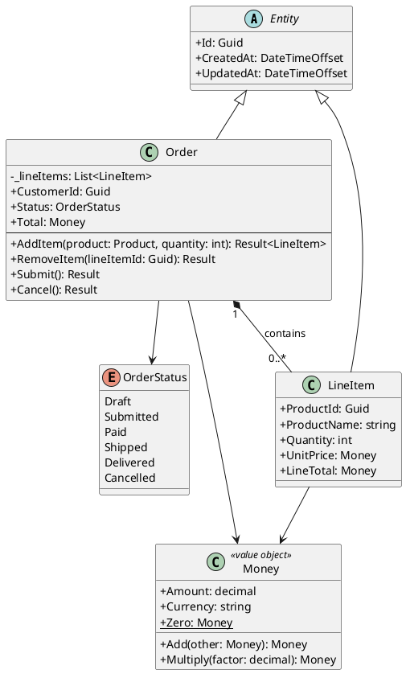
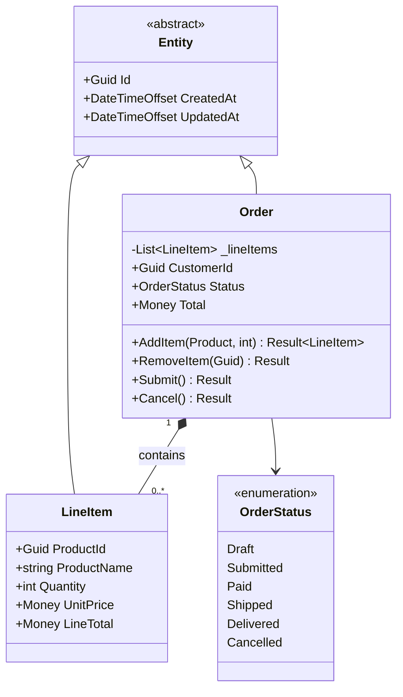
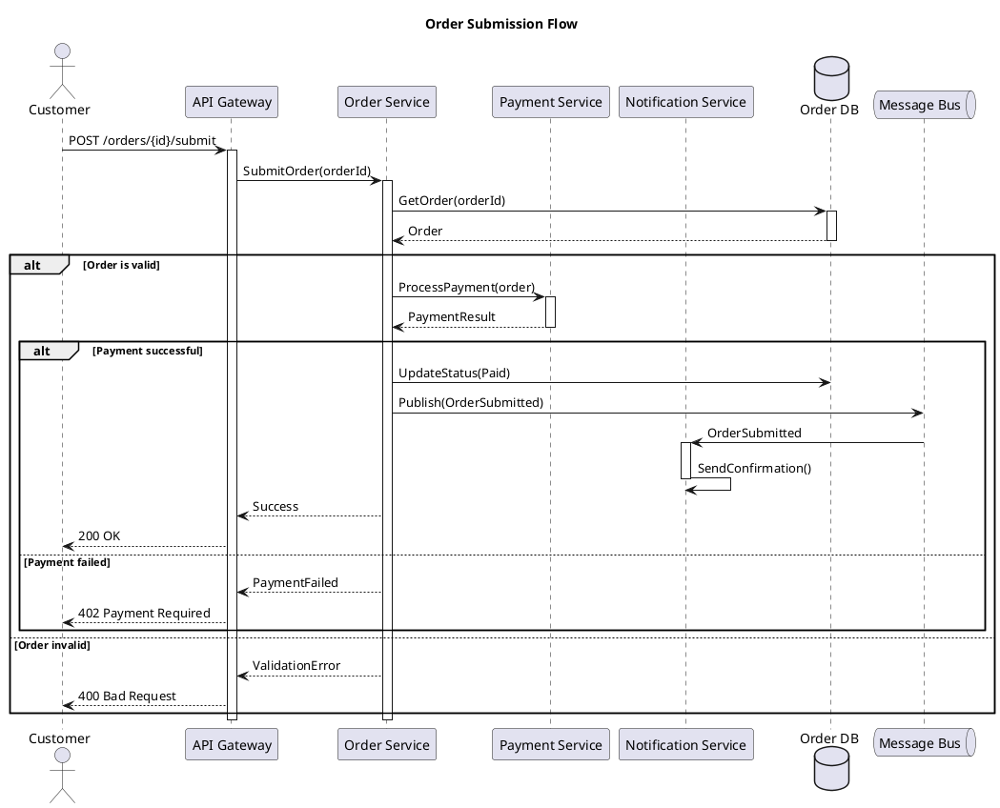
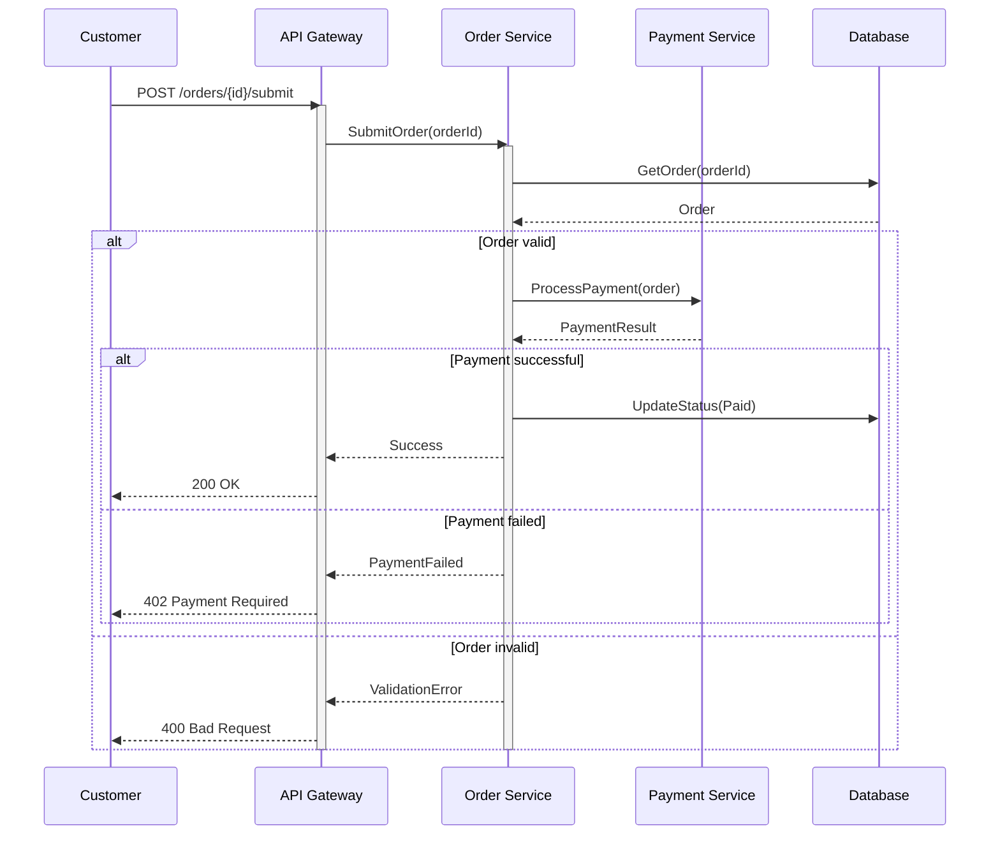
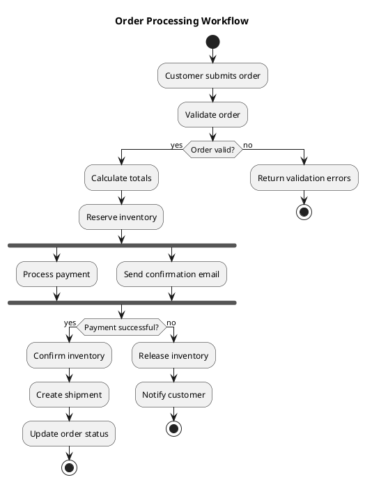
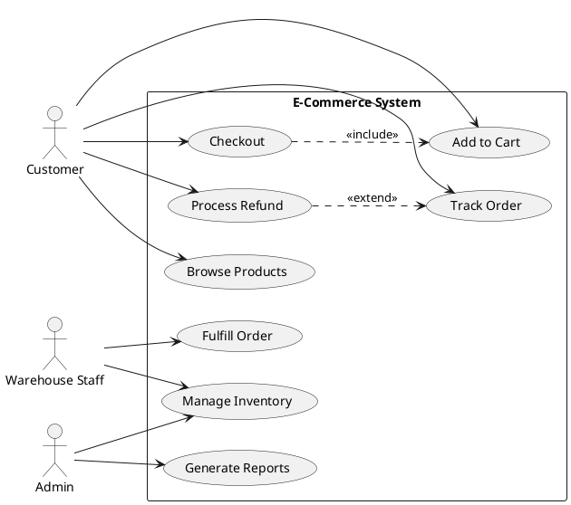
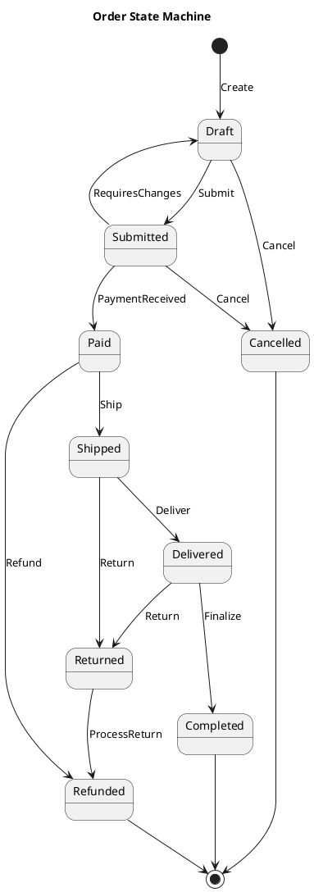
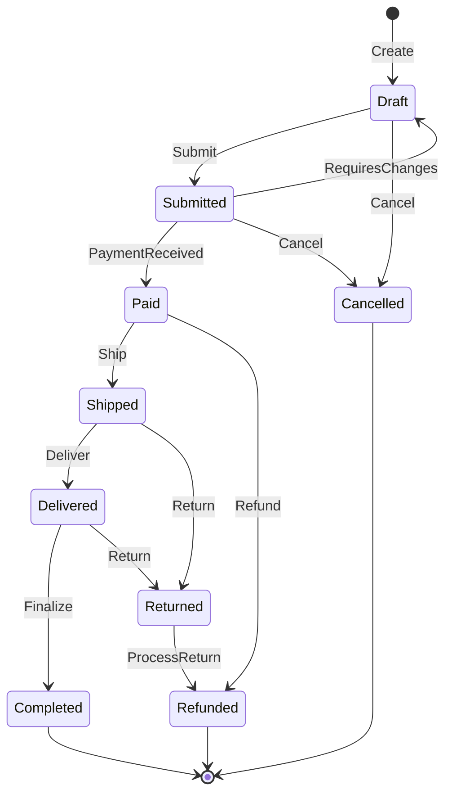
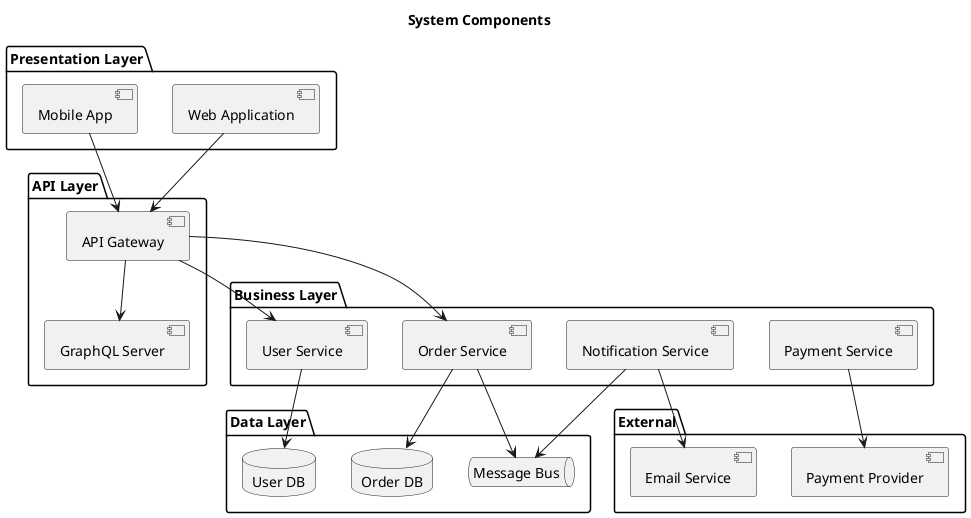

# UML Modeling Skill

## When to Use This Skill

Use this skill when:

- **Uml Modeling tasks** - Working on uml diagram generation including class, sequence, activity, use case, and state diagrams
- **Planning or design** - Need guidance on Uml Modeling approaches
- **Best practices** - Want to follow established patterns and standards

## Overview

Create UML diagrams using PlantUML and Mermaid notation for software design documentation.

## MANDATORY: Documentation-First Approach

Before creating UML diagrams:

1. **Invoke `docs-management` skill** for UML standards guidance
2. **Verify diagram syntax** using appropriate notation (PlantUML/Mermaid)
3. **Base all guidance on UML 2.5 specification**

## UML Diagram Types

### Structural Diagrams

| Diagram | Purpose | When to Use |
|---------|---------|-------------|
| Class | Show classes, attributes, methods, relationships | Domain modeling, design |
| Component | Show components and dependencies | Architecture documentation |
| Deployment | Show physical deployment | Infrastructure planning |
| Object | Show object instances | Specific scenarios |
| Package | Show namespaces/modules | Code organization |

### Behavioral Diagrams

| Diagram | Purpose | When to Use |
|---------|---------|-------------|
| Use Case | Show actor-system interactions | Requirements |
| Sequence | Show message flow over time | API design, protocols |
| Activity | Show workflows and processes | Business processes |
| State Machine | Show state transitions | Lifecycle modeling |
| Communication | Show object interactions | Design patterns |

## Class Diagram

### PlantUML Syntax



### Mermaid Class Diagram



### Relationship Types

```csharp
// UML Relationship Reference
public static class UMLRelationships
{
    // Association: uses, knows about
    // Customer --> Order (Customer uses Order)

    // Aggregation: has-a (shared ownership)
    // Team o-- Player (Team has Players, Players can exist independently)

    // Composition: contains (exclusive ownership)
    // Order *-- LineItem (Order contains LineItems, LineItems cannot exist without Order)

    // Inheritance: is-a
    // Dog --|> Animal (Dog extends Animal)

    // Implementation: implements
    // UserService ..|> IUserService (UserService implements IUserService)

    // Dependency: depends on
    // Controller ..> Service (Controller depends on Service)
}
```

## Sequence Diagram

### PlantUML Syntax



### Mermaid Sequence Diagram



## Activity Diagram

### PlantUML Syntax



## Use Case Diagram

### PlantUML Syntax



## State Machine Diagram

### PlantUML Syntax



### Mermaid State Diagram



## Component Diagram

### PlantUML Syntax



## Best Practices

### General Guidelines

1. **Keep diagrams focused**: One concept per diagram
2. **Use consistent notation**: Choose PlantUML or Mermaid per project
3. **Add meaningful names**: Clear, descriptive labels
4. **Include legends**: For complex diagrams
5. **Version control**: Store in repository with code

### Diagram Selection Guide

| Need | Diagram Type |
|------|--------------|
| Data structures, domain model | Class Diagram |
| API flow, protocols | Sequence Diagram |
| Business processes | Activity Diagram |
| Actor interactions | Use Case Diagram |
| Lifecycle, state transitions | State Machine |
| System structure | Component Diagram |
| Infrastructure | Deployment Diagram |

## Workflow

When creating UML diagrams:

1. **Identify purpose**: What question does the diagram answer?
2. **Select diagram type**: Choose most appropriate type
3. **Draft in text**: Use PlantUML or Mermaid notation
4. **Review for accuracy**: Verify against code/requirements
5. **Add context**: Title, notes, legend as needed
6. **Render and verify**: Ensure diagram renders correctly

## References

For detailed notation guides:

---

**Last Updated:** 2025-12-26
