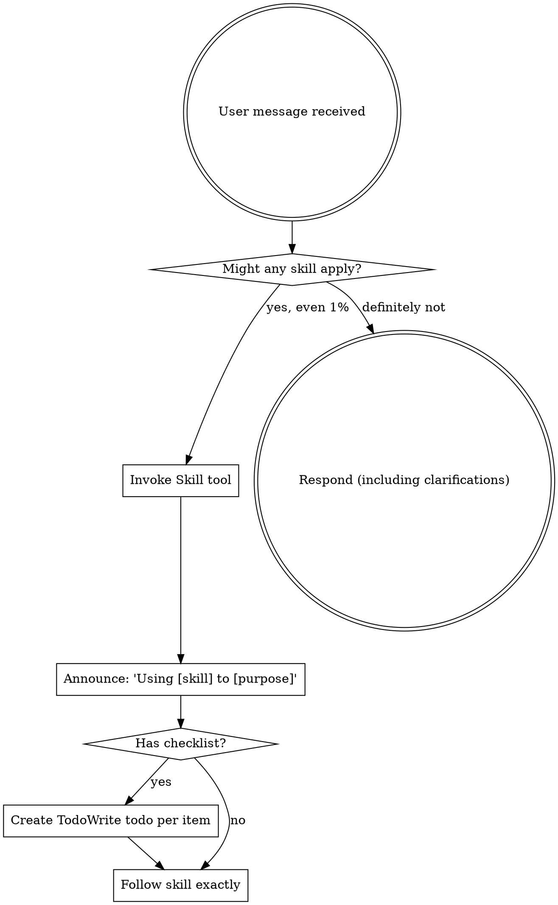

<EXTREMELY-IMPORTANT>
If you think there is even a 1% chance a skill might apply to what you are doing, you ABSOLUTELY MUST invoke the skill.

IF A SKILL APPLIES TO YOUR TASK, YOU DO NOT HAVE A CHOICE. YOU MUST USE IT.

This is not negotiable. This is not optional. You cannot rationalize your way out of this.
</EXTREMELY-IMPORTANT>

## How to Access Skills

**In Claude Code:** Use the `Skill` tool. When you invoke a skill, its content is loaded and presented to you—follow it directly. Never use the Read tool on skill files.

**In other environments:** Check your platform's documentation for how skills are loaded.

# Using Skills

## The Rule

**Invoke relevant or requested skills BEFORE any response or action.** Even a 1% chance a skill might apply means that you should invoke the skill to check. If an invoked skill turns out to be wrong for the situation, you don't need to use it.



## Red Flags

These thoughts mean STOP—you're rationalizing:

| Thought | Reality |
|---------|---------|
| "This is just a simple question" | Questions are tasks. Check for skills. |
| "I need more context first" | Skill check comes BEFORE clarifying questions. |
| "Let me explore the codebase first" | Skills tell you HOW to explore. Check first. |
| "I can check git/files quickly" | Files lack conversation context. Check for skills. |
| "Let me gather information first" | Skills tell you HOW to gather information. |
| "This doesn't need a formal skill" | If a skill exists, use it. |
| "I remember this skill" | Skills evolve. Read current version. |
| "This doesn't count as a task" | Action = task. Check for skills. |
| "The skill is overkill" | Simple things become complex. Use it. |
| "I'll just do this one thing first" | Check BEFORE doing anything. |
| "This feels productive" | Undisciplined action wastes time. Skills prevent this. |
| "I know what that means" | Knowing the concept ≠ using the skill. Invoke it. |

## Skill Priority

When multiple skills could apply, use this order:

1. **Process skills first** (brainstorming, debugging) - these determine HOW to approach the task
2. **Implementation skills second** (frontend-design, mcp-builder) - these guide execution

"Let's build X" → brainstorming first, then implementation skills.
"Fix this bug" → debugging first, then domain-specific skills.

## Skill Types

**Rigid** (TDD, debugging): Follow exactly. Don't adapt away discipline.

**Flexible** (patterns): Adapt principles to context.

The skill itself tells you which.

## User Instructions

Instructions say WHAT, not HOW. "Add X" or "Fix Y" doesn't mean skip workflows.

---

## Planning & Implementation Workflow

When starting work that involves creating or changing functionality, follow this workflow:

```
┌─────────────────────────────────────────────────────────────────┐
│                    STARTING NEW WORK?                           │
└─────────────────────────────────────────────────────────────────┘
                              │
                              ▼
              ┌───────────────────────────────┐
              │ Are requirements clear?       │
              └───────────────────────────────┘
                     │              │
                    NO             YES
                     │              │
                     ▼              ▼
         ┌─────────────────┐   ┌─────────────────┐
         │ /brainstorming  │   │ Does a plan     │
         │                 │   │ file exist?     │
         │ Explore intent, │   │ (gi_*.md)       │
         │ design approach │   └─────────────────┘
         └─────────────────┘          │       │
                  │                  NO      YES
                  ▼                   │       │
         ┌─────────────────┐         │       │
         │ Outputs design  │         │       │
         │ to doc/plans/   │         │       │
         └─────────────────┘         │       │
                  │                  │       │
                  ▼                  ▼       │
         ┌─────────────────────────────┐    │
         │      /issue-planning        │    │
         │                             │    │
         │ Create detailed plan in     │    │
         │ doc/plans/issues/gi_*.md    │    │
         └─────────────────────────────┘    │
                        │                   │
                        └─────────┬─────────┘
                                  ▼
         ┌─────────────────────────────────────┐
         │  Is it a discrete issue (gi_*.md)  │
         │  or a larger plan?                  │
         └─────────────────────────────────────┘
                     │              │
             gi_*.md issue    larger plan
                     │              │
                     ▼              ▼
         ┌─────────────────┐  ┌─────────────────┐
         │/executing-issues│  │ /executing-plans│
         └─────────────────┘  └─────────────────┘
                     │              │
                     └──────┬───────┘
                            ▼
         ┌─────────────────────────────────────┐
         │       /pre-deploy-validation        │
         │                                     │
         │ Before pushing to production        │
         └─────────────────────────────────────┘
```

### Quick Reference

| Situation | Skill |
|-----------|-------|
| Unclear requirements, exploring ideas | `/brainstorming` |
| Need to create detailed implementation plan | `/issue-planning` |
| Implementing a discrete issue with `gi_*.md` file | `/executing-issues` |
| Executing a larger architecture plan | `/executing-plans` |
| Ready to deploy | `/pre-deploy-validation` |

### Workflow Tips

- **Always start with `/brainstorming`** if requirements are fuzzy or you're exploring options
- **Skip to `/issue-planning`** if you already know what to build
- **Skip to `/executing-issues`** if a plan file already exists
- **Use `/executing-plans`** for multi-issue architecture work (e.g., migrations, refactors)

---

## Complete Skill Catalog

### Planning & Execution (Sequential Workflow)

| Skill | When to Use | Trigger Phrases |
|-------|-------------|-----------------|
| `/brainstorming` | Requirements unclear, exploring approaches, new feature design | "Let's build...", "How should we...", "I want to add..." |
| `/issue-planning` | Create detailed implementation plan for discrete task | "Plan this feature", "Create an issue for...", after brainstorming |
| `/executing-issues` | Implement a task with existing `gi_*.md` plan file | "Implement PREPQ-001", "Execute the issue plan" |
| `/executing-plans` | Execute large multi-step plans (migrations, refactors) | "Execute the migration plan", "Implement the architecture" |
| `/pre-deploy-validation` | Verify changes before pushing to production | "Ready to deploy", "Check if this is deployment-ready" |

### Implementation Process (Use During Coding)

| Skill | When to Use | Trigger Phrases |
|-------|-------------|-----------------|
| `/software-architecture` | Reference for code patterns, naming, structure | "What's the convention for...", "How should I structure...", while writing code |
| `/test-driven-development` | Writing any new code (features, bugfixes) | "Implement...", "Fix bug...", "Add feature..." |

**Note:** `software-architecture` is a **reference skill** — consult it while coding. `test-driven-development` is a **process skill** — follow it strictly.

### Code Review (After Implementation)

| Skill | When to Use | Trigger Phrases |
|-------|-------------|-----------------|
| `/requesting-code-review` | After completing work, before merge | "Review my changes", "Check this before merge" |
| `/receiving-code-review` | When you receive feedback on your code | "Here's review feedback...", PR comments received |

### Domain Expert Reviewers (Validation)

These skills activate **read-only reviewers** who provide feedback without making edits. Use them to validate work from different perspectives.

| Skill | Expertise | When to Use |
|-------|-----------|-------------|
| `/hydrological-modeller` | Scientific validity, model correctness, skill metrics | Reviewing model implementations, forecast quality, documentation for modellers |
| `/operational-hydrologist` | End-user workflows, dashboard UX, forecast interpretation | **Any UI changes**, frontend changes, user-facing documentation, visualization decisions |
| `/hydromet-sysadmin` | Server operations, deployment, security, troubleshooting | Deployment docs, maintenance procedures, server-related changes |

**Mandatory reviews:**
- **UI/Frontend changes** → Always invoke `/operational-hydrologist` (they are the end users)
- **Model/forecast changes** → Always invoke `/hydrological-modeller`
- **Deployment/server changes** → Always invoke `/hydromet-sysadmin`

**Typical workflow:** After implementation, invoke the relevant reviewer(s) for domain-specific feedback before deployment.

### Technical Reference (Domain-Specific Guidance)

| Skill | When to Use | Trigger Phrases |
|-------|-------------|-----------------|
| `/ieasyhydro-sdk` | Working with iEasyHydro HF API, SDK errors, data retrieval | "SDK error", "get_data_values", "422 error", working in `preprocessing_runoff` |
| `/cicd-master` | GitHub Actions, deployment scripts, Docker pipelines, cron jobs | Editing `.github/workflows/`, `bin/` scripts, Docker builds |
| `/documentation` | Writing/updating docs, documentation audits, identifying gaps | "Update the docs", "Write documentation for...", working in `doc/` |

### Meta Skills

| Skill | When to Use |
|-------|-------------|
| `/use-skills` | Unsure which skill applies, starting a conversation |
| `/skill-creator` | Creating or updating a skill |

---

## Skill Combinations

Common skill sequences for different work types:

**New Feature:**
```
/brainstorming → /issue-planning → /test-driven-development → /executing-issues → /requesting-code-review → /pre-deploy-validation
```

**Bug Fix:**
```
/test-driven-development → /requesting-code-review → /pre-deploy-validation
```

**Documentation:**
```
/documentation → /hydrological-modeller (for technical review)
```

**Model Changes:**
```
/brainstorming → /issue-planning → /test-driven-development → /hydrological-modeller (review) → /pre-deploy-validation
```

**UI/Frontend Changes (dashboard, visualizations):**
```
/brainstorming → /issue-planning → /test-driven-development → /operational-hydrologist (REQUIRED) → /pre-deploy-validation
```

**Deployment/CI Changes:**
```
/cicd-master → /hydromet-sysadmin (review) → /pre-deploy-validation
```