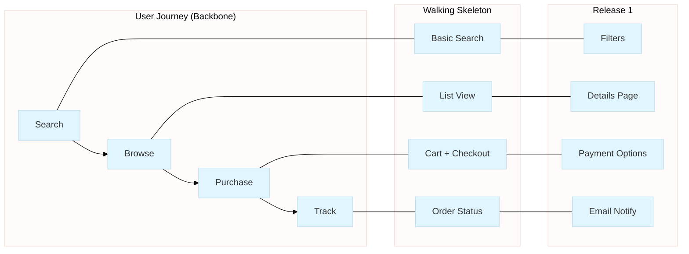

# User Story Mapping

User Story Mapping is Jeff Patton's technique for organizing user stories into a visual map that shows the complete user experience and helps slice work into releases.

## When to Use This Skill

**Keywords:** story map, user story map, backbone, walking skeleton, MVP, release planning, user journey, story slicing, Jeff Patton, Agile discovery

**Use this skill when:**

- Organizing elicited requirements into deliverable increments
- Defining MVP scope from a large set of requirements
- Visualizing the user journey across features
- Planning releases with clear user value
- Slicing large epics into shippable stories
- Communicating product vision to stakeholders

## Core Concepts

### The Map Structure

```text
TIME / USER JOURNEY →
─────────────────────────────────────────────────────────────────
BACKBONE (Activities)   │  Search   │  Browse   │  Purchase  │  Track
                        │           │           │            │
─────────────────────────────────────────────────────────────────
WALKING SKELETON        │  Basic    │  List     │  Cart +    │  Order
(Minimum Path)          │  Search   │  View     │  Checkout  │  Status
─────────────────────────────────────────────────────────────────
Release 1               │  Filters  │  Details  │  Payment   │  Email
                        │           │  Page     │  Options   │  Notify
─────────────────────────────────────────────────────────────────
Release 2               │  Saved    │  Compare  │  Wishlist  │  Tracking
                        │  Searches │  Items    │            │  Map
─────────────────────────────────────────────────────────────────
Release 3 (Nice-to-have)│  AI       │  AR       │  One-Click │  Delivery
                        │  Suggest  │  Preview  │  Buy       │  Photos
```

### Key Elements

| Element | Description |
| ------- | ----------- |
| **Backbone** | High-level user activities in sequence (left-to-right = time) |
| **Walking Skeleton** | Minimum functionality for each activity (first viable path) |
| **User Tasks** | Stories under each activity, ordered by priority (top-to-bottom) |
| **Release Slices** | Horizontal lines grouping stories into releases |
| **Personas** | Different user types may have different paths |

## Creating a Story Map

### Step 1: Define the Backbone

Identify high-level activities the user performs:

```yaml
backbone_questions:
  - "What does the user do first?"
  - "What happens next in their journey?"
  - "What are all the major activities?"
  - "Is there a natural sequence or flow?"
```

### Step 2: Identify the Walking Skeleton

For each backbone activity, what's the minimum viable implementation?

```yaml
walking_skeleton_criteria:
  - Enables the user to complete the activity (barely)
  - End-to-end slice through the system
  - Testable and demonstrable
  - Foundation for incremental enhancement
```

### Step 3: Fill in User Tasks

Under each activity, list user tasks/stories:

```yaml
task_placement:
  vertical_order: "Priority (most important at top)"
  horizontal_alignment: "Which activity does this belong to?"
  dependencies: "Does this need something from another column?"
```

### Step 4: Draw Release Slices

Group stories into releases with clear user value:

```yaml
release_criteria:
  release_1_mvp:
    - Walking skeleton + minimal enhancements
    - "What can we build and ship first?"
    - Validates core value proposition

  release_2:
    - Improves on MVP based on feedback
    - Adds important but not critical features

  future_releases:
    - Nice-to-have features
    - Competitive differentiation
    - Edge cases and polish
```

## Output Formats

### Mermaid Diagram (Default)

The `/story-map` command generates Mermaid flowcharts:



### YAML Export

```yaml
story_map:
  title: "E-commerce Platform"
  personas: ["shopper", "power-user"]

  backbone:
    - id: search
      name: "Search Products"
      walking_skeleton: "Basic keyword search"

    - id: browse
      name: "Browse Catalog"
      walking_skeleton: "List view with thumbnails"

  releases:
    - name: "MVP"
      stories:
        - activity: search
          stories: ["Basic Search", "Filters"]
        - activity: browse
          stories: ["List View", "Details Page"]
```

## Integration with Elicitation

### From Elicited Requirements

```text
1. Load synthesized requirements from /discover
2. Identify user activities from functional requirements
3. Map requirements to backbone activities
4. Prioritize within each activity
5. Slice into releases
```

### Workflow

```bash
# Elicit requirements first
/requirements-elicitation:discover "e-commerce platform"

# Create story map from requirements
/requirements-elicitation:story-map --domain "e-commerce"

# Export map to visualization
/requirements-elicitation:story-map --domain "e-commerce" --format mermaid
```

## Best Practices

### DO

- Include stakeholders in mapping sessions
- Keep backbone at 5-10 activities
- Make walking skeleton truly minimal
- Slice releases for user value, not technical convenience
- Revisit and update as you learn

### DON'T

- Over-detail the map initially
- Organize by technical layer (UI, API, DB)
- Skip the walking skeleton (it's the foundation)
- Make releases too large
- Treat the map as immutable

## Related Commands

- `/story-map` - Generate story maps from elicited requirements
- `/journey-map` - Customer journey visualization (complementary)
- `/discover` - Elicit requirements before mapping
- `/gaps` - Check for missing coverage

## References

**For detailed guidance:**

- [Mapping Techniques](references/mapping-techniques.md) - Detailed mapping workflows
- [Release Planning](references/release-planning.md) - Slicing strategies and MVP definition

**External:**

- Jeff Patton's "User Story Mapping" book
- [jpattonassociates.com](https://jpattonassociates.com)

## Version History

- v1.0.0 (2025-12-26): Initial release - User Story Mapping skill

---

**Last Updated:** 2025-12-26
