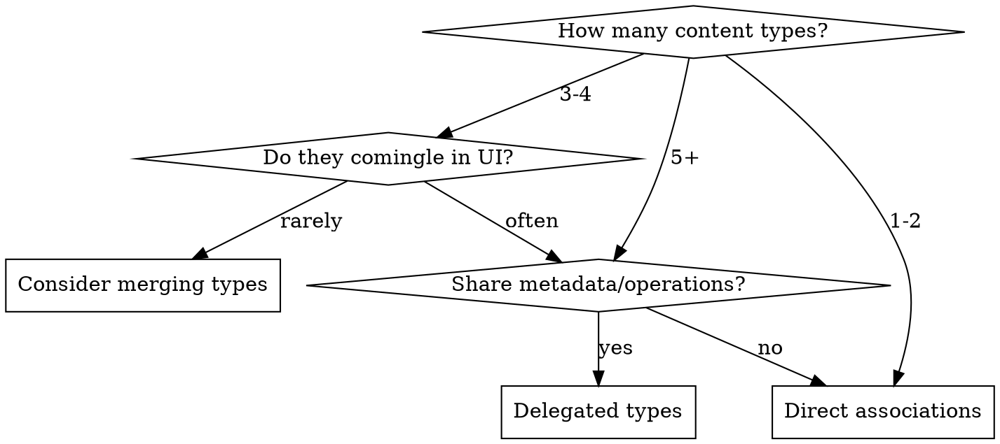

# Delegated Types (Recording/Recordable Pattern)

A container model (Recording) unifies many content types (Recordables) that share metadata, access control, and operations.

**Core insight:** When many content types must comingle and share behavior, create a unified container rather than duplicating metadata or using complex polymorphic queries.

## When to Use

**Use when:**
- 5+ content types (Messages, Documents, Uploads, Comments, etc.)
- Types appear together in feeds, timelines, activity streams
- Shared metadata: project, creator, timestamps, access control
- Common operations: copy, move, archive, search across all types
- Single query needed: "all content in project X sorted by date"

**Don't use when:**
- Only 1-3 types (use direct associations)
- Types are similar enough to merge (see flattening.md)
- Types don't comingle in UI
- No shared metadata or operations

## Quick Reference

| Decision | Answer |
|----------|--------|
| 1-2 content types | Direct associations |
| 3-4 types, rarely comingle | Consider merging or direct |
| 3-4 types, often comingle | Maybe delegated types |
| 5+ types, shared metadata | Delegated types |
| Only 1 type left | Flatten (see flattening.md) |
| Container adds no value | Flatten |

## Difference from Simple Polymorphic

| Aspect | Simple Polymorphic | Delegated Types |
|--------|-------------------|-----------------|
| Query target | Each concrete type | Recording (container) |
| Shared metadata | Duplicated in each table | Once in Recording |
| Pagination | Complex (merge in Ruby) | Natural (query Recording) |
| Access control | Per-type | On Recording |

## Sub-Documents

- **implementing.md** - Two-layer pattern (Bucket + Recording), schema, models, querying
- **flattening.md** - When to remove delegated types, PR 445 example, signals

## Real-World Usage

**Basecamp uses this for:** Messages, Documents, Uploads, Comments, Todos - unified project timeline with shared access control and operations.

**Fizzy removed it:** When only Comments remained after merging EventSummary (see flattening.md).
