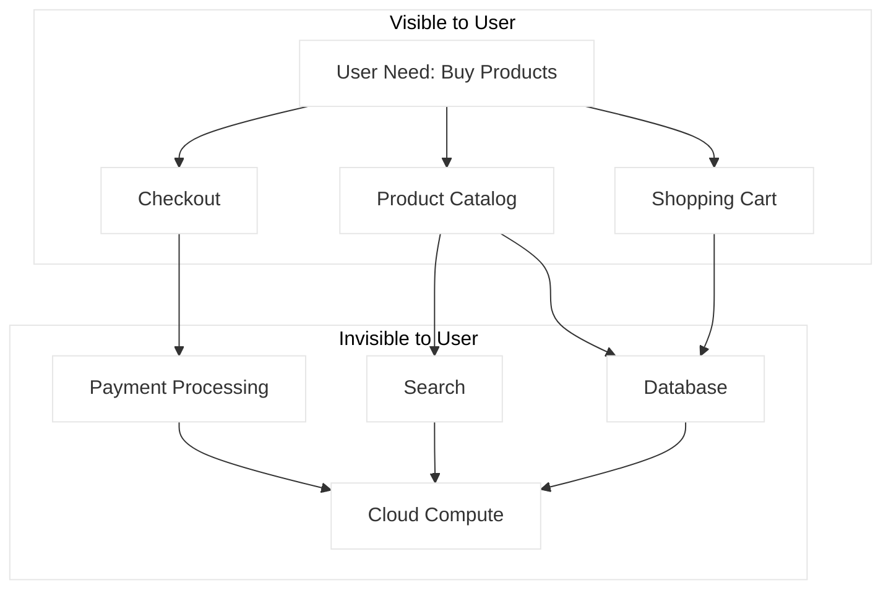

# Wardley Map Creation Skill

Create Wardley Maps to visualize value chains and component evolution for strategic planning.

## When to Use This Skill

Use this skill when:

- **Wardley Map Creation tasks** - Working on create wardley maps from value chains and user needs
- **Planning or design** - Need guidance on Wardley Map Creation approaches
- **Best practices** - Want to follow established patterns and standards

## MANDATORY: Documentation-First Approach

Before creating Wardley Maps:

1. **Invoke `docs-management` skill** for mapping patterns
2. **Verify Wardley mapping methodology** via MCP servers (perplexity)
3. **Base guidance on Simon Wardley's original methodology**

## Wardley Map Fundamentals

```text
Wardley Map Structure:

                    VISIBLE TO USER
    ┌──────────────────────────────────────────────────────────┐
    │  User Need                                                │
    │    ○                                                      │
    │     \                                                     │
    │      ○ Component A                                        │
    │       \                                                   │
    │        ○ Component B ──── ○ Component C                   │
    │         \                  \                              │
    │          ○ Component D      ○ Component E                 │
    │                              \                            │
    │                               ○ Component F               │
    │                                                           │
    └──────────────────────────────────────────────────────────┘
                    INVISIBLE TO USER

    ◄──────────────────────────────────────────────────────────►
    Genesis      Custom-Built      Product/Rental      Commodity
    (I)          (II)              (III)               (IV)

    EVOLUTION AXIS ──────────────────────────────────────────────►
```

## Evolution Stages

| Stage | Characteristics | Examples |
|-------|-----------------|----------|
| **Genesis (I)** | Unique, poorly understood, rare, uncertain, changing | New AI capabilities, novel algorithms |
| **Custom-Built (II)** | Uncommon, understood by few, growing, best practice emerging | Custom integrations, bespoke solutions |
| **Product (III)** | Common, understood, stable, best practice known | Commercial software, SaaS platforms |
| **Commodity (IV)** | Ubiquitous, standardized, certain, utility-like | Cloud compute, electricity, bandwidth |

## Evolution Properties

```text
Properties Change Along Evolution Axis:

                Genesis ────────────────────────► Commodity

Ubiquity:       Rare ──────────────────────────► Everywhere
Certainty:      Uncertain ─────────────────────► Certain
Failure:        High ──────────────────────────► Low
Market:         Undefined ─────────────────────► Defined
Knowledge:      Uncertain ─────────────────────► Known
User perception: Chaotic ──────────────────────► Ordered
Focus:          Exploration ───────────────────► Exploitation
```

## Map Creation Process

### Step 1: Identify User Need

Start with the user's actual need (not a solution):

```text
Good User Needs:
- "I need to process customer payments"
- "I need to communicate with my team"
- "I need to deploy software to production"

Bad (Solution-focused):
- "I need Stripe" (solution, not need)
- "I need Slack" (solution, not need)
- "I need Kubernetes" (solution, not need)
```

### Step 2: Build Value Chain

Work backwards from user need to dependencies:

```text
Example: E-commerce Platform

User Need: "Buy products online"
    │
    ├── Product Catalog
    │       ├── Search
    │       ├── Product Data
    │       └── Images
    │
    ├── Shopping Cart
    │       ├── Session Management
    │       └── Pricing Engine
    │
    ├── Checkout
    │       ├── Payment Processing
    │       ├── Address Validation
    │       └── Tax Calculation
    │
    └── Order Fulfillment
            ├── Inventory
            ├── Shipping
            └── Notifications
```

### Step 3: Position Components

Place each component on the evolution axis:

| Component | Evolution Stage | Rationale |
|-----------|-----------------|-----------|
| Product Catalog | Product | Many commercial options |
| Search | Commodity | Elasticsearch, Algolia commoditized |
| Payment Processing | Commodity | Stripe, PayPal utilities |
| Pricing Engine | Custom | Business-specific rules |
| AI Recommendations | Genesis | Still evolving rapidly |

### Step 4: Add Dependencies

Draw links showing dependencies:

```text
Dependency Rules:
- Higher components depend on lower
- Arrows flow down and to the right
- Visible components near top
- Infrastructure components near bottom
```

### Step 5: Annotate Movement

Add evolution indicators:

```text
Movement Notation:
○────► Moving right (commoditizing)
○◄──── Moving left (rare, usually wrong)
○ ∿ ∿ Inertia (resistance to change)
○ !! Warning/concern
```

## Wardley Map in Mermaid (Approximate)



## Text-Based Map Notation

For precise Wardley Maps, use Online Wardley Maps (OWM) notation:

```text
title E-commerce Platform

anchor User [0.95, 0.70]
component Product Catalog [0.82, 0.65] label [-10, -10]
component Shopping Cart [0.75, 0.55] label [10, -10]
component Checkout [0.70, 0.60] label [10, 10]
component Search [0.60, 0.85] label [-10, -10]
component Payment Processing [0.45, 0.90] label [-20, 10]
component Database [0.35, 0.75] label [10, 10]
component Cloud Compute [0.20, 0.95] label [-10, 10]

User->Product Catalog
User->Shopping Cart
User->Checkout
Product Catalog->Search
Product Catalog->Database
Shopping Cart->Database
Checkout->Payment Processing
Payment Processing->Cloud Compute
Search->Cloud Compute
Database->Cloud Compute

evolve Payment Processing 0.95

note Custom pricing engine at 0.55, 0.35 [business differentiator]
```

## Component Positioning Guide

### Visibility (Y-axis)

| Position | Component Type |
|----------|----------------|
| 0.90-1.00 | Direct user interaction |
| 0.70-0.89 | User-facing features |
| 0.50-0.69 | Application services |
| 0.30-0.49 | Platform/infrastructure |
| 0.10-0.29 | Utilities |
| 0.00-0.09 | Raw resources |

### Evolution (X-axis)

| Position | Stage |
|----------|-------|
| 0.00-0.17 | Genesis |
| 0.18-0.40 | Custom |
| 0.41-0.70 | Product |
| 0.71-1.00 | Commodity |

## Common Mapping Patterns

### Pioneer-Settler-Town Planner

```text
Pioneers: Genesis → Custom
- Explore new territory
- High failure tolerance
- Focus on innovation

Settlers: Custom → Product
- Take pioneer discoveries
- Make them useful
- Focus on product-market fit

Town Planners: Product → Commodity
- Industrialize at scale
- Focus on efficiency
- Volume and margins
```

### Identifying Anchors

```text
Anchor: User needs or market expectations that don't change

Good anchors:
- "Communicate with customers" (stable need)
- "Process transactions" (stable need)

Bad anchors:
- "Use email" (solution, will evolve)
- "Use SQL database" (technology, will evolve)
```

## Workflow

When creating Wardley Maps:

1. **Start with Purpose**: What decision are you trying to make?
2. **Identify Users**: Who are you mapping for?
3. **Define Needs**: What do users actually need?
4. **Build Chain**: Map components from need to dependencies
5. **Position Components**: Place on evolution axis
6. **Add Movement**: Show evolution direction
7. **Identify Opportunities**: Find strategic options
8. **Iterate**: Maps improve with understanding

## Output Template

```markdown
# Wardley Map: [Context]

## Purpose
[What strategic question is this map answering?]

## Scope
[What boundaries define this map?]

## User Need
[The anchor need at the top of the map]

## Map
[OWM notation or diagram]

## Key Components

| Component | Position | Evolution | Notes |
|-----------|----------|-----------|-------|
| [Name] | [y, x] | [stage] | [observations] |

## Movement
[Components evolving and direction]

## Strategic Observations
[What the map reveals]

## Questions Raised
[What needs further exploration]
```

## References

For detailed guidance:

---

**Last Updated:** 2025-12-26
