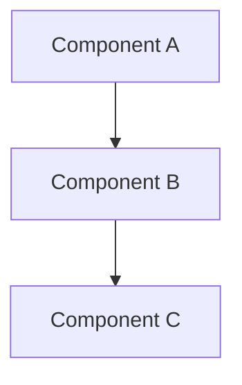
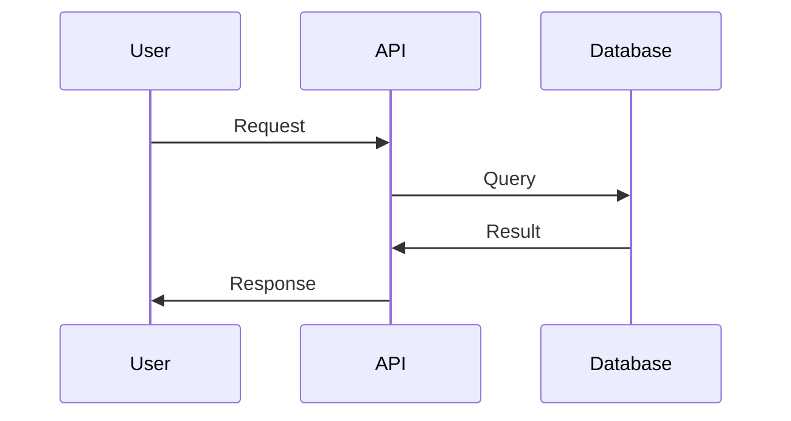

# Document Templates

Generate structured documents based on best practices and industry standards.

## Quick Start

Ask for a template by type:
- "Generate a meeting prep sheet"
- "Create an ADR for [decision]"
- "Generate a Design Doc for [feature]"

Templates are self-contained - no external files needed.

## Available Templates

### 1. Meeting Preparation Sheet

**When to use**: Planning decision meetings, consultations, or information sharing sessions

**What it includes**:
- Meeting purpose classification
- Decision materials (background, problem, constraints)
- Options comparison table
- Recommendation framework

**Usage**: "Generate a meeting prep sheet for [decision/consultation/sharing]"

**Template**:

```markdown
## Meeting Preparation Sheet

### Basic Information
- Meeting Purpose: [ ] Decision / [ ] Consultation / [ ] Information Sharing
- Participants:
- Duration: (minutes)
- Date: YYYY-MM-DD

### 1. Decision Materials

#### Background
- [Why is this meeting necessary?]
- [Current situation]

#### Problem
- [What problem needs to be solved?]
- [What decision needs to be made?]

#### Constraints
- Budget: [amount or "unlimited"]
- Timeline: [deadline]
- Resources: [team size, skills available]
- Compliance: [regulations, standards]

### 2. Options

| Option | Pros | Cons | Timeline | Cost |
|--------|------|------|----------|------|
| A:     |      |      |          |      |
| B:     |      |      |          |      |
| C:     |      |      |          |      |

### 3. Recommendation

Recommended: [Option X]

Reasons:
1. [Specific reason with evidence]
2. [Specific reason with evidence]
3. [Specific reason with evidence]

### 4. Preparation Checklist

Before the meeting:
- [ ] All participants have received background materials
- [ ] Options are clearly defined with pros/cons
- [ ] Decision criteria are explicit
- [ ] Time allocation is planned (discussion: X min, decision: Y min)
- [ ] Follow-up actions are identified

### 5. Expected Outcomes

- [ ] Decision on [topic]
- [ ] Action items assigned
- [ ] Next steps defined
```

---

### 2. ADR (Architecture Decision Record)

**When to use**: Documenting significant technical decisions that affect architecture, technology choices, or system design

**What it includes**:
- Decision context and problem statement
- Considered alternatives with trade-offs
- Decision rationale
- Consequences (positive and negative)

**Usage**: "Create an ADR for [decision title]"

**Best practices**:
- Avoid vague expressions ("適切に", "柔軟に", "効率的に")
- Include specific trade-off analysis
- Document both positive and negative consequences
- Provide concrete examples and metrics

**Template**:

```markdown
# ADR-XXX: [Decision Title]

**Date**: YYYY-MM-DD
**Status**: Proposed / Accepted / Rejected / Superseded
**Deciders**: [List of people involved in decision]

## Context

### Background
[Why is this decision necessary?]
[What is the current situation?]

### Problem Statement
[What specific problem needs to be solved?]
[What are the requirements?]

## Decision

[What was decided? State in 1-2 clear sentences]

## Considered Alternatives

### Option A: [Name]

**Pros**:
- [Specific advantage with evidence/metrics]
- [Specific advantage with evidence/metrics]

**Cons**:
- [Specific disadvantage with impact]
- [Specific disadvantage with impact]

**Cost**: [Initial + Ongoing costs]
**Timeline**: [Implementation time]

### Option B: [Name]

**Pros**:
- [Specific advantage]
- [Specific advantage]

**Cons**:
- [Specific disadvantage]
- [Specific disadvantage]

**Cost**: [Initial + Ongoing costs]
**Timeline**: [Implementation time]

### Option C: [Name]

[Same structure as above]

## Decision Rationale

[Why was this option chosen over alternatives?]

**Key factors**:
1. [Factor with specific reasoning]
2. [Factor with specific reasoning]
3. [Factor with specific reasoning]

**Trade-offs accepted**:
- [What we're giving up and why it's acceptable]

## Consequences

### Positive
- [Specific positive impact]
- [Specific positive impact]

### Negative
- [Specific negative impact and mitigation plan]
- [Specific negative impact and mitigation plan]

### Neutral
- [Changes that are neither clearly positive nor negative]

## Implementation Notes

[How will this decision be implemented?]
[Any migration plan needed?]

## Related Decisions

- ADR-XXX: [Related decision]
- [Links to related documentation]

## Review Date

[When should this decision be revisited?]

---

## Checklist

Before finalizing:
- [ ] All alternatives are documented with pros/cons
- [ ] Decision rationale is specific and evidence-based
- [ ] Both positive and negative consequences are listed
- [ ] No vague expressions (check for "適切に", "柔軟に", etc.)
- [ ] Concrete metrics or examples are provided
- [ ] Related decisions are linked
```

---

### 3. Design Document

**When to use**: Designing new features, major refactorings, or system changes that require detailed planning

**What it includes**:
- Feature overview and goals
- Detailed design with architecture diagrams
- Alternatives considered
- Implementation and testing plan
- Rollout strategy

**Usage**: "Generate a Design Doc for [feature name]"

**Best practices**:
- Use diagrams (Mermaid recommended)
- Include concrete examples and use cases
- Define measurable success criteria
- Document risks and mitigation

**Template**:

```markdown
# [Feature Name] Design Document

**Author**: [Name]
**Date**: YYYY-MM-DD
**Reviewers**: [Names]
**Status**: Draft / In Review / Approved
**Last Updated**: YYYY-MM-DD

## Overview

[3-sentence summary of the feature]

**TL;DR**: [One sentence describing the feature and its value]

## Background

### Context
[Why is this feature needed?]
[What problem does it solve?]

### Current State
[What is the current situation?]
[What are the pain points?]

## Goals and Non-Goals

### Goals
- [Specific, measurable goal]
- [Specific, measurable goal]
- [Specific, measurable goal]

### Non-Goals
- [What this design explicitly does NOT aim to do]
- [What is out of scope]

### Success Metrics
- [Measurable metric: e.g., "Reduce latency to <200ms"]
- [Measurable metric: e.g., "Handle 10K requests/sec"]
- [Measurable metric: e.g., "99.9% uptime"]

## Detailed Design

### Architecture Overview



[Description of architecture]

### Components

#### Component 1: [Name]
**Responsibility**: [What it does]
**Technology**: [Tech stack]
**API**: [Key interfaces]

#### Component 2: [Name]
[Same structure]

### API Design

#### Endpoint 1
```http
POST /api/v1/resource
Content-Type: application/json

{
  "field": "value"
}
```

**Response**:
```json
{
  "id": "123",
  "status": "created"
}
```

### Data Model

```sql
CREATE TABLE resources (
  id UUID PRIMARY KEY,
  name VARCHAR(255),
  created_at TIMESTAMP
);
```

### Data Flow



### Security Considerations

- [Authentication/Authorization approach]
- [Data encryption (at rest, in transit)]
- [Input validation]
- [Rate limiting]

## Alternatives Considered

### Alternative 1: [Name]

**Description**: [Brief description]

**Pros**:
- [Advantage]
- [Advantage]

**Cons**:
- [Disadvantage]
- [Disadvantage]

**Why not chosen**: [Specific reason]

### Alternative 2: [Name]
[Same structure]

## Implementation Plan

### Phase 1: [Name] (Week 1-2)
- [ ] Task 1
- [ ] Task 2
- [ ] Task 3

### Phase 2: [Name] (Week 3-4)
- [ ] Task 1
- [ ] Task 2

### Dependencies
- [External dependency 1]
- [External dependency 2]

## Testing Strategy

### Unit Tests
- [What will be unit tested]
- [Target coverage: e.g., 80%]

### Integration Tests
- [What will be integration tested]
- [Test scenarios]

### End-to-End Tests
- [Critical user flows]

### Performance Tests
- [Load testing plan]
- [Expected metrics]

## Rollout Plan

### Stage 1: Internal Testing (Week 1)
- Deploy to staging
- Internal dogfooding
- Performance validation

### Stage 2: Beta Release (Week 2)
- 10% of users
- Feature flag: `enable_new_feature`
- Monitoring dashboard

### Stage 3: General Availability (Week 3)
- 100% rollout
- Monitoring and alerts

### Rollback Plan
[How to rollback if issues arise]

## Risks and Mitigation

| Risk | Probability | Impact | Mitigation |
|------|------------|--------|------------|
| [Risk 1] | High/Medium/Low | High/Medium/Low | [Mitigation strategy] |
| [Risk 2] | High/Medium/Low | High/Medium/Low | [Mitigation strategy] |

## Open Questions

- [ ] Question 1: [Unresolved item requiring discussion]
- [ ] Question 2: [Unresolved item requiring discussion]

## Appendix

### References
- [Related design docs]
- [External documentation]
- [Research papers]

### Glossary
- **Term 1**: Definition
- **Term 2**: Definition

---

## Checklist

Before review:
- [ ] All sections are complete
- [ ] Architecture diagrams are included
- [ ] API examples are concrete and executable
- [ ] Success metrics are measurable
- [ ] Alternatives are documented with reasoning
- [ ] Security considerations are addressed
- [ ] Testing strategy is comprehensive
- [ ] Rollout plan includes monitoring and rollback
```

---

## Usage Examples

### Example 1: Meeting Prep

**Request**: "Generate a meeting prep sheet for deciding on database technology"

**Output**: Complete meeting prep sheet with:
- Purpose: Decision
- Decision materials section for database context
- Options table for PostgreSQL/MongoDB/etc.
- Recommendation framework

### Example 2: ADR

**Request**: "Create an ADR for adopting PostgreSQL"

**Output**: Complete ADR with:
- Context about database requirements
- Alternatives (PostgreSQL, MongoDB, MySQL, DynamoDB)
- Trade-off analysis
- Decision rationale with specific metrics
- Consequences (positive: ACID compliance; negative: higher ops complexity)

### Example 3: Design Doc

**Request**: "Generate a Design Doc for user authentication system"

**Output**: Complete Design Doc with:
- Overview of authentication needs
- Architecture with JWT tokens
- API design for login/logout/refresh
- Security considerations
- Implementation phases
- Testing strategy

## Best Practices

### Do
- Fill in all sections (don't leave placeholders)
- Use specific, measurable criteria
- Include concrete examples
- Provide diagrams for complex systems
- Document trade-offs explicitly

### Don't
- Use vague expressions ("適切に", "柔軟に", "効率的に")
- Skip alternatives analysis
- Omit negative consequences
- Leave questions unresolved without noting them
- Copy-paste without customization

## Integration with Other Skills

This skill works with:
- `document-quality`: Auto-reviews generated documents
- `tech-doc-reviewer`: Provides detailed feedback
- `principle-guide`: Helps make decisions for ADRs

## Success Criteria

A well-generated document has:
- Complete sections (no TODOs)
- Specific, actionable content
- Concrete examples and metrics
- Trade-offs explicitly documented
- Clear next steps
