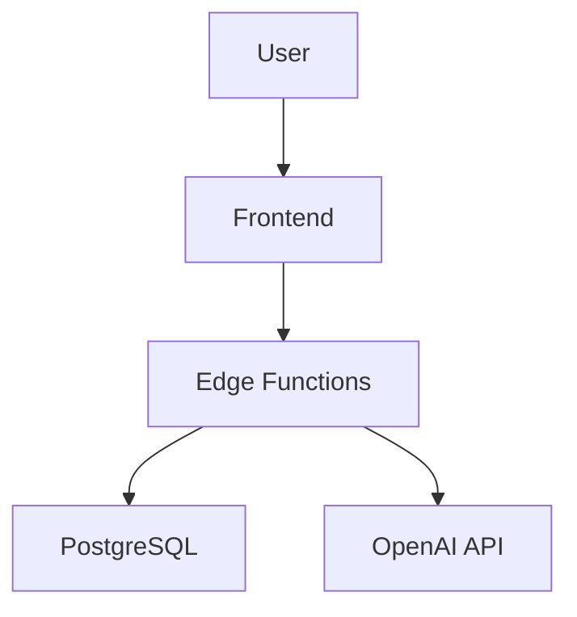
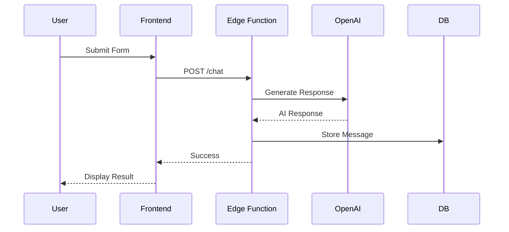
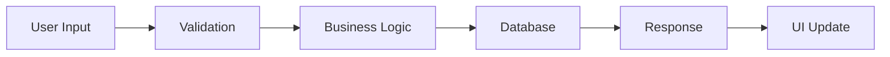

# Docs-Architect Skill

## Purpose

Generate comprehensive technical documentation that serves as the definitive reference for systems. Creates both short-form guides (001-009 numbered sets) and long-form technical manuals (10-100+ pages) suitable for onboarding, architectural reviews, and long-term maintenance.

**Core Approach**: Explain both the "what" (implementation) and the "why" (design decisions).

---

## Quick Start

### Short-Form Documentation (9-Document Set)
```
Use docs-architect to generate MVP documentation set
```

### Long-Form Documentation (Technical Manual)
```
Use docs-architect to create comprehensive technical documentation
Use docs-architect to document the architecture and design decisions
```

### Single Document
```
Use docs-architect to create architecture overview
Use docs-architect to document the security model
```

---

## Documentation Process

### Phase 1: Discovery

**Analyze the system**:
- Read codebase structure and dependencies
- Identify key components and their relationships
- Extract design patterns and architectural decisions
- Map data flows and integration points
- Review existing docs (CLAUDE.md, PRDs, schemas)

**Commands to run**:
```bash
# Analyze structure
ls -R src/ supabase/
grep -r "export" src/components/
grep -r "CREATE TABLE" supabase/migrations/

# Read key files
cat CLAUDE.md
cat package.json
ls supabase/functions/
```

### Phase 2: Structuring

**Organize information**:
- Create logical chapter/section hierarchy
- Design progressive disclosure of complexity
- Plan diagrams and visual aids
- Establish consistent terminology

**Output**: Table of contents with section purposes

### Phase 3: Writing

**Generate documentation**:
- Start with executive summary (one-page overview)
- Progress from high-level architecture to implementation details
- Include rationale for design decisions (the "why")
- Add code examples with thorough explanations
- Use file_path:line_number format for code references

---

## Documentation Types

### Short-Form: 9-Document Set

**Best for**: Quick reference, onboarding, checklists
**Length**: 2-5 pages per document
**Format**: Numbered sequence (001-009)

| No. | Document | Purpose |
|-----|----------|---------|
| 001 | Overview | Executive summary, goals, vision, scope |
| 002 | Architecture | System design, components, diagrams, flows |
| 003 | Setup Guide | Environment setup, tools, dependencies |
| 004 | Core Features | Core functionality, logic, code patterns |
| 005 | Data Models | Schema design, data flow, relationships |
| 006 | Integration Points | APIs, events, external dependencies |
| 007 | Best Practices | Standards, naming, security, performance |
| 008 | Success Criteria | Metrics, functional goals, validation |
| 009 | Workflow Checklist | Task tracking, testing, deployment steps |

### Long-Form: Technical Manual

**Best for**: Comprehensive reference, architecture reviews, knowledge transfer
**Length**: 10-100+ pages
**Format**: Chapter-based with deep technical detail

**Key Chapters**:
1. Executive Summary (1 page for stakeholders)
2. Architecture Overview (system boundaries, key components)
3. Design Decisions (rationale behind architectural choices)
4. Core Components (deep dive into each major module)
5. Data Models (schema design, data flow documentation)
6. Integration Points (APIs, events, external dependencies)
7. Deployment Architecture (infrastructure, operational considerations)
8. Performance Characteristics (bottlenecks, optimizations, benchmarks)
9. Security Model (authentication, authorization, data protection)
10. Appendices (glossary, references, detailed specifications)

---

## Document Structure

### Every Document Must Include

#### 1. Executive Summary
- One-paragraph overview
- Who, what, why, when
- Key takeaways

#### 2. Purpose Statement
- What this document covers
- Why it matters
- Who should read it

#### 3. Core Content
**Short-form**: Steps, examples, diagrams
**Long-form**: Chapters with progressive complexity

#### 4. Visual Aids
- Mermaid diagrams (architecture, sequence, flow)
- Tables for structured data
- Code examples with file paths

#### 5. Design Rationale
- Why this approach was chosen
- Alternatives considered
- Trade-offs made

#### 6. Implementation Guide
- How to use/build the system
- Code examples from actual codebase
- Common pitfalls and solutions

#### 7. Validation Criteria
- How to verify correctness
- Success metrics
- Testing procedures

---

## Templates

### Short-Form Template (002-architecture.md)

```markdown
# System Architecture

## Executive Summary
[One paragraph: what the system is, key components, main flow]

## Purpose
[Why we need this architecture, what problems it solves]

## System Boundaries
**In Scope**: [What the system includes]
**Out of Scope**: [What's excluded or delegated]

## Key Components
1. **Frontend** (src/components/, src/pages/)
   - React + TypeScript + Vite
   - Rationale: Fast builds, modern DX, type safety

2. **Backend** (supabase/functions/)
   - Supabase Edge Functions
   - Rationale: Serverless, integrated with DB, secure API key handling

3. **Database** (supabase/migrations/)
   - PostgreSQL via Supabase
   - Rationale: Strong typing, RLS, real-time capabilities

## Architecture Diagram
\`\`\`mermaid
graph TB
    User[User] --> Frontend[React App]
    Frontend --> EdgeFn[Edge Functions]
    EdgeFn --> DB[Supabase DB]
    EdgeFn --> AI[OpenAI API]
    DB --> RLS[RLS Policies]
\`\`\`

## Data Flow
1. User interacts with React frontend
2. Frontend calls Edge Function (secure)
3. Edge Function validates JWT token
4. Edge Function queries database (RLS enforced)
5. Response returned to frontend
6. UI updates reactively

## Design Decisions

### Why Edge Functions vs. Direct Client Calls?
**Decision**: Proxy AI API calls through Edge Functions
**Rationale**:
- API keys never exposed to browser
- Server-side validation and rate limiting
- Centralized logging and monitoring

**Alternatives Considered**:
- Direct client calls ❌ (security risk)
- Traditional backend ❌ (more infrastructure)

### Why Supabase vs. Custom Backend?
**Decision**: Use Supabase for backend
**Rationale**:
- Built-in auth with JWT
- Row-Level Security (RLS) for data isolation
- Real-time subscriptions
- Edge Functions for custom logic

## Implementation Tips
- Always enable RLS on tables (supabase/migrations/)
- Use profile_id (not user_id) for foreign keys
- Test migrations locally before pushing
- Keep Edge Functions under 10MB

## File References
- Database schema: supabase/migrations/
- Edge Functions: supabase/functions/chat/index.ts
- Frontend components: src/components/
- API client: src/lib/apiClient.ts

## Validation
✅ RLS enabled on all tables
✅ No API keys in frontend code
✅ Edge Functions deployed
✅ TypeScript compiles with no errors
```

### Long-Form Template (Chapter 3: Design Decisions)

```markdown
# Chapter 3: Design Decisions

## Overview
This chapter explains the architectural choices made during development, the rationale behind them, and the alternatives that were considered.

## 3.1 Frontend Architecture

### React + TypeScript + Vite

**Decision**: Use React with TypeScript and Vite for the frontend

**Rationale**:
- **React**: Component-based architecture enables reusability
- **TypeScript**: Catches errors at compile-time, improves maintainability
- **Vite**: 10x faster builds than Webpack, better DX

**Alternatives Considered**:
1. **Vue.js** ❌
   - Pros: Simpler learning curve
   - Cons: Smaller ecosystem, team has React experience

2. **Next.js** ❌
   - Pros: SSR built-in, better SEO
   - Cons: Overkill for SPA, Supabase handles backend

**Trade-offs**:
- ✅ Fast development with hot reload
- ✅ Strong typing catches bugs early
- ❌ Larger bundle size than vanilla JS
- ❌ Build step required (not issue for modern apps)

**Evidence**: Build time reduced from 45s (Webpack) to 3s (Vite)

## 3.2 Authentication Strategy

### JWT + Row-Level Security (RLS)

**Decision**: Use Supabase Auth with JWT tokens and PostgreSQL RLS policies

**Rationale**:
- **JWT tokens**: Stateless, scalable, no session storage needed
- **RLS**: Database enforces access control, no authorization bugs in app code
- **Supabase Auth**: Handles OAuth, magic links, email verification

**Alternatives Considered**:
1. **Custom Auth with Sessions** ❌
   - Pros: Full control
   - Cons: More code, security risks, session management complexity

2. **Auth0** ❌
   - Pros: Battle-tested, feature-rich
   - Cons: Additional cost, vendor lock-in, Supabase already has auth

**Implementation Details**:
- JWT stored in httpOnly cookie (XSS protection)
- RLS policies check auth.uid() = profile_id
- Token refresh handled automatically by Supabase client

**Code Example** (src/lib/supabase.ts):
```typescript
// JWT automatically included in requests
const { data } = await supabase
  .from('presentations')
  .select('*')
// RLS policy ensures user only sees their own data
```

**Validation**:
- ✅ No way to access other users' data
- ✅ Tokens expire after 1 hour (security)
- ✅ Refresh tokens allow seamless re-auth

---

[Continue with sections 3.3, 3.4, etc. for each major decision]
```

---

## Best Practices

### Writing Style
- **Clear and precise**: Avoid jargon unless defined in glossary
- **Progressive complexity**: Start simple, add detail gradually
- **Active voice**: "The system validates..." not "Validation is performed..."
- **Concrete examples**: Use real code from the project

### Documentation Architecture
- **Reading paths**: Provide guidance for different audiences
  - Developers: Start with 003-setup-guide.md → 004-core-features.md
  - Architects: Start with 002-architecture.md → Design Decisions chapter
  - Operations: Start with Deployment Architecture → Security Model

### Visual Communication
- **Diagrams for every flow**: Architecture, sequence, data flow
- **Tables for comparisons**: Alternatives, trade-offs, configurations
- **Code blocks with context**: Include file paths, line numbers

### Maintenance
- **Update docs with code changes**: Documentation is part of the codebase
- **Version numbers**: Increment when making updates
- **Changelog section**: Track major changes over time

### Cross-References
```markdown
✅ Good: "See src/lib/apiClient.ts:45-67 for implementation"
✅ Good: "Refer to [002-architecture.md](002-architecture.md#security-model)"
❌ Bad: "See the code for details"
```

---

## Mermaid Diagram Types

### System Architecture


### Sequence Diagram


### Data Flow


---

## Generation Workflow

### Step 1: Create Output Directory
```bash
mkdir -p docs/mvp  # Short-form
mkdir -p docs/technical-manual  # Long-form
```

### Step 2: Analyze Codebase
- Read project structure
- Review CLAUDE.md
- Check migrations, functions, components
- Identify design patterns

### Step 3: Generate Documentation
**Sequential order** (each builds on previous):
1. Overview/Executive Summary
2. Architecture
3. Design Decisions
4. Implementation Details
5. Validation Criteria

### Step 4: Add Cross-References
Link related sections and code files

### Step 5: Validate
- [ ] All sections complete
- [ ] Diagrams render correctly
- [ ] Code examples tested
- [ ] File paths accurate
- [ ] Design rationale included

---

## Validation Checklist

### Short-Form (9 Documents)
- [ ] All 9 documents exist
- [ ] Each has executive summary
- [ ] Design rationale explained
- [ ] Code examples from actual project
- [ ] Mermaid diagrams render
- [ ] Cross-references work
- [ ] File paths use format: `file_path:line_number`

### Long-Form (Technical Manual)
- [ ] Executive summary (1 page)
- [ ] Chapter structure logical
- [ ] Design decisions documented with rationale
- [ ] Alternatives considered for major choices
- [ ] Trade-offs explained
- [ ] Performance characteristics documented
- [ ] Security model detailed
- [ ] Glossary of terms
- [ ] Reading paths for different audiences

---

## Quick Reference

### Generate Short-Form Docs
```
Use docs-architect to generate MVP documentation set
```

### Generate Long-Form Manual
```
Use docs-architect to create comprehensive technical documentation
```

### Document Specific Areas
```
Use docs-architect to document the authentication system
Use docs-architect to document database schema and RLS policies
Use docs-architect to document API integration points
```

### Update Existing Docs
```
Use docs-architect to update architecture docs with Edge Function changes
```

---

## Integration with Project

### File References Format
```markdown
See `src/lib/supabase.ts:23-45` for client initialization
Review `supabase/migrations/20251014000000.sql` for schema
Check `supabase/functions/chat/index.ts:67` for AI proxy logic
```

### Project Locations
- **Frontend**: `src/components/`, `src/pages/`, `src/hooks/`
- **Backend**: `supabase/functions/*/index.ts`
- **Database**: `supabase/migrations/*.sql`
- **Docs**: `docs/mvp/`, `docs/technical-manual/`
- **Config**: `CLAUDE.md`, `package.json`, `supabase/config.toml`

---

**Remember**: Great documentation explains both **what** the system does and **why** it was built that way. Include design rationale, alternatives considered, and trade-offs made. This helps future developers understand the system's evolution and make informed changes.
