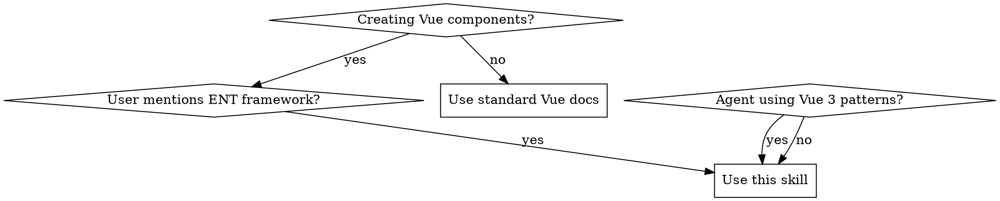

# ENT Framework Programmer

## Overview

**ENT Framework** = Markdown-based Vue 2 + Quasar development where components are `.md` files that compile to Vue runtime. **Core principle:** Follow ENT patterns strictly - no rationalizations allowed.

## When to Use



**Load when:**
- User requests "create ENT component/page/store/namespace"
- Agent violates ENT patterns (Vue 3, custom CSS, v-slot syntax)
- Working with `.md` files containing YAML frontmatter

**Don't use for:** Standard Vue/React projects

## Core Pattern

**Before (Wrong):**
```yaml
# ❌ Vue 3 Composition API
import { ref } from 'vue'
const count = ref(0)

# ❌ Custom CSS
.card { padding: 16px; }

# ❌ v-slot syntax
template(v-slot:header)
```

**After (Correct):**
```yaml
# ✅ Vue 2 Options API
## data
{ count: 0 }

# ✅ Quasar utilities
q-card.q-pa-md

# ✅ ENT slot syntax
template(#header="{}")
```

## Quick Reference

| Task | ENT Pattern | Critical Rules |
|------|-------------|----------------|
| **Component** | `component.enabled: true` | Use PascalCase name, Pug templates |
| **Page** | Must be component + page section | Ends with "Page", requires route |
| **Store** | Extends `base/BaseStore` | Kebab-case name, persistentData |
| **API Calls** | `this.callRestApi()` | Never use `fetch()` or `axios` |
| **Styling** | Quasar utilities only | No custom CSS, semantic colors |
| **Slots** | `template(#slot="{}")` | NEVER use `v-slot:` prefix |
| **Templates** | Single root element | Vue 2 requires exactly one root |

## Implementation

### Component Structure
```yaml
# components/user-card.component.md
---
namespace: tm
component:
  enabled: true
  name: UserCard
  lang: pug
---

## props
```js
{
  user: {type: Object, required: true}
}
```

## template
```pug
q-card.q-pa-md.bg-surface
  .text-h6.text-on-surface {{ user.name }}
  .text-body2.text-on-surface-dim {{ user.email }}
```
```

### Store Structure
```yaml
# stores/auth.store.md
---
namespace: tm
component:
  enabled: true
  name: AuthStore
  extends: base/BaseStore
store:
  enabled: true
  name: auth-store
---

## data
```js
{
  userId: null,
  isLogged: false
}
```

## methods
```js
{
  async loadUser() {
    const result = await this.callRestApi({
      func: 'loadUser',
      payload: {}
    })
    this.userId = result.id
    this.isLogged = true
  }
}
```
```

### Page Structure
```yaml
# pages/dashboard.page.md
---
namespace: tm
component:
  enabled: true
  name: DashboardPage
  lang: pug
page:
  enabled: true
  title: Dashboard
  route: tm/dashboard
---
```

## Common Mistakes

**❌ CRITICAL: Slot Syntax Violations**
```pug
// ABSOLUTELY FORBIDDEN - COMPILATION WILL FAIL!
template(v-slot:header)     // 🚫 NEVER use v-slot: prefix
template(v-slot:actions)    // 🚫 NEVER use v-slot: prefix
template(v-slot:append)     // 🚫 NEVER use v-slot: prefix
template(#header)           // 🚫 Missing equals

// ✅ CORRECT - ONLY use #slotname with equals!
template(#header="{}")
template(#actions="")
template(#append="{}")
```

**❌ Vue 3 vs Vue 2**
```js
// WRONG - Vue 3 Composition API
import { ref } from 'vue'
const count = ref(0)

// CORRECT - Vue 2 Options API
## data
{ count: 0 }
```

**❌ Styling Violations**
```stylus
// WRONG - Custom CSS
## styleModule
.card { padding: 16px; }

// CORRECT - Quasar utilities
## template
q-card.q-pa-md
```

**❌ API Call Violations**
```js
// WRONG - Standard fetch
await fetch('/api/data')

// CORRECT - ENT API method
await this.callRestApi({ func: 'getData', payload: {} })
```

**❌ Method/Data Name Conflicts**
```js
// WRONG - Same name for data and method (Vue 2 error!)
## data
{ showDialog: false }

## methods
{ showDialog() { this.showDialog = true } }

// CORRECT - Different names
## data
{ isDialogOpen: false }

## methods
{ openDialog() { this.isDialogOpen = true } }
```

**❌ Multiple Root Elements**
```pug
// WRONG - Vue 2 requires single root element
## template
div Main content
q-dialog(v-model="showDialog") Dialog

// CORRECT - Everything inside single root
## template
div
  | Main content
  q-dialog(v-model="showDialog") Dialog
```

## Rationalization Table

| Excuse | Reality |
|--------|---------|
| "Vue 3 is modern/better" | ENT uses Vue 2 Options API. MUST use it. |
| "Custom CSS for clean design" | ENT standard = Quasar utility classes ONLY. |
| "v-slot: is more standard" | ENT framework FORBIDS v-slot: prefix. Use #slotname with equals. |
| "Same names are convenient" | Vue 2 forbids duplicate names. Use different names. |
| "Fixed colors are simpler" | Fixed colors break dark mode. Use semantic colors. |
| "Multiple roots is cleaner" | Vue 2 requires exactly ONE root element. No exceptions. |
| "Time pressure justifies shortcuts" | Time pressure ≠ excuse for wrong patterns. |

## Red Flags - STOP and Check Skill

**STOP immediately if you catch yourself:**
- Thinking "Vue 3 Composition API"
- Writing custom CSS in styleModule
- Using `template(v-slot:header)` or any `v-slot:` prefix
- Creating methods with same name as data properties
- Creating multiple root elements in template
- Using fixed colors like `text-grey-6`, `bg-blue-1`
- Using `fetch()` or `axios` for API calls
- Creating store without `extends: base/BaseStore`
- Creating page without component section
- Saying "I know Vue/Quasar" (≠ knowing ENT)

**All of these mean: You're NOT using ENT patterns. Re-read this skill.**

## Dark Mode Quick Rules

**✅ USE semantic colors:**
```pug
q-card.bg-surface.bordered
  .text-h6.text-on-surface Main text
  .text-body2.text-on-surface-dim Secondary text
  .text-caption.text-on-surface-dim-2 Helper text
```

**❌ NEVER use fixed colors:**
```pug
q-card.bg-blue-1           // Breaks dark mode
  .text-h6.text-grey-6     // Invisible in dark mode
```

## File Organization

**Required folder structure:**
```
[namespace]/
  components/
  pages/
  stores/
  libs/
```

**Required file extensions:**
- Components: `.component.md`
- Pages: `.page.md`
- Stores: `.store.md`
- Namespaces: `.namespace.md`

## Critical Dependencies

**REQUIRED SUB-SKILL:** You MUST understand and apply all patterns from this skill. No exceptions or rationalizations allowed.

**For complete ENT documentation:** See `/docs` symlinks in project:
- `docs/ent-main-doc.md` - Complete reference
- `docs/component.md` - Component examples
- `docs/store.md` - Store patterns

**Reference these only when:** You need comprehensive API details beyond these patterns.