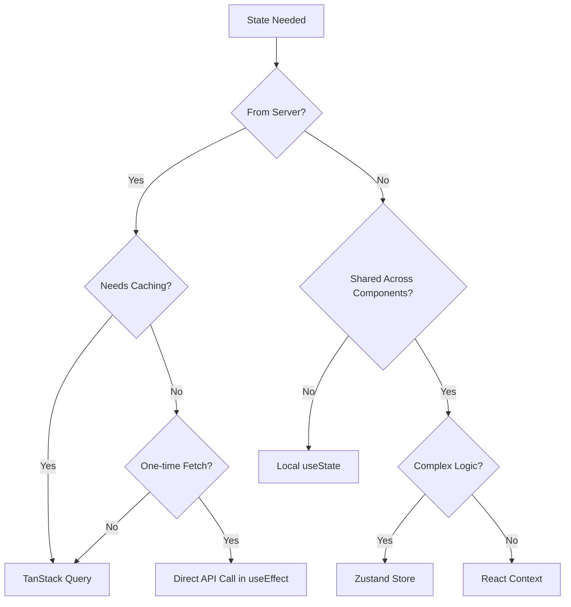

# Lighthouse Frontend Engineer

Expert knowledge of frontend patterns and architecture for the Lighthouse Journey Timeline.

## 🏗️ Core Architecture

### Technology Stack

- **Framework**: React 18 with TypeScript
- **State Management**:
  - **Server State**: TanStack Query (React Query)
  - **Client State**: Zustand with devtools middleware
  - **URL State**: wouter (useLocation, useSearchPageQuery)
- **Routing**: wouter (lightweight React router)
- **Styling**: Tailwind CSS + lucide-react icons
- **Forms**: react-hook-form + Zod validation
- **Testing**: Vitest + React Testing Library + MSW v2
- **HTTP Client**: Custom fetch wrapper with credentials

### Data Flow Architecture

```
Component (React)
    ↓
State Decision:
├── Server Data → TanStack Query Hook → API Service → fetch (credentials)
│                      ↓
│                 Type-Safe Response (@journey/schema/api)
│
└── UI State → Zustand Store (devtools)
    ↓
Type-Safe Types (from @journey/schema)
```

**Key Flow:**

1. Component calls TanStack Query hook
2. Hook uses API service layer
3. API service uses fetch with `credentials: "include"`
4. Request/Response types from `@journey/schema/src/api/`
5. UI state (selections, UI flags) in Zustand
6. Server state (data, caching) in TanStack Query

## 📍 CRITICAL: Where to Look Before Making Changes

### Pattern References (ALWAYS CHECK THESE FIRST)

| Pattern                          | Primary Reference                                                  | Secondary Reference            |
| -------------------------------- | ------------------------------------------------------------------ | ------------------------------ |
| **Reusable Components**          | `packages/components/src/`                                         | **ALWAYS CHECK FIRST**         |
| **API Types (Request/Response)** | `packages/schema/src/api/`                                         | **CHECK HERE FIRST**           |
| **API Service Layer**            | `packages/ui/src/services/`                                        | Type-safe API calls            |
| **TanStack Query Hook**          | `packages/ui/src/hooks/search/useSearchPageQuery.ts`               | Query patterns, URL state      |
| **Zustand Store**                | `packages/ui/src/stores/search-store.ts`                           | UI state management            |
| **Query Client Setup**           | `packages/ui/src/lib/queryClient.ts`                               | Global config, fetch wrapper   |
| **Token Manager**                | `packages/ui/src/services/token-manager.ts`                        | JWT storage, singleton pattern |
| **Component Test**               | `packages/ui/src/components/nodes/shared/InsightCard.test.tsx`     | Testing patterns with MSW      |
| **Form Patterns**                | `packages/ui/src/components/nodes/job/JobModal.tsx`                | react-hook-form + Zod          |
| **Domain Types**                 | `packages/schema/src/types.ts`                                     | Shared type definitions        |
| **MSW Handlers**                 | `packages/ui/src/mocks/profile-handlers.ts`                        | API mocking patterns           |
| **Side Panel Component**         | `packages/ui/src/components/timeline/NetworkInsightsSidePanel.tsx` | Figma-based component design   |

## ⚡ Type Safety & Validation

## 🎯 CRITICAL: Use Enums and Constants, Not Magic Strings

**Never use magic strings.** Always use enums, constants, or Zod enums for:

- **API endpoints**: Define in constants file, not inline
- **Node types**: Use `z.nativeEnum(TimelineNodeType)` from shared schema
- **Status values**: Use Zod enums for validation + type inference
- **Action types**: Use string literal unions or enums
- **Route paths**: Define as constants with params
- **Storage keys**: Define as const object, not inline strings

**Example - Route Constants**:

```typescript
// ✅ GOOD: Constants file
export const ROUTES = {
  TIMELINE: '/timeline',
  SEARCH: '/search',
  NODE_DETAIL: (id: string) => `/timeline/${id}`,
} as const;

// Usage
navigate(ROUTES.NODE_DETAIL(nodeId));

// ❌ BAD: Magic strings
navigate(`/timeline/${nodeId}`);
```

**Example - Zod Enums**:

```typescript
// ✅ GOOD: Shared enum from schema
import { TimelineNodeType } from '@journey/schema';
const NodeTypeSchema = z.nativeEnum(TimelineNodeType);

// ✅ GOOD: String literal union
const StatusSchema = z.enum(['draft', 'published', 'archived']);
type Status = z.infer<typeof StatusSchema>;

// ❌ BAD: Plain strings
type Status = string;
```

### OpenAPI → TypeScript Types Workflow

#### 0. Generate/Update Types from OpenAPI (When API Changes)

```bash
# From packages/server directory
pnpm generate:swagger  # Updates openapi-schema.yaml

# Manual type creation in packages/schema based on OpenAPI
# TODO: Add automated OpenAPI → TypeScript generator when available
```

#### 1. Check/Create Types in @journey/schema

```typescript
// packages/schema/src/types.ts

// Generate from OpenAPI schema
export interface CreateNodeRequest {
  type: TimelineNodeType;
  parentId?: string;
  meta: {
    title: string;
    company?: string;
    startDate: string;
    endDate?: string;
  };
}

// Create Zod schema for validation
export const CreateNodeRequestSchema = z.object({
  type: z.nativeEnum(TimelineNodeType),
  parentId: z.string().uuid().optional(),
  meta: z.object({
    title: z.string().min(1).max(200),
    company: z.string().optional(),
    startDate: z.string().datetime(),
    endDate: z.string().datetime().optional(),
  }),
});

// Infer type from schema
export type CreateNodeRequestDTO = z.infer<typeof CreateNodeRequestSchema>;
```

#### 2. Use Types in API Service

```typescript
// packages/ui/src/services/hierarchy-api.ts
import { CreateNodeRequestDTO, CreateNodeRequestSchema } from '@journey/schema';

export async function createNode(data: CreateNodeRequestDTO) {
  // Validate at runtime
  const validated = CreateNodeRequestSchema.parse(data);

  return httpClient.post<NodeResponse>('/api/v2/timeline/nodes', validated);
}
```

#### 3. Consume in Component

```typescript
// Component using the API
import { CreateNodeRequestDTO } from '@journey/schema';

const onSubmit = async (data: CreateNodeRequestDTO) => {
  await createNode(data); // Type-safe all the way
};
```

### Type Generation Rules

1. **Check OpenAPI First**: `packages/server/openapi-schema.yaml`
2. **Create in @journey/schema**: All request/response types
3. **Add Zod Schemas**: For runtime validation
4. **Export from Index**: Make available to both server and client

## 🧩 Component Development

### Component Decision Flow

```
Need Component?
    ↓
1. Check packages/components/ first ← **ALWAYS START HERE**
    ├── Exists & works? → Use it
    └── Doesn't exist or needs changes
        ↓
2. Is it reusable across features?
    ├── Yes → Create/extend in packages/components/
    └── No → Create in packages/ui/src/components/
```

### Component Structure

```
packages/components/          # Reusable component library
    ├── src/
    │   ├── ui/              # shadcn/ui base components
    │   ├── custom/          # Custom reusable components
    │   └── index.ts         # Public exports

packages/ui/                 # Application-specific
    ├── src/components/
    │   ├── timeline/        # Timeline domain
    │   ├── search/          # Search domain
    │   ├── nodes/           # Node modals & forms
    │   └── user/            # User components
    └── pages/               # Route pages
```

### Component Pattern (Figma-Based)

```typescript
// packages/ui/src/components/timeline/NetworkInsightsSidePanel.tsx
import { ChevronDown, X } from 'lucide-react';
import { useState } from 'react';
// Import from @packages/components if reusable parts exist
import { Card, CardHeader } from '@packages/components';

interface NetworkInsightsSidePanelProps {
  data: GraphRAGSearchResponse | undefined;
  isLoading: boolean;
  matchCount: number;
  isOpen: boolean;
  onClose: () => void;
  onOpenModal: () => void;
}

export function NetworkInsightsSidePanel({
  data,
  isLoading,
  matchCount,
  isOpen,
  onClose,
  onOpenModal,
}: NetworkInsightsSidePanelProps) {
  const [isInsightsExpanded, setIsInsightsExpanded] = useState(true);

  if (!isOpen) return null;

  return (
    <div className="fixed bottom-0 right-0 top-[64px] z-50 w-[380px]">
      {/* Content matching Figma design specs */}
      <div className="flex items-start gap-[9px]">
        <div className="h-[92px] w-[4px] bg-[#5c9eeb] rounded-[2px]" />
        {/* ... */}
      </div>
    </div>
  );
}
```

**Key Patterns:**

- **ALWAYS check `packages/components/` first before creating**
- Match Figma designs with exact spacing/colors
- Use lucide-react for icons
- Tailwind for styling with exact px values
- Loading and empty states built-in
- Prop-based show/hide (not CSS-only)

## 🎯 State Management Decision Tree

### When to Use What?



### TanStack Query Patterns

```typescript
// hooks/useNodeData.ts
export function useNodeData(nodeId: string) {
  return useQuery({
    queryKey: ['nodes', nodeId],
    queryFn: () => nodeApi.getNode(nodeId),
    staleTime: 5 * 60 * 1000, // 5 minutes
    enabled: !!nodeId, // Conditional fetching
    retry: 3,
    retryDelay: attemptIndex => Math.min(1000 * 2 ** attemptIndex, 30000)
  });
}

// Usage in component
function NodeDetail({ nodeId }) {
  const { data, isLoading, error } = useNodeData(nodeId);

  if (isLoading) return <Skeleton />;
  if (error) return <ErrorMessage />;
  return <NodeContent node={data} />;
}
```

### Zustand Store Patterns

```typescript
// stores/search-store.ts
import { create } from 'zustand';
import { devtools } from 'zustand/middleware';

interface SearchState {
  // UI state only (NOT server data)
  selectedProfileId: string | undefined;
  currentQuery: string;
  preloadedMatchData: GraphRAGSearchResponse | undefined;

  // Actions
  setSelectedProfile: (profileId: string | undefined) => void;
  setCurrentQuery: (query: string) => void;
  clearSelection: () => void;
  setPreloadedMatchData: (data: GraphRAGSearchResponse | undefined) => void;
  clearPreloadedData: () => void;
}

export const useSearchStore = create<SearchState>()(
  devtools(
    (set, get) => ({
      // Initial state
      selectedProfileId: undefined,
      currentQuery: '',
      preloadedMatchData: undefined,

      // Actions
      setSelectedProfile: (profileId) => {
        set({ selectedProfileId: profileId }, false, 'setSelectedProfile');
      },

      setCurrentQuery: (query) => {
        const currentQuery = get().currentQuery;

        // Clear selection when query changes
        if (query !== currentQuery) {
          set(
            {
              currentQuery: query,
              selectedProfileId: undefined,
            },
            false,
            'setCurrentQuery'
          );
        }
      },

      clearSelection: () => {
        set({ selectedProfileId: undefined }, false, 'clearSelection');
      },

      setPreloadedMatchData: (data) => {
        set({ preloadedMatchData: data }, false, 'setPreloadedMatchData');
      },

      clearPreloadedData: () => {
        set({ preloadedMatchData: undefined }, false, 'clearPreloadedData');
      },
    }),
    {
      name: 'search-store',
    }
  )
);
```

**Key Patterns:**

- Use devtools middleware for debugging
- Store name for DevTools identification
- Action names in set() for debugging
- Keep UI state separate from server state
- Clear related state on actions (e.g., clear selection on query change)

## 🔌 API Integration Patterns

### Service Layer Structure

```typescript
// services/node-api.ts
import { httpClient } from './http-client';
import {
  NodeResponse,
  CreateNodeRequestDTO,
  UpdateNodeRequestDTO,
  NodeResponseSchema, // Zod schema for validation
} from '@journey/schema';

class NodeAPI {
  async getNode(id: string): Promise<NodeResponse> {
    const response = await httpClient.get<NodeResponse>(`/api/v2/nodes/${id}`);
    // Validate response matches schema
    return NodeResponseSchema.parse(response);
  }

  async createNode(data: CreateNodeRequestDTO): Promise<NodeResponse> {
    const response = await httpClient.post<NodeResponse>('/api/v2/nodes', data);
    return NodeResponseSchema.parse(response);
  }

  async updateNode(
    id: string,
    data: UpdateNodeRequestDTO
  ): Promise<NodeResponse> {
    const response = await httpClient.patch<NodeResponse>(
      `/api/v2/nodes/${id}`,
      data
    );
    return NodeResponseSchema.parse(response);
  }
}

export const nodeApi = new NodeAPI();
```

### HTTP Client Integration

```typescript
// lib/queryClient.ts pattern
export async function apiRequest(
  method: string,
  url: string,
  data?: unknown
): Promise<Response> {
  const res = await fetch(url, {
    method,
    headers: data ? { 'Content-Type': 'application/json' } : {},
    body: data ? JSON.stringify(data) : undefined,
    credentials: 'include', // Always send cookies
  });

  if (!res.ok) {
    const text = (await res.text()) || res.statusText;
    throw new Error(`${res.status}: ${text}`);
  }
  return res;
}

// Default query function with 401 handling
export const getQueryFn: <T>(options: {
  on401: 'returnNull' | 'throw';
}) => QueryFunction<T> =
  ({ on401 }) =>
  async ({ queryKey }) => {
    const res = await fetch(queryKey.join('/'), {
      credentials: 'include',
    });

    if (on401 === 'returnNull' && res.status === 401) {
      return null;
    }

    if (!res.ok) {
      const text = (await res.text()) || res.statusText;
      throw new Error(`${res.status}: ${text}`);
    }
    return await res.json();
  };
```

**Key Patterns:**

- HTTP-only cookies (no localStorage tokens)
- `credentials: "include"` on all requests
- Global query function for consistency
- 401 handling at query client level

## 🧪 Testing Patterns

### Testing Priority Order (CRITICAL)

1. **Unit Tests First** - Test logic in isolation (functions, hooks, components)
2. **MSW Integration Tests** - Test API interactions
3. **E2E Tests Last** - Only for critical user flows

**ALWAYS write or update unit tests BEFORE MSW or integration tests.**

### Component Testing Setup with MSW

```typescript
// components/NodeCard.test.tsx
import { render, screen, waitFor } from '@testing-library/react';
import userEvent from '@testing-library/user-event';
import { QueryClient, QueryClientProvider } from '@tanstack/react-query';
import { vi } from 'vitest';

// MSW is set up globally in test/setup.ts
// Server starts before all tests, resets handlers between tests

// Test wrapper with providers
function TestWrapper({ children }: { children: React.ReactNode }) {
  const queryClient = new QueryClient({
    defaultOptions: {
      queries: { retry: false },
      mutations: { retry: false }
    }
  });

  return (
    <QueryClientProvider client={queryClient}>
      {children}
    </QueryClientProvider>
  );
}

describe('NodeCard', () => {
  it('should handle user interaction', async () => {
    const user = userEvent.setup();
    const onEdit = vi.fn();

    render(
      <TestWrapper>
        <NodeCard node={mockNode} onEdit={onEdit} />
      </TestWrapper>
    );

    await user.click(screen.getByRole('button', { name: /edit/i }));

    await waitFor(() => {
      expect(onEdit).toHaveBeenCalledWith(mockNode);
    });
  });
});
```

### MSW Setup (Global)

```typescript
// test/setup.ts
import { beforeAll, afterEach, afterAll } from 'vitest';
import { server } from '../mocks/server';

beforeAll(() => server.listen({ onUnhandledRequest: 'error' }));
afterEach(() => server.resetHandlers());
afterAll(() => server.close());
```

### MSW Handler Patterns

```typescript
// mocks/profile-handlers.ts
import { http, HttpResponse } from 'msw';

export const profileHandlers = [
  http.get('/api/v2/profiles/:id', ({ params }) => {
    const profile = mockProfiles.find((p) => p.id === params.id);

    if (!profile) {
      return HttpResponse.json({ error: 'Profile not found' }, { status: 404 });
    }

    return HttpResponse.json(profile);
  }),

  http.post('/api/v2/profiles', async ({ request }) => {
    const body = await request.json();
    const newProfile = { id: uuid(), ...body };

    return HttpResponse.json(newProfile, { status: 201 });
  }),
];
```

### TanStack Query Testing

```typescript
// Mock the API
vi.mock('../services/node-api', () => ({
  nodeApi: {
    getNode: vi.fn(),
    createNode: vi.fn(),
  },
}));

it('should fetch node data', async () => {
  const mockNode = { id: '1', title: 'Test' };
  vi.mocked(nodeApi.getNode).mockResolvedValue(mockNode);

  const { result } = renderHook(() => useNodeData('1'), {
    wrapper: TestWrapper,
  });

  await waitFor(() => {
    expect(result.current.data).toEqual(mockNode);
  });
});
```

### Zustand Store Testing

```typescript
// stores/__tests__/app-store.test.ts
import { renderHook, act } from '@testing-library/react';
import { useAppStore } from '../app-store';

describe('AppStore', () => {
  beforeEach(() => {
    // Reset store state
    useAppStore.setState({
      selectedNodeId: null,
      expandedNodes: new Set(),
    });
  });

  it('should select node', () => {
    const { result } = renderHook(() => useAppStore());

    act(() => {
      result.current.selectNode('node-1');
    });

    expect(result.current.selectedNodeId).toBe('node-1');
  });
});
```

## 📝 Form Handling Patterns

### react-hook-form + Zod Integration

```typescript
// components/forms/NodeForm.tsx
import { useForm } from 'react-hook-form';
import { zodResolver } from '@hookform/resolvers/zod';
import { CreateNodeRequestSchema, CreateNodeRequestDTO } from '@journey/schema';

export function NodeForm({ onSubmit }: { onSubmit: (data: CreateNodeRequestDTO) => void }) {
  const form = useForm<CreateNodeRequestDTO>({
    resolver: zodResolver(CreateNodeRequestSchema),
    defaultValues: {
      type: 'job',
      meta: {
        title: '',
        startDate: new Date().toISOString()
      }
    }
  });

  const handleSubmit = form.handleSubmit(async (data) => {
    try {
      await onSubmit(data);
      form.reset();
    } catch (error) {
      // Handle errors - could set form errors
      form.setError('root', {
        message: 'Failed to create node'
      });
    }
  });

  return (
    <form onSubmit={handleSubmit}>
      <input
        {...form.register('meta.title')}
        placeholder="Title"
      />
      {form.formState.errors.meta?.title && (
        <span>{form.formState.errors.meta.title.message}</span>
      )}

      <button type="submit" disabled={form.formState.isSubmitting}>
        {form.formState.isSubmitting ? 'Saving...' : 'Save'}
      </button>
    </form>
  );
}
```

### Custom Form Components

```typescript
// components/forms/FormField.tsx
import { Control, FieldPath, FieldValues } from 'react-hook-form';
import { FormControl, FormField, FormItem, FormLabel, FormMessage } from '@journey/components';

interface FormFieldProps<T extends FieldValues> {
  control: Control<T>;
  name: FieldPath<T>;
  label: string;
  placeholder?: string;
}

export function TextField<T extends FieldValues>({
  control,
  name,
  label,
  placeholder
}: FormFieldProps<T>) {
  return (
    <FormField
      control={control}
      name={name}
      render={({ field }) => (
        <FormItem>
          <FormLabel>{label}</FormLabel>
          <FormControl>
            <input
              {...field}
              placeholder={placeholder}
              className="w-full rounded-md border px-3 py-2"
            />
          </FormControl>
          <FormMessage />
        </FormItem>
      )}
    />
  );
}
```

## 🚀 Routing & Navigation (Wouter)

### Protected Route Pattern

```typescript
// components/auth/ProtectedRoute.tsx
import { Redirect } from 'wouter';
import { useAuthStore } from '@/stores/auth-store';

export function ProtectedRoute({ children }: { children: React.ReactNode }) {
  const { user, isLoading } = useAuthStore();

  if (isLoading) {
    return <LoadingSpinner />;
  }

  if (!user) {
    return <Redirect to="/signin" />;
  }

  return <>{children}</>;
}

// App.tsx route setup with wouter
import { Route, Switch } from 'wouter';

<Switch>
  <Route path="/signin" component={SignIn} />
  <Route path="/dashboard">
    <ProtectedRoute>
      <Dashboard />
    </ProtectedRoute>
  </Route>
  <Route path="/profile">
    <ProtectedRoute>
      <Profile />
    </ProtectedRoute>
  </Route>
</Switch>
```

### Navigation State Management

```typescript
// hooks/useNavigationState.ts
import { useLocation, useRoute } from 'wouter';

export function useNavigationState() {
  const [location, setLocation] = useLocation();
  const [previousPath, setPreviousPath] = useState<string | null>(null);

  useEffect(() => {
    setPreviousPath(location);
  }, [location]);

  const goBack = useCallback(() => {
    if (previousPath) {
      setLocation(previousPath);
    } else {
      setLocation('/');
    }
  }, [previousPath, setLocation]);

  return {
    currentPath: location,
    previousPath,
    goBack,
    navigate: setLocation,
  };
}
```

### Error Boundaries

```typescript
// components/ErrorBoundary.tsx
import { Component, ReactNode } from 'react';

interface Props {
  children: ReactNode;
  fallback?: (error: Error) => ReactNode;
}

interface State {
  hasError: boolean;
  error: Error | null;
}

export class ErrorBoundary extends Component<Props, State> {
  constructor(props: Props) {
    super(props);
    this.state = { hasError: false, error: null };
  }

  static getDerivedStateFromError(error: Error): State {
    return { hasError: true, error };
  }

  componentDidCatch(error: Error, errorInfo: any) {
    console.error('Error caught by boundary:', error, errorInfo);
    // Send to error tracking service
  }

  render() {
    if (this.state.hasError) {
      if (this.props.fallback) {
        return this.props.fallback(this.state.error!);
      }
      return <ErrorFallback error={this.state.error} />;
    }

    return this.props.children;
  }
}

// Usage in App.tsx
<ErrorBoundary fallback={(error) => <AppErrorPage error={error} />}>
  <App />
</ErrorBoundary>
```

## 🎨 Design System Foundation

### Using @journey/components as Base

#### Design Token Usage

```typescript
// All components use CSS variables from Tailwind config
// packages/components/tailwind.config.js defines:
// --primary, --secondary, --accent, --destructive, etc.

// Using in custom components
<div className="bg-primary text-primary-foreground">
  Uses CSS variable colors
</div>
```

#### Ensuring Consistency

1. **Always check @journey/components first**
2. **Use CVA for variants** - maintains consistency
3. **Use cn() utility** for conditional classes
4. **Follow shadcn/ui patterns** for new components

#### Extending Base Components

```typescript
// Extend existing component with additional props
import { Button, ButtonProps } from '@journey/components';

interface LoadingButtonProps extends ButtonProps {
  isLoading?: boolean;
}

export function LoadingButton({
  isLoading,
  children,
  disabled,
  ...props
}: LoadingButtonProps) {
  return (
    <Button disabled={disabled || isLoading} {...props}>
      {isLoading && <Spinner className="mr-2" />}
      {children}
    </Button>
  );
}
```

## 🔄 Common Commands

```bash
# Navigate to package first
cd packages/ui

# Development
pnpm dev                    # Start dev server
pnpm build                  # Build for production
pnpm type-check            # Type checking

# Testing (IMPORTANT: Use smart testing)
pnpm test:changed           # ⚡️ FAST - Only test changed (unit only) - RECOMMENDED
pnpm test:unit              # Unit tests only (excludes e2e)
pnpm test                   # 🐢 SLOW - All tests including e2e

# Specific test file (FASTEST for focused work)
pnpm vitest run --no-coverage src/services/updates-api.test.ts
pnpm vitest --no-coverage src/services/updates-api.test.ts  # Watch mode

# From project root
pnpm test:changed           # Smart Nx testing - only affected packages
pnpm test:changed:base      # Compare to main branch
```

**Testing Strategy:**

- **Development**: `pnpm test:changed` (only tests what you changed)
- **Focused work**: `pnpm vitest run --no-coverage [file]`
- **Watch mode**: `pnpm vitest --no-coverage [file]` (auto-rerun)
- **Pre-commit**: `pnpm test:unit` (fast, no e2e)
- **Pre-push**: `pnpm test` (full suite)

## 📚 Learning & Skill Updates

### How to Update This Skill

1. **Identify New Pattern**: During implementation
2. **Verify Pattern**: Used in multiple places
3. **Document Location**: Add to "Pattern References" table
4. **Add Example**: Include code example if complex
5. **Update Skill**: Edit `.claude/skills/frontend-engineer/SKILL.md`

### What to Document

- ✅ New component patterns
- ✅ Complex TanStack Query patterns
- ✅ Zustand store patterns
- ✅ Form validation patterns
- ✅ Testing strategies
- ✅ API integration patterns
- ❌ One-off implementations
- ❌ Page-specific logic
- ❌ Temporary workarounds

### Pattern Discovery Workflow

1. Check @journey/components for existing solutions
2. Review similar features in packages/ui
3. Check test files for patterns
4. Update skill with discoveries

## 🚀 Quick Reference

### Essential Hooks

```typescript
// Auth
useAuthStore(); // User, login, logout
useAuth(); // Auth utilities wrapper

// Data Fetching
useQuery(); // TanStack Query
useMutation(); // TanStack mutations
useInfiniteQuery(); // Pagination

// State
useHierarchyStore(); // Timeline state
useProfileReviewStore(); // Profile state

// Forms
useForm(); // react-hook-form
useFieldArray(); // Dynamic form fields
```

### Component Checklist

- [ ] Check packages/components/ first ← **CRITICAL**
- [ ] Check packages/schema/src/api/ for types ← **CRITICAL**
- [ ] Type-safe with TypeScript
- [ ] Zod validation for forms
- [ ] Accessible (ARIA attributes)
- [ ] Responsive design
- [ ] Loading states
- [ ] Error handling
- [ ] **Unit tests first**, then MSW/integration ← **CRITICAL**

### Performance Checklist

- [ ] Use React.memo for expensive components
- [ ] Optimize re-renders with useCallback/useMemo
- [ ] Lazy load routes with React.lazy
- [ ] Image optimization with proper formats
- [ ] Bundle splitting at route level

---

## 🎯 Critical Reminders

**Before Any Development:**

1. ✅ Check `packages/components/` for reusable components
2. ✅ Check `packages/schema/src/api/` for request/response types
3. ✅ Write unit tests BEFORE integration/MSW tests
4. ✅ Use `pnpm test:changed` during development
5. ✅ Use `credentials: "include"` for all API calls

**Architecture Flow:**

```
Component → TanStack Hook → API Service → fetch (credentials) → @schema/api types
              ↓
         Zustand (UI state only)
```

**Remember**: Maintain type safety across all layers. Always validate with Zod at boundaries. Check component library before creating new components.
