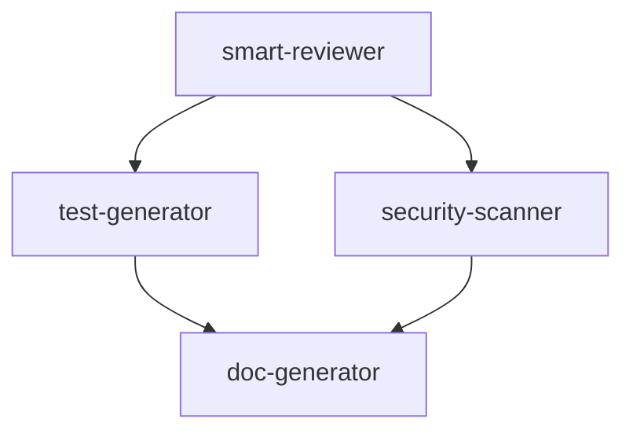

# MCP Workflow Composition

Advanced patterns for combining multiple MCP tools into powerful automated workflows.

## Core Concept: Tool Composition

**Philosophy:** Individual tools are powerful; combined tools are transformative.

**Key Insight:** The @j0kz/mcp-agents toolkit is designed for composition:
- Each tool handles one concern well
- Tools communicate via structured JSON
- Output from one tool feeds into another
- MCPPipeline orchestrates the flow

**Example:** Code quality workflow
1. smart-reviewer identifies issues
2. test-generator creates missing tests
3. refactor-assistant applies fixes
4. doc-generator updates documentation

## MCPPipeline Basics

### Installation

```bash
npm install @j0kz/shared
```

### Basic Usage

```typescript
import { MCPPipeline } from '@j0kz/shared';

const pipeline = new MCPPipeline();

// Add steps
pipeline.addStep({
  name: 'review',
  tool: 'smart-reviewer',
  config: {
    action: 'review_file',
    params: { filePath: 'src/index.ts' }
  }
});

// Execute
const results = await pipeline.execute();
```

### Step Dependencies

```typescript
pipeline.addStep({
  name: 'tests',
  tool: 'test-generator',
  dependsOn: ['review']  // Runs after review completes
});
```

## Pre-Built Workflows

For comprehensive pre-built workflow examples including code quality, pre-commit validation, PR review, security audit, and more:

```bash
cat .claude/skills/mcp-workflow-composition/references/prebuilt-workflows.md
```

This reference includes:
- Complete code quality workflow
- Pre-commit validation pipeline
- Pull request review automation
- Security audit workflow
- Full project audit pipeline

## Dependency Management

### Sequential Dependencies

```typescript
// Step B waits for Step A
pipeline.addStep({ name: 'A', tool: 'smart-reviewer', /* ... */ });
pipeline.addStep({
  name: 'B',
  tool: 'test-generator',
  dependsOn: ['A']  // B runs after A completes
});
```

### Parallel Execution

```typescript
// These run simultaneously
pipeline.addStep({ name: 'review', tool: 'smart-reviewer', /* ... */ });
pipeline.addStep({ name: 'security', tool: 'security-scanner', /* ... */ });
pipeline.addStep({ name: 'architecture', tool: 'architecture-analyzer', /* ... */ });
```

### Complex Dependencies

```typescript
// D waits for both B and C
// B and C run in parallel after A
pipeline.addStep({ name: 'A', /* ... */ });
pipeline.addStep({ name: 'B', dependsOn: ['A'], /* ... */ });
pipeline.addStep({ name: 'C', dependsOn: ['A'], /* ... */ });
pipeline.addStep({ name: 'D', dependsOn: ['B', 'C'], /* ... */ });
```

### Dependency Graph Visualization



## Error Handling Strategies

### Fail-Fast (Default)

```typescript
pipeline.setErrorStrategy('fail-fast');
// Pipeline stops at first error
```

### Continue on Error

```typescript
pipeline.setErrorStrategy('continue');
// All steps run, errors collected at end
```

### Retry with Backoff

```typescript
pipeline.addStep({
  name: 'flaky-step',
  tool: 'api-designer',
  retry: {
    maxAttempts: 3,
    backoffMs: 1000  // Exponential: 1s, 2s, 4s
  }
});
```

### Custom Error Handler

```typescript
pipeline.onError((error, stepName) => {
  console.error(`Step ${stepName} failed:`, error);
  // Custom logic: notify, log, recover
  return 'continue';  // or 'abort'
});
```

### Error Recovery Pattern

```typescript
pipeline.addStep({
  name: 'main-task',
  tool: 'refactor-assistant',
  onError: {
    fallback: {
      name: 'recovery',
      tool: 'smart-reviewer',
      config: { /* simpler config */ }
    }
  }
});
```

## Custom Workflow Patterns

For detailed custom workflow patterns including progressive quality gates, fan-out/fan-in, conditional execution, and retry strategies:

```bash
cat .claude/skills/mcp-workflow-composition/references/workflow-patterns.md
```

## Tool Combination Patterns

### Review → Test → Document

```typescript
const codeQualityWorkflow = new MCPPipeline();

// 1. Review code
codeQualityWorkflow.addStep({
  name: 'review',
  tool: 'smart-reviewer',
  config: {
    action: 'review_file',
    params: { filePath, config: { severity: 'moderate' } }
  }
});

// 2. Generate missing tests
codeQualityWorkflow.addStep({
  name: 'tests',
  tool: 'test-generator',
  config: {
    action: 'generate_tests',
    params: { sourceFile: filePath }
  },
  dependsOn: ['review']
});

// 3. Update documentation
codeQualityWorkflow.addStep({
  name: 'docs',
  tool: 'doc-generator',
  config: {
    action: 'update_readme',
    params: { projectPath: './' }
  },
  dependsOn: ['tests']
});
```

### Security → Architecture → Refactor

```typescript
const deepAnalysisWorkflow = new MCPPipeline();

// Parallel analysis
deepAnalysisWorkflow.addStep({
  name: 'security',
  tool: 'security-scanner',
  config: { /* ... */ }
});

deepAnalysisWorkflow.addStep({
  name: 'architecture',
  tool: 'architecture-analyzer',
  config: { /* ... */ }
});

// Refactor based on both analyses
deepAnalysisWorkflow.addStep({
  name: 'refactor',
  tool: 'refactor-assistant',
  config: { /* ... */ },
  dependsOn: ['security', 'architecture']
});
```

### API Design → Schema → Tests

```typescript
const apiWorkflow = new MCPPipeline();

apiWorkflow.addStep({
  name: 'design-api',
  tool: 'api-designer',
  config: { /* ... */ }
});

apiWorkflow.addStep({
  name: 'generate-schema',
  tool: 'db-schema',
  config: { /* ... */ },
  dependsOn: ['design-api']
});

apiWorkflow.addStep({
  name: 'generate-tests',
  tool: 'test-generator',
  config: { /* ... */ },
  dependsOn: ['generate-schema']
});
```

## Best Practices

### 1. Start Simple, Grow Complex

```typescript
// Version 1: Single tool
const simple = await tools.smartReviewer.review(file);

// Version 2: Two tools
const pipeline = new MCPPipeline();
pipeline.addStep({ tool: 'smart-reviewer', /* ... */ });
pipeline.addStep({ tool: 'test-generator', /* ... */ });

// Version 3: Full workflow with conditions
// ... grow as needed
```

### 2. Cache Intermediate Results

```typescript
pipeline.enableCaching({
  ttl: 3600000,  // 1 hour
  key: (step) => `${step.name}_${step.params.filePath}`
});
```

### 3. Use Proper Granularity

```typescript
// ❌ Too coarse
pipeline.addStep({ name: 'do-everything', /* ... */ });

// ✅ Proper granularity
pipeline.addStep({ name: 'lint', /* ... */ });
pipeline.addStep({ name: 'test', /* ... */ });
pipeline.addStep({ name: 'build', /* ... */ });
```

### 4. Handle Partial Success

```typescript
const results = await pipeline.execute();

const successful = results.filter(r => r.success);
const failed = results.filter(r => !r.success);

if (successful.length > 0) {
  // Process what succeeded
}
```

### 5. Document Workflow Purpose

```typescript
/**
 * Pre-commit validation workflow
 *
 * Purpose: Ensure code quality before commit
 * Tools: smart-reviewer, test-generator, security-scanner
 * Time: ~30 seconds
 * Fail condition: Any high-severity issue
 */
const preCommitWorkflow = new MCPPipeline();
```

### 6. Monitor Performance

```typescript
pipeline.onStepComplete((step, duration) => {
  console.log(`${step.name}: ${duration}ms`);
});

const results = await pipeline.execute();
console.log(`Total: ${results.totalDuration}ms`);
```

### 7. Test Workflows

```typescript
// Test with sample data
const testPipeline = workflow.clone();
testPipeline.dryRun = true;  // Don't actually execute
const plan = await testPipeline.execute();
// Verify execution plan
```

### 8. Version Control Workflows

```typescript
// Save workflow definitions
const workflowConfig = {
  version: '1.0.0',
  name: 'code-quality',
  steps: [/* ... */]
};

// Load and execute
const pipeline = MCPPipeline.fromConfig(workflowConfig);
```

## Troubleshooting

### Common Issues

**Issue:** Steps running out of order
```typescript
// Check dependencies
console.log(pipeline.getDependencyGraph());
```

**Issue:** Pipeline hangs
```typescript
// Add timeout
pipeline.setTimeout(60000);  // 60 seconds total
```

**Issue:** Memory issues with large files
```typescript
// Process in batches
const chunks = splitArray(files, 10);
for (const chunk of chunks) {
  await pipeline.execute({ files: chunk });
}
```

**Issue:** Tool not found
```typescript
// Verify tool installation
const available = await MCPPipeline.listAvailableTools();
console.log(available);
```

### Debug Mode

```typescript
pipeline.debug = true;  // Verbose logging

pipeline.onStepStart((step) => {
  console.log(`Starting: ${step.name}`);
});

pipeline.onStepComplete((step, duration, result) => {
  console.log(`Completed: ${step.name} in ${duration}ms`);
  console.log('Result:', result);
});
```

### Validation

```typescript
// Validate before execution
const errors = pipeline.validate();
if (errors.length > 0) {
  console.error('Workflow errors:', errors);
  // Fix issues before running
}
```

## Performance Optimization

### Parallel Execution

```typescript
// Maximum parallelism
pipeline.maxConcurrency = 4;  // Run up to 4 tools simultaneously
```

### Selective Execution

```typescript
// Only run what's needed
if (hasTypeScriptChanges) {
  pipeline.addStep({ tool: 'smart-reviewer', /* ... */ });
}

if (hasAPIChanges) {
  pipeline.addStep({ tool: 'api-designer', /* ... */ });
}
```

### Result Streaming

```typescript
// Process results as they come
pipeline.onStepComplete((step, duration, result) => {
  // Stream to UI, database, etc.
  streamResult(result);
});
```

### Resource Limits

```typescript
// Limit resource usage
pipeline.addStep({
  name: 'heavy-analysis',
  tool: 'architecture-analyzer',
  limits: {
    memory: '2GB',
    timeout: 30000,  // 30 seconds
    cpu: 0.5  // 50% of one core
  }
});
```

---

## Quick Reference

### Essential Commands

```typescript
// Create pipeline
const pipeline = new MCPPipeline();

// Add step
pipeline.addStep({ name, tool, config });

// Set dependencies
pipeline.addStep({ name, dependsOn: ['other'] });

// Execute
const results = await pipeline.execute();

// Error handling
pipeline.setErrorStrategy('continue');

// Performance
pipeline.maxConcurrency = 4;
```

### Common Workflows

1. **Quality Check:** review → test → document
2. **Security Audit:** scan → analyze → report
3. **Refactoring:** analyze → refactor → test → review
4. **API Development:** design → schema → test → document
5. **Pre-commit:** lint → test → security → review

---

## Complete Example

```typescript
import { MCPPipeline } from '@j0kz/shared';

async function runCodeQualityPipeline(files: string[]) {
  const pipeline = new MCPPipeline();

  // Configure pipeline
  pipeline.setErrorStrategy('continue');
  pipeline.maxConcurrency = 3;
  pipeline.setTimeout(120000);  // 2 minutes

  // Add steps
  pipeline.addStep({
    name: 'review',
    tool: 'smart-reviewer',
    config: {
      action: 'batch_review',
      params: { filePaths: files }
    }
  });

  pipeline.addStep({
    name: 'generate-tests',
    tool: 'test-generator',
    config: {
      action: 'batch_generate',
      params: { sourceFiles: files }
    },
    dependsOn: ['review']
  });

  pipeline.addStep({
    name: 'security-scan',
    tool: 'security-scanner',
    config: {
      action: 'scan',
      params: { path: './', files }
    }
  });

  // Execute and handle results
  try {
    const results = await pipeline.execute();

    // Process successful results
    const issues = results.review?.issues || [];
    const testsGenerated = results['generate-tests']?.count || 0;
    const vulnerabilities = results['security-scan']?.findings || [];

    console.log(`Found ${issues.length} code issues`);
    console.log(`Generated ${testsGenerated} tests`);
    console.log(`Found ${vulnerabilities.length} security issues`);

    return { success: true, results };
  } catch (error) {
    console.error('Pipeline failed:', error);
    return { success: false, error };
  }
}
```

---

**Next Steps:** Start with simple 2-tool workflows, then expand as needed!