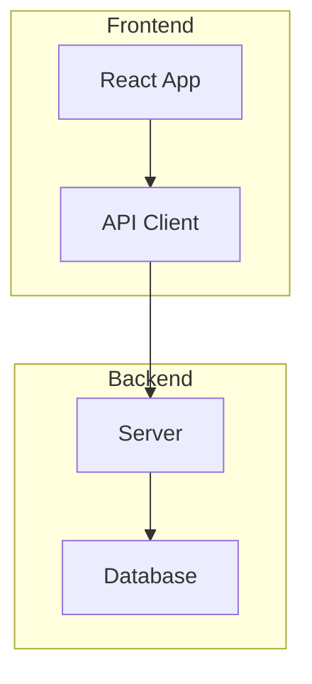
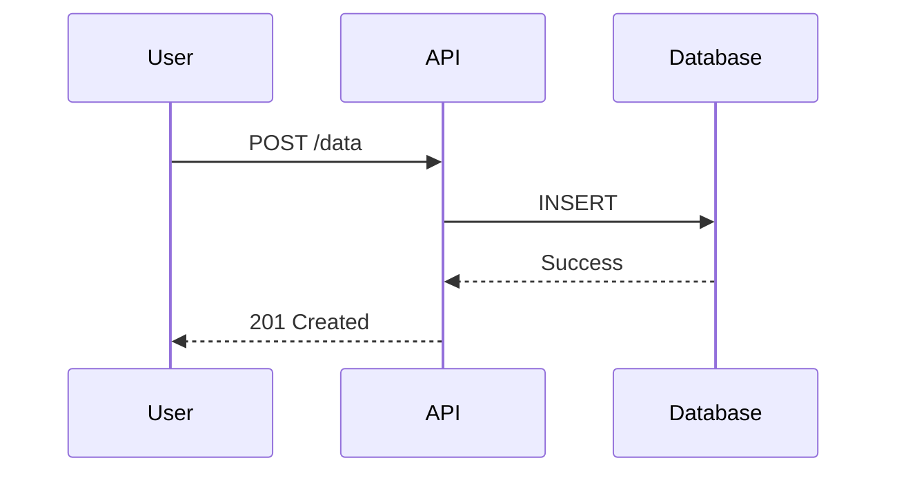

# Plan-Collab: Collaborative Plan Review

A web interface for reviewing and commenting on Claude's implementation plans. Users can select text and add inline comments (like Google Docs), answer questions in a dedicated panel, and track plan versions.

## When to Use

Use this skill when:
- Entering plan mode to create detailed implementation plans
- User wants to review and comment on plans
- You need structured user feedback on implementation approaches
- Creating complex multi-step plans that benefit from user review

## Quick Start

### 1. Start Server and Open Plan

```bash
# Start the web server (finds available port automatically)
cd ~/.claude/skills/plan-collab/scripts
node cli.js start-server

# Open a plan in the browser
node cli.js open-plan ~/.claude/plans/my-feature.md
```

### 2. Get User Feedback

After user has reviewed and added comments:

```bash
# Fetch pending comments and answers
node cli.js get-feedback
```

Output:
```json
{
  "planPath": "~/.claude/plans/my-feature.md",
  "planName": "my-feature",
  "pending": {
    "comments": [
      {
        "selectedText": "use Redis for caching",
        "comment": "Can we use Memcached instead?",
        "status": "OPEN"
      }
    ],
    "answers": []
  },
  "summary": {
    "totalComments": 1,
    "openComments": 1,
    "pendingComments": 1
  }
}
```

### 3. Check Status

```bash
node cli.js status
```

## Server Management

### IMPORTANT: Always Check Status First

Before starting the server, ALWAYS check if it's already running:

```bash
node cli.js status
```

**If server is running** (response shows `"running": true`):
- DO NOT run `start-server` - use the existing instance
- Note the URL from the response (e.g., `http://localhost:3847`)
- Proceed directly to `open-plan`

**If server is not running** (response shows `"running": false`):
- Run `node cli.js start-server`

> **Note:** The `start-server` command is idempotent - if the server is already running, it returns `{"status": "already_running", ...}` and exits safely. However, checking status first is more efficient and avoids unnecessary startup attempts.

## Commands Reference

| Command | Description | Example |
|---------|-------------|---------|
| `start-server` | Start web server | `node cli.js start-server` |
| `stop-server` | Stop server | `node cli.js stop-server` |
| `open-plan <path>` | Open plan in browser | `node cli.js open-plan ~/.claude/plans/feature.md` |
| `get-feedback` | Get pending comments | `node cli.js get-feedback` |
| `sync-plan [path]` | Sync plan content | `node cli.js sync-plan` |
| `set-status <id\|path> <status>` | Set plan status | `node cli.js set-status ~/.claude/plans/feature.md done` |
| `status` | Check server status | `node cli.js status` |

## Plan Status Management

Plans in the queue have a status that tracks their lifecycle:

| Status | Meaning | Visual |
|--------|---------|--------|
| `pending` | Plan pushed, waiting for work | Normal appearance |
| `working` | Agent actively working on plan | Blue badge, pulsing border |
| `updated` | Plan content has been updated | Orange badge |
| `done` | Work complete or user dismissed | Green badge, muted appearance |

### Automatic Status Changes
- When you call `open-plan`: Status automatically set to `working`
- When plan content is updated: Status set to `updated`
- When exiting plan mode: Call `set-status <path> done`

### Manual Status Changes
Users can manually mark plans as done or reactivate them via hover buttons in the web UI.

### Example Workflow
```bash
# Start working on a plan (sets status to 'working')
node cli.js open-plan ~/.claude/plans/my-feature.md

# ... do work ...

# Mark plan as done when complete
node cli.js set-status ~/.claude/plans/my-feature.md done
```

## Web UI Features

### Text Selection Commenting
1. User selects text in the rendered plan
2. Comment popup appears
3. User types feedback and submits
4. Comment is anchored to the selected text

### Questions Panel
Claude's questions appear in a dedicated sidebar panel. Questions should use this format in the plan:

```markdown
> [!QUESTION]
> Which database should we use: PostgreSQL or MySQL?
> - Option A: PostgreSQL (better JSON support)
> - Option B: MySQL (team familiarity)
```

### Dark Mode
Toggle dark/light mode with the button in the header.

### Keyboard Shortcuts
- `Cmd+Enter` / `Ctrl+Enter`: Submit comment
- `Escape`: Cancel comment

## Workflow Integration

### When Creating Plans

1. Write plan to `~/.claude/plans/<plan-name>.md`
2. Check server status: `node cli.js status`
3. If server NOT running (`"running": false`): `node cli.js start-server`
4. Open plan: `node cli.js open-plan <path>`
5. Inform user: "I've opened the plan in your browser. Please review and add any comments."

### When Collecting Feedback

1. Wait for user signal ("done reviewing", "check my comments")
2. Fetch feedback: `node cli.js get-feedback`
3. Address each comment in your response
4. Update plan if needed

## Hook Integration (Optional)

Add to `.claude/settings.json` for automatic browser opening:

```json
{
  "hooks": {
    "PostToolUse": [
      {
        "matcher": "Write|Edit",
        "hooks": [
          {
            "type": "command",
            "command": "~/.claude/skills/plan-collab/scripts/on-plan-write.sh",
            "timeout": 10
          }
        ]
      }
    ]
  }
}
```

This automatically opens the browser when you write to `~/.claude/plans/`.

## Data Storage

### Plan Files
- Location: `~/.claude/plans/*.md`
- Format: Standard markdown

### Database
- Location: `~/.plan-collab/plan-collab.db`
- Stores: Plans, versions, comments, questions

### Feedback Files
- Location: `~/.claude/plans/<name>.feedback.json`
- Auto-generated with user feedback

## Setup

### First-Time Setup

```bash
# Install CLI dependencies (none required - uses Node.js built-ins)
cd ~/.claude/skills/plan-collab/scripts

# Install webapp dependencies
cd ~/.claude/skills/plan-collab/webapp
npm install

# Build for production
npm run build
```

### Requirements
- Node.js 18+
- Modern browser (Chrome, Firefox, Safari, Edge)

## Error Handling

All CLI commands output JSON. Errors include:
```json
{ "error": "Error message here" }
```

Common errors:
- `Server not running`: Run `start-server` first
- `Plan not found`: Check file path exists
- `No active plan`: Run `open-plan` first

## Best Practices

1. **One plan at a time**: Only one plan can be actively reviewed
2. **Poll for feedback**: Don't poll automatically; wait for user signal
3. **Address all comments**: Respond to each feedback item
4. **Version tracking**: Each plan change creates a new version
5. **Question format**: Use `> [!QUESTION]` blocks for structured questions

## Mermaid Diagram Best Practices

Include Mermaid diagrams in plans to visualize complex concepts. The plan-collab web UI renders them beautifully.

### Recommended Diagram Types

| Type | Use Case | Example |
|------|----------|---------|
| `flowchart` | System architecture, decision trees | Component relationships |
| `sequenceDiagram` | API interactions, data flow | Request/response cycles |
| `stateDiagram-v2` | State machines, workflows | Order status transitions |
| `erDiagram` | Database schema | Data model visualization |

### Example: System Architecture



### Example: API Flow



### When to Include Diagrams

- Multi-step processes or workflows
- System architecture changes
- API design or data flow
- Database schema modifications
- Component relationships

## Working Directory

CLI commands should be run from:
```
~/.claude/skills/plan-collab/scripts/
```

Or use full paths:
```bash
node ~/.claude/skills/plan-collab/scripts/cli.js <command>
```
