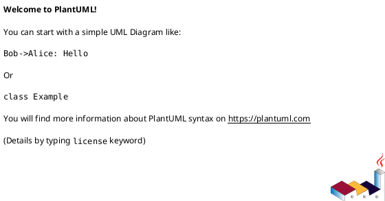
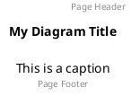
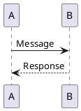
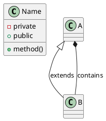
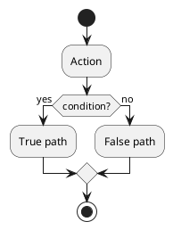
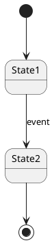
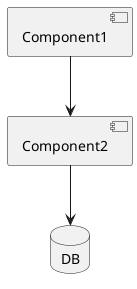

# PlantUML Syntax Reference

## Overview

PlantUML is a Java-based tool that creates diagrams from text descriptions. It supports comprehensive UML diagrams and many non-UML diagram types.

**Key advantages:**

- Most comprehensive diagram support (15+ types)
- Mature C4 model integration with icons/sprites
- Extensive customization options
- Battle-tested (since 2009)

**Requirements:**

- Java Runtime Environment (JRE)
- GraphViz (for some diagram types)
- Or use Docker: `docker run -p 8080:8080 plantuml/plantuml-server`

---

## Diagram Types Quick Reference

### UML Diagrams

| Type | Keywords | Best For |
| --- | --- | --- |
| Sequence | `@startuml` | Interactions, API flows, protocols |
| Use Case | `@startuml` | Requirements, user stories |
| Class | `@startuml` | OOP design, domain models |
| Activity | `@startuml` | Workflows, processes |
| Component | `@startuml` | System structure |
| Deployment | `@startuml` | Infrastructure, deployment |
| State | `@startuml` | State machines |

### Non-UML Diagrams

| Type | Keywords | Best For |
| --- | --- | --- |
| JSON | `@startjson` | JSON structure visualization |
| YAML | `@startyaml` | YAML structure visualization |
| Wireframe | `@startsalt` | UI mockups |
| Gantt | `@startgantt` | Project timelines |
| MindMap | `@startmindmap` | Hierarchical ideas |
| WBS | `@startwbs` | Work breakdown |
| ER | `@startuml` | Database schemas |
| C4 | `@startuml` with C4 include | Software architecture |

---

## Basic Syntax

All PlantUML diagrams are wrapped in start/end tags:

**Comments:**

- Single line: `' This is a comment`
- Block: `/' This is a block comment '/`

**Title and captions:**

---

## Quick Reference Card

### Sequence

### Class

### Activity

### State

### Component

---

## References

For detailed syntax and complete examples, see:

| Reference | Content | When to Load |
| --- | --- | --- |
| [sequence.md](references/sequence.md) | Participants, arrows, activation, groups, notes | Creating sequence diagrams |
| [class.md](references/class.md) | Classes, visibility, relationships, cardinality | Creating class diagrams |
| [activity.md](references/activity.md) | Conditions, swimlanes, fork/join | Creating activity diagrams |
| [state-component.md](references/state-component.md) | State machines, components, deployment | Creating state/component diagrams |
| [c4.md](references/c4.md) | C4 context, container, component diagrams | Creating C4 architecture diagrams |
| [special-diagrams.md](references/special-diagrams.md) | ER, JSON, MindMap, Gantt | Creating non-UML diagrams |
| [styling-setup.md](references/styling-setup.md) | Skinparams, themes, installation | Customizing diagrams, setting up PlantUML |

---

## File Extensions

| Extension | Description |
| --- | --- |
| `.puml` | Standard PlantUML file |
| `.plantuml` | Alternative extension |
| `.pu` | Short extension |
| `.iuml` | Include file |

---

## Test Scenarios

### Scenario 1: Creating a sequence diagram

**Query:** "Create a PlantUML sequence diagram for user authentication"

**Expected:** Skill activates, provides sequence syntax with participants, arrows, and alt/else blocks

### Scenario 2: Creating a class diagram

**Query:** "Generate a PlantUML class diagram for an e-commerce domain"

**Expected:** Skill activates, provides class syntax with relationships and cardinality

### Scenario 3: Creating a C4 diagram

**Query:** "Create a C4 container diagram in PlantUML"

**Expected:** Skill activates, directs to c4.md reference for includes and syntax

---

**Last Updated:** 2025-12-28
**PlantUML Version:** 1.2024.6

## Version History

- **v1.1.0** (2025-12-28): Refactored to progressive disclosure - extracted content to references/
- **v1.0.0** (2025-12-26): Initial release
