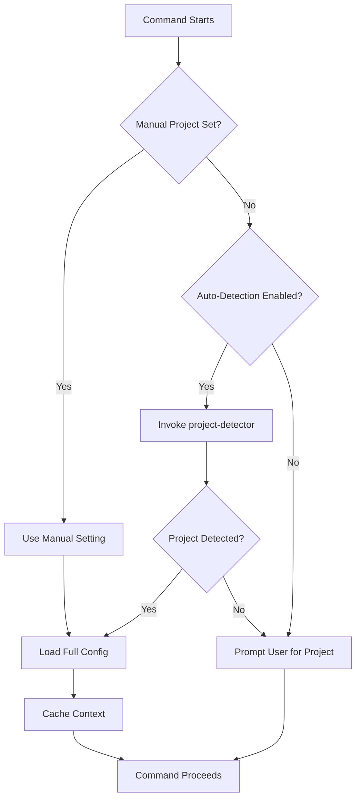

# Project Detection Skill

This skill ensures every CCPM command has the correct project context. It auto-activates to provide seamless project detection without user intervention.

## Instructions

### Automatic Activation

This skill activates automatically:
- **At command start**: Before any CCPM command executes
- **Context validation**: When project context is needed
- **Error recovery**: When project detection fails

### Core Detection Flow



### Detection Priority Order

1. **Manual Setting** (Highest Priority)
   - User explicitly set: `/ccpm:project:set my-project`
   - Stored in `context.current_project`
   - Overrides all auto-detection

2. **Git Remote URL Match**
   - Match current git remote against `projects.*.repository.url`
   - Normalizes git@ and https:// URLs
   - Works in any subdirectory of repo

3. **Subdirectory Pattern Match** (NEW)
   - Check if CWD is in project's `local_path`
   - Match against `context.detection.subdirectories` patterns
   - Returns project + active subproject
   - Supports glob patterns

4. **Local Path Match**
   - Match CWD against `projects.*.repository.local_path`
   - Uses longest-match-wins
   - No subproject info

5. **Custom Patterns**
   - Match against `context.detection.patterns`
   - User-defined glob patterns
   - Flexible for non-standard setups

### Agent Integration

**Always use the project-detector agent**:

```javascript
// At the start of every command
const detection = Task(project-detector): `
Detect active project

Environment:
- Current directory: ${cwd}
- Git remote: ${gitRemote}
- Config: ~/.claude/ccpm-config.yaml
`

if (detection.error) {
  // Handle no project detected
  console.error(detection.error.message)
  detection.error.suggestions.forEach(s => console.log(s))
  return
}

// Cache for command duration
const PROJECT_CONTEXT = {
  id: detection.project_id,
  name: detection.project_name,
  subproject: detection.subproject,
  method: detection.detection_method
}
```

### Monorepo Detection

For monorepos with multiple sub-projects:

#### Configuration

```yaml
projects:
  my-monorepo:
    repository:
      url: https://github.com/org/monorepo
      local_path: /Users/dev/monorepo

    context:
      detection:
        subdirectories:
          - subproject: web-app
            match_pattern: "*/apps/web/*"
            priority: 10

          - subproject: mobile-app
            match_pattern: "*/apps/mobile/*"
            priority: 10

          - subproject: api-server
            match_pattern: "*/services/api/*"
            priority: 10

    code_repository:
      subprojects:
        - name: web-app
          path: apps/web
          tech_stack:
            frontend: [react, nextjs]

        - name: mobile-app
          path: apps/mobile
          tech_stack:
            frontend: [react-native, expo]
```

#### Detection Examples

**Example 1: Web App Directory**
```bash
$ cd /Users/dev/monorepo/apps/web/src/components
$ /ccpm:plan "Add dark mode"

# Detection flow:
# 1. Git remote → matches "my-monorepo" ✓
# 2. Subdirectory → CWD matches "*/apps/web/*" ✓
# 3. Result: project="my-monorepo", subproject="web-app"

# Display:
📋 Project: My Monorepo › web-app
🛠️ Tech Stack: React, Next.js

# Linear labels: [my-monorepo, web-app, planning]
```

**Example 2: Mobile App Directory**
```bash
$ cd /Users/dev/monorepo/apps/mobile
$ /ccpm:work WORK-123

# Detection:
# → project="my-monorepo", subproject="mobile-app"

# Display:
📋 Project: My Monorepo › mobile-app
🛠️ Tech Stack: React Native, Expo
```

**Example 3: Repository Root**
```bash
$ cd /Users/dev/monorepo
$ /ccpm:project:list

# Detection:
# 1. Git remote → matches "my-monorepo" ✓
# 2. Subdirectory → CWD at root, no pattern match
# 3. Result: project="my-monorepo", subproject=null

# Display:
📋 Project: My Monorepo
⭐ Active (Git remote match)
```

### Pattern Matching Logic

**Glob Patterns Supported**:

```yaml
# Match any path containing /frontend/
"*/frontend/*"

# Match specific nesting
"apps/web/src/*"

# Match multiple levels
"**/services/**"

# Match alternatives (requires extension)
"apps/{web,mobile}/*"
```

**Priority Handling**:

When multiple patterns match, higher priority wins:

```yaml
subdirectories:
  # Specific pattern (high priority)
  - subproject: admin-panel
    match_pattern: "*/apps/web/admin/*"
    priority: 20

  # General pattern (lower priority)
  - subproject: web-app
    match_pattern: "*/apps/web/*"
    priority: 10

# Working in: /apps/web/admin/users
# Both patterns match, but "admin-panel" wins (priority 20 > 10)
```

### Context Display

**In Command Headers**:
```
📋 Project: My Monorepo › frontend
```

**In Status Displays**:
```
━━━━━━━━━━━━━━━━━━━━━━━━━━━━━━━━━━━━━━━━━
📋 Active Project
━━━━━━━━━━━━━━━━━━━━━━━━━━━━━━━━━━━━━━━━━

Project:     My Monorepo
Subproject:  frontend
Tech Stack:  React, TypeScript, Vite
Location:    /Users/dev/monorepo/apps/frontend
Detection:   Auto (subdirectory match)

━━━━━━━━━━━━━━━━━━━━━━━━━━━━━━━━━━━━━━━━━
```

### Error Handling

#### Scenario 1: No Project Detected

**Situation**: User runs command outside any configured project

**Detection Result**:
```javascript
{
  error: {
    code: "NO_PROJECT_DETECTED",
    message: "Could not detect active project",
    suggestions: [
      "Set active project: /ccpm:project:set <project-id>",
      "Enable auto-detection: /ccpm:project:set auto",
      "Check current directory is within a configured project",
      "List projects: /ccpm:project:list"
    ]
  }
}
```

**Command Response**:
```
❌ Could not detect active project

You are currently in: /Users/dev/random-project

CCPM couldn't match this to any configured project.

Options:
1. Set a specific project:
   /ccpm:project:set <project-id>

2. Enable auto-detection and cd to a configured project:
   /ccpm:project:set auto
   cd ~/my-project

3. Add this project to CCPM:
   /ccpm:project:add new-project

4. See all configured projects:
   /ccpm:project:list
```

#### Scenario 2: Ambiguous Detection

**Situation**: Multiple projects match (rare, but possible)

**Detection Result**:
```javascript
{
  error: {
    code: "AMBIGUOUS_PROJECT",
    message: "Multiple projects match current context",
    candidates: [
      { project: "my-monorepo", reason: "Git remote matches" },
      { project: "local-clone", reason: "Working directory matches" }
    ]
  }
}
```

**Command Response**:
```
⚠️  Multiple projects match your current location

Candidates:
1. my-monorepo (Git remote: github.com/org/monorepo)
2. local-clone (Local path: /Users/dev/monorepo)

Please specify which project:
/ccpm:project:set my-monorepo

Or disable one detection method in config.
```

#### Scenario 3: Configuration Error

**Situation**: Project detected but config invalid

**Command Response**:
```
❌ Project configuration error

Project 'my-project' detected but has errors:
- Missing required field: linear.team
- Missing required field: linear.project

Fix with:
/ccpm:project:update my-project --field linear.team

Or edit config manually:
~/.claude/ccpm-config.yaml
```

### Auto-Detection vs Manual Setting

#### Manual Setting (Stable)

**Use When**:
- Working exclusively on one project
- Want consistent context across sessions
- Terminal multiplexing (tmux, iTerm tabs)

**How**:
```bash
/ccpm:project:set my-project

# Now ALL commands use my-project, regardless of directory
```

**Pros**:
- Consistent everywhere
- No surprises
- Fast (no detection needed)

**Cons**:
- Must manually switch projects
- Not ideal for monorepo workflows

#### Auto-Detection (Flexible)

**Use When**:
- Working on multiple projects
- Monorepo with subdirectories
- Frequent project switching

**How**:
```bash
/ccpm:project:set auto

# Now commands detect based on directory/git
cd ~/monorepo/apps/frontend  # → project: monorepo, sub: frontend
cd ~/other-project           # → project: other-project
```

**Pros**:
- Seamless project switching
- Natural workflow (cd = switch)
- Ideal for monorepos

**Cons**:
- Small detection overhead
- Must be in correct directory

### Performance Considerations

**Detection Speed**:
- **Manual setting**: 0ms (instant lookup)
- **Auto-detection**: <100ms (cached after first)

**Caching**:
```javascript
// Detect once per command
if (!CACHED_CONTEXT) {
  CACHED_CONTEXT = Task(project-detector): "Detect project"
}

// Reuse for entire command
const project = CACHED_CONTEXT.project_id
```

**Optimization**:
- Config file read once, cached
- Git operations cached per session
- Pattern matching is fast (string ops)

### Integration with Commands

**Every CCPM command should start with**:

```markdown
## Step 1: Detect Project Context

Skill(project-detection): This auto-activates

Task(project-detector): `
Detect active project
`

If detection succeeds → proceed
If detection fails → show error and exit
```

**Then load full config**:

```markdown
## Step 2: Load Project Configuration

Task(project-config-loader): `
Load configuration for project: ${PROJECT_ID}
Include subproject: ${SUBPROJECT}
Validate: true
`
```

### Testing Scenarios

1. **Git Remote Match**: In repo with matching remote
2. **Subdirectory Match**: In monorepo subdir
3. **Manual Override**: Manual setting overrides auto
4. **No Match**: Outside any project
5. **Nested Subdirs**: In deeply nested subdir
6. **Priority Conflict**: Multiple patterns match

### Troubleshooting Guide

**Problem**: "No project detected" but I'm in a project

**Solution**:
```bash
# Check config file exists
ls -la ~/.claude/ccpm-config.yaml

# Check git remote matches
git remote get-url origin
# Compare with config: projects.*.repository.url

# Check local path if set
pwd
# Compare with config: projects.*.repository.local_path

# Try manual setting
/ccpm:project:set <project-id>
```

**Problem**: "Wrong subproject detected"

**Solution**:
```bash
# Check subdirectory patterns in config
cat ~/.claude/ccpm-config.yaml | grep -A 20 "subdirectories:"

# Verify pattern matches current path
pwd
# Should match one of the patterns

# Adjust pattern or priority if needed
/ccpm:project:update <project-id> --field context.detection.subdirectories
```

**Problem**: "Detection is slow"

**Solution**:
- Switch to manual setting: `/ccpm:project:set <project-id>`
- Reduce number of detection patterns
- Disable unused detection methods in config

### Best Practices

1. **Enable Auto-Detection**: Best for natural workflow
2. **Configure Subdirectories**: Essential for monorepos
3. **Set Priorities**: More specific patterns = higher priority
4. **Validate Patterns**: Test after configuration changes
5. **Cache Context**: Detect once, use throughout command
6. **Handle Errors**: Always provide actionable suggestions

### Related Skills & Agents

**Skills**:
- `project-operations` - Overall project management guidance
- `pm-workflow-guide` - Workflow guidance with project context

**Agents**:
- `project-detector` - Detection implementation
- `project-config-loader` - Config loading
- `project-context-manager` - Context management

### Maintenance

**When to update**:
- New detection methods added
- Pattern matching logic changes
- New project templates
- Performance optimizations

**Update locations**:
- This skill (guidance)
- `project-detector` agent (implementation)
- Command templates (integration)
- Documentation (user guides)
