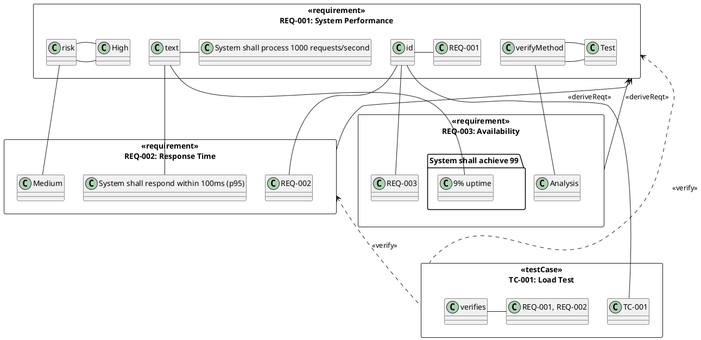
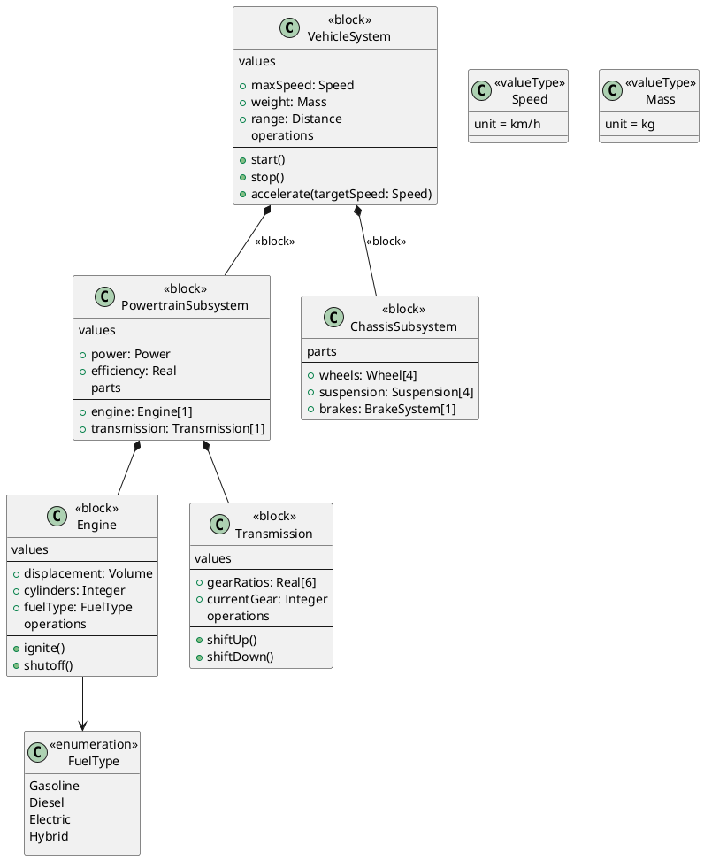
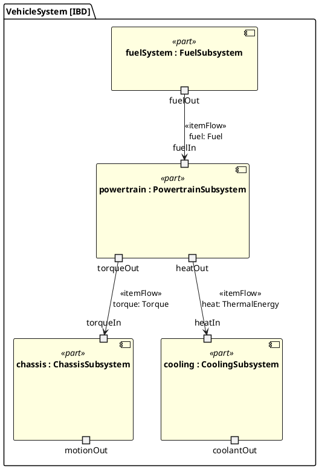
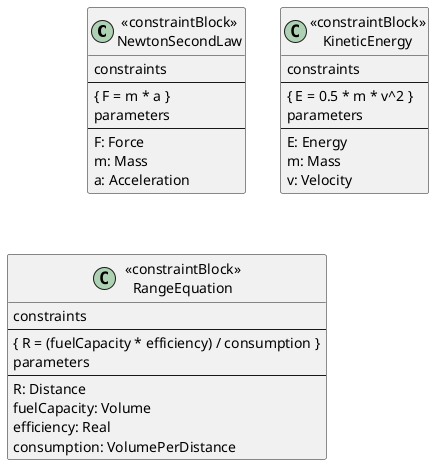
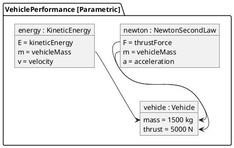
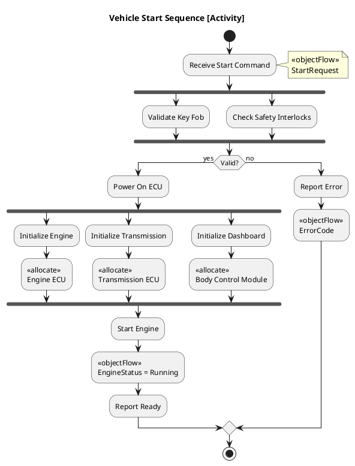
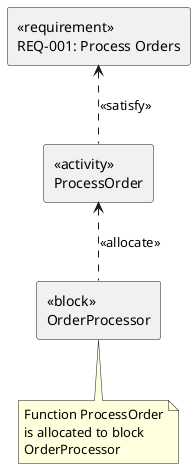

# SysML Modeling Skill

## When to Use This Skill

Use this skill when:

- **Sysml Modeling tasks** - Working on systems modeling language (sysml) for systems engineering and complex system design
- **Planning or design** - Need guidance on Sysml Modeling approaches
- **Best practices** - Want to follow established patterns and standards

## Overview

Systems Modeling Language (SysML) for Model-Based Systems Engineering (MBSE) and complex system design.

## MANDATORY: Documentation-First Approach

Before creating SysML models:

1. **Invoke `docs-management` skill** for systems engineering patterns
2. **Verify SysML 2.0 syntax** via MCP servers
3. **Base all guidance on OMG SysML specification**

## SysML vs UML

| Aspect | UML | SysML |
|--------|-----|-------|
| Focus | Software systems | Systems of all types |
| Requirements | Not included | First-class diagrams |
| Structure | Classes, Components | Blocks, Parts |
| Parametrics | Not included | Constraint blocks |
| Allocation | Not included | Allocation relationships |
| Domain | Software engineering | Systems engineering |

## SysML Diagram Types

### Behavior Diagrams

| Diagram | Purpose | From UML |
|---------|---------|----------|
| Activity | Flow of actions and data | Extended |
| Sequence | Object interactions over time | Same |
| State Machine | Lifecycle behavior | Same |
| Use Case | System-actor interactions | Same |

### Structure Diagrams

| Diagram | Purpose | SysML Specific |
|---------|---------|----------------|
| Block Definition (BDD) | System structure hierarchy | Yes |
| Internal Block (IBD) | Internal component connections | Yes |
| Package | Model organization | Extended |

### Requirements Diagrams

| Diagram | Purpose | SysML Specific |
|---------|---------|----------------|
| Requirements | Requirements and relationships | Yes |
| Parametric | Constraint equations | Yes |

## Requirements Diagram

### PlantUML Syntax



### Requirements Relationships

```text
<<deriveReqt>>    Derived requirement (child from parent)
<<refine>>        Element refines requirement
<<satisfy>>       Design element satisfies requirement
<<verify>>        Test case verifies requirement
<<trace>>         General traceability
<<copy>>          Requirement copied (reuse)
<<containment>>   Nested requirement
```

## Block Definition Diagram (BDD)

### PlantUML Syntax



### Block Stereotypes

```text
<<block>>           System element (hardware, software, human)
<<constraintBlock>> Parametric constraint
<<valueType>>       Type with unit
<<flowPort>>        Flow of matter/energy/data
<<proxy>>           Proxy for external element
<<full>>            Full internal access
```

## Internal Block Diagram (IBD)

### PlantUML Syntax



## Parametric Diagram

### Constraint Blocks



### Parametric Usage



## Activity Diagram (Enhanced)

### SysML Extensions



### Object Flow and Control Flow

```text
Control Flow: Sequence of actions (solid arrow)
Object Flow: Data/material flow (dashed arrow with <<objectFlow>>)
Rate: Flow rate specification { rate = 100/sec }
Probability: Branch probability { probability = 0.8 }
Streaming: Continuous flow { streaming }
```

## Allocation

### Allocation Relationships



### Allocation Matrix

```text
| Function/Behavior | Allocated To (Block) |
|-------------------|----------------------|
| ProcessOrder      | OrderProcessor       |
| ValidatePayment   | PaymentGateway       |
| ShipOrder         | FulfillmentSystem    |
| NotifyCustomer    | NotificationService  |
```

## C# Model Representation

```csharp
// SysML Block as C# class
public abstract class Block
{
    public string Name { get; init; }
    public IReadOnlyDictionary<string, object> Values { get; init; }
    public IReadOnlyList<Block> Parts { get; init; }
    public IReadOnlyList<Port> Ports { get; init; }
}

public sealed class VehicleSystem : Block
{
    // Value properties
    public Speed MaxSpeed { get; init; }
    public Mass Weight { get; init; }
    public Distance Range { get; init; }

    // Parts
    public PowertrainSubsystem Powertrain { get; init; }
    public ChassisSubsystem Chassis { get; init; }
    public CoolingSubsystem Cooling { get; init; }

    // Operations
    public void Start() { /* ... */ }
    public void Stop() { /* ... */ }
    public void Accelerate(Speed targetSpeed) { /* ... */ }
}

// Value Types with Units
public readonly record struct Speed(double Value, SpeedUnit Unit = SpeedUnit.KmPerHour)
{
    public static Speed FromKmPerHour(double value) => new(value, SpeedUnit.KmPerHour);
    public static Speed FromMilesPerHour(double value) =>
        new(value * 1.60934, SpeedUnit.KmPerHour);
}

public readonly record struct Mass(double Value, MassUnit Unit = MassUnit.Kilogram);
public readonly record struct Distance(double Value, DistanceUnit Unit = DistanceUnit.Kilometer);

// Constraint Block
public sealed class NewtonSecondLaw : IConstraint
{
    public Force CalculateForce(Mass mass, Acceleration acceleration)
        => new(mass.Value * acceleration.Value);

    public Acceleration CalculateAcceleration(Force force, Mass mass)
        => new(force.Value / mass.Value);
}

// Requirement
public sealed record Requirement(
    string Id,
    string Text,
    RiskLevel Risk,
    VerificationMethod VerifyMethod,
    IReadOnlyList<string> DerivedFrom,
    IReadOnlyList<string> SatisfiedBy,
    IReadOnlyList<string> VerifiedBy);

public enum RiskLevel { Low, Medium, High }
public enum VerificationMethod { Analysis, Inspection, Demonstration, Test }
```

## MBSE Workflow

When creating SysML models:

1. **Define Requirements**: Capture stakeholder needs in requirements diagrams
2. **Model Structure**: Create BDD for system decomposition
3. **Define Interfaces**: Use IBD for part connections and flows
4. **Specify Behavior**: Activity, sequence, and state diagrams
5. **Add Constraints**: Parametric diagrams for physics/math
6. **Allocate Functions**: Map behaviors to structural elements
7. **Trace & Verify**: Link requirements through to verification

## Best Practices

### Model Organization

```text
Model
├── 1_Requirements/
│   ├── StakeholderNeeds.req
│   ├── SystemRequirements.req
│   └── DerivedRequirements.req
├── 2_Structure/
│   ├── SystemContext.bdd
│   ├── SystemArchitecture.bdd
│   └── Subsystems/
│       ├── PowertrainStructure.bdd
│       └── PowertrainInternal.ibd
├── 3_Behavior/
│   ├── UseCases.uc
│   ├── SystemSequences.seq
│   └── StateMachines/
│       └── VehicleStates.stm
├── 4_Parametrics/
│   └── PerformanceConstraints.par
└── 5_Allocation/
    └── FunctionAllocation.alloc
```

### Naming Conventions

| Element | Convention | Example |
|---------|------------|---------|
| Block | PascalCase noun | VehicleSystem |
| Part | camelCase noun | powertrain |
| Port | camelCase + In/Out | fuelIn, torqueOut |
| Requirement | REQ-### | REQ-001 |
| Constraint | PascalCase equation | NewtonSecondLaw |

## References

For detailed guidance:

---

**Last Updated:** 2025-12-26
