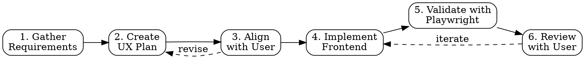

# /ui-ux-builder — Full-Lifecycle UI/UX Builder

Full-lifecycle UI/UX skill: requirements gathering -> design plan -> user alignment -> implementation -> visual validation using Playwright.

## When to Use

- Build or redesign UI for a web application
- Validate web app appearance against design specs
- Take screenshots of web pages
- Navigate and inspect page structure
- Compare implemented UI against design plans
- Check responsive layouts across breakpoints

## Prerequisites

- **Python 3.10+** (system `python3` or any project virtual environment)
- **Playwright + Chromium**: `pip install playwright && python -m playwright install chromium`
- The screenshot tool is at `${CLAUDE_PLUGIN_ROOT}/skills/ui-ux-builder/scripts/screenshot.py`
- The UX plan template is at `${CLAUDE_PLUGIN_ROOT}/skills/ui-ux-builder/template.md`
- A sample completed plan is at `${CLAUDE_PLUGIN_ROOT}/skills/ui-ux-builder/examples/sample.md`

### Resolving Paths

**NEVER hardcode absolute paths.** Always resolve dynamically:

1. Set `TOOL="${CLAUDE_PLUGIN_ROOT}/skills/ui-ux-builder/scripts/screenshot.py"`
2. Find Python by searching the project root in order:
   - `venv/bin/python`
   - `.venv/bin/python`
   - Any `venv_*/bin/python`
   - Fall back to system `python3`
3. Set `PYTHON` to the first match found
4. Use `$PYTHON $TOOL` in all commands

Example:
```bash
# Auto-detect python
if [ -f "venv/bin/python" ]; then PYTHON="venv/bin/python"
elif [ -f ".venv/bin/python" ]; then PYTHON=".venv/bin/python"
else PYTHON="python3"; fi

TOOL="${CLAUDE_PLUGIN_ROOT}/skills/ui-ux-builder/scripts/screenshot.py"
$PYTHON $TOOL http://localhost:3000 -o homepage.png
```

---

## Workflow

Follow this 6-phase lifecycle:



---

### Phase 1 — Gather Requirements

Ask the user about:

- **Purpose**: What is the app for? Who are the target users?
- **Pages/Views**: What pages or screens are needed?
- **Interactions**: Forms, buttons, modals, navigation?
- **Design constraints**: Color scheme, typography, design system (Tailwind, Material, etc.)?
- **Responsive needs**: Desktop-only? Mobile-first? Which breakpoints?
- **References**: Mockups, Figma links, inspiration sites?

Output a bulleted summary of gathered requirements. Use the template at `${CLAUDE_PLUGIN_ROOT}/skills/ui-ux-builder/template.md` to structure the summary.

---

### Phase 2 — Create UX Plan

Build a structured UX plan using the template. Include:

- **Page inventory** — table of routes, page names, and purposes
- **Component hierarchy** — tree diagram per page
- **Navigation flow** — ASCII diagram of page transitions
- **Interactive elements** — table of components, types, and behaviors
- **State management** — loading, empty, and error states
- **Responsive breakpoints** — layout changes at each breakpoint

Reference `${CLAUDE_PLUGIN_ROOT}/skills/ui-ux-builder/examples/sample.md` for a completed example.

---

### Phase 3 — Align with User

Present the plan section by section. Get explicit approval before proceeding to implementation. If the user requests changes, revise the plan and re-present.

---

### Phase 4 — Implement

Build the frontend per the approved plan:

1. Implement each page and component
2. Start the dev server
3. Confirm the app runs without errors

---

### Phase 5 — Validate with Playwright

Use the screenshot tool to visually validate the implementation.

#### Screenshot Commands

All commands use `$PYTHON $TOOL` variables — never absolute paths.

**Full page screenshot:**
```bash
$PYTHON $TOOL http://localhost:3000 -o homepage.png
```

**Element screenshot:**
```bash
$PYTHON $TOOL http://localhost:3000 --selector ".hero-section" -o hero.png
```

**Mobile viewport:**
```bash
$PYTHON $TOOL http://localhost:3000 --width 375 --height 812 -o mobile.png
```

**Device emulation:**
```bash
$PYTHON $TOOL http://localhost:3000 --device "iPhone 13" -o iphone.png
```

**Wait for dynamic content:**
```bash
$PYTHON $TOOL http://localhost:3000 --wait-for ".chart-container svg" --wait 3 -o charts.png
```

**Batch routes:**
```bash
$PYTHON $TOOL http://localhost:3000 --routes routes.txt -o ./screenshots/
```

**Page structure as JSON:**
```bash
$PYTHON $TOOL http://localhost:3000 --structure
```

#### Validation Workflow

1. Start the dev server
2. Screenshot each page at desktop resolution (1400px)
3. Read each screenshot using the Read tool to visually inspect
4. Get page structure with `--structure` and verify elements match the plan
5. Check responsive layouts at 1400px, 768px, and 375px widths
6. Compare screenshots against the UX plan
7. Report findings: matches, deviations, and issues

---

### Phase 6 — Review with User

- Present screenshots inline for the user to review
- Note what matches the plan and what deviates
- Iterate until the user approves the implementation

---

## Quick Reference

| Task | Command |
|---|---|
| Full page screenshot | `$PYTHON $TOOL <url> -o <file.png>` |
| Element screenshot | `$PYTHON $TOOL <url> --selector "<css>" -o <file.png>` |
| Mobile viewport | `$PYTHON $TOOL <url> --width 375 --height 812 -o <file.png>` |
| Device emulation | `$PYTHON $TOOL <url> --device "iPhone 13" -o <file.png>` |
| Wait for content | `$PYTHON $TOOL <url> --wait-for "<css>" --wait 3 -o <file.png>` |
| Batch routes | `$PYTHON $TOOL <url> --routes routes.txt -o ./screenshots/` |
| Page structure | `$PYTHON $TOOL <url> --structure` |
| No full page | `$PYTHON $TOOL <url> --no-full-page -o <file.png>` |

## Common Mistakes

| Mistake | Fix |
|---|---|
| Hardcoding absolute paths | Always use `$PYTHON` and `$TOOL` variables, resolve dynamically |
| App not running when screenshotting | Start the dev server first and confirm it responds |
| Charts/graphs not rendered | Use `--wait-for "<chart-selector>"` and `--wait 3` or more |
| Missing dynamic content | Add `--wait-for` for content loaded via JS/API calls |
| Forgetting error/empty states | Validate all states from the UX plan, not just the happy path |
| Skipping mobile validation | Always check at least 3 breakpoints: 1400, 768, 375 |

## Standalone Screenshot Usage

The screenshot tool works independently for any screenshot task without following the full lifecycle. Use it anytime you need to:

- Capture a webpage screenshot
- Inspect page structure
- Validate that a URL renders correctly
- Compare visual output before and after changes

Just resolve `$PYTHON` and `$TOOL` as described in Prerequisites, then run any command from the Quick Reference table.
