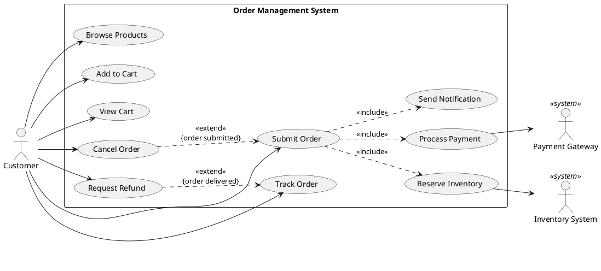
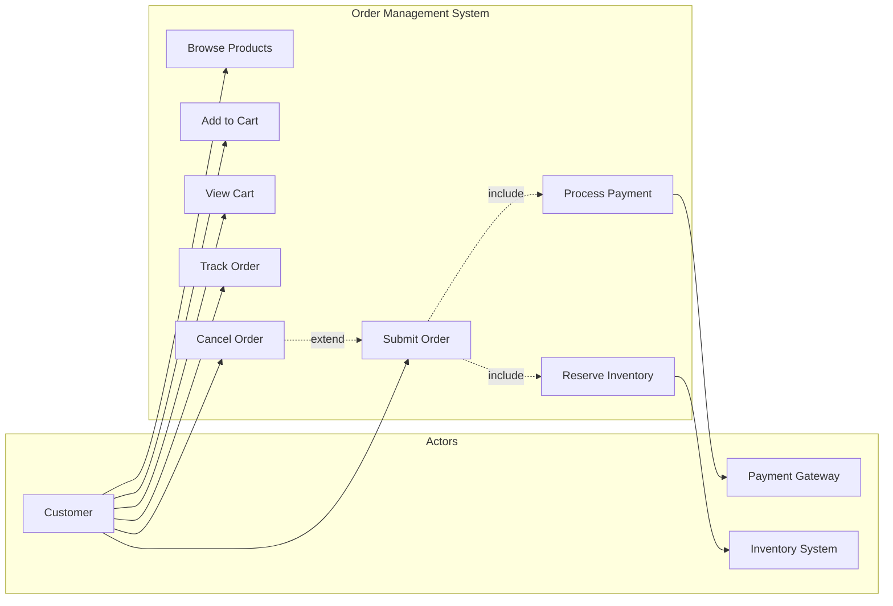

# Use Case Authoring Skill

Use Case 2.0 methodology for capturing functional requirements and documenting actor-system interactions.

## MANDATORY: Documentation-First Approach

Before authoring use cases:

1. **Invoke `docs-management` skill** for requirements patterns
2. **Verify Use Case 2.0 methodology** via MCP servers
3. **Base all guidance on Ivar Jacobson's Use Case 2.0**

## Use Case 2.0 Overview

Use Case 2.0 is a scalable, agile practice for capturing requirements:

| Aspect | Description |
|--------|-------------|
| Lightweight | Start minimal, elaborate as needed |
| Scalable | Works for small and large systems |
| Agile-Friendly | Supports iterative development |
| Traceable | Links to tests and implementation |

## Use Case Structure

### Use Case Specification Template

```markdown
# Use Case: Submit Order

**ID:** UC-ORD-001
**Version:** 1.2
**Author:** System Analyst

## Brief Description
Customer submits a draft order for processing, triggering inventory reservation and payment processing.

## Actors
| Actor | Type | Description |
|-------|------|-------------|
| Customer | Primary | Person placing the order |
| Payment Gateway | Supporting | External payment processor |
| Inventory System | Supporting | Manages product stock |

## Preconditions
1. Customer is authenticated
2. Order exists in Draft status
3. Order contains at least one item
4. Customer has valid payment method on file

## Postconditions
### Success Postconditions
1. Order status changed to Submitted
2. Inventory reserved for all items
3. Payment authorization obtained
4. Confirmation notification sent to customer

### Failure Postconditions
1. Order remains in Draft status
2. No inventory changes made
3. Customer notified of failure reason

## Basic Flow (Happy Path)

| Step | Actor | System |
|------|-------|--------|
| 1 | Customer selects "Submit Order" | |
| 2 | | System validates order contents |
| 3 | | System checks inventory availability |
| 4 | | System reserves inventory for all items |
| 5 | | System calculates order total (subtotal + tax + shipping) |
| 6 | | System requests payment authorization from Payment Gateway |
| 7 | | Payment Gateway authorizes payment |
| 8 | | System updates order status to Submitted |
| 9 | | System sends confirmation email to Customer |
| 10 | | System displays order confirmation page |

## Alternative Flows

### AF1: Partial Inventory Available
**Trigger:** Step 3 - Some items unavailable
| Step | Actor | System |
|------|-------|--------|
| 3a | | System identifies unavailable items |
| 3b | | System displays unavailable items to Customer |
| 3c | Customer chooses: Remove items / Wait for restock / Cancel | |
| 3d | | If remove: System updates order, returns to step 3 |
| 3e | | If wait: System creates backorder, continues to step 4 |
| 3f | | If cancel: End use case (order unchanged) |

### AF2: Payment Declined
**Trigger:** Step 7 - Payment authorization fails
| Step | Actor | System |
|------|-------|--------|
| 7a | | Payment Gateway returns decline reason |
| 7b | | System releases reserved inventory |
| 7c | | System displays payment error to Customer |
| 7d | Customer updates payment method | |
| 7e | | System returns to step 6 |
| 7f | | After 3 failed attempts: End use case (Failure) |

### AF3: Customer Cancels
**Trigger:** Any step - Customer clicks Cancel
| Step | Actor | System |
|------|-------|--------|
| *a | Customer selects "Cancel" | |
| *b | | System releases any reserved inventory |
| *c | | System returns to order details page |
| *d | | End use case (order remains Draft) |

## Exception Flows

### EF1: System Unavailable
**Trigger:** Any step - System component unreachable
| Step | System |
|------|--------|
| 1 | System detects component unavailability |
| 2 | System logs error with correlation ID |
| 3 | System displays "Service temporarily unavailable" message |
| 4 | System suggests retry in 5 minutes |
| 5 | End use case |

### EF2: Session Timeout
**Trigger:** Any step - Customer session expires
| Step | System |
|------|--------|
| 1 | System detects expired session |
| 2 | System saves order state (if possible) |
| 3 | System redirects to login page |
| 4 | After re-login: Resume at last completed step |

## Business Rules
| ID | Rule |
|----|------|
| BR-001 | Order must contain at least one item |
| BR-002 | All items must have positive quantity |
| BR-003 | Payment authorization must be obtained before status change |
| BR-004 | Inventory must be reserved atomically (all or none) |
| BR-005 | Confirmation email must be sent within 30 seconds |

## Non-Functional Requirements
| ID | Category | Requirement |
|----|----------|-------------|
| NFR-001 | Performance | Order submission completes within 3 seconds (p95) |
| NFR-002 | Availability | Service available 99.9% of time |
| NFR-003 | Scalability | Support 1000 concurrent submissions |
| NFR-004 | Security | All payment data encrypted in transit |

## UI Mockups / Wireframes
- Order Summary Page: [Link to mockup]
- Payment Confirmation: [Link to mockup]
- Error States: [Link to mockup]

## Related Use Cases
| Use Case | Relationship |
|----------|--------------|
| UC-ORD-002: Cancel Order | Extension |
| UC-PAY-001: Process Payment | Include |
| UC-INV-001: Reserve Inventory | Include |
| UC-NOT-001: Send Notification | Include |

## Test Scenarios
| Scenario ID | Description | Steps Covered |
|-------------|-------------|---------------|
| TS-001 | Happy path submission | Basic Flow 1-10 |
| TS-002 | Partial inventory | AF1 |
| TS-003 | Payment decline and retry | AF2 |
| TS-004 | Customer cancellation | AF3 |
| TS-005 | Session timeout recovery | EF2 |

## Revision History
| Version | Date | Author | Changes |
|---------|------|--------|---------|
| 1.0 | 2025-01-01 | J. Smith | Initial version |
| 1.1 | 2025-01-10 | J. Smith | Added AF2 payment retry logic |
| 1.2 | 2025-01-15 | M. Jones | Added NFR-003 scalability requirement |
```

## Use Case Diagram

### PlantUML Syntax



### Mermaid Syntax



## Use Case Slices

Use Case 2.0 introduces **slices** for incremental implementation:

### Slice Definition

```markdown
# Use Case Slice: Submit Order - Basic Flow

**Use Case:** UC-ORD-001: Submit Order
**Slice ID:** UC-ORD-001-S01
**Priority:** High
**Sprint:** Sprint 3

## Scope
This slice implements the basic happy path for order submission without alternative flows.

## Flows Included
- Basic Flow: Steps 1-10

## Flows Excluded (Future Slices)
- AF1: Partial Inventory (Slice S02)
- AF2: Payment Declined (Slice S02)
- AF3: Customer Cancels (Slice S03)

## Acceptance Criteria
```gherkin
Feature: Submit Order - Basic Flow

  Scenario: Successfully submit a valid order
    Given I am logged in as a customer
    And I have a draft order with 2 items
    And all items are in stock
    And I have a valid payment method
    When I click "Submit Order"
    Then my order status should be "Submitted"
    And I should receive a confirmation email
    And I should see the confirmation page

## Stories
| Story ID | Description | Points |
|----------|-------------|--------|
| US-301 | As a customer, I want to submit my order | 5 |
| US-302 | As a customer, I want confirmation after submission | 2 |
| US-303 | As the system, I need to reserve inventory | 3 |
```

## Actor Catalog

```markdown
# Actor Catalog

## Human Actors

### Customer
**Description:** End user who browses products and places orders
**Goals:**
- Find products quickly
- Complete purchases efficiently
- Track order status
- Get support when needed

**Characteristics:**
- May have varying technical proficiency
- Expects responsive, intuitive interface
- Values order status transparency

### Administrator
**Description:** System operator who manages platform configuration
**Goals:**
- Configure system settings
- Monitor system health
- Manage user accounts
- Generate reports

## System Actors

### Payment Gateway
**Type:** External System
**Description:** Third-party payment processor (Stripe, PayPal)
**Interface:** REST API
**Interactions:**
- Authorize payments
- Capture payments
- Process refunds

### Inventory System
**Type:** External System
**Description:** Warehouse management system
**Interface:** Message Queue (RabbitMQ)
**Interactions:**
- Check availability
- Reserve inventory
- Release inventory
- Confirm shipment

### Notification Service
**Type:** Internal System
**Description:** Email and SMS notification dispatcher
**Interface:** Internal API
**Interactions:**
- Send confirmation emails
- Send shipping updates
- Send promotional messages
```

## C# Implementation Mapping

```csharp
// Use Case to Application Service mapping
public interface ISubmitOrderUseCase
{
    /// <summary>
    /// Executes UC-ORD-001: Submit Order
    /// </summary>
    /// <remarks>
    /// Basic Flow: Steps 1-10
    /// Preconditions: Customer authenticated, order in Draft, has items
    /// Postconditions: Order Submitted, inventory reserved, payment authorized
    /// </remarks>
    Task<Result<OrderConfirmation>> ExecuteAsync(
        SubmitOrderCommand command,
        CancellationToken ct = default);
}

public sealed class SubmitOrderUseCase : ISubmitOrderUseCase
{
    private readonly IOrderRepository _orders;
    private readonly IInventoryService _inventory;
    private readonly IPaymentGateway _payments;
    private readonly INotificationService _notifications;
    private readonly ILogger<SubmitOrderUseCase> _logger;

    public SubmitOrderUseCase(
        IOrderRepository orders,
        IInventoryService inventory,
        IPaymentGateway payments,
        INotificationService notifications,
        ILogger<SubmitOrderUseCase> logger)
    {
        _orders = orders;
        _inventory = inventory;
        _payments = payments;
        _notifications = notifications;
        _logger = logger;
    }

    public async Task<Result<OrderConfirmation>> ExecuteAsync(
        SubmitOrderCommand command,
        CancellationToken ct = default)
    {
        // Step 2: Validate order contents
        var order = await _orders.GetByIdAsync(command.OrderId, ct);
        if (order is null)
            return Result.Failure<OrderConfirmation>("Order not found");

        var validationResult = ValidateOrder(order);
        if (validationResult.IsFailure)
            return validationResult.ToResult<OrderConfirmation>();

        // Step 3-4: Check and reserve inventory
        var inventoryResult = await _inventory.ReserveAsync(order.Items, ct);
        if (inventoryResult.IsFailure)
            return HandlePartialInventory(order, inventoryResult); // AF1

        try
        {
            // Step 5-7: Process payment
            var paymentResult = await _payments.AuthorizeAsync(
                order.CustomerId,
                order.CalculateTotal(),
                ct);

            if (paymentResult.IsFailure)
            {
                await _inventory.ReleaseAsync(order.Items, ct); // AF2 step 7b
                return HandlePaymentFailure(order, paymentResult);
            }

            // Step 8: Update order status
            order.Submit(paymentResult.Value.AuthorizationCode);
            await _orders.UpdateAsync(order, ct);

            // Step 9: Send confirmation
            await _notifications.SendOrderConfirmationAsync(order, ct);

            // Step 10: Return confirmation
            return Result.Success(new OrderConfirmation(
                order.Id,
                order.Status,
                order.CalculateTotal(),
                DateTimeOffset.UtcNow));
        }
        catch (Exception ex)
        {
            // EF1: System unavailable
            _logger.LogError(ex, "Order submission failed for {OrderId}", order.Id);
            await _inventory.ReleaseAsync(order.Items, ct);
            return Result.Failure<OrderConfirmation>("Service temporarily unavailable");
        }
    }

    private Result ValidateOrder(Order order)
    {
        // BR-001: Order must contain at least one item
        if (!order.Items.Any())
            return Result.Failure("Order must contain at least one item");

        // BR-002: All items must have positive quantity
        if (order.Items.Any(i => i.Quantity <= 0))
            return Result.Failure("All items must have positive quantity");

        // Precondition: Order in Draft status
        if (order.Status != OrderStatus.Draft)
            return Result.Failure("Only draft orders can be submitted");

        return Result.Success();
    }

    private Result<OrderConfirmation> HandlePartialInventory(
        Order order,
        Result inventoryResult)
    {
        // AF1: Partial inventory handling
        // In full implementation, would return structured error with unavailable items
        return Result.Failure<OrderConfirmation>(
            $"Some items are unavailable: {inventoryResult.Error}");
    }

    private Result<OrderConfirmation> HandlePaymentFailure(
        Order order,
        Result paymentResult)
    {
        // AF2: Payment declined
        return Result.Failure<OrderConfirmation>(
            $"Payment declined: {paymentResult.Error}");
    }
}

// Command object
public sealed record SubmitOrderCommand(
    Guid OrderId,
    Guid CustomerId);

// Response object
public sealed record OrderConfirmation(
    Guid OrderId,
    OrderStatus Status,
    Money Total,
    DateTimeOffset SubmittedAt);
```

## Relationship Types

| Relationship | Symbol | Description |
|--------------|--------|-------------|
| **Include** | `<<include>>` | Base UC always includes target UC |
| **Extend** | `<<extend>>` | Extension UC optionally extends base |
| **Generalization** | Arrow | Specialized UC inherits from general |

### When to Use Each

```text
Include: Common behavior extracted (e.g., authentication)
- "Submit Order" includes "Authenticate User"
- Always happens, not optional

Extend: Optional/conditional behavior
- "Cancel Order" extends "View Order" (only when status allows)
- "Apply Coupon" extends "Checkout" (only if customer has coupon)

Generalization: Specialized versions
- "Pay with Credit Card" specializes "Process Payment"
- "Pay with PayPal" specializes "Process Payment"
```

## Workflow

When authoring use cases:

1. **Identify Actors**: Who interacts with the system?
2. **Define System Boundary**: What's in/out of scope?
3. **List Use Cases**: What goals do actors achieve?
4. **Write Brief Descriptions**: One-sentence summaries
5. **Elaborate Flows**: Basic flow first, then alternatives
6. **Define Preconditions/Postconditions**: State changes
7. **Identify Business Rules**: Constraints and policies
8. **Create Slices**: Prioritize incremental delivery
9. **Map to Tests**: Acceptance criteria and scenarios

## Best Practices

1. **User-Centric**: Write from actor's perspective
2. **Goal-Oriented**: Each use case achieves a goal
3. **Technology-Agnostic**: Describe what, not how
4. **Testable**: Clear acceptance criteria
5. **Incremental**: Use slices for agile delivery
6. **Traceable**: Link to requirements and tests

## References

For detailed guidance:

---

**Last Updated:** 2025-12-26
