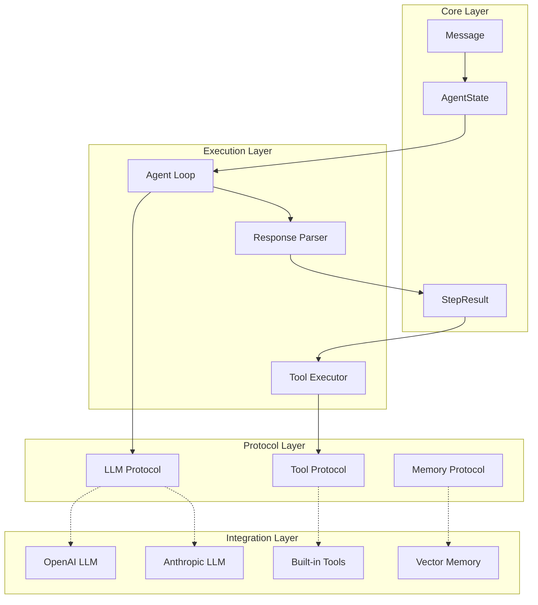

# Architecture Synthesis

Generates a reference architecture specification for a new framework.

## Process

1. **Define primitives** — Message, State, Result, Tool types
2. **Specify interfaces** — Protocols for LLM, Tool, Memory
3. **Design the loop** — Core execution algorithm
4. **Create diagrams** — Visual architecture representation
5. **Produce roadmap** — Implementation phases

## Prerequisites

Before synthesis, ensure you have:
- [ ] Comparative matrix with decisions per dimension
- [ ] Anti-pattern catalog with "Do Not Repeat" list
- [ ] Design requirements document

## Core Primitives Definition

### Message Type

```python
from typing import Literal
from pydantic import BaseModel

class Message(BaseModel):
    """Immutable message in the conversation."""
    role: Literal["system", "user", "assistant", "tool"]
    content: str
    name: str | None = None  # For tool messages
    tool_call_id: str | None = None
    
    class Config:
        frozen = True  # Immutable
```

### State Type

```python
from dataclasses import dataclass, field
from typing import Any

@dataclass(frozen=True)
class AgentState:
    """Immutable agent state - copy-on-write pattern."""
    messages: tuple[Message, ...]
    tool_results: tuple[ToolResult, ...] = ()
    metadata: dict[str, Any] = field(default_factory=dict)
    step_count: int = 0
    
    def with_message(self, msg: Message) -> "AgentState":
        """Return new state with message added."""
        return AgentState(
            messages=(*self.messages, msg),
            tool_results=self.tool_results,
            metadata=self.metadata,
            step_count=self.step_count
        )
```

### Result Types

```python
from typing import Union

@dataclass(frozen=True)
class ToolResult:
    """Result from tool execution."""
    tool_name: str
    success: bool
    output: str | None = None
    error: str | None = None
    
@dataclass(frozen=True)
class AgentFinish:
    """Agent completed its task."""
    output: str
    
@dataclass(frozen=True)
class AgentContinue:
    """Agent needs another step."""
    tool_calls: tuple[ToolCall, ...]

StepResult = Union[AgentFinish, AgentContinue]
```

## Interface Protocols

### LLM Protocol

```python
from typing import Protocol, Iterator

class LLM(Protocol):
    """Minimal LLM interface."""
    
    def generate(self, messages: list[Message]) -> LLMResponse:
        """Generate a response."""
        ...
    
    def stream(self, messages: list[Message]) -> Iterator[str]:
        """Stream response tokens."""
        ...

@dataclass
class LLMResponse:
    """Full LLM response with metadata."""
    content: str
    tool_calls: list[ToolCall] | None
    usage: TokenUsage
    model: str
    raw: Any  # Original API response
```

### Tool Protocol

```python
class Tool(Protocol):
    """Minimal tool interface."""
    
    @property
    def name(self) -> str:
        """Tool identifier."""
        ...
    
    @property
    def description(self) -> str:
        """Human-readable description."""
        ...
    
    @property
    def schema(self) -> dict:
        """JSON Schema for parameters."""
        ...
    
    def execute(self, **kwargs) -> str:
        """Execute the tool."""
        ...
```

### Memory Protocol

```python
class Memory(Protocol):
    """Memory/context management interface."""
    
    def add(self, message: Message) -> None:
        """Add a message to memory."""
        ...
    
    def get_context(self, query: str, max_tokens: int) -> list[Message]:
        """Retrieve relevant context."""
        ...
    
    def clear(self) -> None:
        """Clear memory."""
        ...
```

## Execution Loop Design

### Algorithm Pseudocode

```
FUNCTION run_agent(input: str, max_steps: int) -> str:
    state = initial_state(input)
    
    FOR step IN range(max_steps):
        # 1. Build context
        messages = build_messages(state)
        
        # 2. Call LLM
        response = llm.generate(messages)
        
        # 3. Parse and decide
        result = parse_response(response)
        
        # 4. Handle result
        IF result IS AgentFinish:
            RETURN result.output
        
        IF result IS AgentContinue:
            # Execute tools
            FOR tool_call IN result.tool_calls:
                tool_result = execute_tool(tool_call)
                state = state.with_tool_result(tool_result)
            
            # Feed back to LLM
            state = state.with_message(format_observations(state))
        
        # 5. Emit events
        emit("step_complete", state)
    
    # Max steps reached
    RAISE MaxStepsExceeded(state)
```

### Implementation Template

```python
class Agent:
    def __init__(
        self,
        llm: LLM,
        tools: list[Tool],
        system_prompt: str,
        max_steps: int = 10
    ):
        self.llm = llm
        self.tools = {t.name: t for t in tools}
        self.system_prompt = system_prompt
        self.max_steps = max_steps
        self.callbacks: list[Callback] = []
    
    def run(self, input: str) -> str:
        state = AgentState(messages=(
            Message(role="system", content=self.system_prompt),
            Message(role="user", content=input)
        ))
        
        for step in range(self.max_steps):
            self._emit("step_start", step, state)
            
            # LLM call
            response = self.llm.generate(list(state.messages))
            self._emit("llm_response", response)
            
            # Parse
            result = self._parse_response(response)
            
            # Finish or continue
            if isinstance(result, AgentFinish):
                self._emit("agent_finish", result)
                return result.output
            
            # Execute tools
            for call in result.tool_calls:
                tool_result = self._execute_tool(call)
                state = state.with_tool_result(tool_result)
            
            # Update state
            state = state.with_message(
                Message(role="assistant", content=response.content)
            )
            for tr in state.tool_results[-len(result.tool_calls):]:
                state = state.with_message(
                    Message(role="tool", content=tr.output or tr.error, name=tr.tool_name)
                )
            
            self._emit("step_end", step, state)
        
        raise MaxStepsExceeded(f"Exceeded {self.max_steps} steps")
    
    def _execute_tool(self, call: ToolCall) -> ToolResult:
        tool = self.tools.get(call.name)
        if not tool:
            return ToolResult(call.name, success=False, error=f"Unknown tool: {call.name}")
        
        try:
            output = tool.execute(**call.arguments)
            return ToolResult(call.name, success=True, output=output)
        except Exception as e:
            return ToolResult(call.name, success=False, error=f"{type(e).__name__}: {e}")
```

## Architecture Diagram



## Implementation Roadmap

### Phase 1: Core (Week 1-2)
- [ ] Define Message, State, Result types
- [ ] Implement LLM Protocol with OpenAI
- [ ] Implement basic Tool Protocol
- [ ] Create minimal Agent loop
- [ ] Add step limit termination

### Phase 2: Robustness (Week 3-4)
- [ ] Add error handling and feedback
- [ ] Implement retry mechanisms
- [ ] Add comprehensive logging
- [ ] Create callback/event system
- [ ] Add token counting

### Phase 3: Extensibility (Week 5-6)
- [ ] Add Memory Protocol
- [ ] Implement vector store integration
- [ ] Create tool discovery/registry
- [ ] Add configuration system
- [ ] Write documentation

### Phase 4: Production (Week 7-8)
- [ ] Add tracing/observability
- [ ] Implement streaming
- [ ] Add rate limiting
- [ ] Create async version
- [ ] Performance optimization

## Output Artifacts

```
reference-architecture/
├── docs/
│   ├── ARCHITECTURE.md      # This document
│   ├── PRIMITIVES.md        # Type definitions
│   ├── PROTOCOLS.md         # Interface specs
│   └── LOOP.md              # Algorithm details
├── diagrams/
│   ├── architecture.mermaid
│   ├── flow.mermaid
│   └── types.mermaid
├── examples/
│   ├── simple_agent.py
│   ├── multi_tool_agent.py
│   └── custom_llm.py
└── ROADMAP.md               # Implementation plan
```

## Integration

- **Inputs from**: `comparative-matrix`, `antipattern-catalog`
- **Produces**: Reference architecture for implementation
- **Validates against**: Original protocol requirements
