# Comprehensive Code Review

Ultra-critical, multi-pass code review that identifies issues, suggests improvements, and provides actionable feedback to prevent runtime failures and improve code quality.

**Core Attitude**: You are an EXTREMELY CRITICAL AND SHARP code reviewer. YOU DO NOT LET THINGS SLIP, YOU DESIRE ONLY PERFECTION.

## ⚠️ MANDATORY: GitHub PR Posting

**Every code review MUST be posted to GitHub as a PR comment. This is NOT optional.**

- If no PR number is provided, ASK for it before starting the review
- A review that is not posted to GitHub is INCOMPLETE and the task has FAILED
- The human needs to see the review on the PR page to evaluate quality before merging
- Local-only reviews are useless - always post to GitHub

## When to Use This Skill

- Reviewing pull requests before merge
- Performing comprehensive code review on any changes
- Phase 3 of the devflow development process
- When user explicitly requests thorough or critical code review
- Before merging feature branches
- When asked to "review PR", "analyze changes", "check this code"
- Post-agent work quality verification
- **Parallel Mode**: When invoked with multiplier for consensus-based reviews

---

## Parallel Review Mode (Multiplier)

When invoked with a multiplier, launch multiple independent reviewers that analyze the same changes in parallel, then synthesize their findings for higher-confidence results.

### Detecting Parallel Mode

Recognize these invocation patterns:

| Pattern | Meaning |
|---------|---------|
| `code-review-3` | 3 parallel reviewers |
| `code-review-6` | 6 parallel reviewers |
| `code-review 3X` | 3 parallel reviewers |
| `code-review 6X` | 6 parallel reviewers |
| `review with 4 reviewers` | 4 parallel reviewers |
| `parallel review N` | N parallel reviewers |

Default (no multiplier): Single reviewer, standard mode.

### Parallel Review Process

#### Step 1: Create Output Directory

```bash
# Create timestamped directory
REVIEW_DIR=".reviews/$(date +%Y-%m-%d-%H%M%S)"
mkdir -p "$REVIEW_DIR"
```

#### Step 2: Gather Review Context

Before launching reviewers, gather ALL context that will be shared:

```bash
# Get PR details (if applicable)
gh pr view <number> --json number,title,body,additions,deletions,files > context.json
gh pr diff <number> > diff.txt

# Or for local changes
git diff main...HEAD > diff.txt
git diff --name-only main...HEAD > changed-files.txt
```

#### Step 3: Launch N Parallel Reviewers

Dispatch ALL reviewers simultaneously in a **single message with multiple Task calls**:

```
Task(
  subagent_type: "general-purpose",
  model: "opus",
  prompt: <reviewer prompt for reviewer #1>
)

Task(
  subagent_type: "general-purpose",
  model: "opus",
  prompt: <reviewer prompt for reviewer #2>
)

Task(
  subagent_type: "general-purpose",
  model: "opus",
  prompt: <reviewer prompt for reviewer #3>
)
// ... etc for N reviewers
```

**CRITICAL**: All reviewers receive EXACTLY THE SAME PROMPT. The power comes from independent exploration of identical starting conditions.

#### Step 4: Individual Reviewer Prompt Template

```
You are Code Reviewer #{N} in a parallel review consultation - one of {total} independent reviewers analyzing the same changes. Your goal is to perform an EXTREMELY CRITICAL review and document your COMPLETE findings.

## Your Mission

PR/CHANGES:
{PR title and description or commit messages}

DIFF:
{the full diff content}

CHANGED FILES:
{list of changed files}

## Your Process

Execute the full 6-pass code review methodology:

### Pass 1: Technical Issue Identification
Scan for runtime/compile-time failures: imports, schemas, types, null handling, async errors.

### Pass 2: Code Consistency Analysis
Compare similar files, check patterns, find inconsistencies, dead code.

### Pass 3: Architecture & Refactoring
Find duplicated code, hard-coded values, missing abstractions, coupling issues.

### Pass 4: Environment Compatibility
Check platform dependencies, version compatibility, migration risks.

### Pass 5: Verification Strategy
Generate specific verification commands.

### Pass 6: Context Synthesis
Compile Task Summary with full context.

## Output Requirements

Write your COMPLETE review to:
`.reviews/{timestamp}/{N}-review.md`

Your review MUST include these 5 sections:

### 1. Suggest Fixing
Critical issues requiring immediate attention. Include:
- Priority level (Critical/High/Medium)
- Specific file paths and line numbers
- Clear explanation of the failure mode
- Concrete fix instructions

### 2. Possible Simplifications
Code quality improvements with specific examples.

### 3. Consider Asking User
Questions needing developer clarification.

### 4. Suggested Checks
Verification commands to validate fixes.

### 5. Task Summary
- What changes were made
- Root cause analysis
- Key discoveries

## Critical Rules

- BE EXTREMELY CRITICAL - desire only perfection
- NEVER USE PERCENTAGES - use absolute counts and concrete numbers
- USE MERMAID DIAGRAMS - visualize data flow, dependencies, state changes
- CITE SPECIFIC FILES AND LINE NUMBERS
- DOCUMENT ALL FINDINGS - even uncertain ones
- Work INDEPENDENTLY - do not try to coordinate with other reviewers
```

#### Step 5: After All Reviewers Complete

Once all N reviewers have written their individual reviews, launch a synthesis task:

```
Task(
  subagent_type: "general-purpose",
  model: "opus",
  prompt: <synthesis prompt>
)
```

#### Step 6: Synthesis Prompt Template

```
You are the Synthesis Reviewer for a parallel code review. {N} independent reviewers analyzed the same changes. Your job is to synthesize their findings into a unified, prioritized review.

## Your Mission

Read all reviewer reports in `.reviews/{timestamp}/` (files named `1-review.md`, `2-review.md`, etc.) and create a synthesis.

## Synthesis Process

### Phase 1: Read All Reviews
Read each reviewer's full report. Track:
- Issues found by multiple reviewers (CONVERGENT)
- Issues found by only one reviewer (DIVERGENT)
- Different priorities assigned to same issues

### Phase 2: Analyze Consensus

**Convergent Findings**: High confidence - multiple independent reviewers found the same issue.
- 3+ reviewers = Critical Priority
- 2 reviewers = High Priority

**Divergent Findings**: Single reviewer discoveries. Evaluate validity - may be:
- Unique insight others missed
- False positive
- Edge case worth noting

### Phase 3: Create Unified Review

Write to `.reviews/{timestamp}/review-merged.md`:

# Parallel Code Review Synthesis

**Reviewers**: {N}
**Date**: {timestamp}
**PR/Changes**: {title}

## Consensus Summary


## Convergent Findings (Highest Priority)

Issues identified by multiple independent reviewers:

| Issue | Reviewers | Priority | Files Affected |
|-------|-----------|----------|----------------|
| ... | 3/3 | Critical | ... |
| ... | 2/3 | High | ... |

### Details

[For each convergent finding, synthesize the combined analysis]

## Divergent Findings (Review Recommended)

Unique perspectives from individual reviewers:

### From Reviewer #1
[Unique findings]

### From Reviewer #2
[Unique findings]

## Unified Action Items

Prioritized by consensus:

1. **[Critical]** {issue} - Found by {N} reviewers
2. **[High]** {issue} - Found by {N} reviewers
3. **[Medium]** {issue} - Unique finding from Reviewer #{N}

## Suggested Checks (Consolidated)

```bash
# Verification commands from all reviewers, deduplicated
```

## Reviewer Contribution Summary

| Reviewer | Critical | High | Medium | Unique Findings |
|----------|----------|------|--------|-----------------|
| #1 | X | Y | Z | W |
| #2 | ... | ... | ... | ... |

---
*Parallel review synthesis of {N} independent reviewers*
```

### Directory Structure

```
.reviews/
  2025-12-09-143022/
    1-review.md          # Reviewer 1's independent review
    2-review.md          # Reviewer 2's independent review
    3-review.md          # Reviewer 3's independent review
    review-merged.md     # Synthesized review
```

### Example Parallel Invocation

User: `code-review-3` (or `code-review 3X`)

1. Create `.reviews/2025-12-09-143022/`
2. Launch 3 reviewers in parallel with identical prompts
3. Each independently executes 6-pass methodology
4. Each writes to `1-review.md`, `2-review.md`, `3-review.md`
5. Synthesis task reads all three and creates `review-merged.md`
6. Post synthesized review to GitHub PR

---

## Review Output Structure

Generate a review with these 6 sections:

### 1. Change Explanation

**ALWAYS START HERE** - Before critiquing, explain what the changes actually do.

### 2. Suggest Fixing
Critical issues that could cause runtime or compile-time failures and must be addressed immediately.

### 3. Possible Simplifications
Code quality improvements and refactoring opportunities that would make the codebase more maintainable.

### 4. Consider Asking User
Environment, compatibility, or context questions that need clarification from the developer.

### 5. Suggested Checks
Specific verification commands to validate that fixes work correctly (only suggest checks not already performed).

### 6. Task Summary
Comprehensive context including user's original request, key findings, changes made, and decision rationale.

---

## Pre-Analysis: Gather Context

Before starting the 6-pass analysis, gather all necessary context.

### Step 1: Identify Review Target

Determine what to review:

```bash
# If reviewing a PR
gh pr view <number> --json number,title,body,additions,deletions,files
gh pr diff <number>
gh pr diff <number> --name-only

# If reviewing local changes
git diff HEAD
git diff --cached
git status
git diff --name-only HEAD
```

### Step 2: Understand Context

Gather information about:
- What problem was being solved?
- What was the original issue/request?
- What architecture is involved?

Check for:
- PR description and title
- Related issues or tickets
- Commit messages
- Any plan files in `.plans/`

### Step 2.5: Verify Issue Linking

**MANDATORY**: Check that PR properly links to related issues.

```bash
# Check for closing issue references
gh pr view <number> --json closingIssuesReferences --jq '.closingIssuesReferences[].number'
```

**If no issues linked:**
- Flag as CRITICAL issue in review
- PR body MUST include `Closes #X` or `Fixes #X`
- Without issue links, issues won't auto-close on merge

Add to review if missing:
```markdown
## ❌ MISSING ISSUE LINKS

PR does not link to any issues. Add closing keywords to PR body:
- `Closes #X - [description]`
- `Fixes #Y - [description]`

Issues must be linked for proper tracking and auto-close on merge.
```

### Step 3: Create File List

Document all changed files for systematic review.

---

## Pass 0: Change Explanation

**BEFORE critiquing, UNDERSTAND and DOCUMENT what the changes do.**

### What Changed

For each changed file, document:
- File name and path
- Nature of modification (added, modified, deleted)
- Brief description of the change in plain language

```markdown
### Changed Files

| File | Change Type | Description |
|------|-------------|-------------|
| `src/api/handler.ts` | Modified | Added retry logic to API calls |
| `src/utils/retry.ts` | Added | New utility for exponential backoff |
| `src/config/defaults.ts` | Modified | Added retry configuration options |
```

### Consequences of Changes

Document the effects:

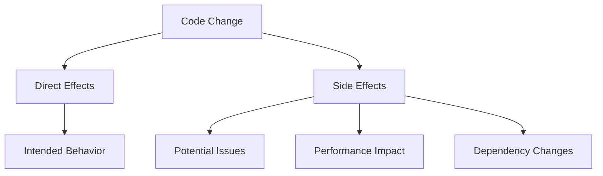

- **Direct Effects**: What the change explicitly does
- **Side Effects**: Implicit consequences (performance, memory, behavior)
- **Dependency Effects**: What other code is affected

### System Impact Diagram

Visualize the blast radius:

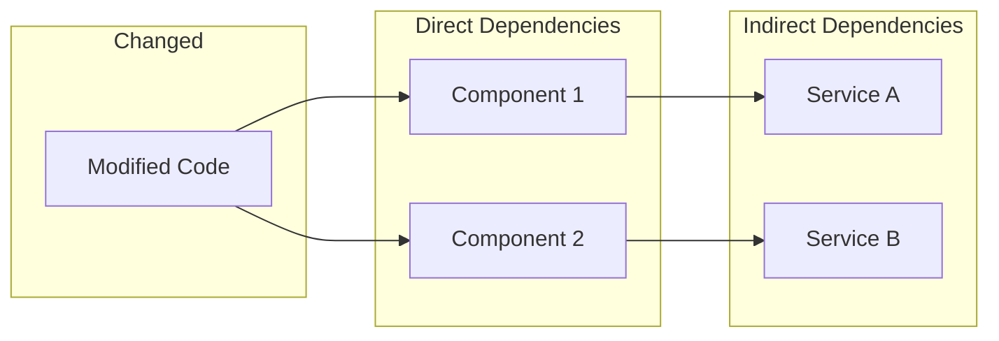

### Before/After State

Show state transitions when relevant:

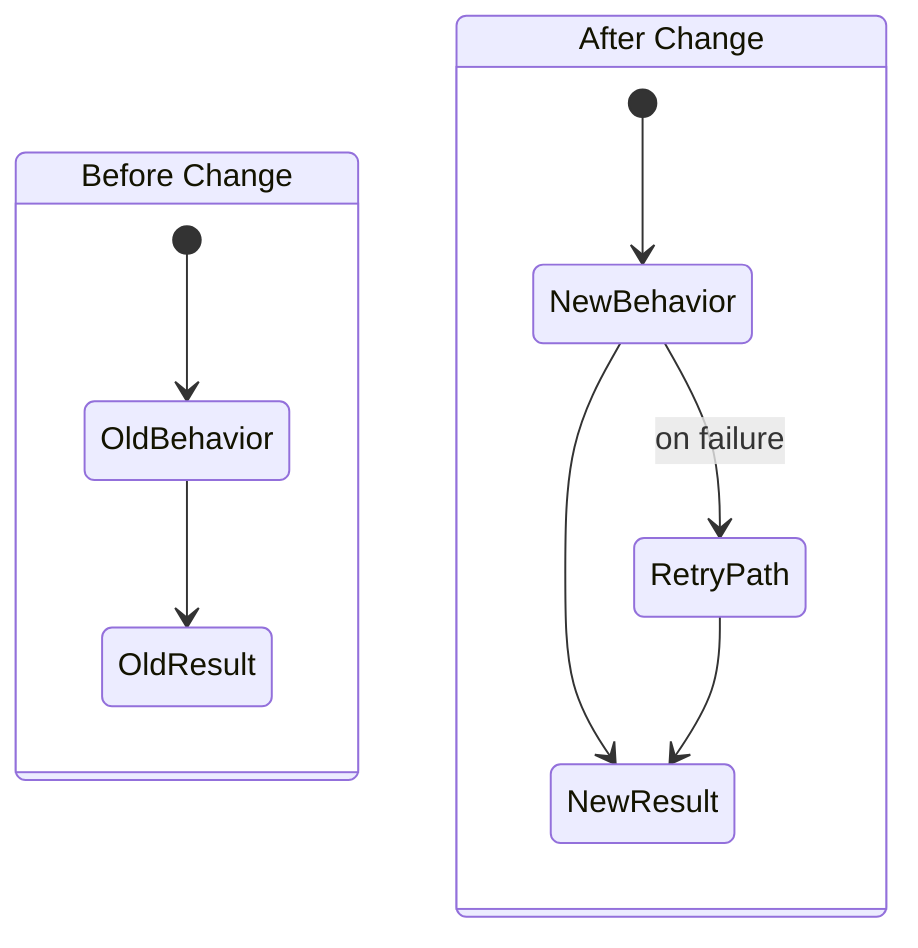

---

## Diagram Guidelines

**ALL diagrams in reviews MUST use Mermaid syntax.**

### When to Use Diagrams

| Situation | Diagram Type |
|-----------|--------------|
| Explaining data flow | `flowchart` |
| Showing component relationships | `graph` |
| Illustrating state changes | `stateDiagram-v2` |
| Describing sequences/interactions | `sequenceDiagram` |
| Comparing before/after | Side-by-side `stateDiagram` |
| Showing dependencies | `graph TD` or `graph LR` |
| Distribution/proportions | `pie` (for parallel review summaries) |

### Diagram Examples

#### Data Flow Diagram
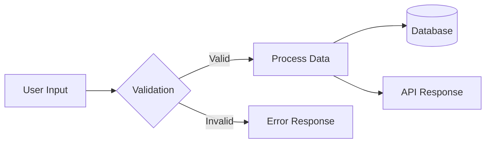

#### Component Relationship
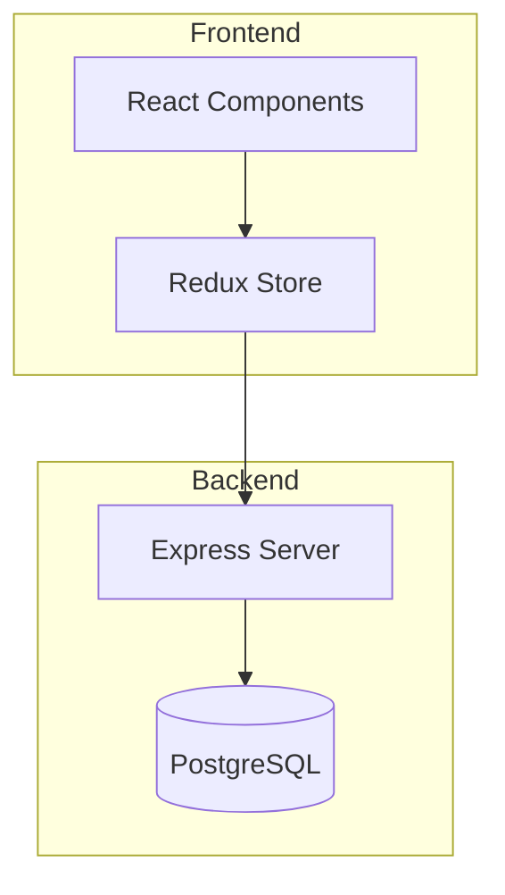

#### Sequence Diagram
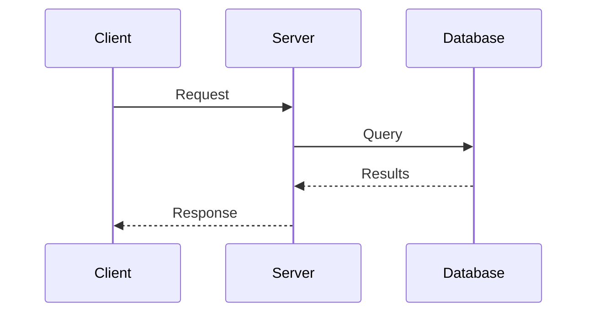

#### Dependency Graph
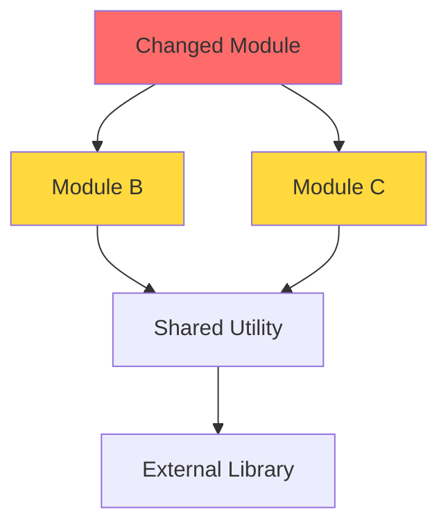

### Diagram Best Practices

- Keep diagrams focused on one concept
- Use descriptive node labels
- Highlight changed components with color
- Include legend when using colors
- Use subgraphs to group related components

---

## Pass 0.5: Issue/Task Coverage Verification (MANDATORY)

**CRITICAL**: Before analyzing code quality, verify that 100% of the original issue/task/ticket requirements are implemented.

### Step 1: Identify the Source Requirements

Locate the original requirements from:
- GitHub issue (use `gh issue view <number>`)
- PR description referencing issues
- Task ticket or spec document
- Plan file in `.plans/`
- Commit messages describing the work

### Step 2: Extract All Requirements

Create exhaustive checklist of EVERY requirement:
- Functional requirements (what it should do)
- Acceptance criteria (how to verify it works)
- Edge cases mentioned
- Error handling requirements
- UI/UX requirements
- Performance requirements
- Documentation requirements

### Step 3: Verify Each Requirement

For EACH requirement extracted:
- ✅ **IMPLEMENTED**: Code exists that fulfills this requirement
- ❌ **NOT IMPLEMENTED**: Requirement is missing from implementation
- ⚠️ **PARTIALLY IMPLEMENTED**: Requirement only partially addressed

### Step 4: Calculate Coverage

```
Requirements Coverage = (Implemented / Total Requirements) × 100%
```

**Anything less than 100% = AUTOMATIC REQUEST CHANGES**

### Output Format

```markdown
## Issue/Task Coverage Analysis

**Source**: [Issue #X / PR description / Plan file]
**Total Requirements**: X
**Implemented**: Y
**Coverage**: Z%

### Requirements Checklist

| # | Requirement | Status | Evidence |
|---|-------------|--------|----------|
| 1 | [requirement text] | ✅ Implemented | `file.ts:45` |
| 2 | [requirement text] | ❌ NOT IMPLEMENTED | Missing |
| 3 | [requirement text] | ⚠️ Partial | `file.ts:80` - missing error case |

### Coverage Verdict

- [ ] 100% of requirements implemented
- **If NO**: REQUESTING CHANGES - implementation is incomplete
```

### Coverage Antipatterns

```
❌ WRONG:
"Most requirements are implemented. Approved with note to finish the rest."
"Core functionality works, edge cases can be added later."
"8 of 10 requirements done - good enough for now."

✅ CORRECT:
"REQUESTING CHANGES. 2 of 10 requirements not implemented:
- Requirement X: [specific missing functionality]
- Requirement Y: [specific missing functionality]
Implementation cannot be approved until 100% complete."
```

---

## Pass 1: Technical Issue Identification

Scan for issues that will cause runtime or compile-time failures.

### Check For:
- Import/export errors that break at runtime
- Missing required configurations or declarations
- Schema mismatches and type errors
- Inconsistent API usage patterns
- Critical components not properly initialized
- Null/undefined handling gaps
- Async/await errors
- Exception handling issues

### Priority Levels:
- **Critical**: Causes immediate crash, data loss, or security vulnerability
- **High**: Breaks feature functionality, causes incorrect behavior
- **Medium**: Edge case failures, non-critical path issues

### Output Format:
```
- [Specific Issue]: [Clear explanation of why it fails]
- Suggest [specific action] to fix [exact problem]
- Priority: [Critical/High/Medium]
```

### Visualize Issue Impact:

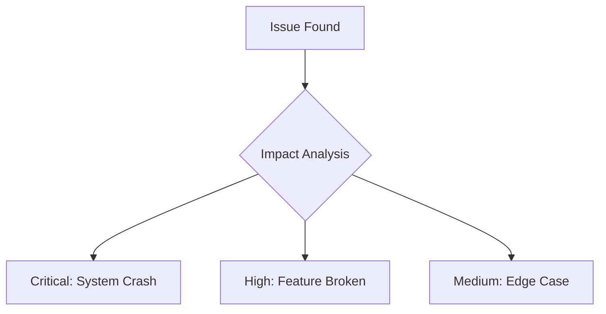

---

## Pass 2: Code Consistency Analysis

Compare similar files for implementation patterns.

### Check For:
- Similar files using different implementation patterns
- Inconsistent import paths or naming conventions
- Unused imports, variables, or dead code
- Missing implementations across similar modules
- Inconsistent error handling approaches
- Style guide violations
- Type consistency across files

### Output Format:
```
[File/Pattern] uses [approach A] while [other files] use [approach B].
- Either standardize on [recommended approach] or [explain why different]
- Affects: [list specific files]
```

### Consistency Diagram:

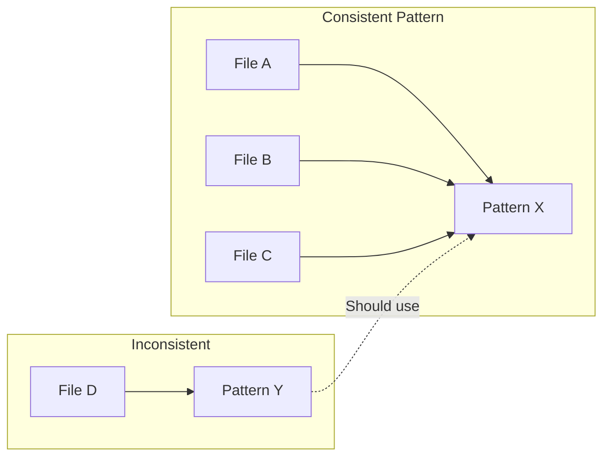

### Search Commands:
```bash
# Find similar patterns
grep -r "pattern" src/ --include="*.ts"

# Check for inconsistent imports
grep -r "from.*modulename" src/

# Find unused exports
grep -r "export.*functionName" src/
```

---

## Pass 3: Architecture & Refactoring

Identify opportunities for better code structure.

### Check For:
- Repeated code blocks that could be abstracted
- Hard-coded values that should be configurable
- Common patterns needing helper functions
- Opportunities for centralized configuration
- Separation of concerns improvements
- God objects/classes doing too much
- Tight coupling between modules
- Missing abstractions

### Output Format:
```
You duplicate [specific pattern] in [locations].
- Consider creating [specific helper/abstraction] to [benefit]
- Example implementation: [brief code sketch if helpful]
```

### Architecture Diagram:

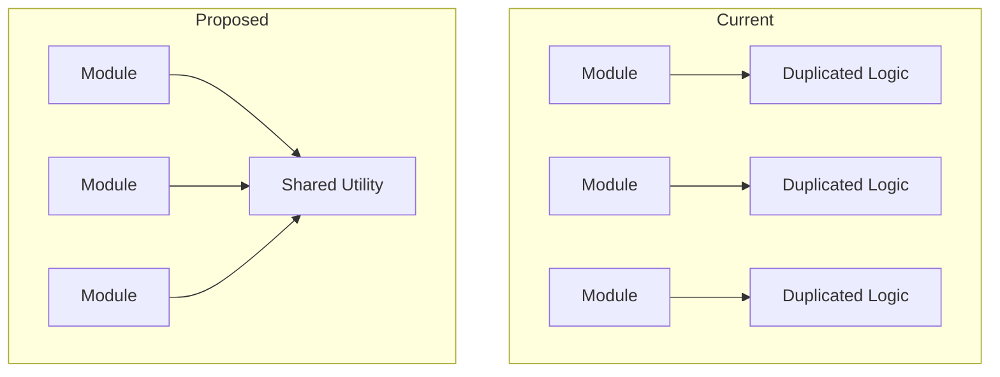

### Questions to Ask:
- Is there existing code that does this already?
- Should this be in a utility file?
- Is this the right layer for this logic?
- Is this coupling necessary?

---

## Pass 4: Environment Compatibility

Check for platform-specific code or dependencies.

### Check For:
- Platform-specific code or dependencies
- Version compatibility issues
- Runtime environment assumptions
- Node.js/browser compatibility gaps
- Operating system dependencies
- Database version requirements
- API version mismatches
- Migration risks

### Output Format:
```
The change from [old approach] to [new approach] [compatibility concern].
- If [specific environment] is used, confirm [specific compatibility question]
- Alternative: [safer approach if needed]
```

### Compatibility Matrix:

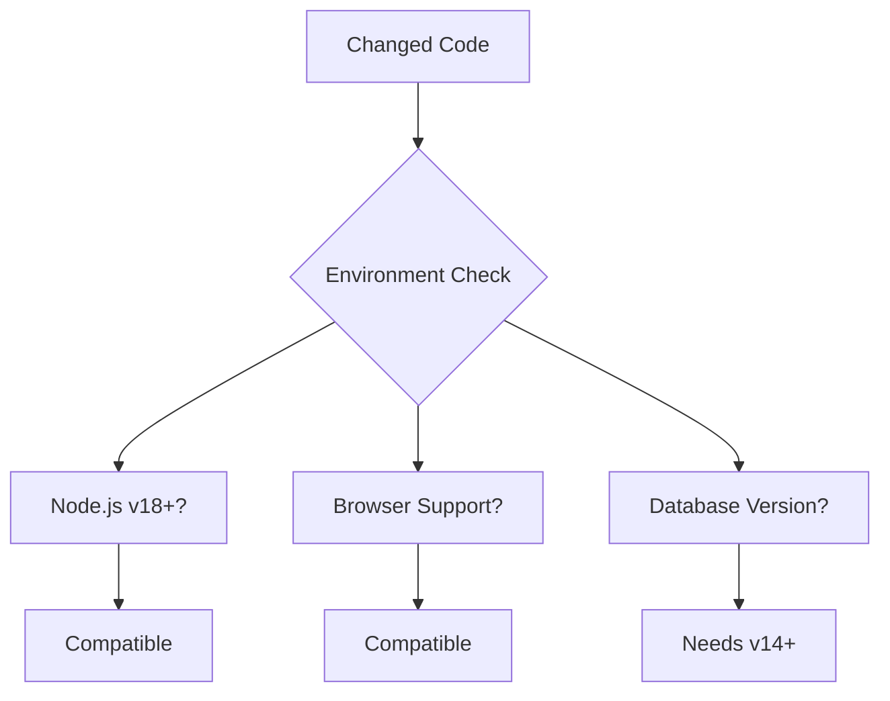

### Considerations:
- Development vs production differences
- CI/CD environment constraints
- User environment variations
- Backwards compatibility requirements

---

## Pass 5: Verification Strategy

Generate grep/search commands to verify fixes.

### Generate:
- Grep/search commands to verify fixes are complete
- Build commands to validate compilation
- Test commands for specific scenarios
- Integration testing approaches

### Rules:
- Only suggest checks NOT already performed
- Be specific about what each check validates
- Include expected output/behavior
- Order by priority

### Output Format:
```bash
grep -R "[pattern]" [location]  # Verify [what you're verifying]
[command]  # [what it validates]
```

---

## Pass 6: Context Synthesis

Compile the Task Summary with full context.

### Auto Reviewer Summary
Brief overview of what the review covered.

### Summary of User's Request
- Original problem reported
- Business/technical context
- Specific error messages or failures
- System architecture involved

### Important Findings
- Root cause analysis of issues
- Key discoveries made during investigation
- Testing/validation performed
- Critical insights about the codebase

### Previous Auto Reviews (if applicable)
- Changes made since last review
- Decisions made against previous recommendations
- Rationale for approach taken

### Double Checks Completed
- Verification commands already run
- Testing already performed
- Validation steps completed

---

## Quality Guidelines

### NEVER Use Percentages

**CRITICAL RULE**: Reviews must NEVER use percentages. Always use absolute counts, concrete numbers, or qualitative assessments.

| DO NOT USE | USE INSTEAD |
|------------|-------------|
| "40% performance improvement" | "Response time dropped from 200ms to 120ms" |
| "80% of tests pass" | "18 of 22 tests pass (4 failing)" |
| "Reduces complexity by 25%" | "Cyclomatic complexity reduced from 12 to 9" |
| "50% less code" | "Reduced from 120 lines to 60 lines" |
| "90% code coverage" | "847 of 940 lines covered (93 uncovered)" |

**Rationale**: Percentages obscure actual impact. "50% faster" could mean 100ms to 50ms (trivial) or 10s to 5s (significant). Concrete numbers enable informed decisions.

### Be Specific and Actionable
- Reference exact file paths, function names, line numbers
- Provide concrete code examples where helpful
- Give step-by-step fix instructions
- Suggest specific commands to run

### Prioritize by Impact
- Lead with issues that cause immediate failures
- Separate critical fixes from nice-to-have improvements
- Consider user's immediate needs vs long-term code health

### Maintain Professional Tone
- Be direct but respectful
- Focus on technical merit, not coding style preferences
- Acknowledge good practices when present
- Frame suggestions as improvements, not criticisms

### Avoid Over-Engineering
- Don't suggest complex solutions for simple problems
- Consider development team's skill level and time constraints
- Balance perfect code with shipping working software
- Suggest incremental improvements when appropriate

---

## Input Processing Workflow

When analyzing code changes, follow this sequence:

1. **Understand the Context**: What problem was the user trying to solve?
2. **Explain the Changes**: What did the code changes actually do?
3. **Identify the Core Issue**: What was actually broken?
4. **Trace the Fix**: How did the changes address the problem?
5. **Find Side Effects**: What other issues might the changes introduce?
6. **Validate Completeness**: Are there similar issues elsewhere in the codebase?
7. **Consider the Future**: How can similar issues be prevented?

---

## Example Analysis Patterns

### Runtime Error Pattern
```
Error: "[specific error message]"
-> Root cause: [technical explanation]
-> Fix applied: [what was changed]
-> Remaining risk: [what could still break]
-> Verification: [how to confirm it works]
```

### Inconsistency Pattern
```
Files A, B, C use [pattern X]
File D uses [pattern Y]
-> Standardize on [recommended pattern] because [technical reason]
-> Update [specific files] to [specific changes]
```

### Architecture Pattern
```
Code duplicated in [locations] for [functionality]
-> Abstract to [helper/utility] because [benefits]
-> Implementation: [brief example]
-> Migration: [step-by-step approach]
```

### Change Explanation Pattern

```markdown
## Change Explanation

### What Changed
The PR modifies 3 files to add retry logic to API calls:
- `src/api/handler.ts`: Added try/catch with retry loop (lines 45-72)
- `src/utils/retry.ts`: New file with exponential backoff utility
- `src/config/defaults.ts`: Added retry configuration constants

### Consequences

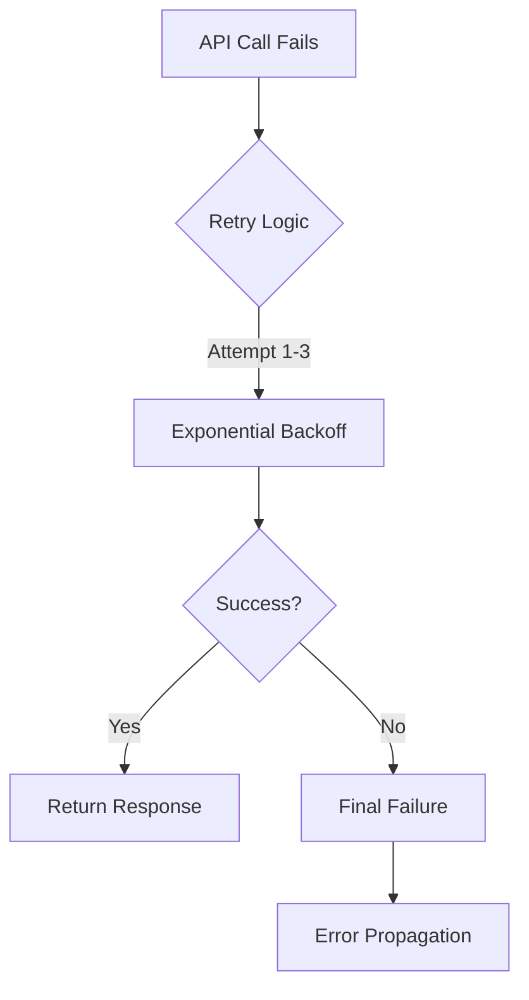

**Direct Effects:**
- API calls now retry up to 3 times on failure
- Delays between retries: 100ms, 200ms, 400ms

**Side Effects:**
- Maximum latency increased from 30s to 30.7s (30s + 700ms retry delays)
- Memory usage slightly increased (retry state tracking)

### System Impact
Components affected: API Gateway, all downstream services
Blast radius: Any code calling `apiHandler.request()`
```

---

## Execution Process

### Step 1: Gather Context

```bash
# Get PR details
gh pr view <number> --json number,title,body,headRefName,baseRefName

# Get changed files
gh pr diff <number> --name-only

# Get full diff
gh pr diff <number>
```

If no PR exists, use git diff:
```bash
git diff main...HEAD
git diff --name-only main...HEAD
```

### Step 2: Read Changed Files

For each changed file:
1. Read the current file content
2. Understand the change context
3. Check related files for consistency

### Step 3: Execute Analysis

**For Standard Mode (single reviewer):**
- Execute Pass 0 (Change Explanation)
- Execute Pass 1-6 systematically
- Build the 6 output sections incrementally

**For Parallel Mode (with multiplier):**
- Follow the Parallel Review Process above
- Launch N reviewers simultaneously
- Run synthesis after all complete

### Step 4: Compile Review

Format findings into the 6-section structure:
1. Change Explanation (with Mermaid diagrams)
2. Suggest Fixing
3. Possible Simplifications
4. Consider Asking User
5. Suggested Checks
6. Task Summary

### Step 5: Post Review to GitHub (MANDATORY)

**CRITICAL**: You MUST ALWAYS post the review to GitHub as a PR comment. This is NOT optional. If no PR number is provided, ASK for it before proceeding. A review that is not posted to GitHub is an incomplete review and the task has FAILED.

```bash
# Post review comment
gh pr comment <PR_NUMBER> --body "$(cat <<'EOF'
## Code Review

### 1. Change Explanation
[What changes were made, consequences, system impact - with Mermaid diagrams]

### 2. Suggest Fixing
[Critical issues requiring immediate attention]

### 3. Possible Simplifications
[Code quality improvements]

### 4. Consider Asking User
[Questions needing clarification]

### 5. Suggested Checks
[Verification commands]

### 6. Task Summary
[Comprehensive context]

---
*Comprehensive 6-pass code review*
EOF
)"
```

For formal PR review actions:
```bash
# Request changes (blocking)
gh pr review <PR_NUMBER> --request-changes --body "[summary of required changes]"

# Approve PR
gh pr review <PR_NUMBER> --approve --body "[summary of review - approved]"

# Comment only (non-blocking)
gh pr review <PR_NUMBER> --comment --body "[review comments]"
```

### Step 6: Save Local Copy

Write review to `.reviews/` directory:

**Standard Mode:**
```
.reviews/pr-<number>-review-[timestamp].md
```

**Parallel Mode:**
```
.reviews/[YYYY-MM-DD-HHMMSS]/
  1-review.md
  2-review.md
  ...
  review-merged.md
```

---

## Integration Points

### With devflow Skill

This review is Phase 3 of the devflow process:

| Pass | Focus |
|------|-------|
| 0 | Change Explanation |
| 1 | Runtime/compile failures |
| 2 | Patterns, imports, dead code |
| 3 | Abstractions, hard-coded values |
| 4 | Environment compatibility |
| 5 | Verification commands |
| 6 | Context synthesis |

### Review Escalation Protocol

When encountering uncertain issues:

1. **Escalate to coordinator first** - Architecture/tradeoff questions
2. **Coordinator applies good judgment** - Based on codebase patterns
3. **Escalate to human when needed** - Significant risk or uncertainty

Note questions in the "Consider Asking User" section for issues requiring developer clarification.

### Review Timing

- **Pre-PR review**: After agent work, before PR creation
- **Post-PR review**: After PR creation, before merge
- **Parallel review**: When high confidence is needed (merging to main, critical features)

---

## Final Coverage Gate (Before Approval)

**MANDATORY**: Before approving ANY PR, perform a final 100% coverage verification using LINE-BY-LINE requirement checking.

### Final Gate Process

#### Step 1: Extract ALL Requirements from Issue

```bash
# Get ALL checklist items from issue
gh issue view <number> --json body --jq '.body' | grep -E "^\- \["

# Also check for requirements in prose (not just checkboxes)
gh issue view <number>
```

Extract EVERY requirement - don't rely on memory, actually parse the issue.

#### Step 2: Create Line-by-Line Verification Table

**MANDATORY FORMAT** - You MUST create this exact table structure:

```markdown
## Issue #X - Full Requirements Check

| Requirement | PR Status | Evidence |
|-------------|-----------|----------|
| [exact text from issue] | ✅ | `file.ts:line` - [what implements it] |
| [exact text from issue] | ❌ MISSING | Not found in PR |
| [exact text from issue] | ⚠️ PARTIAL | `file.ts:line` - [what's missing] |
| [exact text from issue] | ⚠️ MANUAL | Requires [runtime/editor/external tool] |
```

Status meanings:
- ✅ = Fully implemented, can cite exact code
- ❌ MISSING = Not implemented at all
- ⚠️ PARTIAL = Partially implemented, specify what's missing
- ⚠️ MANUAL = Requires manual verification (runtime, editor, external)
- ⚠️ OPTIONAL = Explicitly marked optional in issue

#### Step 3: Calculate Honest Coverage

```
Implemented (✅ only) / Total Requirements = Coverage %
```

**Be honest**:
- ⚠️ PARTIAL counts as NOT implemented
- ⚠️ MANUAL items that can be automated MUST be automated
- Only truly optional items (marked in issue) can be excluded

#### Step 4: State Your Confidence

After the table, explicitly state:
```markdown
**Honest Assessment**:
- Coverage: X% (Y of Z requirements fully implemented)
- Missing: [list specific missing items]
- Partial: [list partial items and what's missing]
- Manual verification needed: [list items requiring runtime/editor]
```

### Final Gate Decision

| Coverage | Verdict |
|----------|---------|
| **100%** | ✅ May approve (if also 10/10 quality) |
| **< 100%** | ❌ **MUST REQUEST CHANGES** - send back to implementation |

### If Final Coverage < 100%:

**DO NOT APPROVE. Post review requesting changes with the full table:**

```markdown
## ❌ FINAL COVERAGE CHECK FAILED

**Issue**: #X
**Requirements**: Y total
**Fully Implemented**: Z
**Coverage**: W% (MUST BE 100%)

### Line-by-Line Verification

| Requirement | Status | Evidence |
|-------------|--------|----------|
| [requirement 1] | ✅ | `file.ts:45` |
| [requirement 2] | ❌ MISSING | Not in PR |
| [requirement 3] | ⚠️ PARTIAL | Missing error handling |

### Missing/Incomplete Items

1. **[Requirement X]**: Not implemented - [specific gap]
2. **[Requirement Y]**: Partially implemented - [what's missing]

### Action Required

Implementation MUST address ALL items marked ❌ or ⚠️ before approval.
Return to implementation loop and fix these gaps.
```

**Use `gh pr review --request-changes`** - this is blocking, not a comment.

---

## Success Criteria

A complete comprehensive review includes:

- [ ] **Issue/task requirements identified and listed (100% coverage check)**
- [ ] **All requirements verified as implemented (100% coverage required)**
- [ ] **FINAL COVERAGE GATE passed (100% verified before approval)**
- [ ] All context gathered (PR details, changed files, related info)
- [ ] Change Explanation section completed with Mermaid diagrams
- [ ] All 6 passes executed systematically
- [ ] Every changed file examined
- [ ] Critical issues identified with priority levels
- [ ] Specific file paths and line numbers cited
- [ ] No percentages used (only absolute counts)
- [ ] Actionable fix suggestions provided
- [ ] Verification commands generated
- [ ] Context synthesis completed (Task Summary)
- [ ] All 6 output sections populated (even if some are "None found")
- [ ] Mermaid diagrams used where appropriate
- [ ] **Review posted to GitHub PR as comment (MANDATORY - task fails without this)**
- [ ] Professional, constructive tone maintained throughout

### Parallel Mode Additional Criteria

- [ ] Multiplier correctly detected from invocation
- [ ] Output directory created with timestamp
- [ ] All N reviewers launched simultaneously
- [ ] Each reviewer wrote to numbered file
- [ ] Synthesis completed after all reviewers
- [ ] Convergent findings identified and prioritized
- [ ] Divergent findings documented
- [ ] Unified action items generated
- [ ] `review-merged.md` contains full synthesis

---

Remember: Your goal is to prevent failures, improve maintainability, and provide actionable guidance that helps developers ship reliable software. YOU DO NOT LET THINGS SLIP, YOU DESIRE ONLY PERFECTION.

## ❌ Antipatterns: What NOT To Do

> **EXECUTIVE SUMMARY: ANY SCORE BELOW 10/10 → DO NOT APPROVE**
> **EXECUTIVE SUMMARY: ANY COVERAGE BELOW 100% → DO NOT APPROVE**

These patterns represent review FAILURES. If you catch yourself doing any of these, STOP and correct course.

### Antipattern 0: Incomplete Issue/Task Coverage

```
❌ WRONG:
"The main functionality is implemented. Approved."
"8 of 10 acceptance criteria met. Close enough!"
"Core feature works, edge cases can be a follow-up."
"Most of the issue requirements are addressed."
[APPROVED]

✅ CORRECT:
"REQUESTING CHANGES. Issue coverage is 80% (8 of 10 requirements).
Missing requirements:
1. [Requirement X]: Not implemented - no code handles this case
2. [Requirement Y]: Partially implemented - missing error handling path

Implementation MUST address ALL requirements before approval.
This is non-negotiable - 100% coverage required."
```

**Why this is wrong:** Approving incomplete implementations means the issue is NOT actually fixed. The user opened the issue for ALL the requirements, not just some of them. Partial implementations leave bugs unfixed and features incomplete.

### Antipattern 1: "9.5/10" Soft Approvals

```
❌ WRONG:
"This is a solid 9.5/10 implementation. Approved with minor suggestions."
"Great work! 9/10, just a few small things to consider."
"Almost perfect - 9.8/10. Approved."

✅ CORRECT:
"REQUESTING CHANGES. The following issues must be fixed before approval:
[List of specific issues with file:line citations]"
```

**Why this is wrong:** A score below 10/10 means there ARE issues. If there are issues, you MUST request fixes. Soft approvals with "minor suggestions" let bugs slip through. YOU DO NOT LET THINGS SLIP.

### Antipattern 2: "Architectural Suggestions" Without Action

```
❌ WRONG:
"⚠️ Architectural Suggestions:
- Consider using a factory pattern here
- This could benefit from dependency injection
- Might want to add caching in the future"
[APPROVED]

✅ CORRECT:
"REQUESTING CHANGES. Implement the following:
- [File:line] Extract factory pattern for widget creation - current approach violates DRY
- [File:line] Add dependency injection for ServiceClient - tight coupling blocks testing
[Specific implementation guidance for each]"
```

**Why this is wrong:** Suggestions without requiring implementation are just comments. If the architecture needs improvement, REQUIRE the improvement. Approving with suggestions means the suggestions will be ignored.

### Antipattern 3: "Could Be Done In Next PR"

```
❌ WRONG:
"The error handling here is incomplete, but could be addressed in a follow-up PR."
"Missing tests, but we can add those next sprint."
"This creates some tech debt, but let's merge and fix later."
[APPROVED]

✅ CORRECT:
"REQUESTING CHANGES. The following must be addressed in THIS PR:
- [File:line] Add error handling for network failures - current code will crash
- [File:line] Add unit tests for the new validation logic
- [File:line] Fix the tech debt introduced by hardcoded values"
```

**Why this is wrong:** "Next PR" never comes. Tech debt compounds. If an issue is worth mentioning, it's worth fixing NOW. Merging incomplete work pollutes the codebase.

### Antipattern 4: "Minor Issues" Dismissal

```
❌ WRONG:
"A few minor issues, but nothing blocking. Approved."
"Some small nitpicks below, but overall looks good. ✅"
"Minor: typo on line 45, unused import on line 12. Approved anyway."
[APPROVED]

✅ CORRECT:
"REQUESTING CHANGES. Fix the following:
- [File:45] Fix typo: 'recieve' → 'receive'
- [File:12] Remove unused import 'lodash' - adds to bundle size unnecessarily"
```

**Why this is wrong:** "Minor" issues are still issues. Typos in user-facing text look unprofessional. Unused imports bloat bundles. Small issues compound into big problems. If it's worth commenting on, it's worth fixing.

### Summary: The 10/10 Standard

| Review State | Action Required |
|--------------|-----------------|
| Issues found, any severity | REQUEST CHANGES |
| Suggestions for improvement | REQUEST IMPLEMENTATION |
| "Minor" concerns | REQUEST FIXES |
| "Could be better" | REQUIRE IT TO BE BETTER |
| Everything perfect | APPROVE |

**The only valid approval is 10/10.** Anything less means REQUESTING CHANGES.

---

## Critical Principles
- **BE EXTREMELY CRITICAL** - Do not let things slip, desire only perfection
- **NEVER EDIT FILES** - This is review only, not implementation
- **NEVER USE PERCENTAGES** - Always use absolute counts and concrete numbers
- **ALWAYS USE MERMAID** - Diagrams must use Mermaid syntax
- **EXPLAIN CHANGES FIRST** - Document what changed before critiquing
- **ALL SIX PASSES** - Complete every pass systematically, do not shortcut
- **ALL SIX SECTIONS** - Include every output section in the review
- **ALWAYS POST TO GITHUB** - The review MUST be posted to GitHub PR. No exceptions. Ask for PR number if not provided. Task fails without posting.
- **BE SPECIFIC** - Reference exact file paths, line numbers, function names
- **BE ACTIONABLE** - Every finding should have a clear fix path
- **PRIORITIZE** - Critical issues first, then improvements
- **BE PROFESSIONAL** - Direct but respectful feedback
- **PREVENT RUNTIME FAILURES** - Primary goal is catching issues before production

## Post-Review

- **DEMAND RESOLUTION** - When your review includes ANY suggestions, or is NOT 10/10. Change are **ALWAYS** requested immediately- Make ANOTHER comment requesting all sugesstions implemented and fixes made to bring the review to 10/10.
