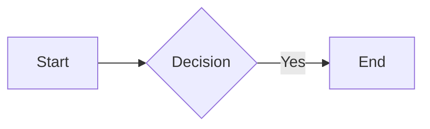

# Deckset Presentation Expert

Expert assistant for creating professional presentations using Deckset's markdown-based format.

## What is Deckset?

Deckset transforms Markdown files into beautiful presentations. Write content in plain text, Deckset handles the design.

## Quick Start

### Basic Structure

```markdown
# Presentation Title
## Subtitle

---

## First Slide

Content with **bold** and *italic*.

- Bullet one
- Bullet two

---

## Second Slide

More content.
```

### Critical Rules

1. **Slide Separators**: `---` MUST have blank lines before and after
2. **Headings**: `#` = title slide, `##` = slide title, `###` = subtitle
3. **Images**: `` = background, `` = inline
4. **Presenter Notes**: Start line with `^` (hidden from slides)
5. **Config**: Add at top before first slide

## Core Syntax

### Slide Separators

**CRITICAL - Most common mistake:**
```markdown
Content

---

Next slide
```

Blank lines are REQUIRED above and below `---`.

### Headings

```markdown
# Large (title slides)
## Regular (slide titles)
### Small (subtitles)

# [fit] Scale to Fit
```

See [docs/formatting/headings.md](docs/formatting/headings.md)

### Lists

```markdown
- Bullet point
  - Sub-point (2 spaces)

1. Numbered item
   1. Sub-item (3 spaces)
```

See [docs/formatting/lists.md](docs/formatting/lists.md)

### Text Formatting

```markdown
**bold** *italic* ***bold italic***
`code` ~~strikethrough~~
```

See [docs/formatting/text-styles.md](docs/formatting/text-styles.md)

### Images

```markdown
                      # Full-screen background
                      # Inline with text
                # Fill space
                 # Custom size
     # Rounded
```

See [docs/media/inline-images.md](docs/media/inline-images.md) and [docs/media/background-images.md](docs/media/background-images.md)

### Code Blocks

````markdown
```python
def hello():
    print("Hello")
```
````

See [docs/formatting/code-blocks.md](docs/formatting/code-blocks.md)

### Presenter Notes

```markdown
## Slide Title

Visible content

^ Presenter note (not visible on slide)
^ Start each note line with ^
```

See [docs/presenting/presenter-notes.md](docs/presenting/presenter-notes.md)

### Videos

```markdown


```

See [docs/media/videos.md](docs/media/videos.md)

## Configuration

Add at the very top (before first slide):

```markdown
theme: Plain Jane, 1
footer: © 2024 Company
slidenumbers: true
autoscale: true

---

# First Slide
```

See [docs/customization/configuration-commands.md](docs/customization/configuration-commands.md)

## Advanced Features

### Columns

```markdown
[.column]
Left content

[.column]
Right content
```

See [docs/formatting/columns.md](docs/formatting/columns.md)

### Formulas (LaTeX)

```markdown
$E = mc^2$

Inline: $x = \frac{-b \pm \sqrt{b^2-4ac}}{2a}$
```

See [docs/formatting/formulas.md](docs/formatting/formulas.md)

### Mermaid Diagrams

````markdown

````

See [docs/media/markdown-graphs.md](docs/media/markdown-graphs.md)

### Build Steps

Lists reveal progressively. Enable with `build-lists: true` in config.

See [docs/presenting/build-steps.md](docs/presenting/build-steps.md)

## Complete Documentation

### Formatting
- [Headings](docs/formatting/headings.md)
- [Lists](docs/formatting/lists.md)
- [Text Styles](docs/formatting/text-styles.md)
- [Quotes](docs/formatting/quotes.md)
- [Links](docs/formatting/links.md)
- [Code Blocks](docs/formatting/code-blocks.md)
- [Tables](docs/formatting/tables.md)
- [Formulas](docs/formatting/formulas.md)
- [Emojis](docs/formatting/emojis.md)
- [Footers & Slide Numbers](docs/formatting/footers-and-slide-numbers.md)
- [Footnotes](docs/formatting/footnotes.md)
- [Line Breaks](docs/formatting/controlling-line-breaks.md)
- [Columns](docs/formatting/columns.md)

### Media
- [Background Images](docs/media/background-images.md)
- [Inline Images](docs/media/inline-images.md)
- [Videos](docs/media/videos.md)
- [Audio](docs/media/audio.md)
- [Mermaid Diagrams](docs/media/markdown-graphs.md)

### Presenting
- [Presenter Notes](docs/presenting/presenter-notes.md)
- [Build Steps](docs/presenting/build-steps.md)
- [Transitions](docs/presenting/transitions.md)
- [Hide Slides](docs/presenting/hide-slides.md)
- [Presenter Display](docs/presenting/switch-presenter-display.md)

### Customization
- [Configuration](docs/customization/configuration-commands.md)
- [Custom Themes](docs/customization/custom-theming.md)

### Reference
- [Getting Started](docs/general/getting-started.md)
- [Keyboard Shortcuts](docs/general/keyboard-shortcuts.md)
- [FAQ](docs/general/frequently-asked-questions.md)

## Examples

See complete working presentations in `examples/`:
- `simple-presentation.md` - Basic structure
- `technical-presentation.md` - Code & diagrams
- `visual-presentation.md` - Image-focused

## Common Mistakes

1. **Missing blank lines around `---`** → Slides merge
2. **Wrong heading levels** → Use `##` for most slides
3. **Incorrect image syntax** → `` not `![fit image.png]`
4. **Config after first slide** → Must be at very top

## Best Practices

1. One idea per slide
2. Use high-quality images
3. Leverage presenter notes for details
4. Test builds before presenting
5. Version control with git

## Troubleshooting

**Slides merging?** Check blank lines around `---`

**Images not showing?** Verify file paths, use forward slashes

**Text too small?** Use `[fit]` modifier or `autoscale: true`

---

**Official docs**: https://docs.deckset.com/English.lproj/
