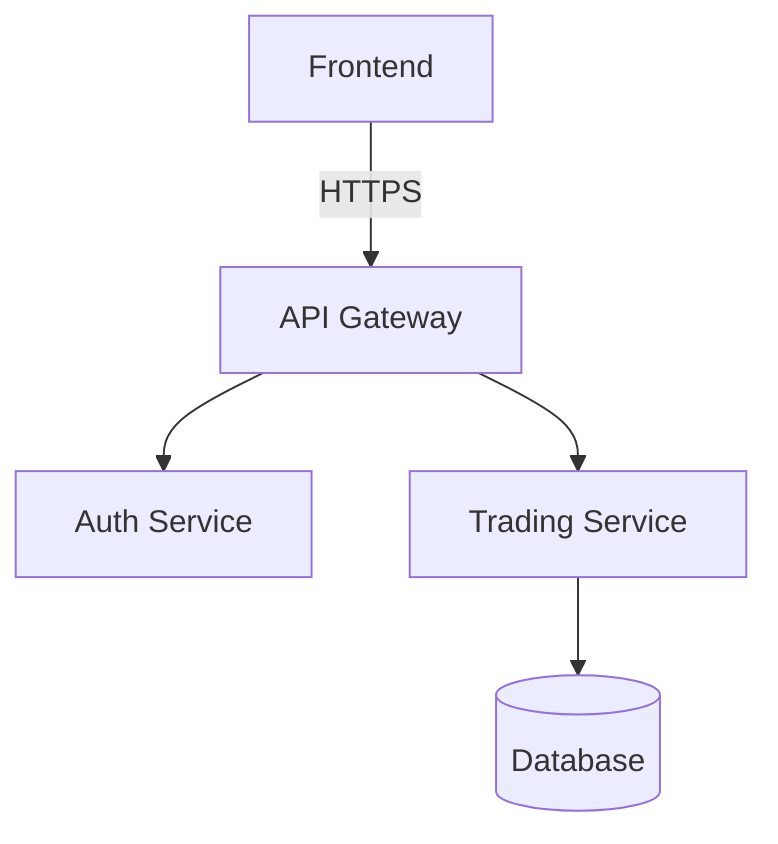

# Documentation Suite (Dev Doc Suite)

## Core Principles
1.  **Code as Truth**: Documentation must always be derived from the actual code implementation, not assumptions.
2.  **Living Documents**: Documentation is NOT a post-mortem artifact; it must evolve with every commit.
3.  **Audience-Centric**: Clearly distinguish between User Docs (Ease of use) and Developer Docs (Implementation details).
4.  **Standardized Format**: Follow the "3-Tier Language Strategy" (Korean for high-level structure, English for technical details).

## Documentation Types & Templates (Source: document-suite-skills)

### 1. Code Documentation (Docstrings)

**Goal:** Clear, comprehensive function/class documentation

**Example Format:**

```python
def function_name(param1: Type, param2: Type) -> ReturnType:
    """
    Brief one-line description.

    Detailed explanation of purpose, behavior, and context.

    Args:
        param1: Description with type and example values
        param2: Description with constraints

    Returns:
        Description of return value and meaning

    Example:
        >>> function_name(example_value1, example_value2)
        expected_output

    Raises:
        ErrorType: When and why this error occurs

    Note:
        Important details, gotchas, performance considerations
    """
```

### 2. API Documentation

**Goal:** Complete API reference for endpoints

**REST API Example:**

```markdown
## Authentication API

### POST /api/auth/login

Authenticate user and return JWT access token.

**Request:**

```json
{
  "email": "user@example.com",
  "password": "SecureP@ss123"
}
```

**Response (200 OK):**

```json
{
  "success": true,
  "data": {
    "accessToken": "eyJhbGciOiJIUzI1NiIsInR5cCI6IkpXVCJ9...",
    "expiresIn": 3600
  }
}
```
```

### 3. Architecture Documentation

**Goal:** Clear system overview and component relationships

**Example:**

```markdown
# System Architecture

## System Diagram



## Core Components

### 1. API Gateway
**Responsibility:** Entry point for all client requests
- Request routing
- Rate limiting

### 2. Auth Service
**Responsibility:** User authentication
- JWT generation
- Session management
```

### 4. README Generation

**Goal:** Comprehensive project README

**Essential Sections:**

```markdown
# [Project Name]

[One-line description] - [What problem it solves]

## Features
- Key feature 1
- Key feature 2

## Installation
\`\`\`bash
npm install
npm run dev
\`\`\`

## Configuration
| Variable | Description | Required |
|----------|-------------|----------|
| `DATABASE_URL` | DB connection string | Yes |
```

### 5. Code Explanations

**Goal:** Clear explanations of complex code

**Process:**
1. **High-Level Purpose**: What problem does this solve?
2. **Step-by-Step Logic**: Break down into phases.
3. **Key Algorithms**: Identify important patterns.
4. **Edge Cases**: validation and error handling.

## Quality Standards
- **Freshness**: All generated docs must be verified against the current codebase state.
- **Completeness**: Every public function/class must have at least a summary description.
- **Readability**: Use clear formatting, bullet points, and code blocks.
- **Safe YAML**: Frontmatter descriptions with special characters must be quoted.

## Checklist
- [ ] **Analysis**: Did you read all relevant code files before writing?
- [ ] **Verification**: Does the documentation accurately reflect the code behavior?
- [ ] **Formatting**: Is the markdown syntax correct and consistent?
- [ ] **Language**: Is the appropriate language (Korean/English) used for the target audience?
