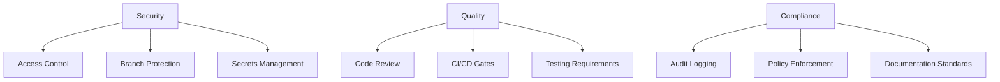

# GitHub Repository Governance

## Overview

Repository governance covers policies, standards, and controls for managing GitHub repositories effectively. This skill includes repository settings, access controls, branch protection, security policies, and best practices for maintaining healthy and secure repositories.

**When to use this skill:** When setting up or managing governance policies for GitHub repositories.

## Table of Contents

1. [Governance Framework](#governance-framework)
2. [Access Control](#access-control)
3. [Branch Protection](#branch-protection)
4. [Security Policies](#security-policies)
5. [Repository Settings](#repository-settings)
6. [Governance Checklist](#governance-checklist)
7. [Quick Reference](#quick-reference)

---

## Governance Framework

### Governance Levels

| Level | Scope | Controls |
|--------|--------|-----------|
| **Organization** | All repos | Policies, billing, members |
| **Team** | Team repos | Access, permissions |
| **Repository** | Single repo | Settings, protection, rules |
| **Branch** | Branch level | Protection, checks, restrictions |

### Governance Principles



### Governance Roles

| Role | Responsibilities | Permissions |
|------|-----------------|-------------|
| **Owner** | Full control, billing, settings | Admin |
| **Maintainer** | Code review, merge, settings | Write |
| **Contributor** | Create PRs, issues | Write |
| **Reader** | View only | Read |
| **Security Team** | Security reviews, alerts | Admin |
| **Compliance** | Audit, policy enforcement | Read |

---

## Access Control

### Permission Levels

| Permission | Read | Write | Admin | Actions |
|-----------|------|-------|--------|---------|
| **Read** | ✅ | ❌ | ❌ | View, clone |
| **Triage** | ✅ | ❌ | ❌ | + Manage issues, PRs |
| **Write** | ✅ | ✅ | ❌ | + Push branches |
| **Maintain** | ✅ | ✅ | ❌ | + Manage settings, teams |
| **Admin** | ✅ | ✅ | ✅ | + Full control |

### Team-Based Access

```yaml
# .github/teams.yml (organization level)
teams:
  - name: backend-team
    permission: admin
    repositories:
      - api-repo
      - service-repo

  - name: frontend-team
    permission: write
    repositories:
      - web-repo
      - mobile-repo

  - name: security-team
    permission: maintain
    repositories:
      - all  # All repositories
```

### CODEOWNERS File

```
# .github/CODEOWNERS

# Global owners
* @tech-lead @security-team

# Directory-specific owners
/api/ @api-team @backend-lead
/frontend/ @frontend-team @frontend-lead
/docs/ @documentation-team

# File pattern owners
*.md @documentation-team
*.sql @database-team
*.yml @devops-team

# Exclusions
.github/ @platform-team
```

### External Collaborators

```bash
# Add outside collaborator
gh api repos/:owner/:repo/collaborators/:username \
  --permission write

# List collaborators
gh api repos/:owner/:repo/collaborators

# Remove collaborator
gh api \
  --method DELETE \
  -H "Accept: application/vnd.github.v3+json" \
  /repos/:owner/:repo/collaborators/:username
```

---

## Branch Protection

### Protection Rules

```yaml
# Branch protection settings (via GitHub UI or API)
# Main branch protection:
- Require pull request before merging
- Require approvals: 2 reviewers
- Dismiss stale reviews: 7 days
- Require review from CODEOWNERS
- Require status checks to pass
- Require branches to be up to date
- Restrict who can push: Team only
- Allow force pushes: No
- Require linear history: Yes
```

### Required Status Checks

| Check Type | Purpose | Configuration |
|-------------|---------|---------------|
| **CI/CD** | Build and deploy | GitHub Actions |
| **Tests** | Unit/integration tests | Test framework |
| **Lint** | Code quality | Linter tool |
| **Security** | Vulnerability scan | Security scanner |
| **Coverage** | Code coverage | Coverage tool |
| **License** | License compliance | License checker |

### Protection Rule Examples

```yaml
# .github/branch-protection.yml
protection_rules:
  - pattern: main
    required_approving_review_count: 2
    required_status_checks:
      - strict: true
        contexts:
          - ci/ci
          - security/scan
    enforce_admins: true
    require_linear_history: true
    allowed_push_users: []

  - pattern: release/*
    required_approving_review_count: 1
    required_status_checks:
      - strict: false
        contexts:
          - ci/ci
    enforce_admins: false
```

---

## Security Policies

### Dependency Security

```yaml
# .github/dependabot.yml
version: 2
updates:
  - package-ecosystem: "npm"
    directory: "/"
    schedule:
      interval: "weekly"
    open-pull-requests-limit: 10
    reviewers:
      - "@security-team"
    labels:
      - "dependencies"
      - "security"

  - package-ecosystem: "pip"
    directory: "/"
    schedule:
      interval: "monthly"
```

### Secret Scanning

```yaml
# .github/workflows/secret-scan.yml
name: Secret Scanning

on:
  push:
    branches: [main]
  pull_request:
    branches: [main]

jobs:
  scan:
    runs-on: ubuntu-latest
    steps:
      - uses: actions/checkout@v3

      - name: Run secret scanner
        uses: trufflesecurity/trufflehog-action@master
        with:
          path: ./
          base: ${{ github.event.repository.default_branch }}
          head: HEAD
```

### Security Policies

```markdown
# SECURITY.md

## Security Policy

### Supported Versions
We support the current major version and the previous major version for security updates.

### Reporting Vulnerabilities
Please report security vulnerabilities privately:
- Email: security@example.com
- PGP Key: [link to key]

### Response Time
- Critical: 24 hours
- High: 48 hours
- Medium: 1 week
- Low: 2 weeks

### Disclosure
We will disclose vulnerabilities after a fix is released.
```

---

## Repository Settings

### Visibility Settings

| Setting | Public | Private | Internal |
|---------|--------|---------|----------|
| **Access** | Anyone | Members only | Organization only |
| **Forking** | Enabled | Disabled | Disabled |
| **Issues** | Public | Private | Private |
| **Wiki** | Public | Private | Private |
| **Pages** | Public | Private | Private |

### Feature Settings

```yaml
# Repository features configuration
features:
  issues: true
  projects: true
  wiki: true
  discussions: false
  actions: true
  packages: true
  pages: true
  security_advisories: true
  dependency_graph: true
  vulnerability_alerts: true
  code_scanning: true
  secret_scanning: true
```

### Issue Templates

```markdown
# .github/ISSUE_TEMPLATE/bug_report.md
---
name: Bug report
about: Create a report to help us improve
title: '[BUG] '
labels: 'bug,needs-triage'
---

## Description
A clear description of the bug.

## Steps to Reproduce
1. Go to '...'
2. Click on '....'
3. Scroll down to '....'
4. See error

## Expected Behavior
What you expected to happen.

## Actual Behavior
What actually happened.

## Environment
 - OS: [e.g. Windows]
 - Browser: [e.g. Chrome]
 - Version: [e.g. 1.0.0]
```

---

## Governance Checklist

### Initial Setup

```markdown
## Repository Setup Checklist

### Access Control
- [ ] Owners and maintainers configured
- [ ] Teams created and assigned
- [ ] CODEOWNERS file created
- [ ] External collaborators reviewed
- [ ] Permission levels documented

### Branch Protection
- [ ] Main branch protected
- [ ] Required reviewers set
- [ ] Status checks configured
- [ ] Force push disabled
- [ ] Linear history required

### Security
- [ ] Secret scanning enabled
- [ ] Dependabot configured
- [ ] Security policies documented
- [ ] Vulnerability alerts enabled
- [ ] Two-factor authentication required

### Features
- [ ] Issue templates created
- [ ] PR templates created
- [ ] Wiki enabled/disabled appropriately
- [ ] Projects enabled
- [ ] Discussions configured
```

### Ongoing Governance

```markdown
## Governance Review Checklist

### Access Review
- [ ] Review active collaborators
- [ ] Remove inactive users
- [ ] Update team memberships
- [ ] Audit access logs
- [ ] Review CODEOWNERS

### Policy Review
- [ ] Review branch protection rules
- [ ] Update security policies
- [ ] Review automation workflows
- [ ] Update templates
- [ ] Review governance docs

### Compliance Review
- [ ] Audit trail reviewed
- [ ] Security incidents logged
- [ ] Policy violations addressed
- [ ] Documentation updated
- [ ] Team training completed
```

---

## Quick Reference

### GitHub CLI Commands

```bash
# Repository settings
gh repo edit --visibility private --enable-wiki

# List collaborators
gh repo collaborator list

# Add collaborator
gh repo collaborator add username --permission write

# Remove collaborator
gh repo collaborator remove username

# Create team
gh api orgs/:org/teams \
  --method POST \
  -f name=team-name \
  -f privacy=closed \
  -f permission=write

# Add team to repo
gh api \
  --method PUT \
  /orgs/:org/teams/:team/repos/:owner/:repo \
  -f permission=maintain
```

### Branch Protection Commands

```bash
# View protection rules
gh api repos/:owner/:repo/branches/main/protection

# Set protection (requires API)
gh api \
  --method PUT \
  /repos/:owner/:repo/branches/main/protection \
  -f required_pull_request_reviews=true \
  -f required_approving_review_count=2
```

### Governance Metrics

| Metric | Target | How to Track |
|--------|--------|----------------|
| **Access review frequency** | Quarterly | Regular access audits |
| **Policy compliance** | 100% | All repos follow policies |
| **Security incidents** | 0 per month | Monitor security alerts |
| **Unauthorized access** | 0 | Audit logs |
| **Template usage** | > 90% | Issues/PRs use templates |

---

## Common Pitfalls

1. **Over-permissive access** - Grant minimum necessary permissions
2. **No branch protection** - Always protect main branches
3. **Ignoring security alerts** - Respond to vulnerabilities promptly
4. **Outdated collaborators** - Regularly review access
5. **No CODEOWNERS** - Define code ownership clearly
6. **Missing templates** - Use templates for consistency
7. **No audit trail** - Track all governance actions
8. **Inconsistent policies** - Standardize across organization

## Additional Resources

- [GitHub Repository Settings](https://docs.github.com/en/repositories/managing-your-repositorys-settings-and-features)
- [Branch Protection](https://docs.github.com/en/repositories/configuring-branches-and-merges-in-your-repository/defining-the-mergeability-of-pull-requests/about-protected-branches)
- [Managing Teams](https://docs.github.com/en/organizations/organizing-members-into-teams)
- [CODEOWNERS Documentation](https://docs.github.com/en/repositories/managing-your-repositorys-settings-and-features/customizing-your-repository/about-code-owners)
