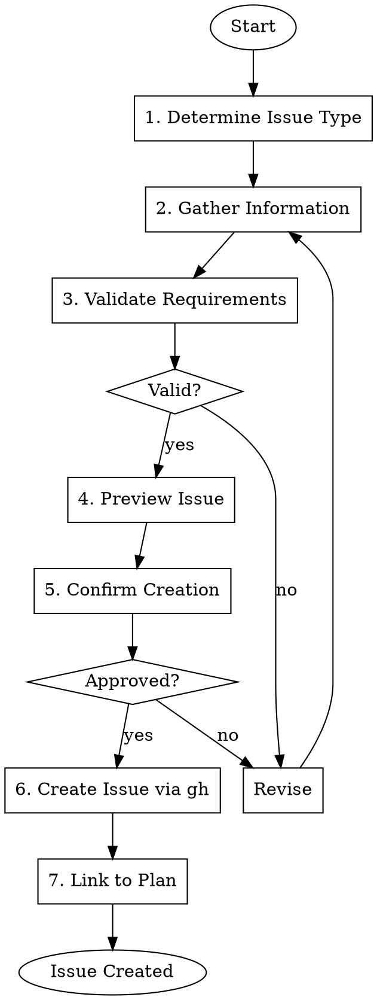

# Gmacko Issue Creator

Create well-structured GitHub issues using the `gh` CLI with proper templates, labels, and linking.

## Prerequisites

- `gh` CLI installed and authenticated
- Repository exists on GitHub (gmacko org)
- Issue templates in `.github/ISSUE_TEMPLATE/`

## Workflow



## Issue Types & Templates

### Bug Report
Use `.github/ISSUE_TEMPLATE/bug.yml`:
- Title prefix: `[Bug]:`
- Required: description, reproduction steps, expected/actual behavior
- Labels: `type:bug`, `status:needs-triage`

### Feature Request
Use `.github/ISSUE_TEMPLATE/feature.yml`:
- Title prefix: `[Feature]:`
- Required: problem statement, proposed solution, acceptance criteria
- Labels: `type:feature`, `status:needs-triage`

### Task (from feature plan)
Custom format:
- Title prefix: `[Task]:`
- Parent issue reference
- Labels: `type:task`, appropriate area label

## Label Taxonomy

### Type Labels
- `type:bug` - Something isn't working
- `type:feature` - New functionality
- `type:task` - Implementation task
- `type:docs` - Documentation
- `type:chore` - Maintenance/tooling

### Status Labels
- `status:needs-triage` - Needs review
- `status:ready` - Ready for implementation
- `status:in-progress` - Being worked on
- `status:blocked` - Waiting on dependency
- `status:needs-review` - PR submitted

### Area Labels
- `area:web` - Next.js app
- `area:mobile` - Expo app
- `area:api` - tRPC routers
- `area:db` - Database/schema
- `area:shared` - Shared packages

### Priority Labels
- `priority:critical` - Blocking users
- `priority:high` - Significant impact
- `priority:medium` - Normal priority
- `priority:low` - Nice to have

## Execution Steps

### Step 1: Determine Issue Type

Ask:
> What type of issue should I create?
> 1. Bug report
> 2. Feature request
> 3. Task (from existing plan)
> 4. Documentation update

### Step 2: Gather Information

**For Bugs:**
```
REQUIRED INFORMATION
====================
1. Title (concise description)
2. Bug description
3. Steps to reproduce
4. Expected behavior
5. Actual behavior
6. Platform(s) affected
7. Environment (dev/staging/prod)
8. Error logs (if any)
9. Sentry link (if any)
```

**For Features:**
```
REQUIRED INFORMATION
====================
1. Title (feature name)
2. Problem statement (what problem does it solve?)
3. Proposed solution
4. Acceptance criteria (testable conditions)
5. Platform(s) affected
6. Priority suggestion
7. Link to INITIAL_PLAN.md section (if applicable)
8. Mockups/screenshots (if any)
```

**For Tasks:**
```
REQUIRED INFORMATION
====================
1. Title (task description)
2. Parent issue/feature
3. Detailed description
4. Acceptance criteria
5. Area (web/mobile/api/db)
6. Estimated effort
7. Dependencies
```

### Step 3: Validate Requirements

Ensure all required fields are complete:

```
VALIDATION CHECKLIST
====================
[OK] Title is descriptive (5-50 chars)
[OK] Problem/description is clear
[OK] Acceptance criteria defined
[OK] Platform(s) specified
[MISSING] Steps to reproduce (required for bugs)
```

If missing required fields, ask for them.

### Step 4: Preview Issue

Show the user what will be created:

```markdown
ISSUE PREVIEW
=============

**Title**: [Bug]: Login button unresponsive on mobile

**Labels**: type:bug, area:mobile, priority:high, status:needs-triage

**Body**:
## Bug Description
The login button on the sign-in screen doesn't respond to taps...

## Steps to Reproduce
1. Open the app
2. Navigate to sign-in
3. Tap the login button
4. Nothing happens

## Expected Behavior
Button should trigger authentication flow

## Actual Behavior
No response, no error

## Platform
- Mobile iOS (Expo)

## Environment
- Production

## Error Logs
No errors in console

---

Does this look correct?
```

### Step 5: Confirm Creation

**IMPORTANT**: Creating issues is an external side effect. Always confirm.

> I'm about to create this issue on GitHub.
> 
> Repository: gmacko/[project-name]
> Title: [Bug]: Login button unresponsive on mobile
> Labels: type:bug, area:mobile, priority:high
>
> Proceed? (yes/no)

### Step 6: Create Issue via gh

Execute the `gh` command:

```bash
# For bug reports
gh issue create \
  --title "[Bug]: Login button unresponsive on mobile" \
  --label "type:bug,area:mobile,priority:high,status:needs-triage" \
  --body-file /tmp/issue-body.md

# For features
gh issue create \
  --title "[Feature]: Add dark mode support" \
  --label "type:feature,area:web,area:mobile,priority:medium,status:needs-triage" \
  --body-file /tmp/issue-body.md

# For tasks with parent
gh issue create \
  --title "[Task]: Implement dark mode toggle component" \
  --label "type:task,area:web,status:needs-triage" \
  --body "Parent: #123

## Description
Create the dark mode toggle component...

## Acceptance Criteria
- [ ] Toggle switches theme
- [ ] Preference persisted
"
```

### Step 7: Link to Plan (if applicable)

If this issue relates to a feature plan:

1. Update the plan document to reference the issue
2. Add issue link to `docs/ai/handoffs/{feature}-plan.md`

```markdown
## Related Issues
- #456 - Main feature issue
- #457 - Database task
- #458 - API task
- #459 - UI task
```

Report success:

> Issue created successfully!
> 
> **URL**: https://github.com/gmacko/[project]/issues/456
> **Number**: #456
>
> Next steps:
> - Add to project board (if using)
> - Assign to developer
> - Link related issues

## Batch Creation

For creating multiple issues from a feature plan:

```
BATCH CREATION
==============
Creating issues for feature: Dark Mode Support

1. [Feature]: Dark mode support - Epic
2. [Task]: Database schema for theme preferences - #457
3. [Task]: API endpoint for theme settings - #458
4. [Task]: Web theme toggle component - #459
5. [Task]: Mobile theme toggle screen - #460

All issues created and linked to parent #456.
```

## Red Flags

| Rationalization | Correction |
|-----------------|------------|
| "I'll create without confirmation" | ALWAYS confirm before `gh issue create` |
| "Labels aren't important" | Proper labels enable filtering and triage |
| "No need for acceptance criteria" | Criteria required for QA verification |
| "I'll link the plan later" | Link immediately for traceability |

## Error Handling

### gh not authenticated
```
gh auth login
```

### Repository not found
```
gh repo view gmacko/[project-name]
# If missing, create first:
gh repo create gmacko/[project-name] --private
```

### Label doesn't exist
```
# Create missing labels
gh label create "type:bug" --color "d73a4a" --description "Something isn't working"
gh label create "type:feature" --color "a2eeef" --description "New feature or request"
```

## Dependencies

- Requires: `gh` CLI authenticated
- Input: Bug report, feature request, or task description
- Output: GitHub issue URL
- Related: `gmacko-dev-feature-plan` (provides task breakdown)
