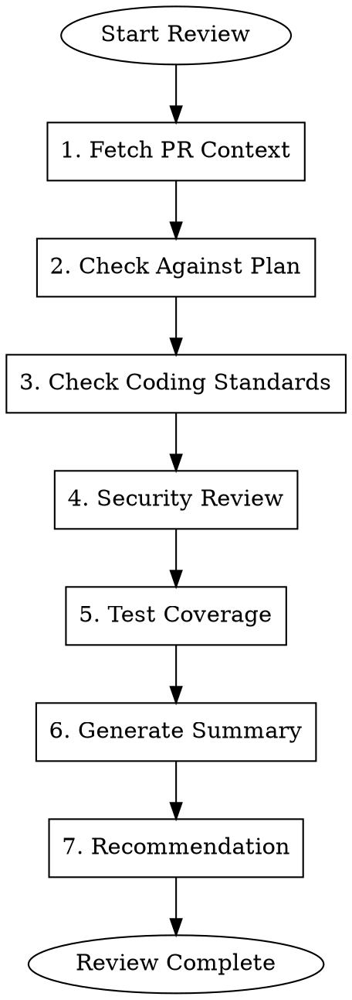

# Gmacko PR Review

Review pull requests against coding standards, INITIAL_PLAN.md, and feature acceptance criteria.

## When to Use

- A PR is ready for review
- User asks for code review
- Before merging to main/staging
- After a major feature implementation

## Workflow



## Review Checklist

### 1. PR Metadata
- [ ] Title follows convention (`[Type]: Description`)
- [ ] Description explains the "why"
- [ ] Related issues linked
- [ ] Appropriate labels assigned
- [ ] Correct base branch

### 2. Plan Alignment
- [ ] Changes match feature plan scope
- [ ] No scope creep (unplanned features)
- [ ] Acceptance criteria addressed
- [ ] Non-goals respected

### 3. Code Quality
- [ ] Follows TypeScript strict mode
- [ ] Uses `interface` over `type` for objects
- [ ] No `any` types (use `unknown` if needed)
- [ ] Proper error handling
- [ ] No console.log statements
- [ ] No commented-out code

### 4. Naming Conventions
- [ ] Files: kebab-case
- [ ] Components: PascalCase
- [ ] Functions/variables: camelCase
- [ ] Constants: SCREAMING_SNAKE_CASE

### 5. Import Order
1. React/external libraries
2. `@repo/*` workspace packages
3. `@/*` internal aliases
4. Relative imports

### 6. Architecture
- [ ] Follows provider hierarchy
- [ ] Uses appropriate shared package
- [ ] tRPC procedures follow patterns
- [ ] Database changes have migrations

### 7. Security
- [ ] No secrets in code
- [ ] No `.env` files modified (only `.env.example`)
- [ ] Input validation on API endpoints
- [ ] Proper auth checks
- [ ] No SQL injection risks

### 8. Performance
- [ ] No unnecessary re-renders
- [ ] Appropriate use of `useMemo`/`useCallback`
- [ ] Images optimized
- [ ] Bundle size considered

### 9. Testing
- [ ] New code has tests (if applicable)
- [ ] Existing tests pass
- [ ] Manual testing documented

### 10. Cross-Platform (if applicable)
- [ ] Web and mobile consistency
- [ ] Platform-specific code isolated
- [ ] Shared logic in packages

## Execution Steps

### Step 1: Fetch PR Context

Get PR details:

```bash
# Get PR info
gh pr view [number] --json title,body,labels,files,additions,deletions

# Get diff
gh pr diff [number]

# Get related issues
gh pr view [number] --json linkedIssues
```

Identify:
- What files changed
- What type of change (feature/bug/refactor)
- Which areas affected (web/mobile/api/db)

### Step 2: Check Against Plan

If PR relates to a feature plan:

1. Find the plan: `docs/ai/handoffs/{feature}-plan.md`
2. Check acceptance criteria
3. Verify scope alignment
4. Note any deviations

```markdown
## Plan Alignment Check

Plan: docs/ai/handoffs/dark-mode-plan.md
Issue: #456

### Acceptance Criteria
- [x] Toggle switches theme (IMPLEMENTED)
- [x] Preference persisted (IMPLEMENTED)
- [ ] Respects system preference (NOT FOUND)

### Scope Notes
- PR includes additional animation (not in plan) - ASK about scope
```

### Step 3: Check Coding Standards

Review code against project standards:

```markdown
## Code Quality Review

### TypeScript
- [x] Strict mode compliance
- [x] No `any` types
- [!] Line 45: Consider using `unknown` instead of type assertion

### Naming
- [x] File naming correct
- [x] Component naming correct
- [!] Line 23: Variable `x` should be more descriptive

### Imports
- [x] Import order correct
- [!] Line 5: External import should come before @repo import

### Patterns
- [x] tRPC procedures follow patterns
- [x] Error handling present
```

### Step 4: Security Review

Check for security issues:

```markdown
## Security Review

- [x] No hardcoded secrets
- [x] .env files not modified
- [x] Auth checks in place
- [x] Input validation present
- [!] Line 78: Consider rate limiting this endpoint
```

### Step 5: Test Coverage

Verify testing:

```markdown
## Test Coverage

- [ ] Unit tests for ThemeToggle component
- [x] Integration test for theme API
- [!] No E2E tests for theme switching flow

### Manual Testing Checklist
- [ ] Web: Theme toggles correctly
- [ ] Web: Preference persists on refresh
- [ ] Mobile: Theme toggles correctly
- [ ] Mobile: Preference persists
```

### Step 6: Generate Summary

Create review summary:

```markdown
# PR Review Summary

**PR**: #123 - [Feature]: Add dark mode support
**Reviewer**: AI Assistant
**Date**: 2025-01-05

## Overall Assessment

**Recommendation**: APPROVE with minor suggestions

## Highlights
- Clean implementation of theme switching
- Good use of Zustand for state management
- Proper separation of web/mobile code

## Issues Found

### Must Fix (Blocking)
None

### Should Fix (Non-blocking)
1. **Line 45**: Use `unknown` type instead of assertion
2. **Line 78**: Add rate limiting to theme endpoint

### Consider (Suggestions)
1. Add unit tests for ThemeToggle
2. Consider adding system preference detection
3. Animation could be smoother

## Checklist Completion
- Plan alignment: 2/3 criteria met
- Code quality: 8/10 checks passed
- Security: All checks passed
- Tests: Partial coverage

## Files Reviewed
- `packages/store/src/stores/theme.ts` - OK
- `apps/web/src/components/theme-toggle.tsx` - Minor issues
- `apps/mobile/src/screens/settings.tsx` - OK
- `packages/api/src/routers/user.ts` - Suggestion
```

### Step 7: Recommendation

Provide clear recommendation:

| Status | Meaning |
|--------|---------|
| **APPROVE** | Good to merge |
| **APPROVE_WITH_SUGGESTIONS** | Can merge, improvements optional |
| **REQUEST_CHANGES** | Must address issues before merge |
| **NEEDS_DISCUSSION** | Requires clarification |

## Review Comment Templates

### Approval
```markdown
LGTM! Clean implementation that follows our patterns.

Minor suggestions:
- Consider adding tests for edge cases
- The animation could be smoother

Approved for merge.
```

### Request Changes
```markdown
Good progress! A few things need attention before merge:

**Must fix:**
1. Line 45: Security issue - input not validated
2. Line 78: Missing auth check

**Questions:**
- Is the scope creep (animations) intentional?

Please address the blocking issues and I'll re-review.
```

## Red Flags

| Rationalization | Correction |
|-----------------|------------|
| "It's a small change, no review needed" | ALL PRs get reviewed, even small ones |
| "Tests can be added later" | At minimum, document what needs testing |
| "Security isn't my concern" | ALWAYS check for secrets and auth |
| "The code works, that's enough" | Standards matter for maintainability |

## Integration

- **Input**: PR number or URL
- **References**: Feature plan, coding standards, INITIAL_PLAN.md
- **Output**: Review summary with recommendation
- **Next**: Developer addresses feedback or merges
