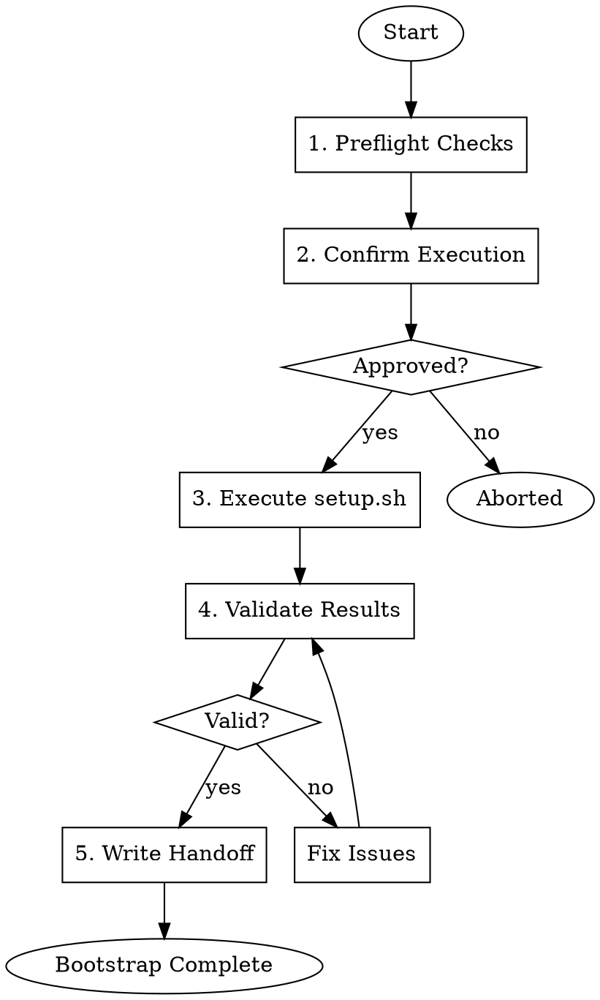

# Gmacko Bootstrap Executor

Execute `scripts/setup.sh` to initialize the project from the template.

## Prerequisites

- `PROJECT_MANIFEST.json` must exist
- `INITIAL_PLAN.md` should exist (run `gmacko-init-plan` first)
- Git working directory should be clean

## Workflow



## Execution Steps

### Step 1: Preflight Checks

Run these checks and report status:

```bash
# Check 1: PROJECT_MANIFEST.json exists
[ -f "PROJECT_MANIFEST.json" ] && echo "OK: Manifest found" || echo "FAIL: Manifest missing"

# Check 2: Git is clean (no uncommitted changes)
[ -z "$(git status --porcelain)" ] && echo "OK: Git clean" || echo "WARN: Uncommitted changes"

# Check 3: Node.js installed
node --version && echo "OK: Node.js found" || echo "FAIL: Node.js missing"

# Check 4: pnpm installed
pnpm --version && echo "OK: pnpm found" || echo "FAIL: pnpm missing"

# Check 5: Read project name from manifest
PROJECT_NAME=$(node -p "require('./PROJECT_MANIFEST.json').project.name")
echo "Project name: $PROJECT_NAME"

# Check 6: Determine if mobile is needed
MOBILE=$(node -p "require('./PROJECT_MANIFEST.json').platforms.mobile")
echo "Mobile platform: $MOBILE"
```

Report preflight summary:
```
PREFLIGHT CHECKS
================
[OK] PROJECT_MANIFEST.json found
[OK] Git working directory clean
[OK] Node.js v20.x installed
[OK] pnpm 9.x installed

Project: acme-saas
Mobile: false (will use --no-mobile flag)
```

### Step 2: Confirm Execution

**IMPORTANT**: This step requires user confirmation because it makes irreversible changes.

Tell the user:
> I'm about to run `scripts/setup.sh` which will:
> 
> 1. Rename all `@repo/*` packages to `@{project-name}/*`
> 2. Update app metadata (titles, descriptions)
> 3. Remove the template's git history
> 4. Initialize a fresh git repository
> 5. Delete `node_modules` and reinstall dependencies
>
> **This cannot be undone.**
>
> Shall I proceed? (yes/no)

### Step 3: Execute setup.sh

On user confirmation, execute:

```bash
# Build the command
PROJECT_NAME=$(node -p "require('./PROJECT_MANIFEST.json').project.name")
MOBILE=$(node -p "require('./PROJECT_MANIFEST.json').platforms.mobile")

if [ "$MOBILE" = "false" ]; then
  ./scripts/setup.sh "$PROJECT_NAME" --no-mobile
else
  ./scripts/setup.sh "$PROJECT_NAME"
fi
```

Monitor output and report progress:
- Package scope renamed
- App metadata updated
- Dependencies cleaned
- Fresh install running
- Git repository initialized

### Step 4: Validate Results

After setup completes, run validation:

```bash
# Validation 1: Check package.json has correct name
node -p "require('./package.json').name" | grep -q "$PROJECT_NAME" && echo "OK: Root package renamed"

# Validation 2: Type check passes
pnpm typecheck && echo "OK: Type check passed" || echo "FAIL: Type errors"

# Validation 3: Lint passes
pnpm lint && echo "OK: Lint passed" || echo "FAIL: Lint errors"

# Validation 4: Build succeeds
pnpm build && echo "OK: Build succeeded" || echo "FAIL: Build failed"

# Validation 5: Git repo initialized
[ -d ".git" ] && echo "OK: Git initialized" || echo "FAIL: Git missing"
```

Report validation summary:
```
VALIDATION RESULTS
==================
[OK] Package renamed to @acme-saas/*
[OK] Type check passed (0 errors)
[OK] Lint passed (0 warnings)
[OK] Build succeeded
[OK] Git repository initialized

Bootstrap successful!
```

If validation fails, report errors and suggest fixes.

### Step 5: Write Handoff Document

Write `docs/ai/handoffs/init-bootstrap.md`:

```markdown
# Initialization Handoff: Bootstrap Complete

## Timestamp
[ISO timestamp]

## Status
- [x] Preflight checks passed
- [x] setup.sh executed successfully
- [x] Validation passed

## Changes Made
- Renamed `@repo/*` to `@{project-name}/*`
- Updated app titles and metadata
- Removed template git history
- Initialized fresh git repository
- Installed dependencies

## Validation Results
- Type check: PASSED
- Lint: PASSED
- Build: PASSED

## Next Steps
- [ ] Run `gmacko-init-provision` to configure external services
- [ ] Create initial commit with project files
- [ ] Push to gmacko/{project-name} repository

## Notes
[Any warnings or issues encountered]
```

## Post-Bootstrap Actions

After bootstrap completes, suggest:

> Bootstrap complete! Next steps:
>
> 1. **Review the changes**: Check `package.json` and app files
> 2. **Provision services**: Run the `gmacko-init-provision` skill
> 3. **Create initial commit**: 
>    ```bash
>    git add .
>    git commit -m "Initial commit: {project-name}"
>    ```
> 4. **Push to GitHub**:
>    ```bash
>    gh repo create gmacko/{project-name} --private --source=. --push
>    ```

## Red Flags

| Rationalization | Correction |
|-----------------|------------|
| "I'll skip the confirmation, it's just a rename" | ALWAYS require explicit "yes" before setup.sh |
| "Validation failed but it's probably fine" | STOP: Fix all validation errors before proceeding |
| "I'll skip typecheck to save time" | NEVER skip validation; it catches real issues |
| "Git is dirty but I'll proceed anyway" | WARN user; recommend committing first |

## Error Handling

### setup.sh fails
1. Check error output
2. Common issues:
   - Invalid project name (must be lowercase, alphanumeric, hyphens)
   - Disk space issues
   - Permission problems
3. Suggest fix and retry

### Validation fails
1. Report specific failure
2. For type errors: Run `pnpm typecheck` and show errors
3. For lint errors: Run `pnpm lint --fix` if auto-fixable
4. For build errors: Check for missing dependencies

## Dependencies

- Requires: `PROJECT_MANIFEST.json`, `scripts/setup.sh`
- Produces: Renamed project, `docs/ai/handoffs/init-bootstrap.md`
- Next skill: `gmacko-init-provision`
