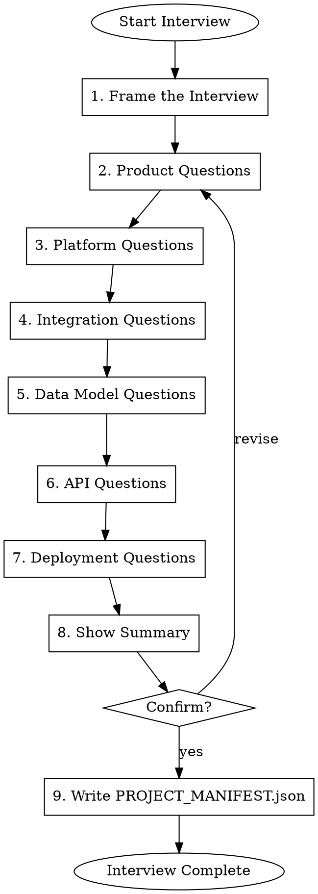

# Gmacko Project Interview

Conduct a structured interview to gather project requirements and generate `PROJECT_MANIFEST.json`.

## Workflow



## Execution Steps

### Step 1: Frame the Interview

Tell the user:

> I'll guide you through setting up your new Gmacko Ventures project. This interview has **7 sections** covering:
> 1. Product goals and scope
> 2. Platform choices (web/mobile)
> 3. Integrations (auth, payments, analytics, etc.)
> 4. Data model and entities
> 5. API design
> 6. Deployment configuration
>
> You can say **"skip"** to use defaults for any section, or **"back"** to revise previous answers.
> 
> At the end, I'll show you a summary before generating your PROJECT_MANIFEST.json.

### Step 2: Product Questions

Ask these questions (wait for responses):

```
PRODUCT GOALS
=============

1. What is the name of your project? (lowercase, hyphens allowed)
   Example: "acme-saas", "team-tracker", "invoice-app"

2. What is the display name? (human-readable)
   Example: "Acme SaaS Platform", "Team Tracker Pro"

3. Describe your project in one sentence:
   Example: "A B2B platform for managing team projects and tasks"

4. Who are your target users?
   Example: "Small to medium B2B teams (5-50 users)"

5. What are 3-5 features that MUST be in your MVP?
   Example: 
   - User authentication
   - Project management
   - Task tracking
   - Team collaboration

6. What features are explicitly OUT of scope for MVP?
   Example:
   - Mobile app
   - Advanced reporting
   - Third-party integrations
```

### Step 3: Platform Questions

```
PLATFORMS
=========

7. Which platforms do you need?
   a) Web only
   b) Web + Mobile (React Native via Expo)
   c) Mobile only

8. If mobile is deferred, which phase? (e.g., "Phase 2")

9. Does the app need to work offline? (yes/no)
```

### Step 4: Integration Questions

```
INTEGRATIONS
============

I'll ask about each integration. Answer "yes", "no", or "later" (for Phase 2+).

10. Authentication (Clerk)
    - Do you need it? (default: yes)
    - Social providers? (google, github, apple, none)
    - Multi-factor auth? (yes/no)
    - Organizations/teams? (yes/no)

11. Payments (Stripe)
    - Do you need it? (yes/no/later)
    - Model: subscription, one-time, or usage-based?
    - How many pricing tiers?
    - Free trial days?

12. Analytics (PostHog)
    - Do you need it? (default: yes)
    - Session recording? (yes/no)

13. Error Monitoring (Sentry)
    - Do you need it? (default: yes)
    - Performance monitoring? (yes/no)

14. Email (SendGrid)
    - Do you need transactional emails? (yes/no/later)

15. Real-time (Pusher)
    - Do you need real-time updates? (yes/no/later)
    - Use case? (e.g., live notifications, collaborative editing)

16. File Storage (Uploadthing)
    - Do you need file uploads? (yes/no/later)
    - Use case? (e.g., profile photos, documents)
```

### Step 5: Data Model Questions

```
DATA MODEL
==========

17. List your core entities (database tables):
    Example: users, teams, projects, tasks, comments

18. For each entity, list the key fields:
    Example:
    - users: id, email, name, avatar
    - projects: id, name, description, status, ownerId

19. Describe the main relationships:
    Example:
    - users -> teams (many-to-many via teamMembers)
    - teams -> projects (one-to-many)
    - projects -> tasks (one-to-many)

20. Is this a multi-tenant app? (single tenant / team-based / organization-based)
```

### Step 6: API Questions

```
API DESIGN
==========

21. API style preference?
    a) tRPC (default, type-safe, recommended)
    b) REST
    c) GraphQL
    d) Mix of tRPC + WebSockets

22. List your main API routers/endpoints:
    Example: users, teams, projects, tasks, billing
```

### Step 7: Deployment Questions

```
DEPLOYMENT
==========

23. Web deployment platform?
    a) Vercel (default, recommended)
    b) Kubernetes cluster
    c) Other (specify)

24. What environments do you need?
    Default: development, staging, production

25. Custom domains?
    - Production: (e.g., app.example.com)
    - Staging: (e.g., staging.example.com)

26. Mobile deployment (if applicable)?
    - EAS (Expo Application Services) is default
    - Bundle ID base: (e.g., com.gmacko.myapp)
```

### Step 8: Show Summary

After gathering all answers, display a summary table:

```
PROJECT CONFIGURATION SUMMARY
=============================

Project
-------
Name:         acme-saas
Display:      Acme SaaS Platform
Description:  A B2B platform for managing team projects
Target Users: Small to medium B2B teams

Platforms
---------
Web:    Yes
Mobile: Phase 2

Integrations
------------
| Integration | Enabled | Configuration |
|-------------|---------|---------------|
| Clerk       | Yes     | Google, GitHub, Orgs |
| Stripe      | Yes     | Subscription, 3 tiers, 14-day trial |
| PostHog     | Yes     | Autocapture, Session recording |
| Sentry      | Yes     | Performance monitoring |
| SendGrid    | No      | - |
| Pusher      | Yes     | Private channels |
| Uploadthing | No      | - |

Data Model
----------
Entities: users, teams, teamMembers, projects, tasks
Multi-tenancy: Team-based

API
---
Style: tRPC
Routers: users, teams, projects, tasks, billing

Deployment
----------
Web: Vercel (dev/staging/prod)
Mobile: EAS
Domains: app.acme-saas.com, staging.acme-saas.com
```

### Step 9: Confirm and Write

Ask:
> Does this look correct? Reply **"yes"** to generate PROJECT_MANIFEST.json, or tell me what to change.

On confirmation:
1. Write `PROJECT_MANIFEST.json` to the repository root
2. Report success and suggest next steps:
   > PROJECT_MANIFEST.json has been created!
   >
   > Next steps:
   > 1. Review the manifest file
   > 2. Run the `gmacko-init-plan` skill to generate INITIAL_PLAN.md
   > 3. Run the `gmacko-init-bootstrap` skill to execute setup

## Output Format

The `PROJECT_MANIFEST.json` must follow this schema:

```json
{
  "version": "1.0.0",
  "createdAt": "<ISO timestamp>",
  "project": {
    "name": "<project-name>",
    "displayName": "<Display Name>",
    "description": "<one-sentence description>",
    "org": "gmacko",
    "repository": "gmacko/<project-name>"
  },
  "goals": {
    "primary": "<main goal>",
    "targetUsers": "<target audience>",
    "successMetrics": ["<metric 1>", "<metric 2>"],
    "mvpScope": ["<feature 1>", "<feature 2>"],
    "outOfScope": ["<deferred 1>", "<deferred 2>"]
  },
  "platforms": {
    "web": true,
    "mobile": false,
    "mobilePhase": 2
  },
  "integrations": {
    "auth": { "provider": "clerk", "enabled": true, "config": {} },
    "payments": { "provider": "stripe", "enabled": true, "config": {} },
    "analytics": { "provider": "posthog", "enabled": true, "config": {} },
    "monitoring": { "provider": "sentry", "enabled": true, "config": {} },
    "email": { "provider": "sendgrid", "enabled": false },
    "realtime": { "provider": "pusher", "enabled": false },
    "storage": { "provider": "uploadthing", "enabled": false }
  },
  "database": {
    "provider": "neon",
    "orm": "drizzle",
    "entities": [],
    "relationships": []
  },
  "api": {
    "style": "trpc",
    "realtime": false,
    "routers": []
  },
  "screens": {
    "mvp": [],
    "phase2": []
  },
  "deployment": {
    "web": { "provider": "vercel", "environments": [] },
    "mobile": { "provider": "eas", "profiles": [], "bundleId": "" }
  },
  "domains": {}
}
```

## Red Flags

| Rationalization | Correction |
|-----------------|------------|
| "I'll skip the interview, user seems clear" | ALWAYS complete all sections; use defaults if user says "skip" |
| "I'll just write the manifest without confirmation" | ALWAYS show summary and get explicit "yes" before writing |
| "The user didn't specify entities, I'll guess" | ASK explicitly; don't invent data model |
| "I'll add extra integrations they might need" | Only enable what user explicitly requests |

## References

- Example manifest: `docs/ai/examples/PROJECT_MANIFEST.example.json`
- Skill system design: `docs/ai/SKILL_SYSTEM_DESIGN.md`
