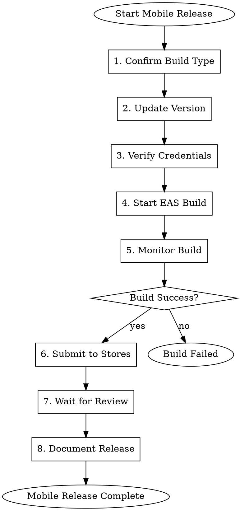

# Gmacko Mobile Deployment (EAS)

Build and submit mobile applications using Expo Application Services (EAS).

## When to Use

- Web deployment is complete (or mobile-only release)
- Ready to build for TestFlight/Play Store internal testing
- Ready to submit to App Store / Google Play
- Need to manage app credentials

## Prerequisites

- EAS CLI installed: `npm install -g eas-cli`
- EAS authenticated: `eas whoami`
- EAS project configured: `apps/mobile/eas.json`
- Apple/Google credentials configured

## Workflow



## Build Profiles

Defined in `apps/mobile/eas.json`:

| Profile | Purpose | Distribution |
|---------|---------|--------------|
| `development` | Dev builds with Expo Go | Internal |
| `preview` | TestFlight / Internal testing | Internal |
| `production` | App Store / Play Store | Store |

## Execution Steps

### Step 1: Confirm Build Type

Ask user:
> I'm preparing a mobile build.
>
> **Options**:
> 1. **Preview** - Internal testing (TestFlight / Internal track)
> 2. **Production** - Store release (App Store / Play Store)
>
> **Platforms**:
> - [ ] iOS
> - [ ] Android
> - [ ] Both
>
> Which would you like to build?

### Step 2: Update Version

Check and update version in `apps/mobile/app.config.js`:

```javascript
// Current version
const version = "1.0.0";  // User-facing version
const buildNumber = "1";   // iOS: CFBundleVersion, Android: versionCode
```

Ask user:
> Current version: **1.0.0** (build 1)
>
> For this release:
> - Version: [suggest next version]
> - Build number: [suggest increment]
>
> Confirm or specify new values.

Update config:
```bash
# In apps/mobile/app.config.js
# Update version and buildNumber constants
```

### Step 3: Verify Credentials

Check credentials are configured:

```bash
# Check iOS credentials
eas credentials --platform ios

# Check Android credentials
eas credentials --platform android
```

For iOS:
```markdown
## iOS Credentials Check
- [ ] Apple Developer account connected
- [ ] Distribution certificate valid
- [ ] Provisioning profile valid
- [ ] Push notification key configured (if needed)
```

For Android:
```markdown
## Android Credentials Check
- [ ] Keystore configured
- [ ] Service account key available (for Play Store)
- [ ] Bundle signing configured
```

### Step 4: Start EAS Build

**Preview Build** (internal testing):
```bash
# Build for both platforms
eas build --profile preview --platform all

# Build for specific platform
eas build --profile preview --platform ios
eas build --profile preview --platform android
```

**Production Build** (store release):
```bash
# Build for both platforms
eas build --profile production --platform all

# Build for specific platform
eas build --profile production --platform ios
eas build --profile production --platform android
```

Capture build IDs:
```bash
# Build URLs will be provided in output
# Example: https://expo.dev/accounts/gmacko/projects/my-app/builds/xxx
```

### Step 5: Monitor Build

Monitor build progress:

```bash
# List recent builds
eas build:list --limit 5

# View specific build
eas build:view [build-id]

# Open in browser
eas build:view [build-id] --open
```

Report status:
```
Build Status
============
iOS Build: BUILDING / SUCCESS / FAILED
  - Build ID: xxx
  - Started: [time]
  - Duration: [Xm Xs]

Android Build: BUILDING / SUCCESS / FAILED
  - Build ID: yyy
  - Started: [time]
  - Duration: [Xm Ys]
```

Build times:
- iOS: ~15-30 minutes
- Android: ~10-20 minutes

### Step 6: Submit to Stores

**For Preview builds** (internal testing):

iOS (TestFlight):
```bash
eas submit --platform ios --profile preview
```

Android (Internal track):
```bash
eas submit --platform android --profile preview
```

**For Production builds** (store release):

iOS (App Store):
```bash
eas submit --platform ios --profile production
```

Android (Play Store):
```bash
eas submit --platform android --profile production
```

### Step 7: Wait for Review

**iOS App Store**:
- TestFlight: Usually instant to ~1 hour
- App Store: 24-48 hours typical, can take longer

**Google Play**:
- Internal track: Usually instant
- Production: Few hours to a few days

Track status:
```markdown
## Review Status

### iOS
- Submitted: [timestamp]
- Status: Waiting for Review / In Review / Ready for Sale
- Estimated: [X hours/days]

### Android
- Submitted: [timestamp]
- Status: Pending / In Review / Published
- Estimated: [X hours]
```

### Step 8: Document Release

Update release summary:

```markdown
## Mobile Deployment Record

### iOS
- **Version**: X.Y.Z (build N)
- **Build ID**: [eas-build-id]
- **Submitted**: [timestamp]
- **Status**: [current status]
- **TestFlight**: [available/pending]
- **App Store**: [available/pending/in-review]

### Android
- **Version**: X.Y.Z (versionCode N)
- **Build ID**: [eas-build-id]
- **Submitted**: [timestamp]
- **Status**: [current status]
- **Internal Track**: [available/pending]
- **Production**: [available/pending/in-review]

### Release Notes (for stores)
[Same as GitHub release notes, adapted for store format]
```

## Credential Management

### iOS Credentials

```bash
# Setup/update credentials
eas credentials --platform ios

# Renew expiring certificates
eas credentials --platform ios
# Select "Manage credentials" > "Renew"
```

### Android Credentials

```bash
# Setup/update credentials  
eas credentials --platform android

# View keystore info
eas credentials --platform android
# Select "View credentials"
```

## Error Handling

### Build Failures

1. Check build logs:
   ```bash
   eas build:view [build-id]
   ```

2. Common iOS issues:
   - Code signing errors → Check credentials
   - Pod install failures → Clear pods, rebuild
   - Xcode version mismatch → Update EAS config

3. Common Android issues:
   - Gradle errors → Check dependencies
   - Keystore issues → Verify credentials
   - Memory errors → Adjust EAS build config

### Submission Failures

1. iOS rejection reasons:
   - Missing screenshots
   - Privacy policy issues
   - Guideline violations
   
2. Android rejection reasons:
   - Policy violations
   - Missing permissions justification
   - Target API level issues

## OTA Updates (Expo Updates)

For minor updates without store release:

```bash
# Publish OTA update
eas update --branch production --message "Bug fixes"

# Check update status
eas update:list
```

Note: OTA updates are limited to JS/asset changes, not native code.

## Red Flags

| Rationalization | Correction |
|-----------------|------------|
| "Skip version increment" | ALWAYS increment build number for new builds |
| "Credentials are fine, skip check" | Verify credentials before every release |
| "Submit to production directly" | Test via preview/TestFlight first |
| "Don't need to wait for review" | Document expected review time |
| "OTA can fix native issues" | Native changes require new build |

## Integration

- **Input**: Build profile, platforms, version
- **References**: Release summary, eas.json config
- **Output**: Build IDs, store submission status, updated release record
- **Next**: `gmacko-release-close` or monitor store status
