# Mermaid Diagrams

Generate diagrams using Mermaid syntax. All diagrams render in markdown code blocks with `mermaid` language identifier.

## Decision Guide

| Use Case | Diagram Type |
|----------|--------------|
| Process flow, decision trees | Flowchart |
| API calls, system interactions over time | Sequence |
| OOP structure, domain models | Class |
| State machines, workflows | State |
| Database schemas, data relationships | ER |
| Software architecture (C4 model) | C4 |
| Brainstorming, hierarchical organization | Mindmap |
| Git branching, commit history | GitGraph |

---

## Quick Reference

### Flowchart
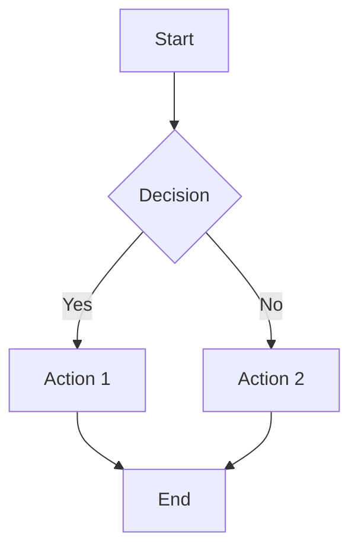

### Sequence
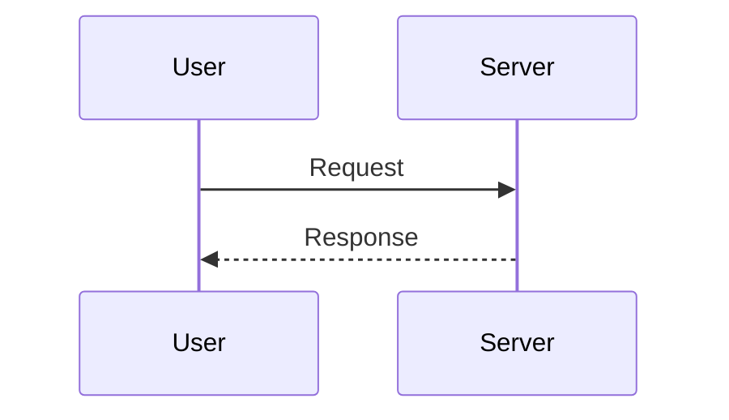

### Class
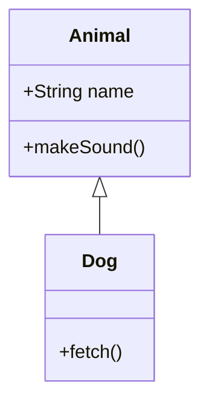

### State
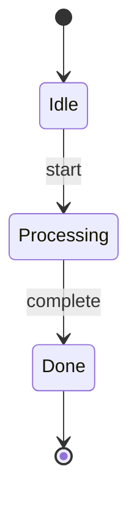

### ER
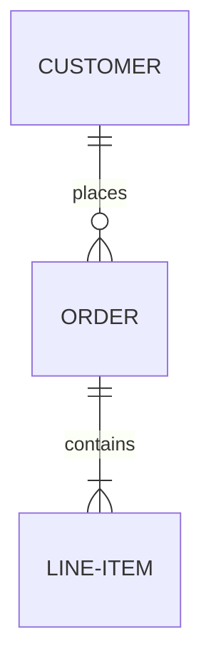

### C4 Context
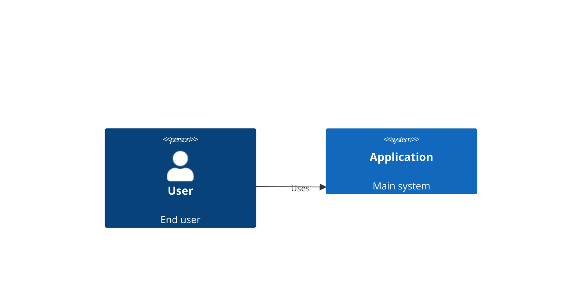

### Mindmap
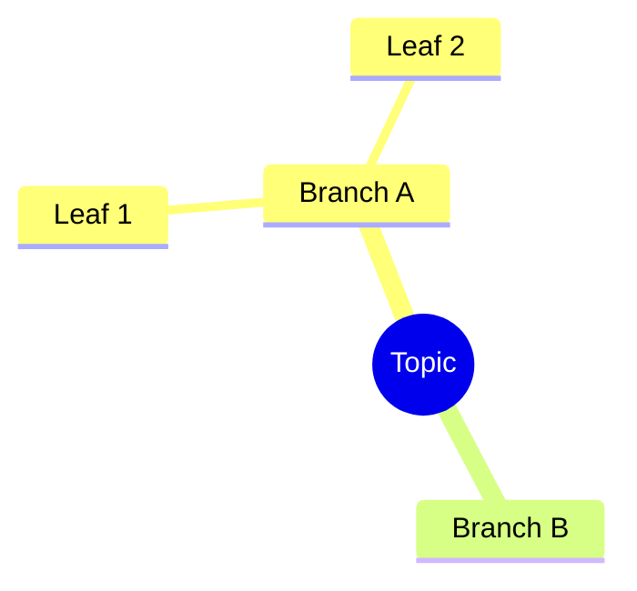

### GitGraph
```mermaid
gitgraph
    commit
    branch feature
    commit
    checkout main
    merge feature
```

---

## Flowchart Reference

**Directions:** `TD` (top-down), `LR` (left-right), `BT` (bottom-top), `RL` (right-left)

### Node Shapes

| Shape | Syntax | Example |
|-------|--------|---------|
| Rectangle | `[text]` | `A[Process]` |
| Rounded | `(text)` | `A(Start)` |
| Stadium | `([text])` | `A([Terminal])` |
| Diamond | `{text}` | `A{Decision}` |
| Circle | `((text))` | `A((Event))` |
| Hexagon | `{{text}}` | `A{{Prepare}}` |
| Cylinder | `[(text)]` | `A[(Database)]` |
| Subroutine | `[[text]]` | `A[[Subprocess]]` |
| Parallelogram | `[/text/]` | `A[/Input/]` |
| Trapezoid | `[\text\]` | `A[\Manual Op\]` |

### Link Types

| Type | Syntax | Description |
|------|--------|-------------|
| Arrow | `-->` | Solid with arrowhead |
| Open | `---` | Solid, no arrowhead |
| Dotted arrow | `-.->` | Dotted with arrowhead |
| Thick arrow | `==>` | Thick with arrowhead |
| With text | `--\|text\|>` | Label on link |
| Multi-length | `---->` | Longer link (more ranks) |

### Subgraphs
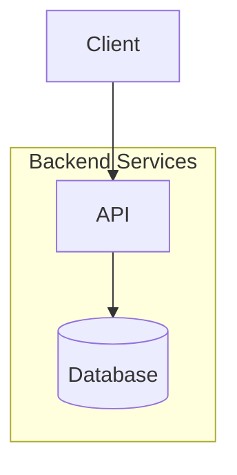

### Styling
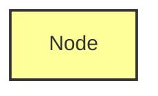

---

## Sequence Diagram Reference

### Arrow Types

| Syntax | Style |
|--------|-------|
| `->>` | Solid with arrowhead |
| `-->>` | Dotted with arrowhead |
| `-x` | Solid with cross |
| `-)` | Async (open arrow) |
| `<<->>` | Bidirectional |

### Participants
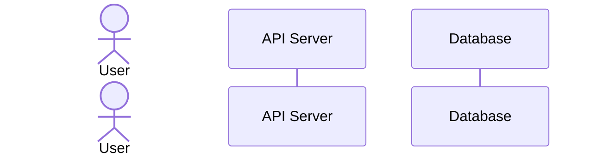

### Activations
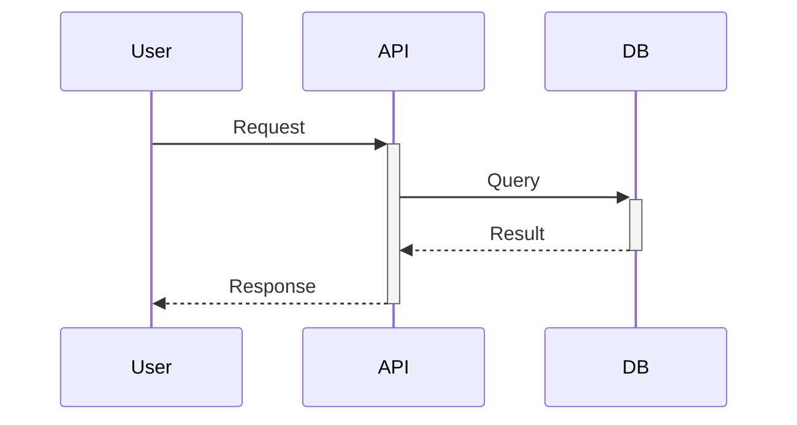

### Control Flow
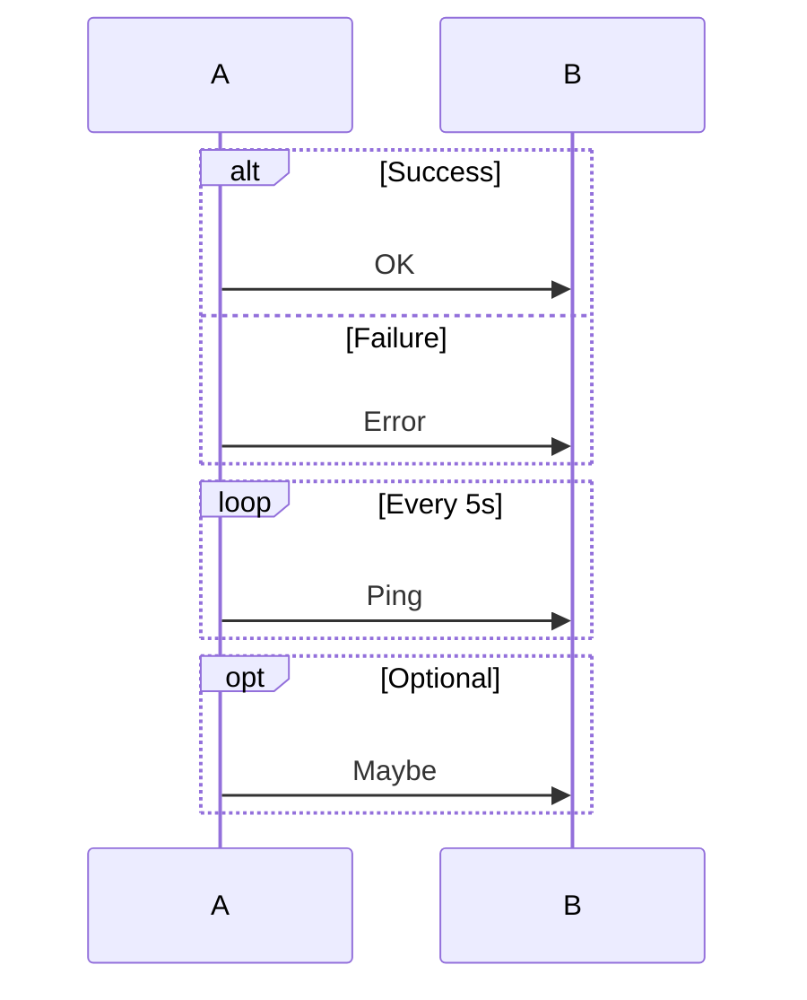

### Notes
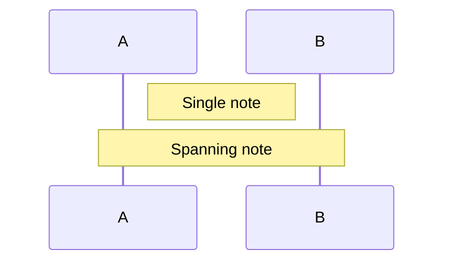

### Grouping with Boxes
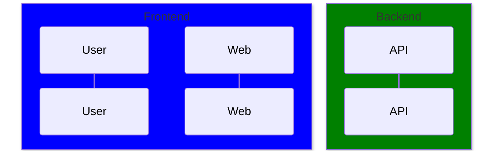

---

## Class Diagram Reference

### Visibility Modifiers

| Symbol | Meaning |
|--------|---------|
| `+` | Public |
| `-` | Private |
| `#` | Protected |
| `~` | Package |

### Relationships

| Type | Syntax | Meaning |
|------|--------|---------|
| Inheritance | `<\|--` | Extends |
| Composition | `*--` | Strong owns |
| Aggregation | `o--` | Weak owns |
| Association | `-->` | Uses |
| Dependency | `..>` | Depends on |
| Realization | `..\|>` | Implements |

### Full Example
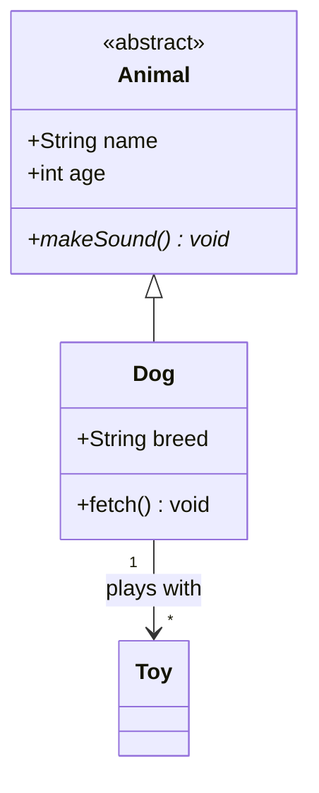

### Generics
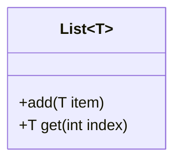

### Annotations
- `<<interface>>` - Interface
- `<<abstract>>` - Abstract class
- `<<service>>` - Service class
- `<<enumeration>>` - Enum

---

## State Diagram Reference

### Basic Syntax
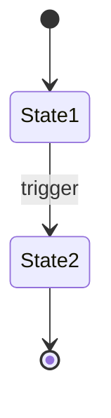

### Composite States
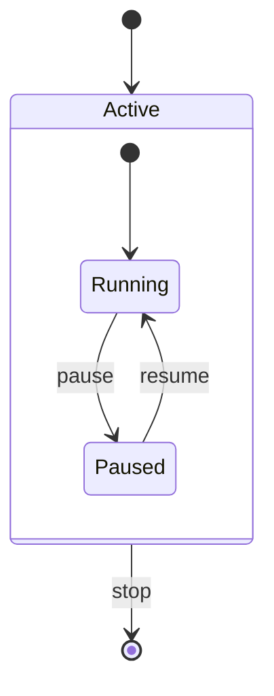

### Fork and Join
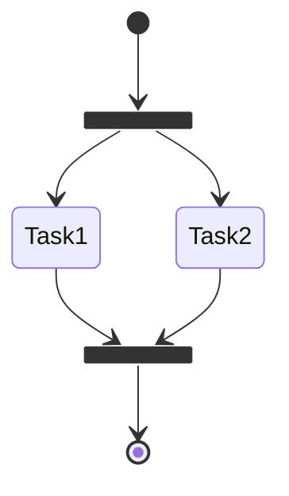

### Choice
```mermaid
stateDiagram-v2
    state check <<choice>>
    [*] --> check
    check --> Success: valid
    check --> Error: invalid
```

### Notes
```mermaid
stateDiagram-v2
    State1
    note right of State1
        Description here
    end note
```

---

## ER Diagram Reference

### Cardinality

| Left | Right | Meaning |
|------|-------|---------|
| `\|o` | `o\|` | Zero or one |
| `\|\|` | `\|\|` | Exactly one |
| `}o` | `o{` | Zero or more |
| `}\|` | `\|{` | One or more |

### Relationship Types
- `--` Identifying (solid line, child depends on parent)
- `..` Non-identifying (dashed line, independent entities)

### Attributes
```mermaid
erDiagram
    USER {
        int id PK
        string email UK
        string name
        datetime created_at
    }
    POST {
        int id PK
        int user_id FK
        string title
        text content
    }
    USER ||--o{ POST : writes
```

---

## C4 Diagram Reference

C4 provides 4 levels of abstraction for architecture documentation.

### Diagram Types
- `C4Context` - System context (level 1)
- `C4Container` - Container diagram (level 2)
- `C4Component` - Component diagram (level 3)
- `C4Dynamic` - Interaction sequences
- `C4Deployment` - Infrastructure layout

### Elements

| Element | Syntax | Use |
|---------|--------|-----|
| Person | `Person(alias, label, desc)` | Users |
| Person_Ext | `Person_Ext(...)` | External users |
| System | `System(alias, label, desc)` | Software systems |
| System_Ext | `System_Ext(...)` | External systems |
| SystemDb | `SystemDb(...)` | Database systems |
| Container | `Container(alias, label, tech, desc)` | Applications |
| ContainerDb | `ContainerDb(...)` | Container databases |
| Component | `Component(alias, label, tech, desc)` | Internal parts |

### Boundaries
```mermaid
C4Container
    System_Boundary(app, "Application") {
        Container(web, "Web App", "React")
        Container(api, "API", "Node.js")
        ContainerDb(db, "Database", "PostgreSQL")
    }
    Rel(web, api, "HTTP/JSON")
    Rel(api, db, "SQL")
```

### Relationships
- `Rel(from, to, label)` - Standard relationship
- `Rel_U/D/L/R(...)` - Directional hints
- `BiRel(from, to, label)` - Bidirectional

### Complete C4 Context Example
```mermaid
C4Context
    Person(user, "Customer", "Uses the system")
    System(app, "E-Commerce", "Online store")
    System_Ext(payment, "Payment Gateway", "Processes payments")
    System_Ext(shipping, "Shipping API", "Handles delivery")

    Rel(user, app, "Browses, orders")
    Rel(app, payment, "Processes payments")
    Rel(app, shipping, "Ships orders")
```

---

## Mindmap Reference

Uses indentation for hierarchy. Root node required.

### Node Shapes
```mermaid
mindmap
    root((Central Topic))
        [Square]
        (Rounded)
        ))Cloud((
        {{Hexagon}}
```

### With Icons
```mermaid
mindmap
    root((Project))
        Tasks ::icon(fa fa-tasks)
        Team ::icon(fa fa-users)
```

### Styling
```mermaid
mindmap
    root
        Important:::urgent
        Normal
```

---

## GitGraph Reference

### Basic Operations
```mermaid
gitgraph
    commit id: "initial"
    commit id: "feature"
    branch develop
    commit
    checkout main
    merge develop tag: "v1.0"
```

### Commit Types
- `type: NORMAL` - Default
- `type: HIGHLIGHT` - Emphasized
- `type: REVERSE` - Reverted

### Full Example
```mermaid
gitgraph
    commit id: "init"
    branch feature
    commit id: "add-login"
    commit id: "add-logout" type: HIGHLIGHT
    checkout main
    commit id: "hotfix" type: REVERSE
    merge feature tag: "v1.0"
```

---

## Best Practices

### DO
- Keep diagrams focused (one concept per diagram)
- Use clear, descriptive labels
- Add direction hints (`TD`, `LR`) explicitly
- Use subgraphs/boundaries for grouping
- Include legends for complex diagrams

### DON'T
- Overcrowd with too many nodes (>15-20)
- Use cryptic single-letter IDs without labels
- Mix multiple concerns in one diagram
- Rely on auto-layout for complex diagrams

### Layout Tips
- **Flowchart**: `LR` for processes, `TD` for hierarchies
- **Sequence**: Order participants by interaction frequency
- **Class**: Group related classes with namespaces
- **C4**: Start with Context, drill down to Container/Component
- **ER**: Place central entities in the middle

### Common Fixes
| Problem | Solution |
|---------|----------|
| Nodes overlap | Reduce node count, use subgraphs |
| Links cross confusingly | Reorder nodes, change direction |
| Text truncated | Use aliases: `A[Long Name] as short` |
| Diagram too wide | Switch `LR` to `TD` |
