# Mermaid Expert

Expert guidance for Mermaid.js, the powerful JavaScript library for creating diagrams and visualizations using text-based syntax. Mermaid transforms simple text descriptions into professional-looking diagrams that can be embedded in documentation, presentations, and web applications.

## Additional Resources

For comprehensive documentation and advanced features, see the [Mermaid Source Documentation](docs/snapshot/v11.12.1/) which includes:
- [Flow Charts Guide](docs/snapshot/v11.12.1/flow_charts.md) - Complete flowchart syntax and examples

For integration details and configuration options, refer to the main documentation at [docs/snapshot/v11.12.1/](docs/snapshot/v11.12.1/).

## Core Concepts

**Mermaid is a text-to-diagram tool that allows you to create:**
- Flowcharts for processes and decision trees
- Sequence diagrams for interactions and timelines
- Class diagrams for software architecture
- State diagrams for finite state machines
- Gantt charts for project management
- Git graphs for version control visualization
- Block diagrams for system layouts

### Getting Started

**Basic Mermaid syntax structure:**
```mermaid
diagramType
    [diagram content]
```

**Simple flowchart example:**
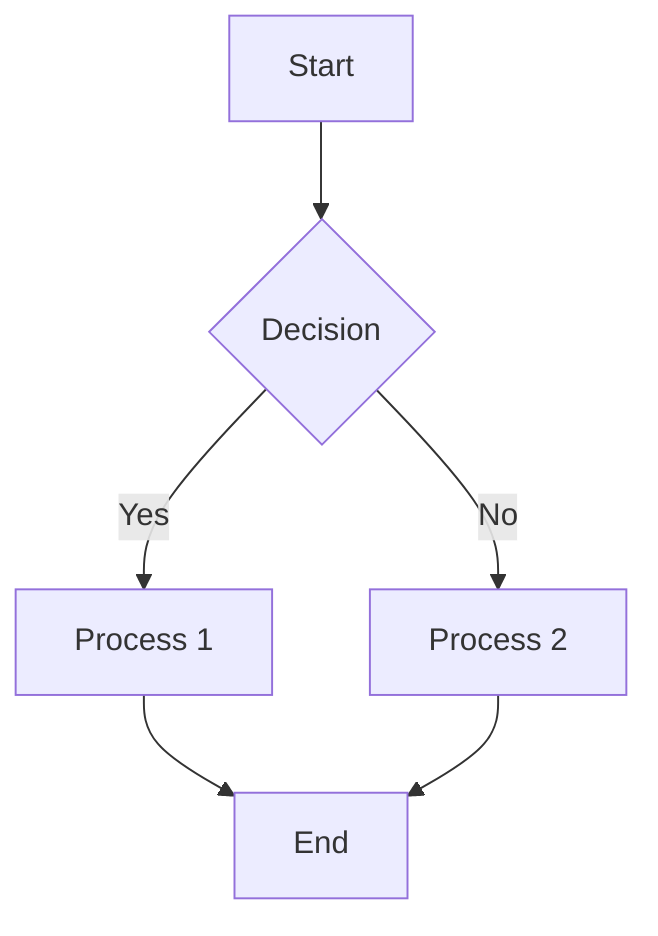

### Installation and Setup

**In HTML:**
```html
<script src="https://cdn.jsdelivr.net/npm/mermaid/dist/mermaid.min.js"></script>
```

**In Markdown/Documentation:**
Most modern platforms (GitHub, GitLab, Notion) support Mermaid natively using code blocks with `mermaid` language identifier.

**Node.js/npm:**
```bash
npm install mermaid
```

### Command Line Interface (mermaid-cli)

For detailed installation instructions and usage, see the official [mermaid-cli repository](https://github.com/mermaid-js/mermaid-cli).

**Basic usage examples (after installation):**
```bash
# Convert Mermaid file to SVG
mmdc -i input.mmd -o output.svg

# Convert to PNG with dark theme and transparent background
mmdc -i input.mmd -o output.png -t dark -b transparent

# Generate diagrams in markdown files (automatically finds and replaces mermaid blocks)
mmdc -i readme.template.md -o readme.md
```

**Piping input from stdin:**
```bash
cat << EOF | mmdc --input -
flowchart TD
    A[Start] --> B[Process]
    B --> C[End]
EOF
```

**Docker usage:**
```bash
docker pull minlag/mermaid-cli
docker run --rm -u $(id -u):$(id -g) -v /path/to/diagrams:/data minlag/mermaid-cli -i diagram.mmd
```

**Syntax validation with mermaid-cli:**
If mermaid-cli is installed, you can validate Mermaid syntax using:
```bash
# Test syntax by piping input
echo "flowchart TD; A-->B" | mmdc --input -
# If no errors occur, the syntax is valid
```

*If mermaid-cli is not installed, please refer to the [official installation guide](https://github.com/mermaid-js/mermaid-cli) for setup instructions.*

**Configuration:**
```javascript
mermaid.initialize({
    startOnLoad: true,
    theme: 'default',
    themeVariables: {
        primaryColor: '#ffcc00',
        primaryTextColor: '#000',
        lineColor: '#ffcc00'
    }
});
```

## Flow Charts

### Basic Flowchart Syntax

**Node types:**
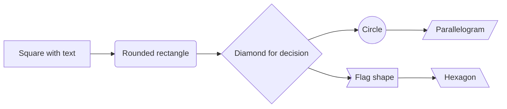

**Directions:**
- `TD` or `TB` - Top to Bottom (default)
- `BT` - Bottom to Top
- `LR` - Left to Right
- `RL` - Right to Left

**Complex example with styling:**
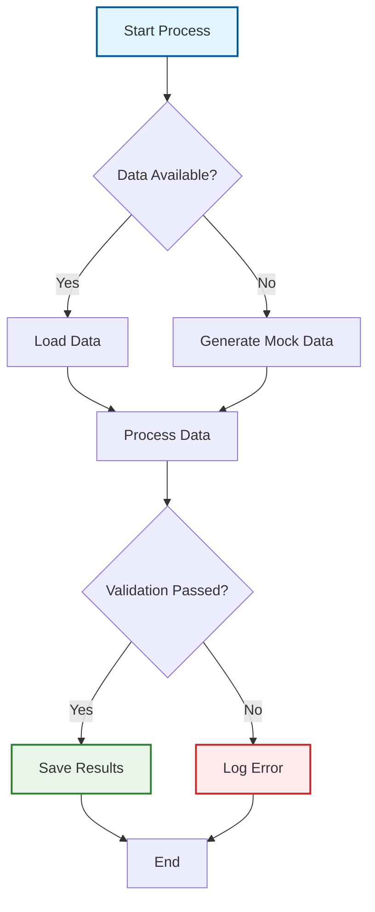

### Advanced Flowchart Features

**Subgraphs:**
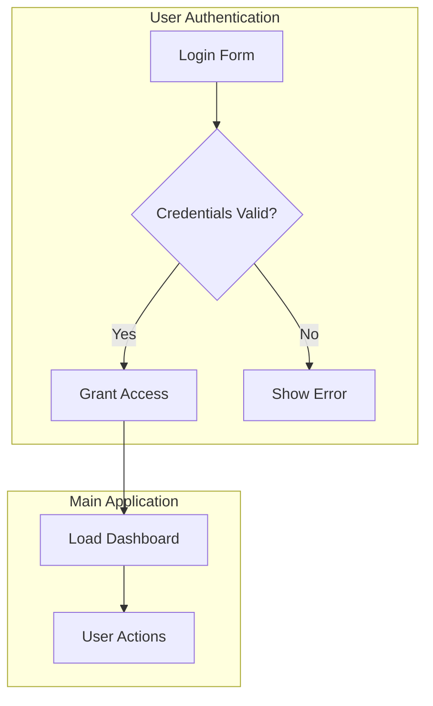

**Links and actions:**
```mermaid
flowchart LR
    A[Click Here] --> B(https://example.com)
    C[Callback] --> D{javascript:alert('Hello')}
```

## Sequence Diagrams

### Basic Sequence Diagram

**Participants and interactions:**
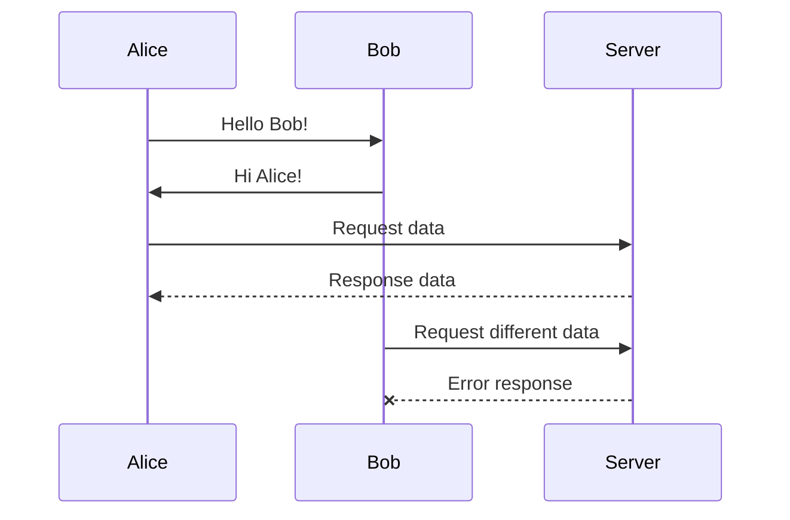

**Advanced features:**
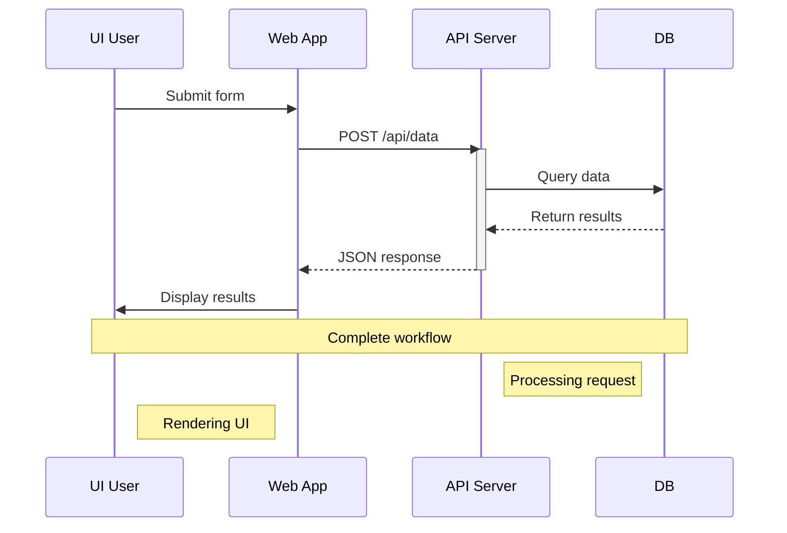

### Loops and Conditionals

```mermaid
sequenceDiagram
    participant Client
    participant Server

    loop Retry mechanism
        Client->>Server: Send request
        alt Success
            Server-->>Client: Success response
            break Stop retrying
        else Server error
            Server--xClient: Error response
            Client->>Client: Wait and retry
        end
    end
```

## Class Diagrams

### UML Class Structure

**Basic class definition:**
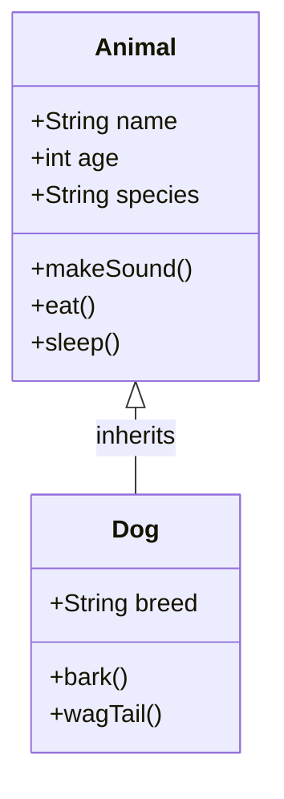

**Complex class relationships:**
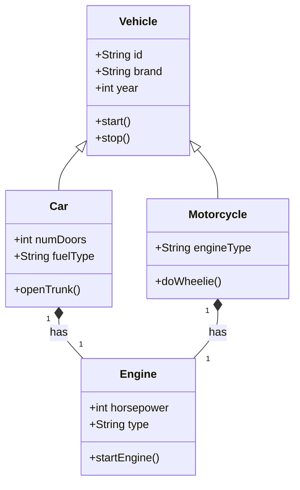

### Class Relationships

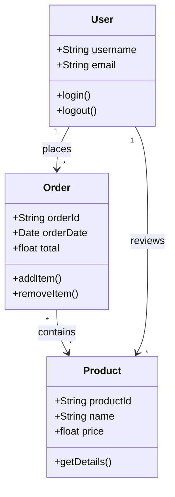

## State Diagrams

### State Machine Visualization

**Basic state diagram:**
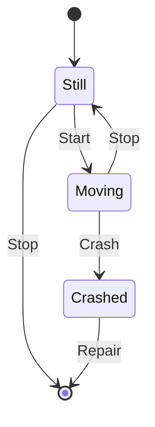

**Complex state machine:**
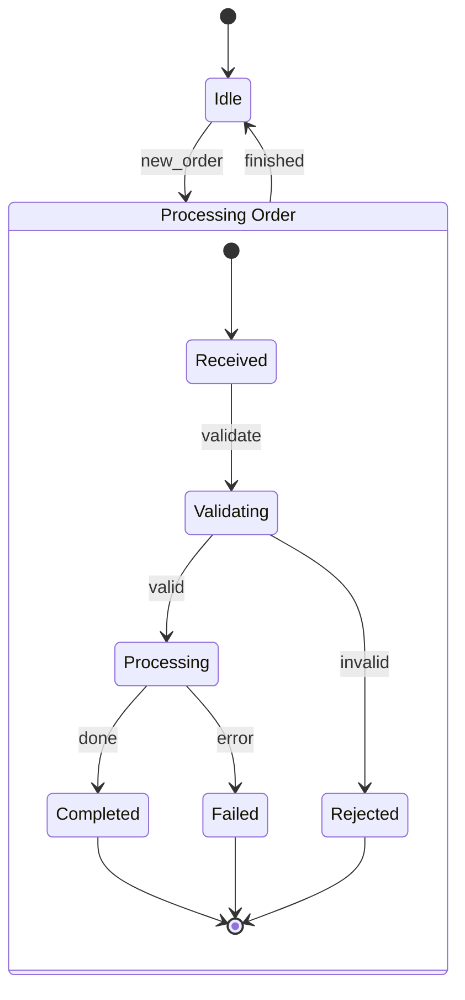

### Concurrent States

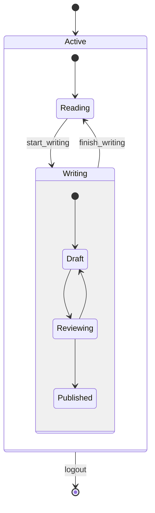

## Gantt Charts

### Project Timeline Visualization

**Basic Gantt chart:**
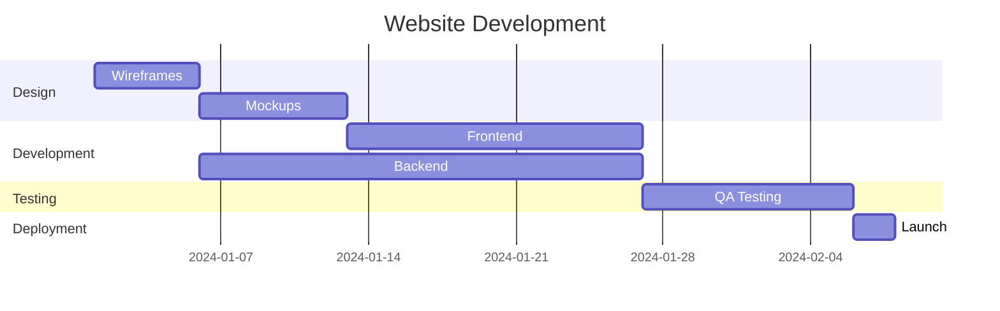

**Advanced Gantt chart with milestones:**
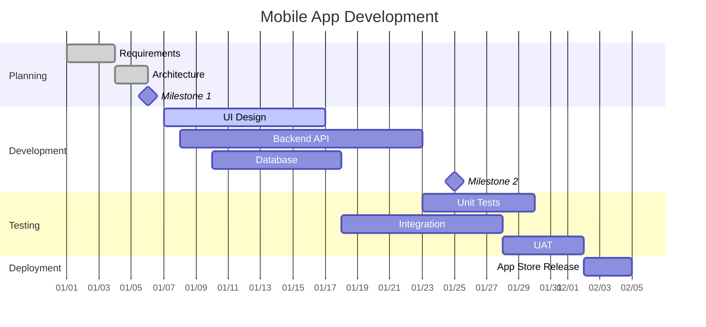

## Git Graphs

### Version Control Visualization

**Basic git graph:**
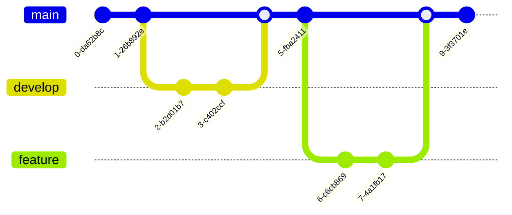

**Advanced git workflow:**
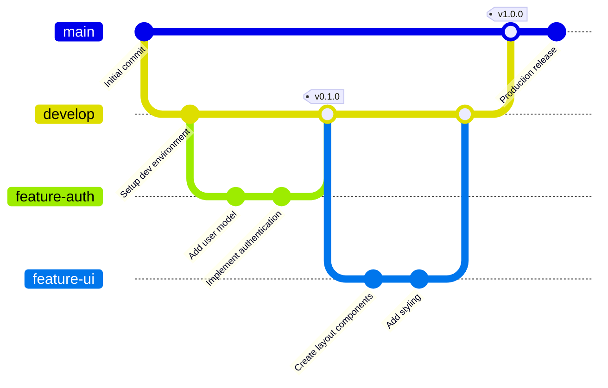

## Block Diagrams

### System Architecture Visualization

**Basic block diagram:**
```mermaid
block-beta
    columns 4
    db[(Database)] block:Server[Server]  rest[API] ui[UI]
    db --> block --> rest --> ui
```

**Complex system architecture:**
```mermaid
block-beta
    columns 4

    block:Users["User Layer"]
        service:Web[Web Client]
        service:Mobile[Mobile App]
        service:Desktop[Desktop App]
    end

    block:Gateway["API Gateway"]
        service:LoadBalancer[Load Balancer]
        service:Auth[Auth Service]
    end

    block:Services["Microservices"]
        service:UserService[User Service]
        service:OrderService[Order Service]
        service:PaymentService[Payment Service]
    end

    block:Data["Data Layer"]
        db[(User DB)]
        db[(Order DB)]
        db[(Payment DB)]
        cache[(Redis Cache)]
    end

    Users --> Gateway
    Gateway --> Services
    Services --> Data
```

## Integration and Usage

### In Markdown Files

**GitHub/GitLab integration:**
```markdown
# Process Flow

Here's our user authentication flow:

```mermaid
flowchart TD
    A[User Login] --> B{Valid Credentials?}
    B -->|Yes| C[Access Granted]
    B -->|No| D[Show Error]
    C --> E[Dashboard]
    D --> A
```
```

### Web Integration

**HTML example:**
```html
<!DOCTYPE html>
<html>
<head>
    <script src="https://cdn.jsdelivr.net/npm/mermaid/dist/mermaid.min.js"></script>
</head>
<body>
    <div class="mermaid">
        flowchart LR
            A[Start] --> B[Process]
            B --> C[End]
    </div>

    <script>
        mermaid.initialize({startOnLoad: true});
    </script>
</body>
</html>
```

### React/Vue Integration

**React component:**
```jsx
import React, { useEffect } from 'react';
import mermaid from 'mermaid';

const MermaidDiagram = ({ chart, id }) => {
  useEffect(() => {
    mermaid.initialize({ startOnLoad: true });
    mermaid.contentLoaded();
  }, []);

  return <div id={`mermaid-${id}`} className="mermaid">{chart}</div>;
};

// Usage
const MyFlow = () => {
  const flowChart = `
    flowchart TD
        A[React Component] --> B[State Management]
        B --> C[UI Rendering]
        C --> D[User Interaction]
  `;

  return <MermaidDiagram chart={flowChart} id="app-flow" />;
};
```

## Best Practices

### Diagram Design Principles

**Keep diagrams simple:**
- Limit to 15-20 nodes per diagram for readability
- Use clear, concise labels
- Group related elements together
- Use consistent styling

**Effective flowcharts:**
- Follow top-to-bottom or left-to-right flow
- Use decision points sparingly
- Color-code different types of actions
- Add meaningful annotations

**Sequence diagram tips:**
- Show clear message flow
- Use appropriate message types (sync, async, reply)
- Group related interactions
- Highlight important state changes

### Performance Optimization

**For web applications:**
```javascript
// Initialize Mermaid once
mermaid.initialize({
    startOnLoad: false,
    theme: 'default',
    themeVariables: {
        primaryColor: '#0066cc',
        primaryTextColor: '#333'
    }
});

// Render diagrams on demand
const renderDiagram = async (element, definition) => {
    const { svg } = await mermaid.render('mermaid-diagram', definition);
    element.innerHTML = svg;
};
```

### Accessibility Considerations

**Accessible Mermaid diagrams:**
- Provide alt text descriptions
- Use high-contrast colors
- Ensure keyboard navigation
- Include ARIA labels

```html
<div class="mermaid" aria-label="User authentication flowchart" role="img">
    flowchart TD
        A[Login] --> B{Valid?}
        B -->|Yes| C[Dashboard]
        B -->|No| D[Error]
</div>
```

## Troubleshooting

### Common Issues

**Diagrams not rendering:**
- Check JavaScript loading order
- Verify correct language identifier (`mermaid`)
- Ensure proper HTML escaping

**Syntax errors:**
- Validate indentation (spaces only, no tabs)
- Check for missing semicolons or brackets
- Verify node and edge syntax

**Using mermaid-cli for validation:**
If you have mermaid-cli installed, you can validate syntax:
```bash
# Test syntax by attempting to render
echo "flowchart TD; A-->B" | mmdc --input -
# If successful, syntax is valid
# If errors appear, check the console output for specific issues
```

For installation instructions, see the [official mermaid-cli repository](https://github.com/mermaid-js/mermaid-cli).

**Performance issues:**
- Large diagrams may slow page loading
- Consider lazy loading for complex diagrams
- Use appropriate SVG optimization

### Debug Tools

**Browser console:**
```javascript
// Enable debug mode
mermaid.initialize({
    logLevel: 'debug'
});

// Check diagram parsing
mermaid.parse('flowchart TD\nA-->B');
```

## Advanced Features

### Custom Themes

**Define custom theme variables:**
```javascript
mermaid.initialize({
    theme: 'base',
    themeVariables: {
        primaryColor: '#ffcc00',
        primaryTextColor: '#333333',
        primaryBorderColor: '#333333',
        lineColor: '#333333',
        secondaryColor: '#fff',
        tertiaryColor: '#fff'
    }
});
```

### Interactive Features

**Click handlers:**
```javascript
// Add click actions to nodes
const definition = `
flowchart LR
    A[Click Me] --> B{Action}

    click A "https://example.com"
    click B "alert('Decision point')"
`;
```

## Resources

- Official documentation: https://mermaid.js.org/
- Live editor: https://mermaid.live/
- GitHub repository: https://github.com/mermaid-js/mermaid
- Integration guides: https://mermaid.js.org/ecosystem/integration/
- Community Discord: https://discord.gg/mERmu2FpGJ
