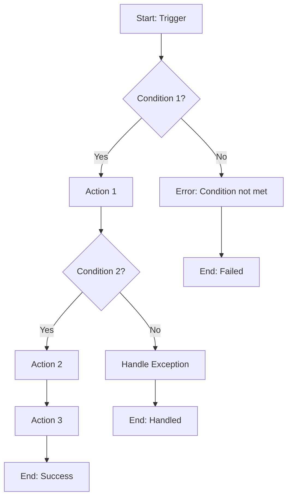
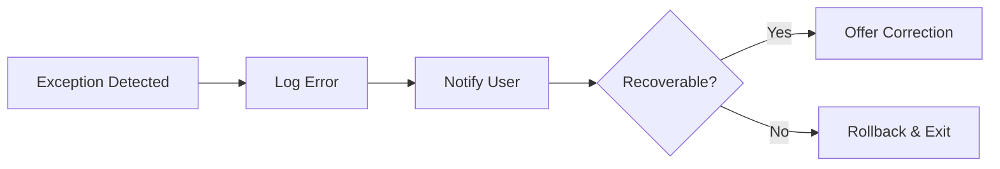

# Phase 4: Generate Ontology

Transform DRD into final Ontology artifacts ready for use.

## Trigger

Execute when:
- Phase 3 DRD is available
- Ontology regeneration requested

## Output Structure

```
_output/
├── 00-ontology/                        # Domain Foundation (SINGLE SOURCE)
│   ├── README.md                       # Index and overview
│   ├── domain/                         # Entity definitions
│   │   ├── [submodule-1]-entities.md
│   │   ├── [submodule-2]-entities.md
│   │   └── shared-entities.md
│   └── workflows/                      # Workflow CATALOG only
│       ├── [submodule-1]-workflows.md
│       └── [submodule-2]-workflows.md
│
└── 01-concept/                         # Behavioral Documentation
    ├── README.md                       # Concept index
    ├── 01-overview.md                  # Module overview
    └── [submodule]/                    # Per submodule
        ├── overview.md                 # Submodule overview
        ├── [workflow-1]-guide.md       # Workflow DETAIL here
        └── [workflow-2]-guide.md
```

### Key Principle: Separation of Concerns

| Layer | Contains | Purpose |
|-------|----------|---------|
| `00-ontology/domain/` | Entity definitions | "What exists" - SINGLE SOURCE |
| `00-ontology/workflows/` | Workflow catalog | "What workflows exist" - Index only |
| `01-concept/` | Concept guides | "How things work" - Detailed flows |

## Process

### Step 1: Load DRD

Read: `_output/00-drd/DRD-[module].md`

Extract:
- All entities from Section 2
- All business rules from Section 3
- All workflows from Section 4
- Examples from Section 5

### Step 2: Group by Submodule

Organize entities and workflows into logical submodules:

```yaml
submodule_grouping:
  [submodule-1]:
    entities: [list]
    workflows: [list]
  [submodule-2]:
    entities: [list]
    workflows: [list]
  shared:
    entities: [list]  # Cross-cutting entities
```

### Step 3: Generate Ontology README.md

Create: `_output/00-ontology/README.md`

```markdown
# [Module] Domain Ontology

**Module**: [MODULE-CODE]  
**Version**: 1.0  
**Generated**: [timestamp]  
**Source**: DRD v1.0

---

## Overview

[Brief description of module]

## Structure

### Domain Entities

| Submodule | File | Entities |
|-----------|------|----------|
| [Sub-1] | [domain/sub1-entities.md](domain/sub1-entities.md) | [list] |
| [Sub-2] | [domain/sub2-entities.md](domain/sub2-entities.md) | [list] |
| Shared | [domain/shared-entities.md](domain/shared-entities.md) | [list] |

### Workflow Catalog

| Submodule | File | Workflows |
|-----------|------|-----------|
| [Sub-1] | [workflows/sub1-workflows.md](workflows/sub1-workflows.md) | [list] |
| [Sub-2] | [workflows/sub2-workflows.md](workflows/sub2-workflows.md) | [list] |

> **Note**: Workflow catalogs contain index and metadata only. 
> For detailed workflow guides, see [01-concept/](../01-concept/).

## Quick Reference

### Entity Index

| Entity | Type | Submodule | Definition |
|--------|------|-----------|------------|
| [Entity1] | CORE | [Sub] | [→ Link](domain/sub-entities.md#entity1) |
| [Entity2] | TRANSACTION | [Sub] | [→ Link](domain/sub-entities.md#entity2) |

### Workflow Index

| ID | Workflow | Type | Catalog | Guide |
|----|----------|------|---------|-------|
| WF-001 | [Name] | CORE | [→ Catalog](workflows/sub-workflows.md#wf-001) | [→ Guide](../01-concept/sub/wf-001-guide.md) |

## References

- Source: [DRD-[module].md](../00-drd/DRD-[module].md)
- Concept Guides: [01-concept/](../01-concept/)
```

### Step 3b: Generate Concept README.md

Create: `_output/01-concept/README.md`

```markdown
# [Module] Concept Guides

**Module**: [MODULE-CODE]  
**Version**: 1.0  
**Generated**: [timestamp]

---

## Overview

This section contains detailed concept guides explaining how [Module] workflows operate.

## Guide Index

| Submodule | Guide | Workflow | Description |
|-----------|-------|----------|-------------|
| [Sub-1] | [WF-001 Guide](sub1/wf-001-guide.md) | [WF-001](../00-ontology/workflows/sub1-workflows.md#wf-001) | [Brief desc] |
| [Sub-1] | [WF-002 Guide](sub1/wf-002-guide.md) | [WF-002](../00-ontology/workflows/sub1-workflows.md#wf-002) | [Brief desc] |
| [Sub-2] | [WF-010 Guide](sub2/wf-010-guide.md) | [WF-010](../00-ontology/workflows/sub2-workflows.md#wf-010) | [Brief desc] |

## By Submodule

### [Submodule 1]

- [Overview](sub1/overview.md) - Submodule introduction
- [WF-001: Workflow Name](sub1/wf-001-guide.md)
- [WF-002: Workflow Name](sub1/wf-002-guide.md)

### [Submodule 2]

- [Overview](sub2/overview.md)
- [WF-010: Workflow Name](sub2/wf-010-guide.md)

## References

- Entity Definitions: [00-ontology/domain/](../00-ontology/domain/)
- Workflow Catalog: [00-ontology/workflows/](../00-ontology/workflows/)
```

### Step 4: Generate Entity Files

For each submodule, create `domain/[submodule]-entities.md`:

```markdown
# [Submodule] - Domain Entities

**Module**: [MODULE-CODE]  
**Submodule**: [SUBMODULE-CODE]  
**Version**: 1.0  
**Generated**: [timestamp]

---

## Overview

[Brief description of this submodule's entities]

---

## Entity: [EntityName] {#entity-name}

**Classification**: [CORE_ENTITY | VALUE_OBJECT | REFERENCE_DATA | TRANSACTION_DATA]  
**Description**: [Clear description from DRD]

### Attributes

| Attribute | Type | Required | Constraints | Description |
|-----------|------|----------|-------------|-------------|
| `id` | UUID | ✅ | PK | Primary identifier |
| `[attr_1]` | [type] | [✅/❌] | [constraints] | [description] |
| `[attr_2]` | [type] | [✅/❌] | [constraints] | [description] |
| `created_at` | DateTime | ✅ | Auto | Record creation time |
| `updated_at` | DateTime | ✅ | Auto | Last update time |

### Relationships

| Relationship | Target | Cardinality | Description |
|--------------|--------|-------------|-------------|
| `[rel_name]` | [TargetEntity](#target-entity) | [1:1/1:N/N:M] | [description] |

### Lifecycle States

```
[STATE_1] ──[action]──→ [STATE_2]
              │
              └──[action]──→ [STATE_3]
```

| State | Description | Allowed Transitions |
|-------|-------------|---------------------|
| [STATE_1] | [desc] | → STATE_2, → STATE_3 |
| [STATE_2] | [desc] | → STATE_3 |

### Business Rules

| Rule ID | Description | Reference |
|---------|-------------|-----------|
| [BR-XXX-001] | [rule description] | [DRD Section 3] |
| [BR-XXX-002] | [rule description] | [DRD Section 3] |

### Examples

```yaml
# Example 1: [Scenario]
[entity_name]:
  id: "550e8400-e29b-41d4-a716-446655440000"
  [attr_1]: [value]
  [attr_2]: [value]
  status: [STATE]

# Example 2: [Different scenario]
[entity_name]:
  id: "550e8400-e29b-41d4-a716-446655440001"
  [attr_1]: [different value]
  status: [DIFFERENT_STATE]
```

### Related Entities

- [Entity1](#entity1) - [relationship description]
- [Entity2](./other-entities.md#entity2) - [relationship description]

### Source

- DRD: Section 2 - [Concept Name]
- Confidence: [HIGH/MEDIUM/ASSUMED]

---

## Entity: [NextEntity] {#next-entity}

[Same structure...]

---

## References

- [DRD Section 2](../00-drd/DRD-[module].md#2-domain-concepts)
- [Related Submodule](./other-submodule-entities.md)
```

### Step 5: Generate Workflow Catalog Files

For each submodule, create `workflows/[submodule]-workflows.md`:

```markdown
# [Submodule] - Workflow Catalog

**Module**: [MODULE-CODE]  
**Submodule**: [SUBMODULE-CODE]  
**Version**: 1.0  
**Generated**: [timestamp]

---

## Workflow Index

| ID | Name | Type | Trigger | Guide |
|----|------|------|---------|-------|
| [WF-XXX-001] | [Name] | [CORE/SUPPORT] | [Trigger] | [→ Guide](../../01-concept/[submodule]/wf-xxx-001-guide.md) |
| [WF-XXX-002] | [Name] | [Type] | [Trigger] | [→ Guide](../../01-concept/[submodule]/wf-xxx-002-guide.md) |

---

## WF-[XXX]-001: [Workflow Name] {#wf-xxx-001}

**Classification**: [CORE | SUPPORT | INTEGRATION]  
**Trigger**: [Trigger type and description]

### Actors

| Actor | Type | Role in Workflow |
|-------|------|------------------|
| [Actor 1] | USER | [Role description] |
| [Actor 2] | SYSTEM | [Role description] |

### Related Entities

| Entity | Usage | Link |
|--------|-------|------|
| [Entity1] | Created/Updated | [→ Definition](../domain/sub-entities.md#entity1) |
| [Entity2] | Read | [→ Definition](../domain/sub-entities.md#entity2) |

### High-Level Flow

```
[Actor] ──→ [Action 1] ──→ [System] ──→ [Action 2] ──→ [Result]
                              │
                              └──→ [Alternate Result]
```

### Outcomes

| Outcome | Description | Post-Conditions |
|---------|-------------|-----------------|
| Success | [Description] | [What's true after success] |
| Failure | [Description] | [What's true after failure] |

### Business Rules Applied

- [BR-XXX-001](../domain/sub-entities.md#entity-name) - [Brief description]
- [BR-XXX-002](../domain/sub-entities.md#entity-name) - [Brief description]

### Detailed Guide

> **📖 Full Guide**: See [WF-XXX-001 Concept Guide](../../01-concept/[submodule]/wf-xxx-001-guide.md) for:
> - Step-by-step flow with decisions
> - Exception handling
> - Mermaid diagrams
> - Detailed scenarios

### Source

- DRD: Section 4 - WF-XXX-001
- Confidence: [HIGH/MEDIUM/ASSUMED]

---

## WF-[XXX]-002: [Next Workflow] {#wf-xxx-002}

[Same structure...]

---

## References

- [DRD Section 4](../00-drd/DRD-[module].md#4-workflows)
- [Entity Definitions](../domain/)
```

### Step 6: Generate Concept Guides

For each core workflow, create `_output/01-concept/[submodule]/[wf-id]-guide.md`:

```markdown
# [Workflow Name] - Concept Guide

**Workflow ID**: [WF-XXX-001]  
**Version**: 1.0  
**Audience**: BA, PO, End Users, Developers

---

## Overview

[1-2 paragraph description of what this workflow accomplishes and why it matters]

**Related Catalog Entry**: [→ Workflow Catalog](../workflows/sub-workflows.md#wf-xxx-001)

---

## Process Flow



---

## Step-by-Step Guide

### Step 1: [Step Name]

**Actor**: [Who performs this step]  
**Trigger**: [What initiates this step]

**Action**:
[Detailed description of what happens]

**System Behavior**:
- [System action 1]
- [System action 2]

**Validation**:
| Check | Rule | Error Message |
|-------|------|---------------|
| [Check 1] | [BR-XXX] | "[Error message]" |

**Outcome**: [What's true after this step]

---

### Step 2: [Step Name]

**Actor**: [Actor]  
**Input from Previous Step**: [What's passed from step 1]

**Action**:
[Description]

**Decision Point**:
```
IF [condition] THEN
  → Proceed to Step 3
ELSE
  → Go to Exception Handling
```

---

### Step 3: [Step Name]

[Continue pattern...]

---

## Exception Handling

### Exception: [Exception Name]

**Trigger**: [What causes this exception]  
**Detection**: [How system detects it]

**Handling Flow**:


**User Message**: "[User-friendly error message]"

**Recovery Options**:
1. [Option 1]
2. [Option 2]

---

### Exception: [Another Exception]

[Same structure...]

---

## Business Rules in Detail

### BR-[XXX]-001: [Rule Name]

**Statement**: [Full rule description]

**When Applied**: Step [N] - [Context]

**Implementation**:
```
WHEN [condition]
THEN [action]
OTHERWISE [alternative]
```

**Examples**:

✅ **Valid Case**:
```yaml
input:
  [attr]: [valid value]
result: Accepted
```

❌ **Invalid Case**:
```yaml
input:
  [attr]: [invalid value]
result: Rejected
reason: "[Error message]"
```

---

## Data Flow

### Entity State Changes

```yaml
Before Workflow:
  [Entity]:
    status: [INITIAL_STATE]
    [attr]: [initial value]

After Workflow (Success):
  [Entity]:
    status: [FINAL_STATE]
    [attr]: [new value]
    [new_attr]: [created during workflow]
```

### Related Entities Affected

| Entity | Change | When |
|--------|--------|------|
| [Entity1] | Created | Step 3 |
| [Entity2] | Updated | Step 5 |
| [Entity3] | Read only | Step 2 |

---

## Scenarios

### Scenario 1: [Happy Path]

**Context**: [Setup description]

**Steps**:
1. User: [action]
2. System: [response]
3. User: [action]
4. System: [response]

**Result**: [Expected outcome]

---

### Scenario 2: [Edge Case]

**Context**: [Different setup]

**Steps**:
1. User: [action]
2. System: [different response due to condition]

**Result**: [Different outcome]

---

### Scenario 3: [Error Case]

**Context**: [Setup that will fail]

**Steps**:
1. User: [action]
2. System: [error response]

**Result**: [Error handled, user informed]

---

## Integration Points

| External System | When | Data Exchanged | Direction |
|-----------------|------|----------------|-----------|
| [System 1] | Step [N] | [Data] | Outbound |
| [System 2] | Step [N] | [Data] | Inbound |

---

## Related

### Entities
- [Entity1](../../00-ontology/domain/sub-entities.md#entity1) - Primary entity
- [Entity2](../../00-ontology/domain/sub-entities.md#entity2) - Supporting entity

### Other Workflows
- [Preceding Workflow](./wf-xxx-000-guide.md) - Happens before
- [Following Workflow](./wf-xxx-002-guide.md) - Happens after

### Workflow Catalog
- [WF-XXX-001 Catalog Entry](../../00-ontology/workflows/sub-workflows.md#wf-xxx-001)

### Specifications (when available)
- FR-XXX-001: [Functional requirement]
- UC-XXX-001: [Use case]

---

## Source & Confidence

| Aspect | Confidence | Source |
|--------|------------|--------|
| Main Flow | [HIGH/MED] | [DRD/User Story/Interview] |
| Exceptions | [HIGH/MED] | [Source] |
| Business Rules | [HIGH/MED] | [Source] |

**Assumptions Made**:
- [Assumption 1]
- [Assumption 2]
```

### Step 7: Final Validation

Before completing:

- [ ] All entities from DRD have definitions
- [ ] All workflows from DRD have catalog entries
- [ ] All core workflows have concept guides
- [ ] All internal links work (check #anchors)
- [ ] Business rules are linked to entities
- [ ] Examples are consistent across files
- [ ] No placeholder text remaining

### Step 8: Generate Completion Report

Create: `_output/_logs/generation-report.md`

```markdown
# Ontology Generation Report

**Generated**: [timestamp]
**Pipeline Version**: 1.0

## Summary

| Artifact | Count | Status |
|----------|-------|--------|
| Entity Files | [N] | ✓ Generated |
| Workflow Catalogs | [N] | ✓ Generated |
| Concept Guides | [N] | ✓ Generated |
| Total Entities | [N] | Defined |
| Total Workflows | [N] | Cataloged |

## Files Generated

### 00-ontology/
#### Domain Entities
- `domain/[sub1]-entities.md` - [N] entities
- `domain/[sub2]-entities.md` - [N] entities

#### Workflow Catalogs
- `workflows/[sub1]-workflows.md` - [N] workflows
- `workflows/[sub2]-workflows.md` - [N] workflows

### 01-concept/
#### Concept Guides
- `[sub1]/overview.md` - Submodule overview
- `[sub1]/wf-001-guide.md` - Workflow detail
- `[sub1]/wf-002-guide.md` - Workflow detail
- `[sub2]/overview.md` - Submodule overview
- `[sub2]/wf-010-guide.md` - Workflow detail

## Traceability

| DRD Element | Ontology Location |
|-------------|-------------------|
| [Concept 1] | domain/[sub]-entities.md#[entity] |
| [Workflow 1] | workflows/[sub]-workflows.md#[wf-id] |

## Quality Metrics

| Metric | Value |
|--------|-------|
| Entities with examples | [N]/[Total] |
| Workflows with guides | [N]/[Total] |
| Business rules linked | [N]/[Total] |

## Next Steps

1. Human review of generated ontology
2. Proceed to Concept layer development
3. Proceed to Specification layer

## Pipeline Complete ✓
```

## Output

- `_output/00-ontology/` - Domain ontology (entities + workflow catalog)
- `_output/01-concept/` - Concept guides (workflow details)
- `_output/_logs/generation-report.md` - Generation summary
- `_output/_logs/gate-4-manifest.yaml` - Final verification manifest
- `_output/_logs/traceability-matrix.yaml` - End-to-end trace

## Gate 4: Final Verification

Generate comprehensive verification manifest:

```yaml
# _output/_logs/gate-4-manifest.yaml
gate: 4
name: "Post-Generate Verification (Final)"
timestamp: "[ISO timestamp]"

structural_checks:
  - check: "Ontology README exists"
    status: PASS | FAIL
  - check: "All entity files generated"
    status: PASS | FAIL
    expected: [list]
    generated: [list]
    missing: []
  - check: "All workflow catalogs generated"
    status: PASS | FAIL
  - check: "All concept guides generated"
    status: PASS | FAIL
    expected: [list from core workflows]
    generated: [list]
    missing: []
  - check: "No empty files"
    status: PASS | FAIL
    empty_files: []

consistency_checks:
  - check: "Cross-references valid"
    status: PASS | FAIL
    total_links: [N]
    broken_links: []
  - check: "Entity anchors exist"
    status: PASS | FAIL
    missing_anchors: []
  - check: "Workflow-to-guide links valid"
    status: PASS | FAIL
    unlinked: []

quality_checks:
  - check: "Entities have all required sections"
    status: PASS | FAIL
    incomplete: []
  - check: "Concept guides have diagrams"
    status: PASS | FAIL
    guides_without_diagrams: []
  - check: "Business rules linked to entities"
    status: PASS | FAIL
    unlinked_rules: []

result:
  status: PASS | FAIL | WARN
  blocking_failures: []
  warnings: []
  pipeline_complete: true | false
  ready_for_review: true | false
```

## Traceability Matrix

Generate end-to-end traceability:

```yaml
# _output/_logs/traceability-matrix.yaml
generated: "[timestamp]"

trace_chains:
  - output: "domain/leave-entities.md#leave-request"
    drd: "DRD-LV.md#section-2.1"
    analysis: "analysis-report.md#entity-leave-request"
    input: 
      - source: "user-stories.md"
        reference: "US-001, US-002"
      - source: "interview-hr.md"
        reference: "Line 45-67"
    confidence: HIGH
    
  - output: "domain/leave-entities.md#leave-balance"
    drd: "DRD-LV.md#section-2.2"
    analysis: "analysis-report.md#entity-leave-balance"
    input:
      - source: "user-stories.md"
        reference: "US-001 (mentioned)"
    confidence: MEDIUM
    
  - output: "domain/leave-entities.md#approval-chain"
    drd: "DRD-LV.md#section-2.5"
    analysis: "analysis-report.md#entity-approval-chain"
    input: []  # No direct input
    confidence: ASSUMED
    assumption: "Standard workflow pattern"

coverage_summary:
  total_output_elements: [N]
  fully_traced: [N]
  partially_traced: [N]
  assumed: [N]
  coverage_percentage: "[%]"
```

## Pipeline Complete

After Phase 4:
- Ontology is ready for use
- Concept guides provide workflow details
- Verification manifests available for review
- Traceability matrix enables audit
- Ready for Independent Verifier (optional)
- Ready for human review (recommended)
